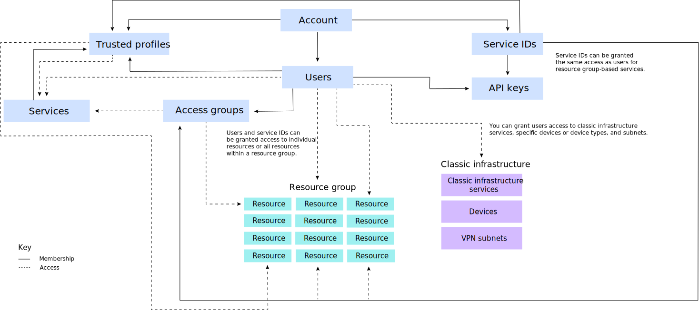

---

copyright:
  years: 2019, 2020
lastupdated: "2021-05-17"

keywords: IBM Cloud account, account differences, account overview, account components, resource, Cloud Foundry, API key, users

subcollection: account

---

{:shortdesc: .shortdesc}
{:codeblock: .codeblock}
{:screen: .screen}
{:tip: .tip}

# What's in an account?
{: #overview}

Your {{site.data.keyword.Bluemix}} account includes many interacting components and systems for resource, user, and access management. Concepts like how certain components are connected or how access works help you in understanding how to set up your account.
{:shortdesc}

Within the following diagram, there are two main concepts for the components in the account hierarchy that are important to understand. The use of the solid lines and the dotted lines help illustrate that some components are contained within others, for example, users are added to access groups or Cloud Foundry orgs. However, some components interact with others for providing access instead of membership. For example, users are given access to resource groups but are not members of a resource group the same way they are for access groups.

{: caption="Figure 1. A description that prints on the page" caption-side="bottom"}

<dl>
<dt>Users</dt>
<dd>Users are invited to the account and given access to the resources in the account.</dd>
<dt>Service IDs</dt>
<dd>A service ID identifies a service or application similar to how a user ID identifies a user. You can use a service ID that you create to enable an application outside of {{site.data.keyword.Bluemix_notm}} access to your services. You can assign specific access policies to the service ID that restrict permissions for using specific services, or even combine permissions for accessing different services. Since service IDs are not tied to a specific user, if a user happens to leave an organization and is deleted from the account, the service ID remains, ensuring that your application or service stays up and running. For more information, see [Creating and working with service IDs](/docs/account?topic=account-serviceids).</dd>
<dt>Service instances or resources</dt>
<dd>Services in {{site.data.keyword.Bluemix_notm}} are either resource group- or Cloud Foundry-based. Service instances that can be added to a resource group and managed by using {{site.data.keyword.Bluemix_notm}} Identity and Access Management (IAM) are called resources. Service instances that are added to Cloud Foundry orgs and spaces have a separate access management system by using Cloud Foundry roles. For more information, see [Managing resources](/docs/account?topic=account-manage_resource)</dd>
<dt>API keys</dt>
<dd>An API key is a unique code that is passed in to an API to identify the calling application or user. You can use platform API keys, which are associated with user identities, and you can create other API keys for service IDs. For more information, see [Understanding API keys](/docs/account?topic=account-manapikey).</dd>
<dt>Access groups</dt>
<dd>You can create an access group to organize a set of users and service IDs into a single entity and easily assign permissions. You can assign a single policy to the group instead of assigning the same access multiple times per individual user or service ID. For more information, see [Setting up access groups](/docs/account?topic=account-groups).</dd>
<dt>Resource groups</dt>
<dd>You can use a resource group to organize your account resources in customizable groupings so that you can quickly assign users access to more than one resource at a time. Any account resource that is managed by using IAM access control belongs to a resource group within your account. Users are not added to resource groups, but users are provided access to the resources within or can manage the resource group. Users given access to manage the resource group can create new instances within the group, manage other user's access to work with the group, or edit the group name based on the assigned IAM role. For more information, see [Best practices for organizing resources and assigning access](/docs/account?topic=account-account_setup).</dd>
<dt>Cloud Foundry orgs</dt>
<dd>As an account owner or organization manager, you can add orgs and spaces from the Cloud Foundry Organizations page in the console. Services that support the use of Cloud Foundry orgs and spaces are added to an org and space when you create them from the catalog. Orgs contain users, domains, and quotas. Within each org, spaces are added, which contain the service instances. For more information, see [Adding orgs and spaces](/docs/account?topic=account-orgsspacesusers).</dd>
<dt>Cloud Foundry spaces</dt>
<dd>Within an organization, you can use spaces to group a set of applications, services, and users. Spaces are tied to a specific region in {{site.data.keyword.Bluemix_notm}}. You can create spaces in an org based on the delivery lifecycle. For example, you can create a dev space as a development environment, a test space as a testing environment, and a production space as a production environment. Then, you can associate your apps with spaces. For more information, see [Adding orgs and spaces](/docs/account?topic=account-orgsspacesusers).</dd>
</dl>

Another important aspect of the previous diagram is the depiction of the three types of access management systems that you can use to provide account users access to resources within the account.

  * You can use IAM [access roles](/docs/account?topic=account-userroles) to provide users access to all resources that belong to a resource group. You can also give users access to manage resource groups and create new service instances that are assigned to a resource group.
  * You can use Cloud Foundry [organization and space roles](/docs/account?topic=account-cfaccess) to provide users access to any service instances that are in a Cloud Foundry space.
  * You can use [classic infrastructure permissions](/docs/account?topic=account-infrapermission) to grant users more granular permissions for classic infrastructure resources. You assign device access and VPN subnet access separately.
