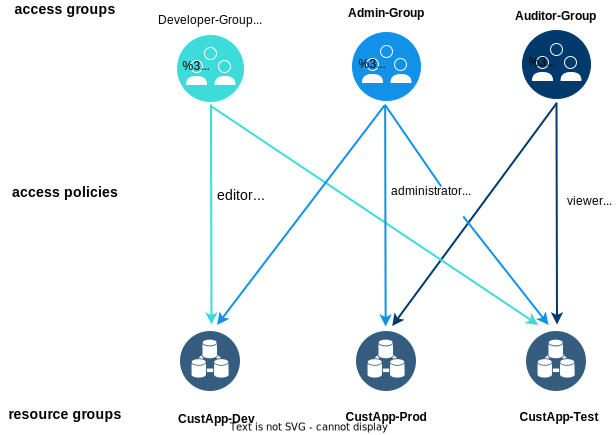

---

copyright:

  years: 2018, 2025
lastupdated: "2025-01-28"

keywords: organizing resources, organizing resource groups, account best practices, best practices account, access best practice, my resources, administrator, administrator role

subcollection: account

---

{{site.data.keyword.attribute-definition-list}}

# Best practices for organizing resources and assigning access
{: #account_setup}

After you set up your {{site.data.keyword.cloud}} account, you're ready to start planning how you want to organize [resources](#x2004267){: term} and assign access to identities in your account. These best practices provide you with the basic building blocks to enable successful and secure app development in {{site.data.keyword.cloud_notm}}.
{: shortdesc}

The following best practices focus on resources that are enabled for {{site.data.keyword.cloud_notm}} Identity and Access Management (IAM) and that are assigned to resource groups. Classic infrastructure services aren't IAM-enabled, which means that they can't be assigned to resource groups.
{: note}

## What makes a good resource group strategy?
{: #resource-group-strategy}

Use resource groups to organize your account resources for access control and billing purposes.

Administrators can have better control of resource usage at the project environment level if one resource group per project environment is used. For example, a typical project has development, test, and production environments. A project that is named `CustApp` might have the following resource groups:

* CustApp-Dev
* CustApp-Test
* CustApp-Prod

In this scenario, you might assign a developer wide-ranging access to the development resource group and much tighter or no access to the production resource group.

### Organizing resources in resource groups
{: #setting-up-rgs}

All resources that are managed by using IAM access control belong to a resource group. You assign a resource to its resource group when you create it from the catalog. It's important to [create your resource groups](/docs/account?topic=account-rgs#create_rgs) first because you can't change the assignment of resources after you set it. If you accidentally assign a resource to the wrong resource group, delete the resource and create a new one.

A default resource group is created for your account. If you have a Lite account, you're limited to the use of one resource group. If you want to create multiple resource groups, [upgrade](/docs/account?topic=account-upgrading-account) to a Pay-As-You-Go or Subscription account.
{: tip}

### Searching for resources
{: #tags}

You can use user tags to easily organize and search for the resources in your account. You can also use user tags to help identify specific team usage or cost allocation when you view your [Exporting your usage details to a CSV file](/docs/account?topic=account-viewingusage&interface=ui#export-csv).

For more information, see [Working with tags](/docs/account?topic=account-tag).

## How IAM access works
{: #how_access}

After you set up and organize resource groups in your account, you can take advantage of a couple of strategies to streamline the access management process:

Access groups
:   You can minimally manage the number of assigned policies by giving the same access to all identities in an access group instead of assigning the same access multiple times per individual user, service ID, or trusted profile. Users must be invited to your account before you can add them to an access group. If a user qualifies for a trusted profile that is a member of the access group, you don't need to invite them to your account.

Trusted profiles
:   If your organization has an enterprise directory, trusted profiles can reduce the time and effort to manage access. It simplifies the login process to your {{site.data.keyword.cloud_notm}} account for federated users in your enterprise. You can automatically grant federated users or compute resources access to your account by creating trusted profiles. For federated users, add conditions based on SAML attributes to define which federated users can apply a profile. For compute resources, specify specific resources, or add conditions based on resource attributes to define which compute resources can apply a profile. For both entity types, the level of access that is granted is determined by the access policies that are specified within each trusted profile, or the access groups that the trusted profile is a member of. However, trusted profiles don't require federated users to be invited to an account, and only users that are federated by an external identity provider (IdP) can apply a trusted profile.

When you're a member of multiple access groups, all policies apply at once when you access an account. As a federated user, you might have the option to apply different trusted profiles, but you select just one profile to apply when you log in. For example, if you want to complete developer-related tasks, select the `Developer` profile when you log in. If you want to complete an administrator-related task, you select the`Admin` profile that has privileged permissions. This way, you reduce the risk of taking privileged actions by mistake.
{: tip}

A policy consists of a subject, target, and role. The subject in this case is the access group or trusted profile. The target is what you want the subject to access, such as a set of resources in a resource group, a service instance, all services in the account, or all instances of a service. The role defines the level of access that is granted.

The following diagram shows how an access policy works:

{: caption="What is an Access Policy" caption-side="bottom"}

The most commonly used roles are viewer, editor, operator, and administrator platform roles.

* The viewer role provides the least amount of access for viewing instances and resource groups in an account.
* The operator role includes actions such as the ability to view instances and manage aliases, bindings, and credentials.
* The editor role includes actions the same actions of an operator role but also actions for creating, editing, deleting, and binding service instances.
* The administrator role includes everything for working with a service instance and assigning access to others for that service or instance that the policy is for.

While these are the most popular roles for assigning access in the platform, there are a second set of roles to consider called service roles. The actions mapped to these roles are defined by each service. Typically the actions mapped to these roles relate specifically to the ability to work with a service's APIs and UI.

For more information about the roles that can be assigned, see [IAM roles](/docs/account?topic=account-userroles#iamusermanrol).

## Reducing time and effort to manage access
{: #limit-policies}

There is a [limit](/docs/account?topic=account-known-issues#access-tag-limits) on the total number of policies that are allowed in an account. You can use a few strategies to ensure that you don't reach the limit and to reduce the amount of time that you spend managing access for the identities in your account (users, service IDs, or trusted profiles):

* Use the principle of least privilege and assign only the access that is necessary. This can help you ensure that the identities in your account are limited to only the actions that you want to allow. For example, time-based conditions for access policies grant access during only the timeframe you specify, reducing the opportunity for attack in the event of a security breach. For more information, see [Limiting access with time-based conditions](/docs/account?topic=account-iam-time-based&interface=ui).
* Add resources to a resource group to further minimize the number of necessary policies. For example, you might have a team working on a project that uses specific resources in your account. Add the team members to an access group or trusted profile with a policy that assigns access to only the resources that are in a specific resource group. This way, you don't need to assign a policy to each resource for each team member.
* Use access groups to streamline managing access for identities that require the same level of access. You can set up an access group with a specific policy defined, and then add those identities to the group. If the group members need more access later on, you simply define a new policy for the access group.
* Use access management tags to control access to the resources and service IDs in your account at scale. By assigning access only to resources and service IDs that have specific tags that are attached to them, you can avoid multiple updates to your defined policies. For more information, see [Controlling access to resources by using tags](/docs/account?topic=account-access-tags-tutorial).
* Use trusted profiles to automatically grant federated users and compute resources access to your account. This way, federated users can be mapped to one or more trusted profiles during login by evaluating SAML-based attributes to determine which profiles they can apply. Using trusted profiles for compute resources helps you avoid storing credentials to run applications and the management and rotation of credentials. You can also add trusted profiles to access groups to leverage the set of policies you have already created.
* Assign access by using a group of services so that you need only a single policy to assign access to multiple services. This way, you decrease the number of policies in your account and reduce the time and effort to manage access.
   * **All Identity and Access enabled services**: All catalog services that use IAM for access management.
   * **All Account Management services**: Platform services, such as billing and usage, license and entitlements, enterprises, and more. For more information, see [Assigning access to account management services](https://cloud.ibm.com/docs/account?topic=account-account-services&interface=ui#account-management-actions-roles).
   * **All IAM Account Management services**: A subset of account management services that includes the IAM platform services IAM Identity, IAM Access Management, IAM Users, IAM Groups, and future IAM services.

Removing access for inactive identities and inactive policies can reduce the risk of unauthorized access to your {{site.data.keyword.cloud_notm}} resources and help you manage access more efficiently. For more information, see [Identifying inactive identities](/docs/account?topic=account-id-inactive-identities) and [Auditing access policies](/docs/account?topic=account-iam-audit-policies).
{: tip}

## What makes a good access group strategy?
{: #accessgroup_strategy}

An access group is an organization of users, service IDs, and trusted profiles in a grouping that you can grant the same IAM access. All identities in a single access group inherit the same access.

A logical way to assign access to your resource groups and the included resources is by [creating one access group](/docs/account?topic=account-groups) per required level of access. Then, you can map each access group to the previously created resource groups. For example, to control access to the `CustApp` project, you might create the following access groups:

* Auditor-Group
* Developer-Group
* Admin-Group

For the Auditor-Group, assign two access policies that grant viewer access to the `CustApp-Test` and the `CustApp-Prod` resources and resource groups. For the Developer-Group, assign two access policies that grant editor access to the `CustApp-Dev` and `CustApp-Test` resources and resource groups. For the Admin-Group, assign three access policies that grant administrator access to all three `CustApp` resource groups and their resources.

You can assign administrator access to everything in an account by creating an access group and assigning two policies to it. To create the first policy, select **All Identity and Access enabled services** with the Administrator platform role and Manager service role. To create the second policy, select **All Account Management services** with the Administrator role assigned. Users with the Administrator role can change the access and remove access groups and add and remove users from an access group, including other users with the administrator role.

Users with the Administrator role on access groups can grant or revoke access by adding or removing users from an access group. By creating an access group with administrator access, you are delegating the granting and revoking of administrator access of the account to the added administrators of the access group. Administrator access to everything in the account includes the ability to revoke access for other users with the administrator role.
{: note}

The following diagram shows how access is assigned to resource groups:

{: caption="Assigning access to resource groups" caption-side="bottom"}

For more best practices from IBM Garage for Cloud, see [Managing access to resources in {{site.data.keyword.cloud_notm}}](https://develop.cloudnativetoolkit.dev/resources/ibm-cloud/access-control/){: external}.

### Sample access policies
{: #sample_policies_ag}

Review the following sample access policies to help you determine how you might want to assign access to an access group for resources that are organized in resource groups.

* A policy that grants the access group a platform administrator role on the {{site.data.keyword.containerlong_notm}} across the entire account. The users in the access group can access all instances of this service and create instances of the service in any resource group that they have at least a viewer role assigned. Access group members with an administrator role that is assigned on any resource can also grant access to that resource.
* A policy that grants the access group a platform viewer role on a resource group, but not its member resources. The users in the access group have visibility to the resource group, which is required to create instances of any service in this resource group.
* A policy that grants the access group a platform editor role on all resources in the resource group. The users in the access group can edit or delete that resource.
* A policy that grants the access group a platform administrator role on the entire account (all IAM-enabled services). The users in the access group can perform any platform actions on any resource in the entire account and management actions, such as managing the resource groups in the account.

## What makes a good trusted profiles strategy?
{: #trustedprofiles_strategy}

A trusted profile is a grouping of federated users or compute resources to which the same IAM access can be granted. All identities that are allowed to apply a single profile inherit the same access. To reduce the number of policies in an account, you can add compute resources and federated users to the same trusted profile if their access needs are the same.

A logical way to assign access to your resource groups and the included resources is by [creating one trusted profile](/docs/account?topic=account-create-trusted-profile) per required level of access. Then, you can map each trusted profile to the previously created resource groups. For example, to control access to the `CustApp` project, you might create the following trusted profiles:

* Auditor-Profile
* Developer-Profile
* Admin-Profile

For the `Auditor-Profile`, specify conditions based on SAML attributes for the federated users that you want to be able to apply this profile. These SAML attributes are defined in your corporate user directory. This way, managing federated users, granting access, and revoking access is primarily done in the corporate user directory. Next, assign two access policies that grant viewer access to the `CustApp-Test` and `CustApp-Prod` resources and resource groups.

For the `Developer-Profile`, specify conditions based on SAML attributes for the federated users that you want to be able to apply this profile. Assign two access policies that grant editor access to the `CustApp-Dev` and `CustApp-Test` resources and resource groups. For the `Admin-Profile`, specify conditions based on SAML attributes for the federated users that you want to be able to apply this profile. Then, assign three access policies that grant administrator access to all three `CustApp` resource groups and their resources.

A trusted profile, like other IAM identities, can be granted access by using a policy or by adding it to an access group. If you have access groups that have the same level of access that a trusted profile needs, then the trusted profile can be added to that access group.
{: note}

The following diagram shows how access is assigned to trusted profiles:

{: caption="Assigning access to trusted profiles" caption-side="bottom"}

You can select only one trusted entity type when you first create a trusted profile. You can [update trusted profiles](/docs/account?topic=account-trusted-profile-update) at any time to add trust relationships with compute resources.

You can assign administrator access to everything in an account by creating a trusted profile and assigning two policies to it. To create the first policy, select **All Identity and Access enabled services** with the Administrator platform role and Manager service role. For the second policy, select **All Account Management services** with the Administrator role assigned. Users with the Administrator role can update and remove trusted profile's access and add and remove users from the trusted profile, including other users with the administrator role.

Users with the Administrator role on trusted profiles can grant or revoke access by adding or removing rules from trusted profiles. By creating a trusted profile with administrator access, you are delegating the granting and revoking of administrator access of the account to the added administrators of the trusted profile. Administrator access to everything in the account includes the ability to revoke access for other users with the administrator role.
{: note}

### Sample access policies
{: #sample_policies_tp}

Review the following sample access policies to help you determine how you might want to assign trusted profiles access to resources that are organized in resource groups.

* A policy that grants federated users a platform administrator role on the {{site.data.keyword.containerlong_notm}} across the entire account. Federated users are allowed to apply this profile when the federated user's external IdP attributes fulfill the conditions of the trust relationship. For example, if your corporate user directory has a `jobrole` attribute that identifies administrators by the value `admin`, then you can create a condition that dynamically adds federated users with that attribute to the trusted profile, along with other conditions. The federated users that are allowed to apply the trusted profile can access all instances of this service and create instances of the service in any resource group that they have at least a viewer role assigned. Trusted profiles with an administrator role for a resource can also grant access to that resource. Conditions can be specified so that only federated users that require the highest privileges can apply this trusted profile. All other federated users can be filtered out based on their SAML attributes.
* A policy that grants compute resources `Reader` and `Writer` roles on a resource group. When compute resources authenticate and fulfill the conditions that are specified in the trusted profile, such as `location` or `resource type` the trusted profile is automatically applied. This way, any existing or future resources that meet these conditions can have the profile that is automatically applied when authenticated.
* You can also establish trust with specific compute resources, like a single Kubernetes cluster. For example, you might have an application that is running on {{site.data.keyword.containershort_notm}} where the application needs to read and write from {{site.data.keyword.cloudant}} and read and write to a {{site.data.keyword.cosdimshort_notm}} bucket. Both the {{site.data.keyword.cloudant}} and {{site.data.keyword.cosdimshort_notm}} instances would be in the same resource group and the trusted profile would be assigned `Reader` or `Writer` roles.

Using trusted profiles is a best practice for applications running on {{site.data.keyword.Bluemix_notm}} compute resources to gain access to IAM-enabled resources.
{: important}

## Compare access groups and trusted profiles
{: #compare-accessgroups-trustedprofiles}

Access groups are best used for granting access for a user's day-to-day work, while trusted profiles are suited for granting federated users the level of access they need to complete a specialized and specific set of tasks within a limited time period. These are usually critical tasks that you would want to avoid doing unintentionally in daily work. With trusted profiles, federated users don't need to onboard to {{site.data.keyword.Bluemix_notm}}, they are granted access to {{site.data.keyword.Bluemix_notm}} resources in an account by way of the trust relationship. If a federated user leaves your company, you can simply delete their corporate identity in your directory, which then also removes access to {{site.data.keyword.Bluemix_notm}}. Time-based access with trusted profiles allows frequent authentication checks for reduced security risks.

Use the following table to understand the differences between using access groups and trusted profiles to make the best decision for your use case.

| Feature | Access group                    | Trusted profile                 |
|---------------------------------|---------------------------------|---------------------------------|
| IAM access control              | Yes                             | Yes                             |
| Inviting users to the {{site.data.keyword.cloud_notm}} account required|  Yes            | No                              |
| Access can be defined before user is added to the account | Yes, by using dynamic rules | Yes       |
| Federated users                 | Yes                             | Yes                             |
| Non-federated users             | Yes                             | Yes                              |
| Service ID                      | Yes                             | Yes                              |
| Compute resource identities     | No                              | Yes                             |
| User management is primarily done in| {{site.data.keyword.cloud_notm}} account           | Corporate user directory        |
{: caption="Compare access groups and trusted profiles" caption-side="top"}

Access groups and trusted profiles can be used separately or hand-in-hand for user and access management, depending on your organization's needs.

For example, for the `CustApp` project, you might choose to create an `IAM Admin` trusted profile with the following policies:

* `Administrator` for access groups CustApp-Dev/Test/Prod. This way, the administrator can grant and revoke access to users by adding them to and removing them from access groups.
* `Administrator` for IAM Identity account management service. This way, the administrator can manage service IDs, trusted profiles, rules, and so on.
* `Editor` for User Management account management service. This way, the administrator can invite users to the account, view users in account, and so on.

With this trusted profile, the administrator can add developers to an access group with broad access policies to complete day-to-day actions and tasks in the development and test environments. Access for operations on the production environment can be set up in a trusted profile named `Operator-Profile`. This way, the developer can change job roles by logging in and applying the `Operator-Profile` when they need to take any operation actions on the `CustApp` in production.

## Use cases for organizing resources and assigning access
{: #usecase_examples}

Review the following use cases to help you prepare a plan that works for your organization. For each use case, it is recommended to use either access groups or trusted profiles to provide access to a group of users while maintaining a minimal number of access policies. By using access groups, you can simply add or remove users in your account from the access groups to assign or revoke access as needed. By using trusted profiles, you can easily update the conditions by which federated users from your corporate user directory are allowed to apply trusted profiles without having to invite them to the account or assign individual access to each user.

### Multiple users working together on a single project by using access groups
{: #account-ten-users}

Some of the users in your account need to manage the account and assign other users access. Some users need to create service instances that incur expenses. Other users are application developers who need to use only the service instances from their application components.

You want to grant all users various roles in the account and the default resource group. You don't need to create more resource groups to separate resources or restrict some users from accessing some of the resources. You can grant the users the roles that are appropriate for their needs by creating an access group for each group of users:

* Create an access group and assign users to the group who need to manage the account and give others access. Then, assign a policy with an administrator role on the all IAM-enabled services and all account management services.
* Create an access group and assign users to the group who need to create service instances. Then, assign a policy with an editor role on the default resource group and a policy with the editor role for any service the users need to create.
* Create an access group and assign users to the group who need to use the service instances in a resource group. Then, assign a policy with a writer or reader role on the service instances that exist in the resource group.

### Multiple users working together on a single project by using trusted profiles
{: #account-tesb-users-tp}

In a larger organization, you want to manage access at scale. Some of the members in your organization need to manage the {{site.data.keyword.Bluemix_notm}} account and assign other users access. Some members need to create service instances that incur expenses. Other members are application developers who need to use only the service instances from their application components.

You want to grant all users various roles in the account and the default resource group. You don't need to create more resource groups to separate resources or restrict some users from accessing some of the resources. You can grant the users the roles that are appropriate for their needs by creating trusted profiles for each type of user and map them to the correct profile based on external IdP attributes:

* Create a trusted profile for users who need to manage the account and give others access. Establish a trust relationship with your external IdP and define the attributes that allow the appropriate members of your organization to apply the profile. Then, assign a policy with an administrator role on the all IAM-enabled services and all account management services.
* Create a trusted profile for users who need to create service instances. Establish a trust relationship with your external IdP and define the attributes that allow the appropriate members of your organization to apply the profile. Then, assign a policy with an editor role on the default resource group and a policy with the editor role for any service the users need to create.
* Create a trusted profile for users who need to use the service instances in a resource group. Establish a trust relationship with your external IdP and define the attributes that allow the appropriate members of your organization to apply the profile. Then, assign a policy with a writer or reader role on the service instances that exist in the resource group.

### Two teams working on two related projects
{: #two-teams-projects}

You have two functional projects in your account. Developers working on a project need access to all of its resources. As an account administrator, you can grant access by creating access groups for each project and incorporating access management tags into each group's access policies.

Flexibility is important, and with IAM, you can share resources between various groups. Let's say you notice that a resource might work well for both projects. You can share a resource between the two projects by tagging the resource and relying on the existing permissions to grant access to the developers. If a project doesn't require a resource anymore, you can simply revoke the developers' access by detaching the appropriate tag from the service instance. Check out the following video to gain a better understanding of how you can use access management tags to manage access to the resources in your account.

{: video output="iframe" data-script="#video-transcript-tags" id="mediacenter-player" width="560" height="315" scrolling="no" allowfullscreen webkitallowfullscreen mozAllowFullScreen frameborder="0" style="border: 0 none transparent;"}

#### Video transcript
{: #video-transcript-tags}
{: notoc}

As an account administrator, you can use tags to centrally manage access to the resources in your account at scale.

For example, you have two functional projects: One is called soulmate, which is used for Watson language services and storage, and the other one is called Soul-FAQ, which is a support for project soulmate. It uses Watson Assistant and Cloud Object Storage.

To create access management tags as an account administrator, click Manage then Account in the IBM Cloud console. From the Tags page, click Access management tags. To create new tags, type the tag names that are separated by commas. We're creating two tags: one for the project soulmate and one for the project soul-faq.

Jumping to the resource list you can see all resources on the account. You can tag project-related resources here and view them throughout the account by filtering by tags.

At this point, the developer cannot view the resources because they don't have the correct permissions that are assigned yet.

An account administrator can give the developer permissions to access the resources on their project by using a combination of access-groups and tags.

As an account administrator, click Manage then Access and select Access groups. You have two access groups set up: one for the soulmate project, one for the FAQ.

There's one developer in the soulmate developer's group. There are no policies set up, so the account administrator needs to assign access. To do so, select all services in the account based on specific attributes. Select Access Management Tags to view all the tags that are available in the account. Since you're creating a policy for the project soulmate, select the corresponding tag. The console shows that the project soulmate tag is mapped to three distinct resources.

Next, select some roles. Give the whole group the viewer role so everyone can view the resources in the list as well as all the functional access to these services. Click Assign to create the policy.

Now there are three services available for the developer. They have access to all three resources and any subresources that might exist.

Flexibility is important, so we've made it easy to share resources between various groups. Let's say an account administrator notices that IBM Cloud Object Storage is great for backup purposes and works well with the FAQ project. The account administrator wants to use IBM Cloud Object Storage in the soulmate project.

Simply edit the Access management tags. Add the project soulmate tag and click Save.

In the resource list, you can confirm that there are two access management tags attached to the Cloud Object Storage instance.

In addition to the original resources, the developer can now see the Cloud Object Storage resource. The instance is available to anyone who has access to project soulmate or project FAQ.

Let's say you don't want the Tone Analyzer service for the soulmate project anymore. Detaching the project soulmate tag from the Tone Analyzer service revokes the developer's access to that service instance. An account administrator can detach the tag by clicking Edit tags, and deleting the tag from the list.

The Tone Analyzer service instance is no longer included in the developer's list of resources.

When you use access management tags to control access, your team's projects can grow without requiring updates to IAM policies.

### Three teams working on three projects
{: #three-teams-projects}

A few users in my account are administrators. They need to create new resource groups and assign users access to them. I assign these users to an access group with a policy that has the administrator role that is assigned on all IAM-enabled services.

The remaining users need access to only the resource group that's associated with their project. I use access groups and assign various roles on the resource group and its members that are associated with their project: an editor role on the resource group for those who need to create instances, plus a reader or writer role on the resource group members for those who need to use those instances.

### Multiple resource groups in my account
{: #multi-rgs}

Some of the users in my account are the administrators for a service, `Service A`, across my entire account, and they need access to all instances of that service and to create instances. These users don’t need access to other resources in the account. I create an access group and assign an administrator role on Service A at the account level, and a policy with the viewer role for any resource groups in the account that they need to be able to create instances in. You can do this by selecting **Resource group only**, then select the resource group, and at least viewer role for that resource group. Then, repeat for each resource group that they need access to.

### A user that requires access to a specific resource
{: #user-specific-resource}

My account includes a user who needs access to only a specific resource in one service, for example, the ability to write to a bucket, `Bucket A`, in {{site.data.keyword.cos_full_notm}}. This user doesn't need to view the resource groups in my account or access other services or buckets in this instance of {{site.data.keyword.cos_short}}.

I assign the user a writer role on Bucket A in the specific instance of {{site.data.keyword.cos_short}}. I can choose to use the IAM UI or the {{site.data.keyword.cos_short}} UI to assign the role. I use the service-specific UI because I can from a list of resources. The IAM UI doesn't display resources past the service instance level, and I need to manually enter the CRN to assign policy to those resources.

## Next steps
{: #bp-access-next}

Now that you know how to set up your resource groups, organize your resources, and create access groups in your account, you can start [inviting users to your account](/docs/account?topic=account-iamuserinv) and assigning them access to your access groups. If you already invited users to your account, you can go to your Users page and start to [assign access](/docs/account?topic=account-assign-access-resources#assign-access-resources).

If you decide that your organization wants to manage user access based on your corporate user directory, you can start by [creating trusted profiles](/docs/account?topic=account-create-trusted-profile).
