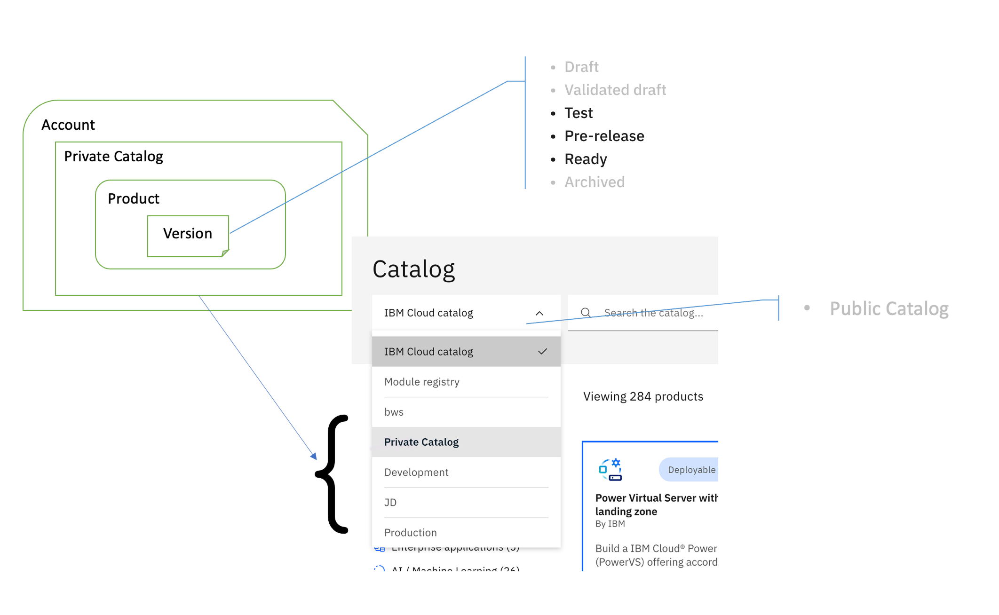

---

copyright:

  years: 2023, 2025
lastupdated: "2025-04-02"

keywords: enterprise, share, private catalog, allowlist, account groups, share request, opt in, visibility

subcollection: account

---

{{site.data.keyword.attribute-definition-list}}

# Visibility of product versions in public and private catalogs
{: #catalog-share-overview}

Learn about managing and sharing products from your private catalog and using products that are available in the {{site.data.keyword.cloud}} catalog. Learn why some product tiles are not visible to you, depending on your IAM access and the state of product versions.
{: shortdesc}

When you use {{site.data.keyword.cloud_notm}} products (deployable architectures, Terraform, Helm charts, Operators, VSI images, VMware images), you typically use them from the {{site.data.keyword.cloud_notm}} catalog, where you can filter and search the product tiles that you want to work with.

When you create, edit, or manage software products, you do this from a private catalog. You share your product from a private catalog. You don't share catalogs or versions of a product.

Catalog access is governed with [IAM](/iam/roles){: external}. Users who have Editor or Administrator IAM access to the Catalog Management service can see and manage all versions of a product in their private catalog.

If you are logged in to an account that has a private catalog, the [Catalog menu](/catalog){: external} includes all catalogs that you have viewer or higher permissions for. When you select a private catalog, you can see all versions for a product tile.

You can specify who can see your particular product by sharing a product from your private catalog with other accounts, enterprise groups, enterprises, and to the {{site.data.keyword.cloud_notm}} catalog.

{: caption="The Catalog menu shows all catalogs that you have permissions to see and work with." caption-side="bottom"}

The {{site.data.keyword.cloud_notm}} catalog includes products that are published to the {{site.data.keyword.IBM}} public cloud, as well as products that are shared with you directly from private catalogs. The product tiles that are visible to you include products that have one or more versions that are in either the `test`, `pre-release`, or `ready` state.

{: caption="The IBM Cloud catalog includes product tiles that are either public or shared with you from a private catalog." caption-side="bottom"}

## Versioning workflow in your private catalogs
{: #version-flow}

The following table outlines the version states of a product, their sharing rules, and how they progress through the onboarding and release workflow. Understanding these states helps determine when you can share or publish a product.

| Programmatic name | Display name | Sharing | Description |
| ------------- | ---------------- | ------- | ----------- |
| `new`           | Draft  | Not sharable | The initial version of the product. It is still in development and not yet reviewed or validated. |
| `validated`     | Validated draft  | Not sharable | The product passed validation but is not yet available for sharing. |
| `test` [New]{: tag-new} | Test | No validation required to share. Not included in share requests by default, but you can update the request to include test versions. | The product can be made available to a subset of allowlisted accounts for controlled testing. |
| `prerelease`    | Pre-release | Must be validated before sharing only if you are going through Partner Center. Otherwise, no validation required to share. Included in all share requests. | The product is available for sharing or publishing before full release. It is included in all share requests, making it accessible to allowlisted users for early access and feedback. |
| `consumable`    | Ready  | Must be validated before sharing. Included in all share requests. | The product is fully approved and available for broader sharing or publishing. It is included in all share requests, making it accessible to allowlisted users for use. |
| `deprecated`    | Archived | Not sharable | The product is no longer actively supported or available for new users. |
{: caption="Private catalog version states in the console and their programmatic names." caption-side="top"}
