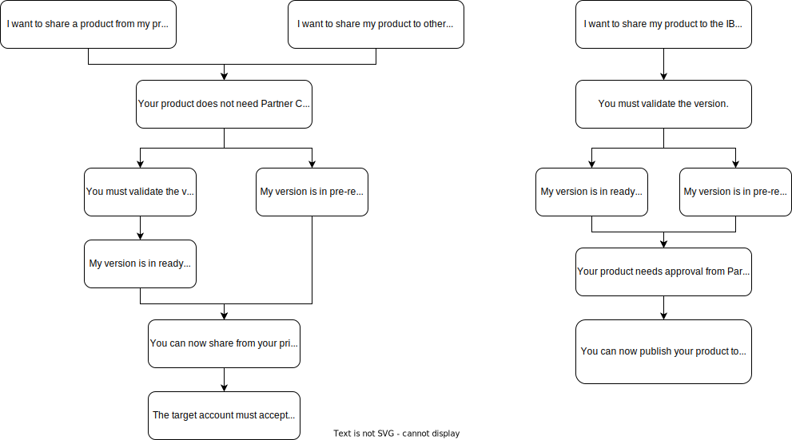

---

copyright:

  years: 2022, 2025
lastupdated: "2025-11-15"

keywords: enterprise, share, private catalog, allowlist, account groups, share request, opt in

subcollection: account

---

{{site.data.keyword.attribute-definition-list}}

# Sharing private catalog products
{: #catalog-share}

Control who can access your private catalog products by sharing them with other accounts, enterprises, users in your account, or account groups within enterprises. When you send a share request, recipients can create instances of any version that is in the `ready` or `pre-release` state and `test` versions if you specifically allow it. Versions that are in the `draft` state cannot be shared.
{: shortdesc}

You can share your private catalog product with any account, enterprise, or account group without Partner Center approval. The recipient must accept the share request. If you're already approved in Partner Center, you can add accounts to an allowlist to let users access the product without needing to accept the request. For more information, see [Accepting share requests for private catalog products](/docs/account?topic=account-catalog-share-accept&interface=ui).
{: note}

The following flowchart shows the use cases for sharing your product. Each pathway addresses who you want to share your product with, how to share it, and if you need approval through Partner Center. If you need approval from Partner Center, see [Selling on {{site.data.keyword.cloud_notm}}](/docs/sell).

{: caption="Flow chart of sharing a product to other accounts, enterprises, or account groups within enterprises, or publishing with Partner Center approval" caption-side="bottom"}

A `pre-release` version does not need to be validated before you can share it from your private catalog. However, a `pre-release` version must be validated if you are going through Partner Center. A `ready` version must be validated before you can share it. For more information, see [Validating the software](/docs/account?topic=account-create-private-catalog&interface=ui#catalog-validate-product).
{: note}

## Before you begin
{: #ent-share-prereq}
{: ui}

* You must be assigned the Publisher and Viewer access roles for the Catalog Management service to share products with other accounts, enterprises, or account groups within enterprises. For more information, see [Access management in {{site.data.keyword.cloud_notm}}](/docs/account?topic=account-cloudaccess). You don't need to be a member of a specific enterprise account to share products with that enterprise account.
* Verify that at least one version of your product is in either the `test`, `pre-release` or `ready` state.
* You need to know the ID for the accounts, enterprises, or account groups that you want to share with.

## Sharing your product by using the console
{: #ent-share-steps}
{: ui}

When you share your product from your private catalog with another account, you are asking the target account for permission to share products now and in the future rather than just one product at a time. In doing so, you are adding that account to an allowlist, which is a list of IDs that are granted access to the product. When the target account accepts your initial share request, that account is opting in to having access to future products that you share from the same account. You need to send a separate share request only if you want to share a product for a different catalog type (Product or Virtual Private Endpoint). Only accounts included in the allowlist can access your product. For more information, see [Accepting share requests for private catalog products](/docs/account?topic=account-catalog-share-accept&interface=ui).

Complete the following steps to share your product:

1. In the {{site.data.keyword.cloud}} console, click **Manage** > **Catalogs** > **Private catalogs**.
1. Select the private catalog where your product is located.
1. Select the catalog type (Product or Virtual Private Endpoint) of the product that you want to share.
1. Select the product that you want to share.
1. Select **Actions** > **Share**.
1. Review the list of versions that are available to share.

   If you don't see the version that you want to share, make sure that the version is in the `test`, `ready` or `pre-release` state.
   {: tip}

1. Select one of the following options:
   - **Share to this account** to make the product available to any user who has access to this account. Then, click **Share**.
   - **Share with other accounts** to add IDs for accounts that you want to share your product with by clicking **Add accounts**. If you want to add other accounts of which you are a member, click **Add your accounts**. A list of your accounts is displayed. Then, click **Add**.

   Enterprise IDs are prefixed by `-ent-`, and account groups are prefixed by `-entgrp-`. This option is used to create an allowlist of other accounts to which you want to share your product.
   {: note}

1. If you want to share `test` versions with a subset of the allowlist, toggle **Share test versions?** to **Yes**. This way, you can share early versions with a more limited set of accounts for testing and gathering feedback before sharing more widely.
1. Click **Share**. In the version list, the **Visibility** status is now changed to `Shared`.

You need to configure [service to service authorization](/docs/account?topic=account-serviceauth&interface=ui#create-auth) to share a product between accounts through {{site.data.keyword.bplong}}. To establish a service-to-service authorization between {{site.data.keyword.bplong}} and Catalog Management, {{site.data.keyword.bplong}} acts as the source and Catalog Management as the target with a viewer role. This ensures that {{site.data.keyword.bplong}} can access the source URL when provisioning the product from another account.
{: note}

If a share request has already been accepted by the target account for a previous product, this new share request is automatically accepted.

### Checking the share request status 
{: #ent-share-steps-check}
{: ui}

Complete the following steps to check the status of your share requests:

1. In the {{site.data.keyword.cloud_notm}} console, select **Manage** > **Catalogs** > **Share requests**.
1. Click **Sent requests** to show the table of all your requests.

   - If the target account accepted the request, the request state is `Accepted`.
   - If the target account denied the request, the request state is `Rejected`.
