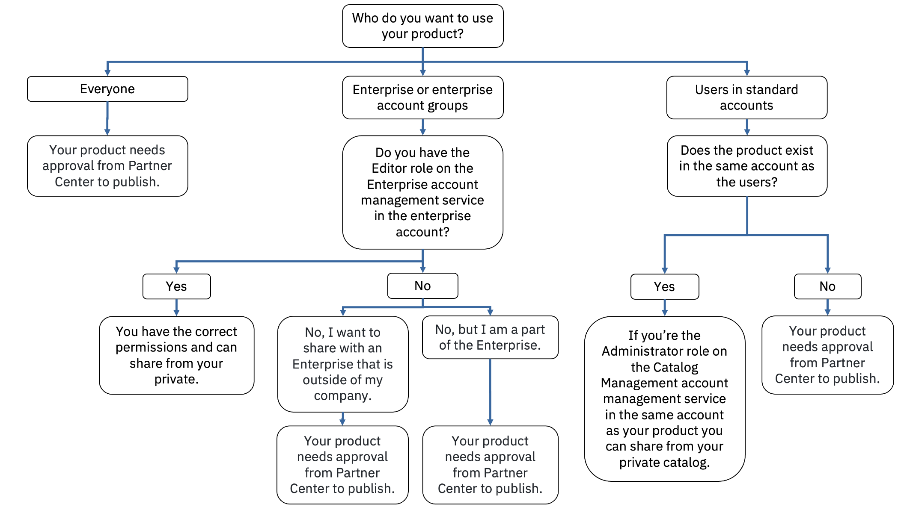

---

copyright:
  years: 2022, 2023
lastupdated: "2023-05-22"

keywords: enterprise, share, private catalog, allowlist, account groups

subcollection: account

---

{{site.data.keyword.attribute-definition-list}}

# Sharing private catalog products
{: #catalog-share}

You can share products in your private catalog with users in your account, account groups within your enterprise, the entire enterprise, and even other enterprises that you have access to. By sharing your product, any user within the account, enterprise, or account groups can create an instance of your product.
{: shortdesc}

The following flowchart shows three use cases for sharing your product. Each pathway addresses who you want to share your product with, if you need certain IAM permissions, and if you need approval through Partner Center Sell. If you need approval from Partner Center Sell, see [Selling on {{site.data.keyword.cloud_notm}}](/docs/sell).

If you received approval through Partner Center, you can share your product to any user.
{: note}

{: caption="Figure 1. Flow chart of the approvals and permissions that are necessary to share a product" caption-side="bottom"}

## Before you begin
{: #prereqs-enterprise-share}

1. You must be assigned the following access. For more information, see [Assigning users access](/docs/account?topic=account-catalog-access).
   - Editor role on the Enterprise account management service in the enterprise account.
   - Administrator role on the Catalog Management account management service in the same account as your product.
1. Verify that at least one version of your product is in the `ready` state.

## Sharing your product by using the console
{: #ent-share-steps}
{: ui}

When you share a product with enterprises, users in your account, or account groups, they can create instances of any version that is validated and in the `ready` state. Versions that are in the `draft` state are not shared with users. Complete the following steps to share your product:

1. In the {{site.data.keyword.cloud}} console, click **Manage** > **Catalogs** > **Private catalogs**.
1. Select the private catalog where your product is located.
1. Select the product that you want to share.
1. Click **Actions...** > **Share**.
1. Review the list of affected versions.

   If you don't see the version that you want to share, make sure that the version is in the `ready` state.
   {: tip}

1. Select one of the following options:
   - **Share to this account**
   - **Share to this enterprise or account groups** to select the enterprise or specific account groups within the enterprise.
   - **Share with other enterprises** to add IDs for enterprises or account groups in other enterprises that you are assigned Editor role or higher on. This option is used to create an allowlist of other enterprises or account groups to which you want to share your product. You must have the Editor role on the enterprise or account group that you are trying to add. Select **Add accounts**, enter the enterprise ID, and click **Add** > **Share**.

   When you share your product with another enterprise, the enterprise is added to a list of IDs that are granted access to your product. This list is also known as the allowlist. Any account that is not included in the allowlist can't access your product.
   {: note}

1. Click **Share**.

## Sharing your product by using the CLI
{: #ent-share-cli}
{: cli}

When you share a product with users in your account, enterprise, or account groups, they can create instances of any version that is validated and in the `ready` state. Versions that are in the `draft` state are not shared with users.

Run the [`ibmcloud catalog offering publish enterprise`](/docs/cli?topic=cli-manage-catalogs-plugin#publish-offering-enterprise) command to share your product to your enterprise:

   ```bash
   ibmcloud catalog offering publish enterprise [--catalog CATALOG][--offering OFFERING]
   ```
   {: codeblock}

Run the [`ibmcloud catalog offering publish allowlist`](/docs/cli?topic=cli-manage-catalogs-plugin#publish-offering-allowllist) command to share your product to an allowlisted set of accounts:

   ```bash
   ibmcloud catalog offering publish allowlist [--catalog CATALOG][--offering OFFERING][--account-ids ACCOUNT-IDS]
   ```
   {: codeblock}

The `ibmcloud catalog offering publish allowlist` command shares your product with stand-alone accounts, enterprises, or account groups based on the IDs listed in the command. You must have Editor role or higher on the other enterprise or enterprise account groups that you add to the list to successfully share the product. If you add a stand-alone account that is external to your enterprise, the account is added to your allowlist, but your product isn't shared to that account until you have [publishing approval for your product](/docs/sell?topic=sell-sw-publish&interface=ui#sw-request-approval).
{: note}
