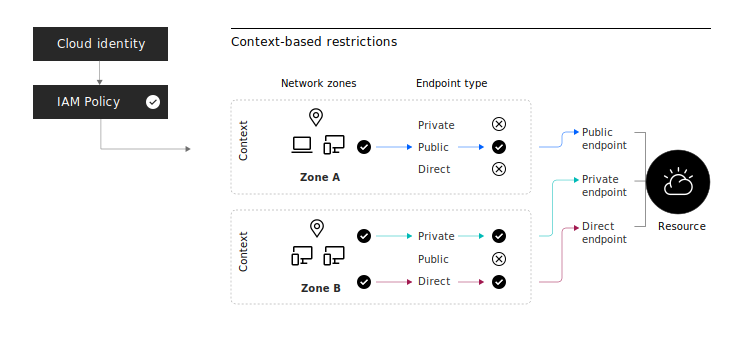

---

copyright:

  years: 2021, 2025
lastupdated: "2025-07-24"

keywords: Context based restriction, rule, context, network zone, IBM Cloud restrictions, IBM Cloud context restriction, IBM Cloud access, access control, resource access, endpoint type

subcollection: account

---

{{site.data.keyword.attribute-definition-list}}

# What are context-based restrictions?
{: #context-restrictions-whatis}

Context-based restrictions give account owners and administrators the ability to define and enforce access restrictions for {{site.data.keyword.cloud}} resources based on a rule's criteria. The criteria include the network location of access requests, the endpoint type from where the request is sent, the multifactor authentication level of an identity, and sometimes the API that the request tries to access. These restrictions work with traditional IAM policies, which are based on identity, to provide another layer of protection. Since both IAM policies and context-based restrictions enforce access, context-based restrictions offer protection even in the face of compromised or mismanaged credentials.
{: shortdesc}

{: caption="A diagram that shows how context-based restrictions work." caption-side="bottom"}

For an example scenario on creating context-based restrictions, follow the tutorial for [Leveraging context-based restrictions to secure your resources](/docs/account?topic=account-context-restrictions-tutorial).

For more information about implementing context-based restrictions in your security strategy, see the solution tutorial [Enhance cloud security by applying context-based restrictions](/docs/solution-tutorials?topic=solution-tutorials-cbr-enhanced-security).

## Rules
{: #restriction-rules}

A rule associates an {{site.data.keyword.cloud_notm}} resource with a set of contexts:

* The cloud resource is specified by resource attributes similar to IAM access policies.
* A context is a combination of network zones and endpoint types.

The contexts that you configure define the boundary for the associated resources.

The necessary resource attributes in context-based restrictions rules are `accountId` and `serviceName`. Rules must be scoped to an account and a specific service.

Context-based restriction rules are applied by the following logic:

* Access is granted by a rule only when at least one of the rule's contexts allows access.
* If multiple rules are applicable to a particular resource, access is granted only when all applicable rules allow access.
* If no rules are applicable to a particular resource, access is determined exclusively by IAM policies.

Unlike IAM policies, context-based restrictions don't assign access. Context-based restrictions check that an access request comes from an allowed context that you configure.

The interface that you use to access a resource, such as the console, CLI, or API, doesn't affect how a rule applies to that resource. The rule applies the same way across all interfaces and is based on the client IP address.
{: note}

### Rule enforcement
{: #rule-enforcement}

You can decide how you want to enforce a rule upon creation and update the rule enforcement at any time.

Enabled
:   Enforce the rule. Depending on the service that you select, monitoring denied access attempts through {{site.data.keyword.atracker_short}} might be available. Review each service's documentation to learn about how they integrate with context-based restrictions.

Disabled
:   No restrictions apply to your account resources. Select this option if you're not ready to enable the rule.

Report-only
:   Depending on the service that you select, you can monitor how a rule affects access without enforcing it. With report-only mode, all attempts to access resources in the account are logged in {{site.data.keyword.atracker_short}}. If available, monitoring is recommended for 30 days before you enforce a rule.

Report-only mode is not available for all services, so review each service's documentation to learn about how they integrate with context-based restrictions.

You can monitor the impact of your enabled and report-only rules. For more information, see [Monitoring context-based restrictions](/docs/account?topic=account-cbr-monitor).
{: tip}

### Defining the scope of a rule
{: #rule-scope}

Define the APIs that you want to protect to narrow the scope of a rule's restrictions. This way, you can specify granular protections for different APIs that have distinct access requirements.

For example, you might create a rule that targets a data plane API so that it is only accessible from a Kubernetes cluster, or wherever your compute infrastructure exists. Then, you can create a rule that targets your control plane API and all platform APIs to protect interactions with the cloud console so that it is only accessible from behind your organization's VPN.

Only some services support the ability to scope a rule by API.
{: note}

With some services, you can restrict the actions of all service APIs on your resources by default, which includes all current and future APIs that the service might support. Or, select specific APIs. For example, [Kubernetes](/docs/containers?topic=containers-cbr&interface=ui#cbr-overview) has custom service APIs that you can restrict access to based on the context of the request. Review each service's documentation to learn more about how they integrate with context-based restrictions.

Select services support the ability to scope a rule to protect all platform APIs, which include all current and future platform APIs that a service might support. The addition of platform APIs to the scope of a rule ensures that platform operations like resource provisioning, service credential management, and attaching tags are only accessible from locations that you define.

Context-based restrictions default to protect all of the service and platform APIs the target service supports.
{: tip}

## Contexts
{: #restriction-context}

Contexts define where your resource can be accessed. A context is made up of the allowed endpoint types and network zones that you configure.

* If a context includes network zones, then access is granted only when the request is created from within one of those zones.
* If a context includes service endpoint types, then access is granted only when the request is received over a connection that matches one of those types.
* If a context includes multifactor authentication (MFA), then access is granted only when the requesting identity has an MFA level equal to or exceeding the required MFA level.
* If a context includes multiple restrictions, for example, both zones and endpoint types, then all restrictions must be satisfied for access to be granted.

### Network zone
{: #network-zones-whatis}

A network zone represents an allowlist of IP addresses where an access request is created. It defines a set of one or more network locations that are specified by the following attributes:

* IP addresses, which include individual addresses, ranges, or subnets.
* VPCs
* Service references, which allow access from other {{site.data.keyword.Bluemix}} services.

#### IP addresses
{: #ip-attribute}

Customers can specify the IP addresses they know that they want to be able to send traffic from. Anything outside of the specified IP addresses is denied.

#### VPCs
{: #vpc-attribute}

If you have apps that are deployed in a VPC that need access to a context-based restricted resource, you can include the VPC IP addresses in your network zone. To do so, select the target VPC in your network zone and add that network zone to your rule. This way, you don’t must find the IP addresses that the VPC uses. Resources that are contacted see that the request is coming from a set of allowed IP addresses.

#### Service references
{: #service-attribute}

A service reference represents the network locations of a service or service instance. Including a service reference in a network zone adds the IP addresses associated with the service to your allowlist without requiring you to know the service's underlying IP addresses. Service references are helpful since the network locations of cloud services are unknown to the context-based restriction administrator and can change over time.

The following is a list of services that you can add to a network zone as a service reference:
| Service       | Service type | `service_name` |
|---------------|--------------|----------------|
| All Account Management services | Account Management | `iam-access-management` |
| IAM Access Groups Service  | Account Management | `iam-groups` |
| IAM User Management | Account Management | `user-management` |
| [{{site.data.keyword.atracker_short}}](/docs/account?topic=account-at_events_cbr) | IAM-enabled |  `logdnaat` |
| [{{site.data.keyword.appconfig_short}}](/docs/app-configuration?topic=app-configuration-ac-restrict-access-cbr) | IAM-enabled | `apprapp` |
| Catalog Management Service | IAM-enabled | `globalcatalog-collection` |
| Cloud {{site.data.keyword.block_storage_is_short}} | IAM-enabled | |
| [Cloud {{site.data.keyword.cos_short}}](/docs/cloud-object-storage?topic=cloud-object-storage-setting-a-firewall) | IAM-enabled | `cloud-object-storage` |
| [{{site.data.keyword.codeengineshort}}](/docs/codeengine?topic=codeengine-cbr) | IAM-enabled | `codeengine` |
| [{{site.data.keyword.databases-for-cassandra}}](/docs/cloud-databases?topic=cloud-databases-cbr) | IAM-enabled | `databases-for-cassandra` |
| [{{site.data.keyword.databases-for-enterprisedb}}](/docs/cloud-databases?topic=cloud-databases-cbr) | IAM-enabled | `databases-for-enterprisedb` |
| [{{site.data.keyword.databases-for-elasticsearch}}](/docs/cloud-databases?topic=cloud-databases-cbr) | IAM-enabled | `databases-for-elasticsearch` |
| [{{site.data.keyword.databases-for-etcd}}](/docs/cloud-databases?topic=cloud-databases-cbr) | IAM-enabled | `databases-for-etcd` |
| [{{site.data.keyword.databases-for-mongodb}}](/docs/cloud-databases?topic=cloud-databases-cbr) | IAM-enabled | `databases-for-mongodb` |
| [{{site.data.keyword.databases-for-mysql}}](/docs/cloud-databases?topic=cloud-databases-cbr) | IAM-enabled | `databases-for-mysql` |
| [{{site.data.keyword.databases-for-postgresql}}](/docs/cloud-databases?topic=cloud-databases-cbr) | IAM-enabled | `databases-for-postgresql` |
| [{{site.data.keyword.databases-for-redis}}](/docs/cloud-databases?topic=cloud-databases-cbr) | IAM-enabled | `databases-for-redis` |
| {{site.data.keyword.dl_short}} | IAM-enabled | `directlink` |
| [{{site.data.keyword.en_short}}](/docs/event-notifications?topic=event-notifications-en-access-control-cbr) | IAM-enabled | `event-notifications` |
| [{{site.data.keyword.messagehub}}](/docs/EventStreams?topic=EventStreams-restrict_access#configuring_cbr) | IAM-enabled | `messagehub` |
| [{{site.data.keyword.containershort}}](/docs/containers?topic=containers-cbr&interface=ui) / [{{site.data.keyword.redhat_openshift_notm}}](/docs/openshift?topic=openshift-cbr&interface=ui) | IAM-enabled | `containers-kubernetes`|
| [{{site.data.keyword.messages-for-rabbitmq}}](/docs/cloud-databases?topic=cloud-databases-cbr)  | IAM-enabled | `messages-for-rabbitmq` |
| {{site.data.keyword.secrets-manager_short}} | IAM-enabled | `secrets-manager` |
| [VPC Infrastructure Services](/docs/vpc?topic=vpc-cbr&interface=cli#network-zone) | IAM-enabled | |
| [{{site.data.keyword.bpshort}}](/docs/schematics?topic=schematics-access-control-cbr&interface=ui) | IAM-enabled | `schematics` |
| [Toolchain](/docs/ContinuousDelivery?topic=ContinuousDelivery-pipeline-subnet-ranges) | IAM-enabled | `toolchain` |
{: caption="Services that are compatible with service references." caption-side="top"}

In table 1, **All Account Management services** refers to the grouping of Account Management type services that are listed in the table. For example, if there are two Account Management services that are listed in table 1, **All Account Management services** includes those two services. As more Account Management services become available as service references, network zones that specify **All Account Management services** as a service reference automatically include the newly added account management services.
{: note}

Refer to each service offering's documentation for more information about which services to add as a service reference for the service offering that you target in a rule.
{: important}

### Endpoint types
{: #context-restrictions-endpint-type}

An endpoint type represents the connection over which an access request is received. It corresponds to the endpoint that receives the connection. You can allow access from all endpoint types that are supported by the service or specific service endpoint types.

The three common endpoint types are as follows:

* Public endpoints can accept requests from anywhere.
* Private endpoints are available for most requests that originate from within {{site.data.keyword.cloud}}.
* Direct endpoints are used in Bring-Your-Own-IP scenarios, generally for requests that originate from resources within VPCs.

Some endpoint types might not be supported by the selected service.
{: note}

To access virtual private endpoints, the CLI users must log in using the command `ibmcloud login -a private.cloud.ibm.com --vpc`​. For more information, see [Creating a private endpoint gateway (required for VPC use)](/docs/cli?topic=cli-service-connection#cli-private-vpc). 
{: note}

### Multifactor authentication
{: #context-restrictions-mfa}

Multifactor authentication (MFA) requires identities to authenticate by using another authentication factor beyond an ID and password. By setting a lower MFA level requirement, you’re allowing users who meet or exceed that requirement to authenticate. For example, if your rule requires users to authenticate with MFA LEVEL1, users that have MFA LEVEL2 are still compliant since LEVEL2 exceeds the security criteria for LEVEL1. The following MFA levels name the minimum MFA factor for each level. For more information, see [IBM Cloud multifactor authentication](/docs/account?topic=account-types).

* LEVEL1: Email-based MFA
* LEVEL2: TOTP MFA
* LEVEL3: U2F MFA

In addition to LEVEL1, LEVEL2, and LEVEL3 MFA, the context-based restrictions rule also supports the value `IAM_ACCOUNT_SETTING`, which means that the rule's MFA value matches whatever you define as the MFA requirement for your account. This way, any changes to your account's MFA settings automatically applies to the rule. For more information, see [MFA options](/docs/account?topic=account-types#mfa-options).

If an option is selected from the **MFA for users with an IBMid** section in the IAM authentication settings, the MFA value from IAM is mapped to LEVEL2 MFA in context-based restrictions. MFA is applied to both federated and nonfederated users, even if **Non-federated user** is selected.
{: note}

Only some services support the ability to specify MFA in a rule.
{: note}

## Access requirements
{: #cbr-access-reqs}

To complete rule actions, you must be assigned an IAM policy on the target service. To complete network zone actions, you must be assigned an IAM policy on the context-based restrictions service.

To create a context-based restriction for a service, you must be assigned an IAM policy with the Administrator role the service you are creating a rule against. For example, if you want to create a rule to protect a **Key Protect** instance, you must be assigned the Administrator role on the **Key Protect** service and the Viewer role or higher on the context-based restrictions service.

The Viewer role on the context-based restrictions service authorizes you to add network zones to your rule.
{: tip}

### Context-based restrictions roles and actions
{: #cbr-access-reqs-cbr-restrict}

To manage network zones, you must be assigned an IAM policy with a specific role for the Context-based restrictions account management service. The following table shows the possible access roles and actions for account management.

| Roles         | Actions                                                                                                |
|---------------|--------------------------------------------------------------------------------------------------------|
| Viewer        | View network zones|
| Editor        | View network zones   \n  \n Create network zones   \n  \n Update network zones   \n  \n Remove network zones  |
| Administrator | View network zones   \n  \n Create network zones   \n  \n Update network zones   \n  \n Remove network zones |
{: caption="Roles and actions for the context-based restrictions service" caption-side="top"}

For more information, see [Actions and roles for account management services](/docs/account?topic=account-account-services&interface=ui).

You can also use network zones to restrict access at the account level. To set account-level restrictions by using network zones, go to **Manage** > **IAM** > **Settings** in the {{site.data.keyword.cloud_notm}} console and enter the name of your network zone.
{: note}

### Target service roles and actions
{: #cbr-access-reqs-target-service}

To manage rules, you must be assigned an IAM policy with the Administrator role for the service that you are creating the rule against. The following table shows the possible access roles and actions for services.

| Roles         | Actions                                                                                                |
|---------------|--------------------------------------------------------------------------------------------------------|
| Viewer        | View rules |
| Editor        | View rules |
| Administrator | View rules   \n  \n Create rules   \n  \n Update rules   \n  \n Remove rules |
{: caption="Roles and example actions for target service" caption-side="top"}

## Services integrated with context-based restrictions
{: #cbr-adopters}

Specific {{site.data.keyword.Bluemix_notm}} services are integrated with context-based restrictions, and only these services can apply rules to their resources. The way that rules apply to individual services is determined by the service, so be sure to review the documentation for each service to understand how context-based restrictions apply.

You can create context-based restrictions for the following services if you are granted the correct access on the service:

| Service       | Service type | Scope to APIs | `service_name` |
|---------------|--------------|---------------|----------------|
| Catalog Management Service | IAM-enabled | Yes | `globalcatalog-collection` |
| [Context-based restrictions Service](/docs/account?topic=account-context-restrictions-update) | Account Management | No | `context-based-restrictions` |
| IAM Access Groups Service  | Account Management | No | `iam-groups` |
| IAM Access Management Service | Account Management | No | `iam-access-management` |
| IAM Identity Service  | Account Management | No | `iam-identity`|
| IAM User Management | Account Management | No | `user-management` |
| [{{site.data.keyword.atracker_short}}](/docs/account?topic=account-at_events_cbr) | IAM-enabled | Yes | `logdnaat` |
| [{{site.data.keyword.appconfig_short}}](/docs/app-configuration?topic=app-configuration-ac-restrict-access-cbr) | IAM-enabled | No | `apprapp` |
| [Cloud {{site.data.keyword.cos_short}}](/docs/cloud-object-storage?topic=cloud-object-storage-setting-a-firewall) | IAM-enabled | No | `cloud-object-storage` |
| [{{site.data.keyword.codeengineshort}}](/docs/codeengine?topic=codeengine-cbr) | IAM-enabled | No | `codeengine` |
| [{{site.data.keyword.registryshort}}](/docs/Registry?topic=Registry-iam&interface=ui#iam_cbr) | IAM-enabled | No | `container-registry` |
| [{{site.data.keyword.databases-for-cassandra}}](/docs/cloud-databases?topic=cloud-databases-cbr) | IAM-enabled | Yes | `databases-for-cassandra` |
| [{{site.data.keyword.databases-for-enterprisedb}}](/docs/cloud-databases?topic=cloud-databases-cbr) | IAM-enabled | Yes | `databases-for-enterprisedb` |
| [{{site.data.keyword.databases-for-elasticsearch}}](/docs/cloud-databases?topic=cloud-databases-cbr) | IAM-enabled | Yes | `databases-for-elasticsearch` |
| [{{site.data.keyword.databases-for-etcd}}](/docs/cloud-databases?topic=cloud-databases-cbr) | IAM-enabled | Yes | `databases-for-etcd` |
| [{{site.data.keyword.databases-for-mongodb}}](/docs/cloud-databases?topic=cloud-databases-cbr) | IAM-enabled | Yes | `databases-for-mongodb` |
| [{{site.data.keyword.databases-for-mysql}}](/docs/cloud-databases?topic=cloud-databases-cbr) | IAM-enabled | Yes | `databases-for-mysql` |
| [{{site.data.keyword.databases-for-postgresql}}](/docs/cloud-databases?topic=cloud-databases-cbr) | IAM-enabled | Yes | `databases-for-postgresql` |
| [{{site.data.keyword.databases-for-redis}}](/docs/cloud-databases?topic=cloud-databases-cbr) | IAM-enabled | Yes | `databases-for-redis` |
| [{{site.data.keyword.dl_short}}](/docs/dl?topic=dl-cbr) | IAM-enabled | No | `directlink` |
| [{{site.data.keyword.dns_short}}](/docs/dns-svcs?topic=dns-svcs-cbr) | IAM-enabled | No | `dns-svcs`|
| [{{site.data.keyword.en_short}}](/docs/event-notifications?topic=event-notifications-en-access-control-cbr) | IAM-enabled | No | `event-notifications` |
| [{{site.data.keyword.messagehub}}](/docs/EventStreams?topic=EventStreams-restrict_access#configuring_cbr) | IAM-enabled | No | `messagehub` |
| [{{site.data.keyword.keymanagementserviceshort}}](/docs/key-protect?topic=key-protect-access-control-with-cbr) | IAM-enabled | No | `kms` |
| [{{site.data.keyword.containershort}}](/docs/containers?topic=containers-cbr&interface=ui) / [{{site.data.keyword.redhat_openshift_notm}}](/docs/openshift?topic=openshift-cbr&interface=ui) | IAM-enabled | Yes | `containers-kubernetes` |
| [{{site.data.keyword.messages-for-rabbitmq}}](/docs/cloud-databases?topic=cloud-databases-cbr)  | IAM-enabled | Yes | `messages-for-rabbitmq` |
| [{{site.data.keyword.secrets-manager_short}}](/docs/secrets-manager?topic=secrets-manager-access-control-cbr) | IAM-enabled | No | `secrets-manager` |
| [{{site.data.keyword.compliance_short}}](/docs/security-compliance?topic=security-compliance-cbr) | IAM-enabled | No | `compliance` |
| [{{site.data.keyword.tg_short}}](/docs/transit-gateway?topic=transit-gateway-cbr) | IAM-enabled | No | `transit` |
| [{{site.data.keyword.vpc_full}}](/docs/vpc?topic=vpc-cbr) | IAM-enabled | No | `is` |
| [{{site.data.keyword.bpshort}}](/docs/schematics?topic=schematics-access-control-cbr&interface=ui) | IAM-enabled | No | `schematics` |
{: caption="Services that are compatible with context-based restrictions." caption-side="top"}

Context-based restrictions that are defined for IAM-enabled services do not apply to platform actions like create or delete. For more information, see [IAM roles and actions](/docs/account?topic=account-iam-service-roles-actions).
{: important}

Check back regularly to see what services are added as more services integrate with context-based restrictions.
{: note}

## Context-based restrictions limits
{: #cbr-limits}

The following table lists the maximum limits for context-based restrictions. These limits apply to any user who can create context-based restrictions rules or network zones. For more information, see [What are context-based restrictions?](/docs/account?topic=account-context-restrictions-whatis).

If you have a specific use case that requires an extended limit, you can request an increase. For more information, see [Increasing account limits](/docs/account?topic=account-account-limits).
{: note}

| Resource                               | Max  |
|----------------------------------------|------|
| Context-based restriction rules per account [^tabletext2] | 4020 |
| Network zones per account              | 500 |
| IP addresses per network zone              | 1000 |
| IP addresses per rule             | 1000 |
{: caption="Context-based restrictions limits" caption-side="top"}

[^tabletext2]: IAM policies and context-based restrictions rules share a combined limit of 4020.

A context-based restriction rule that includes multiple network zones can have a maximum of 1000 IP addresses indirectly associated with it. For example, in a rule that includes two network zones, one of the zones might have 800 IP addresses and the other might have a maximum of 200 IP addresses.
{: note}

If you want to check the number of rules in your account, see [Viewing the total number of rules per account](/docs/account?topic=account-account-limits&interface=cli#total-number-rules-cli). To request an increase in the account limit, see [Requesting a policy and rule shared limit increase](/docs/account?topic=account-account-limits&interface=cli#limit-increase).

### Eventual consistency
{: #cbr-eventual-consistency}

Context-based restrictions follow an [eventually consistent](https://en.wikipedia.org/wiki/Eventual_consistency){: external} pattern that is common to many cloud-native services. As a result, context-based restrictions remain highly available and performant across multiple global regions. Changes that are made to context-based restrictions rules and network zones are recorded and propagated worldwide. Access changes might not take effect until the propagation process is complete, usually within a few minutes.
