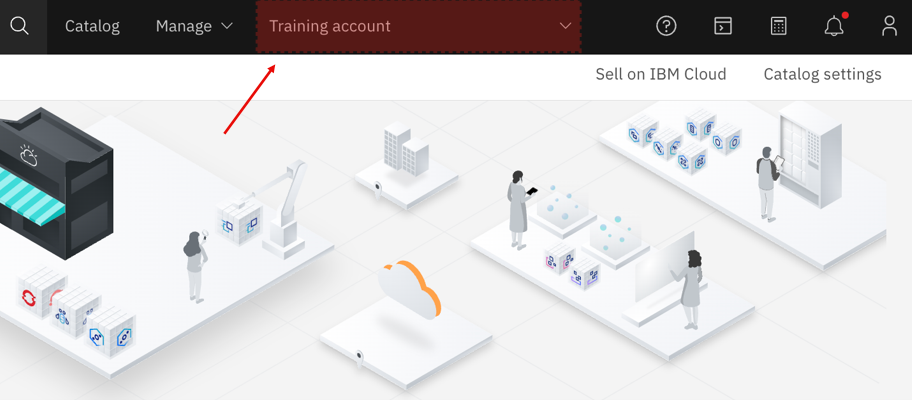

---

copyright:
  years: 2020
lastupdated: "2021-06-11"

keywords: creating accounts, multiple accounts

subcollection: account

---

{{site.data.keyword.attribute-definition-list}}

# Managing multiple accounts with your IBMid
{: #create-mult-accounts}

As the owner or administrator of an {{site.data.keyword.cloud}} account, you can create and manage multiple accounts that are associated with a single IBMid to access and manage details about each account from one email address. For example, you might be responsible for managing several departments in your company that have different billing requirements. By creating multiple accounts, you can switch between them without having to log in and out of the {{site.data.keyword.cloud_notm}} console each time.
{: shortdesc}

Only Pay-As-You-Go and Subscription accounts can create multiple accounts by using one email. Lite accounts can create only one account per email.
{: note}

Managing multiple accounts with a single IBMid is different from using an enterprise account. With an enterprise account, you can have several child accounts attached to a parent account, and all associated charges roll up to the parent account in the enterprise. See [What is an enterprise?](/docs/enterprise-management?topic=enterprise-management-what-is-enterprise) for more information.

To create multiple accounts associated with your IBMid, complete the following steps:

1. In the console, go to the **{{site.data.keyword.avatar}}** icon  > **Log out**, and click **Log out**.
2. From the login screen, click **Create an account**.
3. From the registration page, enter your email address, complete the necessary information, and click **Create account**.

After you create the accounts, you can switch to a specific account from the console menu bar as shown in the following image.

{: caption="Account selector" caption-side="bottom"}
