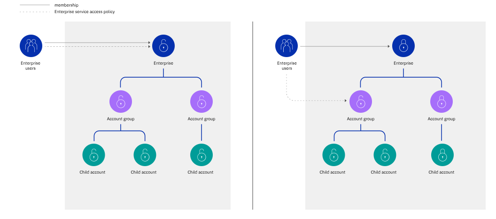

---

copyright:

  years: 2019, 2021

lastupdated: "2021-09-24"

keywords: enterprise policy, enterprise access, assign enterprise access, enterprise service

subcollection: account

---

{:shortdesc: .shortdesc}
{:codeblock: .codeblock}
{:screen: .screen}
{:tip: .tip}
{:note: .note}
{:external: target="_blank" .external}
{:ui: .ph data-hd-interface='ui'}
{:cli: .ph data-hd-interface='cli'}
{:api: .ph data-hd-interface='api'}

# Assigning enterprise access
{: #assign-access-enterprise}

To assign a user access to manage an {{site.data.keyword.Bluemix}} enterprise, you must invite them to the enterprise account, and assign access for the enterprise account management service.
{: shortdesc}

Access to manage the [enterprise](/docs/account?topic=account-what-is-enterprise) requires an access policy within the enterprise account. When you assign a user an Enterprise account management service policy within a child account in an enterprise, the user can't manage the enterprise to which the account belongs. Depending on the assigned role for the Enterprise account management service in the enterprise account, the user can perform specific actions:

* Create new accounts in the enterprise
* Create and name account groups
* Move accounts between account groups
* Import existing accounts to the enterprise 
* Update the enterprise name or domain
* View usage reports for the enterprise, a specific account group, accounts within account groups, or a specific account

A policy that gives a user access to the enterprise service can either be assigned on the entire enterprise or only on a specific account group or single account.
{: tip}

Typically, the enterprise account itself doesn't contain many resources. Instead, resources are created in the child accounts of the enterprise. It is within each of these accounts that users can be invited and given access to manage and work with resources. The access and membership that a user has in the enterprise account does not apply to the account groups and child accounts in the enterprise hierarchy. User management and access management remain isolated to each account as you can see depicted in the following diagrams.

The first diagram shows how you can assign a policy to a user in the enterprise account to manage the entire enterprise. The second diagram shows a policy that is scoped to an account group that provides access to manage only that account group and the child accounts that are organized within it.

{: caption="Figure 1. Diagram for enterprise access" caption-side="bottom"}

The target and role of the policy is important in determining the scope of access. A user, service ID, or access group in an enterprise can complete enterprise management tasks:

- Across the entire enterprise.
- On an account group that might contain other account groups and accounts.
- On a single account. 

For example, a user can complete tasks within an account group if they're assigned an access policy on the Enterprise account management service with a target that is scoped to a specific account group. The user can't complete actions that affect the enterprise as a whole, like updating the enterprise name or domain, when the target is set to a specific account group or account. 

You can assign users in a child account in the enterprise access policies that apply to the management of only that account or the resources that it contains. For example, if you assign a user in a child account a role on the Enterprise account management service, the user can't take actions at the enterprise account level. You must add them to the enterprise account and assign the policy in that context.

{: caption="Figure 2. Diagram for account access" caption-side="bottom"}

## Required policies for specific jobs
{: #sample-enterprise-policies}

Depending on the job that needs to be done, a combination of access policies might be required for a user who is not the owner of the enterprise. The following examples provide the set of access policies that you must assign a user in the enterprise to be able to complete particular tasks.

If you are an owner of an account that is not part of an enterprise, but you want another user in your account to be able to convert your account to an enterprise, you can assign that user the Administrator role on the Billing account management service.
{: note}

### Viewing usage and managing billing in the enterprise
{: #billing-admin-enterprise}

For a user to [view usage reports](/docs/billing-usage?topic=billing-usage-enterprise-usage) for all accounts in the enterprise, make payments, and view invoices, you must assign all of the following access policies:

* Usage reports viewer role for the Enterprise account management service in the enterprise account
* Administrator role for the Billing account management service in the enterprise account 

### Importing an existing account to the enterprise
{: #add-account}

For a user to [import an existing IBM Cloud account to the enterprise](/docs/account?topic=account-enterprise-add#add-accounts), you must assign all of the following access policies:

* Administrator role on the Billing account management service in the account that is to be imported
* Administrator or Editor role on the Enterprise account management service for the account group or enterprise account
* Administrator role on the Billing account management service for the enterprise account 

### Moving an account
{: #move-accountgroup}

For a user to [move an account within an enterprise](/docs/account?topic=account-enterprise-organize#move-accounts), you must assign the following access policies:

* Administrator role for the Billing account management service in the enterprise account

Then, one of the following two options:

* Administrator or Editor role for the Enterprise account management service for the entire enterprise
* Administrator or Editor role on the current and target account group 

For details about the actions users can take for each role, see [Actions and roles for account management services](/docs/account?topic=account-account-services#enterprise-account-management).

## Assigning access in the console
{: #enterprise-access-console}
{: ui}

To assign an access policy to an existing user in the enterprise account, complete the following steps:

You can set the target of the policy to be for the entire enterprise, a specific account group, which can include access to all accounts within it, or even a specific account in an account group.
{: tip}

1. In the {{site.data.keyword.cloud_notm}} console, click **Manage** &gt; **Access (IAM)**, and select **Users**.
2. From the row for the user that you want to assign access, click the **Actions** icon , and click **Assign access**.
3. Select **Assign users additional access**.
4. Select the **Account Management** tile.
5. For the type of access to assign, select **Enterprise**.
6. Select any combination of roles or permissions to define the scope of access, and click **Add**.
7. (Optional) Repeat steps to add additional access. 
8. Click **Assign** to assign all added access. 

For more information about roles and actions to assign access in an enterprise account, see [Assigning access to account management service](https://cloud.ibm.com/docs/account?topic=account-account-services#enterprise-account-management).

## Assigning access by using the CLI
{: #enterprise-cli-policy}
{: cli}

To create a new access policy for a user, run the **`ibmcloud iam user-policy-create`** command. In the command example, a JSON file is used to specify the policy details. Review the example in the [Assigning access by using the API](#enterprise-api-policy) section for an example of what to include in the JSON file.

Create a user policy:
```bash
ibmcloud iam user-policy-create name@example.com -f policy.json
```
{: pre}

For more information, see [ibmcloud iam user-policy-create](/docs/cli?topic=cli-ibmcloud_commands_iam#ibmcloud_iam_user_policy_create).

## Assigning access by using the API
{: #enterprise-api-policy}
{: api}

The following request example assigns a policy for a user with the Editor role on the Enterprise service in an enterprise account that is scoped to an account group. This type of policy is hierarchical and applies to all descendant objects in the hierarchy, which means all account groups or accounts within the specified target account group.

```bash
curl -X POST 'https://iam.cloud.ibm.com/v1/policies' -H 'Authorization: Bearer $TOKEN' -H 'Content-Type: application/json' -d '{
  "type": "access",
  "description": "Editor role for SERVICE_NAME's RESOURCE_NAME",
  "subjects": [
    {
      "attributes": [
        {
          "name": "iam_id",
          "value": "IBMid-123453user"
        }
      ]
    }'
  ],
  "roles":[
    {
      "role_id": "crn:v1:bluemix:public:iam::::role:Editor"
    }
  ],
  "resources":[
    {
      "attributes": [
        {
          "name": "accountId",
          "value": "$ACCOUNT_ID"
        },
        {
          "name": "serviceName",
          "value": "$SERVICE_NAME"
        },
        {
          "name": "resource",
          "value": "$RESOURCE_NAME",
          "operator": "stringEquals"
        }
      ]
    }
  ]
}'
```
{: codeblock}
{: curl}

```java
SubjectAttribute subjectAttribute = new SubjectAttribute.Builder()
        .name("iam_id")
        .value(EXAMPLE_USER_ID)
        .build();

PolicySubject policySubjects = new PolicySubject.Builder()
        .addAttributes(subjectAttribute)
        .build();

PolicyRole policyRoles = new PolicyRole.Builder()
        .roleId("crn:v1:bluemix:public:iam::::role:Viewer")
        .build();

ResourceAttribute accountIdResourceAttribute = new ResourceAttribute.Builder()
        .name("accountId")
        .value(exampleAccountId)
        .operator("stringEquals")
        .build();

ResourceAttribute serviceNameResourceAttribute = new ResourceAttribute.Builder()
        .name("serviceType")
        .value("service")
        .operator("stringEquals")
        .build();

ResourceTag policyResourceTag = new ResourceTag.Builder()
        .name("project")
        .value("prototype")
        .operator("stringEquals")
        .build();

PolicyResource policyResources = new PolicyResource.Builder()
        .addAttributes(accountIdResourceAttribute)
        .addAttributes(serviceNameResourceAttribute)
        .addTags(policyResourceTag)
        .build();

CreatePolicyOptions options = new CreatePolicyOptions.Builder()
        .type("access")
        .subjects(Arrays.asList(policySubjects))
        .roles(Arrays.asList(policyRoles))
        .resources(Arrays.asList(policyResources))
        .build();

Response<Policy> response = service.createPolicy(options).execute();
Policy policy = response.getResult();

System.out.println(policy);
```
{: codeblock}
{: java}

```javascript
const policySubjects = [
  {
    attributes: [
      {
        name: 'iam_id',
        value: exampleUserId,
      },
    ],
  },
];
const policyRoles = [
  {
    role_id: 'crn:v1:bluemix:public:iam::::role:Viewer',
  },
];
const accountIdResourceAttribute = {
  name: 'accountId',
  value: exampleAccountId,
  operator: 'stringEquals',
};
const serviceNameResourceAttribute = {
  name: 'serviceType',
  value: 'service',
  operator: 'stringEquals',
};
const policyResourceTag = {
  name: 'project',
  operator: 'stringEquals',
  value: 'prototype',
};
const policyResources = [
  {
    attributes: [accountIdResourceAttribute, serviceNameResourceAttribute],
    tags: [policyResourceTag],
  },
];
const params = {
  type: 'access',
  subjects: policySubjects,
  roles: policyRoles,
  resources: policyResources,
};

iamPolicyManagementService.createPolicy(params)
  .then(res => {
    examplePolicyId = res.result.id;
    console.log('createPolicy() result:\n' + JSON.stringify(res.result, null, 2));
  })
  .catch(err => {
    console.warn(err)
  });
```
{: codeblock}
{: javascript}

```python
policy_subjects = PolicySubject(
  attributes=[SubjectAttribute(name='iam_id', value=example_user_id)])
policy_roles = PolicyRole(
  role_id='crn:v1:bluemix:public:iam::::role:Viewer')
account_id_resource_attribute = ResourceAttribute(
  name='accountId', value=example_account_id)
service_name_resource_attribute = ResourceAttribute(
  name='serviceType', value='service')
policy_resource_tag = ResourceTag(
  name='project', value='prototype')
policy_resources = PolicyResource(
  attributes=[account_id_resource_attribute,
        service_name_resource_attribute],
  tags=[policy_resource_tag])

policy = iam_policy_management_service.create_policy(
  type='access',
  subjects=[policy_subjects],
  roles=[policy_roles],
  resources=[policy_resources]
).get_result()

print(json.dumps(policy, indent=2))
```
{: codeblock}
{: python}

```go
subjectAttribute := &iampolicymanagementv1.SubjectAttribute{
  Name:  core.StringPtr("iam_id"),
  Value: &exampleUserID,
}
policySubjects := &iampolicymanagementv1.PolicySubject{
  Attributes: []iampolicymanagementv1.SubjectAttribute{*subjectAttribute},
}
policyRoles := &iampolicymanagementv1.PolicyRole{
  RoleID: core.StringPtr("crn:v1:bluemix:public:iam::::role:Viewer"),
}
accountIDResourceAttribute := &iampolicymanagementv1.ResourceAttribute{
  Name:     core.StringPtr("accountId"),
  Value:    core.StringPtr(exampleAccountID),
  Operator: core.StringPtr("stringEquals"),
}
serviceNameResourceAttribute := &iampolicymanagementv1.ResourceAttribute{
  Name:     core.StringPtr("serviceType"),
  Value:    core.StringPtr("service"),
  Operator: core.StringPtr("stringEquals"),
}
policyResourceTag := &iampolicymanagementv1.ResourceTag{
  Name:     core.StringPtr("project"),
  Value:    core.StringPtr("prototype"),
  Operator: core.StringPtr("stringEquals"),
}
policyResources := &iampolicymanagementv1.PolicyResource{
  Attributes: []iampolicymanagementv1.ResourceAttribute{
    *accountIDResourceAttribute, *serviceNameResourceAttribute},
  Tags: []iampolicymanagementv1.ResourceTag{*policyResourceTag},
}

options := iamPolicyManagementService.NewCreatePolicyOptions(
  "access",
  []iampolicymanagementv1.PolicySubject{*policySubjects},
  []iampolicymanagementv1.PolicyRole{*policyRoles},
  []iampolicymanagementv1.PolicyResource{*policyResources},
)

policy, response, err := iamPolicyManagementService.CreatePolicy(options)
if err != nil {
  panic(err)
}
b, _ := json.MarshalIndent(policy, "", "  ")
fmt.Println(string(b))
```
{: codeblock}
{: go}

For more information, see [Create a policy](https://cloud.ibm.com/apidocs/iam-policy-management){: external}.


