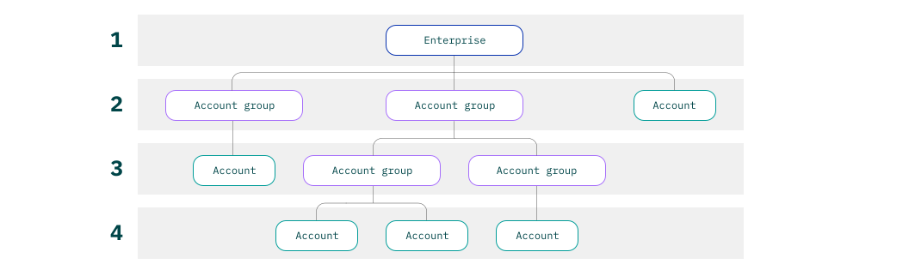

---

copyright:
  years: 2019, 2021
lastupdated: "2021-03-04"

keywords: enterprise, create account group, organize accounts, move accounts, account group, change contact, account group contact 

subcollection: account

---

{:shortdesc: .shortdesc}
{:codeblock: .codeblock}
{:important: .important}
{:tip: .tip}
{:note: .note}
{:ui: .ph data-hd-interface='ui'}
{:cli: .ph data-hd-interface='cli'}
{:api: .ph data-hd-interface='api'}
{:curl: .ph data-hd-programlang='curl'}
{:go: .ph data-hd-programlang='go'}
{:javascript: .ph data-hd-programlang='javascript'}
{:java: .ph data-hd-programlang='java'}
{:python: .ph data-hd-programlang='python'}

# Organizing accounts in an enterprise
{: #enterprise-organize}

Use account groups to organize related accounts in your {{site.data.keyword.Bluemix}} enterprise. You can create a multitiered enterprise hierarchy by nesting account groups within an account group. If you need to, you can reorganize by moving accounts between account groups.
{:shortdesc}

For example, the following diagram depicts a four-tier enterprise that you can set up by nesting account groups. First, you create two account groups that have the enterprise as the parent. Then, you can create two additional account groups that have one of those account groups as a parent. You can move accounts freely within the account groups, no matter what tier they're in. However, account groups cannot be moved.

{: caption="Figure 1. A four-tier enterprise hierarchy" caption-side="bottom"}

Remember that how you organize your enterprise impacts how you can track usage costs. For more information, see [Centrally manage billing and usage with enterprises](/docs/billing-usage?topic=billing-usage-enterprise).
{: tip}

## Creating account groups
{: #create-account-group}

To create an account group, you need the Administrator or Editor role on the Enterprise service in the enterprise account.

### Creating account groups in the console
{: #create-account-groups-ui}
{: ui}

1. From the Enterprise dashboard in the {{site.data.keyword.Bluemix_notm}} console, click **Accounts** to view the accounts and account groups in the enterprise.
1. In the Account groups section, click **Create**.
1. Enter a name for the account group that reflects the accounts that it will contain. See [How can I use an enterprise?](/docs/account?topic=account-what-is-enterprise#enterprise-use-cases) for examples of how you might organize accounts.
1. If you want an enterprise user other than yourself to be the primary contact for the account group, select their IBMid from the **Contact** menu. If a user that you want to assign as the contact isn't in the enterprise, first invite the user to the enterprise account. See [Inviting users](/docs/account?topic=account-iamuserinv) for more information.

   The contact is different from an account owner in that they don't have any additional access within the account group or its accounts. The user that you select as a contact acts as a focal point for any account group issues. For example, if a financial officer notices that the account group's usage costs are unexpectedly high, they might notify the account group contact.

1. If you want the account group to be in a different part of your enterprise hierarchy, select a different parent.

  Account groups can't be deleted or moved from where you create them.
  {: note}
1. Click **Create**.

To create a new tier in your enterprise hierarchy, create new account groups within the account group. You can move accounts that are already in the enterprise into the account group, or you can import or create accounts within it. See [Adding accounts to an enterprise](/docs/account?topic=account-enterprise-add) for more information about importing and creating accounts.

### Creating account groups by using the CLI
{: #create-account-groups-cli}
{: cli}

Create an account group by running the following command. To nest an account group within another account group, specify the name of the account group on the `--parent-account-group` option. If you want a different user to be the contact for the account group, specify their IBMid on the `--primary-contact-id` option.

```
ibmcloud enterprise account-group-create NAME
[--parent-account-group ACCOUNT_GROUP_NAME] [--primary-contact-id USER_ID]
```
{: codeblock}

### Creating account groups by using the API
{: #create-account-groups-api}
{: api}

You can programmatically create an account group in the enterprise by calling the Enterprise Management API.

The following sample request creates an account group directly under the enterprise level. When you call the API, replace the ID variables with the values from your enterprise. To nest the account group within another account group, specify the ID of the account group in the Cloud Resource Name (CRN) in the following format: `crn:v1:bluemix:public:enterprise::a/$ENTERPRISE_ACCOUNT_ID::account-group:$ACCOUNT_GROUP_ID`.

```bash
curl -X POST \
"https://enterprise.cloud.ibm.com/v1/account-groups \
-H "Authorization: Bearer <IAM_Token>" \
-H 'Content-Type: application/json' \
-d '{
  "parent": "crn:v1:bluemix:public:enterprise::a/$ENTERPRISE_ACCOUNT_ID::enterprise:$ENTERPRISE_ID",
  "name": "Sample Account Group",
  "primary_contact_iam_id": "IBMid-0123ABC"
}'
```
{: codeblock}
{: curl}

```java
CreateAccountGroupOptions options = new CreateAccountGroupOptions.Builder()
        .parent("'crn:v1:bluemix:public:enterprise::a/ent-account-id-123::enterprise:ent-id-123'")
        .name("billing-unit")
        .primary_contact_iam_id("IBMid-55ABC")
        .build();
Response<CreateAccountGroupResponse> response = service.createAccountGroup(options).execute();
```
{: codeblock}
{: java}

```javascript
const params = {
        parent: 'crn:v1:bluemix:public:enterprise::a/ent-account-id-123::enterprise:ent-id-123', 
        name: 'Sample Account Group', 
        primaryContactIamId: 'IBMid-55ABCD'
};
service.createAccountGroup(params).then(response => {
        console.log(response);
}).catch(err => {});
```
{: codeblock}
{: javascript}

```python
response = service.create_account_group (
        parent = 'crn:v1:bluemix:public:enterprise::a/ent-account-id-123::enterprise:ent-id-123', 
        name = 'Sample Account Group', 
        primary_contact_iam_id = 'IBMid-55ABCD'
 )
```
{: codeblock}
{: python}

```go
createAccountGroupOptionsModel := service.NewCreateAccountGroupOptions(
        "ent-id-123", 
        "account-id-123")
createAccountGroupOptionsModel.SetParent(
        "crn:v1:bluemix:public:enterprise::a/ent-account-id-123::enterprise:ent-id-123")
createAccountGroupOptionsModel.SetName("Sample Account Group")
createAccountGroupOptionsModel.SetPrimaryContactIamID( "IBMid-55ABCD")
result, detailedResponse, err := service.CreateAccountGroup(createAccountGroupOptionsModel)
```
{: codeblock}
{: go}

For detailed information about the API, see [Enterprise Management API](https://{DomainName}/apidocs/enterprise-apis/enterprise#create-an-account-group){: external}.

## Moving accounts within the enterprise
{: #move-accounts}

You can move accounts anywhere within your enterprise. For example, you can move an account from a lower account group into its parent account group, or you can move it directly under the enterprise. Accounts can be moved only within the enterprise. They can't be moved to a different enterprise or removed from the enterprise to be a stand-alone account.

To move an account, you need the Administrator role on the Billing service in the enterprise account and the Editor or Administrator role on either the entire enterprise or both the current and target account groups.

### Moving an account in the console
{: #move-account-ui}
{: ui}

1. From the Enterprise dashboard in the console, click **Accounts**.
1. In the Accounts section, click the Actions icon  in the row for the account, and select **Move account**.
1. Select the new parent for the account, and click **Save**.

### Moving an account by using the CLI
{: #move-accounts-cli}
{: cli}

1. Find the account name and ID by listing all accounts in your enterprise.

   ```
   ibmcloud enterprise accounts --recursive
   ```
   {: codeblock}
1. If you're moving the account to an account group, find the account group name and ID.

   ```
   ibmcloud enterprise account-groups
   ```
   {: codeblock}
1. Move the account by specifying the new parent on the related option.

   To move the account to an account group, specify the account group name on the `--parent-account-group` option.

   ```
   ibmcloud enterprise account-move -n NAME --parent-account-group ACCOUNT_GROUP_NAME
   ```
   {: codeblock}

   To move the account directly under the enterprise, specify the `--parent-enterprise` option.

   ```
   ibmcloud enterprise account-move -n NAME --parent-enterprise
   ```
   {: codeblock}

### Moving accounts by using the API
{: #move-account-api}
{: api}

You can move an account by calling the Enterprise Management API as shown in the following sample request. Replace the IAM token and ID variables with the values from your enterprise.

```bash
curl -X PATCH \
"https://enterprise.cloud.ibm.com/v1/accounts/$ACCOUNT_ID" \
-H "Authorization: Bearer <IAM_Token>" \
-H 'Content-Type: application/json' \
-d '{
  "parent": crn:v1:bluemix:public:enterprise::a/$ENTERPRISE_ACCOUNT_ID::account-group:$ACCOUNT_GROUP_1"",
}'
```
{: codeblock}
{: curl}

```java
UpdateAccountOptions options = new UpdateAccountOptions.Builder()
        .accountId("account-id-123")
        .parent("crn:v1:bluemix:public:enterprise::a/ent-id-123::account-group:account-group-123")
        .build();
Response<Void> response = service.updateAccount(options).execute();
```
{: codeblock}
{: java}

```javascript
const params = {
        accountId: 'account-id-123', 
        parent: 'crn:v1:bluemix:public:enterprise::a/ent-id-123::account-group:account-group-123'
};
service.updateAccount(params).then(response => {
        console.log(response)
}).catch(err => {});
```
{: codeblock}
{: javascript}

```python
response = service.update_account ( 
        account_id = 'account-id-123', 
        parent = 'crn:v1:bluemix:public:enterprise::a/ent-id-123::account-group:account-group-123'
)
```
{: codeblock}
{: python}

```go
updateAccountOptionsModel := service.NewUpdateAccountOptions()
updateAccountOptionsModel.SetAccountID("account-id-123")
updateAccountOptionsModel.SetParent("crn:v1:bluemix:public:enterprise::a/ent-id-123::account-group:account-group-123")
result, detailedResponse, err := service.UpdateAccount(updateAccountOptionsModel)
```
{: codeblock}
{: go}

For detailed information about the API, see [Enterprise Management API](https://{DomainName}/apidocs/enterprise-apis/enterprise#move-an-account-with-the-enterprise){: external}.
