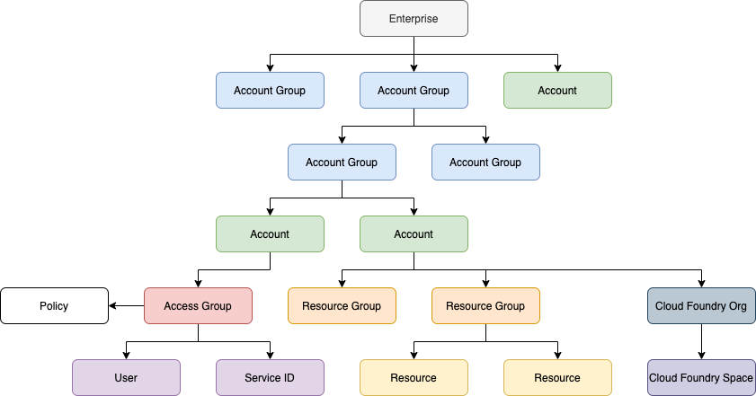
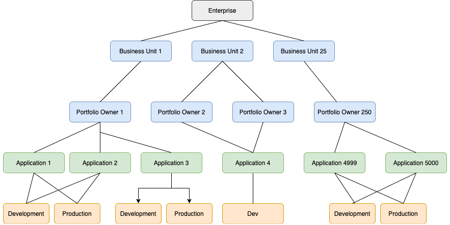
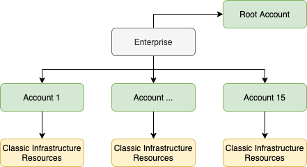
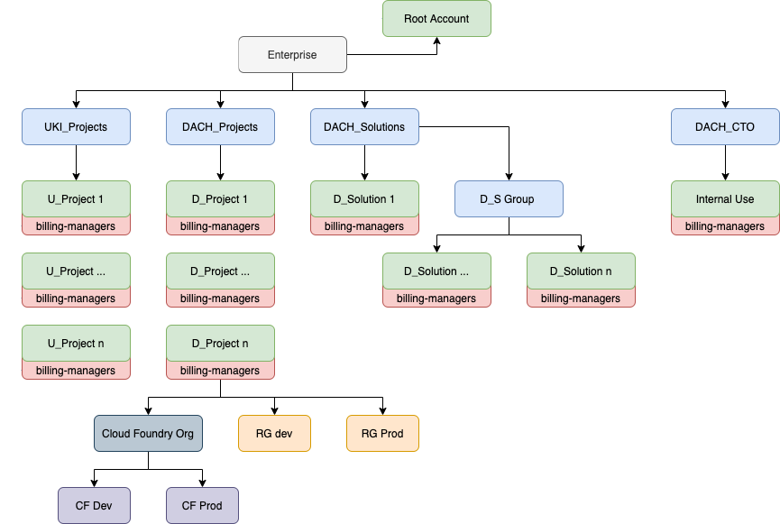
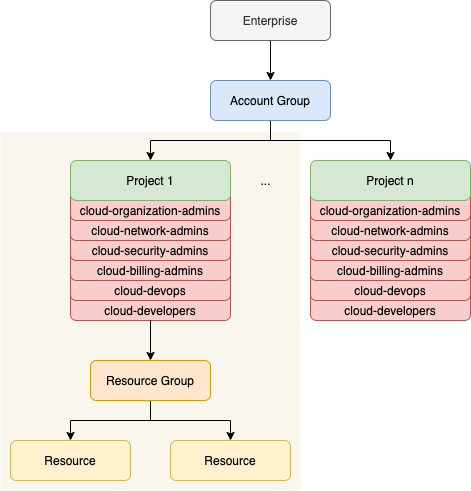

---

copyright:
  years: 2019, 2021
lastupdated: "2021-11-30"

keywords: enterprise, create account group, organize accounts, move accounts, account group, change contact, account group contact 

subcollection: account

---

{{site.data.keyword.attribute-definition-list}}

WIP

# Using enterprise accounts
{: #using-enterprise-account}

Just collecting this information here for now. I'm not sure if this should be it's own doc or if I should try to fit these concepts into other places in the doc. 

## Set up an account hierarchy
{: #enterprise-account-hierarchy}

Define the hierarchy best suited for your organization. Different options are possible based on how your organization wants to work.

{: caption="Figure 2. A six-tier enterprise hierarchy" caption-side="bottom"}

### Organize by structure and role
{: #enterprise-structure-role}

Use account groups to map the organization structure and roles.

{: caption="Figure 3. Enterprise hieararchy organized by structure and role" caption-side="bottom"}

### Flat list of accounts to isolate resources
{: #enterprise-isolate-resources}

Use a flat list of accounts to isolate resources.

{: caption="Figure 4. Flat list of accounts to isolate resources" caption-side="bottom"}

### Isolate projects and environments within a project
{: #enterprise-isolate-proj-env}

Use a functional user, account groups and account to isolate projects and environments within a project

To separate development cycles:

use multiple resource groups such as development, production;
or use dedicated accounts and use resource groups within the account to isolate components of the solution.

{: caption="Figure 5. Isolate projects and environments within a project" caption-side="bottom"}

### Add users and groups
{: #enterprise-add-users-groups}

Use a functional user, account groups and account to isolate projects and environments within a project

To separate development cycles:

use multiple resource groups such as development, production;
or use dedicated accounts and use resource groups within the account to isolate components of the solution.

{: caption="Figure 5. Isolate projects and environments within a project" caption-side="bottom"}
