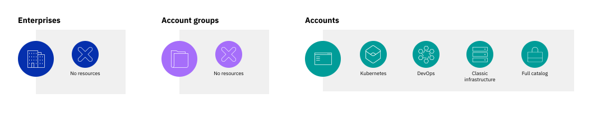

---

copyright:
  years: 2019, 2023
lastupdated: "2023-02-01"

keywords: enterprise, enterprise account, multiple accounts, organization, hierarchy

subcollection: account

---

{{site.data.keyword.attribute-definition-list}}

# What is an enterprise?
{: #what-is-enterprise}

{{site.data.keyword.Bluemix}} enterprises provide a way to centrally manage billing and resource usage across multiple accounts. Within an enterprise, you create a multitiered hierarchy of accounts, with billing and payments for all accounts managed at the enterprise level.
{: shortdesc}

When compared to using multiple stand-alone accounts, enterprises offer the following key benefits:
- Centralized account management: View your entire enterprise hierarchy at a glance, without needing to switch accounts. You can add existing accounts or create new accounts directly within the enterprise.
- Consolidated subscription billing: Track your subscriptions and credit spending for all accounts from a single view. Your subscription credit is pooled and shared among accounts in the enterprise.
- Top-down usage reporting: From your enterprise account, you can view usage of all accounts in your enterprise, which is organized by account group.

## Enterprise hierarchy
{: #enterprise-hierarchy}

At its core, an enterprise consists of three main building blocks:
- The enterprise account, which serves as the parent account to all other accounts in the enterprise. The enterprise account manages billing for the entire enterprise, with usage costs from all accounts that are rolled up and paid from the enterprise account.
- Account groups, which you can use to organize related accounts. Account groups can't contain resources themselves, but you can view costs for resource usage from the accounts that they contain.
- Accounts, which are just like stand-alone {{site.data.keyword.Bluemix_notm}} accounts in that they contain resources and resource groups, Cloud Foundry orgs and spaces, and independent access permissions. However, one major difference is that each account in an enterprise doesn't manage its own billing or payments because these are handled at the enterprise account level.

You create tiers in your enterprise by nesting an account group within an account group.
{: caption="Figure 1. A four-tier enterprise hierarchy" caption-side="bottom"}

An enterprise can contain up to 5 tiers of accounts and account groups. In its most basic form, an enterprise has two tiers: The enterprise account, and a single child account. A maximum of 300 accounts can be added to an enterprise.

Your enterprise structure is flexible and can grow and change as your needs do. You can add and remove account groups and move accounts between account groups. If the purpose of an account group changes, you can rename it to better reflect the accounts it contains.

## Consolidated billing
{: #enterprise-billing}

In an enterprise, all billing is managed through the enterprise account. Enterprises require [subscription billing](/docs/account?topic=account-accounts#subscription-account) or an account with the [Pay as you go with Committed Use billing model](/docs/account?topic=billing-usage-committed-use). Subscription billing means that you purchase a subscription for an amount of credit to spend during the subscription term, and usage is deducted from the subscription credit at a discounted rate. Subscription credit, as well as credit from any promotions, is added to the enterprise credit pool, which is shared across all accounts in the enterprise. As accounts use resources, credit is spent from the credit pool. The Pay as you go with Committed Use billing model is similar to the billing model for Subscription accounts. You commit to spend a certain amount on {{site.data.keyword.Bluemix_notm}} and receive discounts across the platform. You are billed monthly based on your usage and you continue to receive a discount even after you reach your committed amount.

{: caption="Figure 2. Enterprise billing management" caption-side="bottom"}

Because billing is consolidated, enterprises make managing invoicing and payments across multiple accounts easier with these key benefits:
* A credit pool of subscriptions that span multiple accounts, so you can size your subscriptions for all of your usage rather than usage per account
* A single invoice for all usage within the enterprise, so understanding costs is easier
* A single place to manage payment methods, so you can update once for all accounts

Learn more in [Centrally manage billing and usage with enterprises](/docs/billing-usage?topic=billing-usage-enterprise).

## Enterprise support
{: #enterprise-support-model}

The level of support that is assigned to an {{site.data.keyword.Bluemix_notm}} enterprise defaults to the highest support plan within the enterprise. All child accounts within the enterprise also default to the highest support plan. For more information about the support experience, see [Basic, Advanced, and Premium Support plans](/docs/get-support?topic=get-support-support-plans#support_level_enterprise).

## Resource management
{: #enterprise-resources}

Resources and services within an enterprise function the same as in stand-alone accounts. Each account in an enterprise can contain resources in resource groups and services in Cloud Foundry orgs and spaces. Account groups can't contain resources. For more information, see [Managing resources](/docs/account?topic=account-manage_resource).

{: caption="Figure 3. Resources in an enterprise" caption-side="bottom"}

As with all accounts, resources are tied to the resource group and account in which they're created, so they can't be moved between accounts in the enterprise. However, the enterprise's flexible account structure means you can move resources within the enterprise by moving the accounts that contain them.

## Top-down usage reporting
{: #enterprise-usage}

From the enterprise account, you can view resource usage from all accounts in the enterprise. Starting at the enterprise level, you see estimated usage costs that are broken down by account and account groups. You can navigate down within the enterprise structure to see the costs within each level. At the account level, enterprise users can view costs for each type of resource or service in the account.

Because access in the enterprise is separate from access in each account, enterprise users can't automatically create or manage resources within the child accounts. Similarly, users in each account can continue to view their past and current usage from the Usage page regardless of whether they have enterprise access.

For more information, see [Viewing usage in an enterprise](/docs/billing-usage?topic=billing-usage-enterprise-usage).

## Isolated user and access management
{: #enterprise-access}

Enterprises keep user and access management isolated between the enterprise and its child accounts to provide greater security for your accounts' data. The users and their assigned access in the enterprise account are entirely separate from those in the child accounts, and no access is automatically inherited between the two types of accounts.

The user lists for each account are only visible to the users who are invited to that account. Just because a user is invited and given access to manage the entire enterprise, it doesn't mean that they can view the users who are invited to each child account. User management in each enterprise and each account is entirely separate and must be managed by the account owner or a user given the Administrator role on the User management account management service in the specific account.

Similar to how user management is entirely separate in each account and the enterprise itself, so is access management. This separation means that users who manage your enterprise can't access account resources within the child accounts unless you specifically enable them to. For example, your financial officer can have the Administrator role on the Billing account management service within the enterprise account, which provides them access to billing and payment information and usage data down to the resource type. But, unless they are invited to a child account and are assigned access to the Billing account management service for that account, they can't view offers or update spending limits for the child account.

For more information, see [User management for enterprises](/docs/account?topic=account-enterprise-access-management).

## How can I use an enterprise?
{: #enterprise-use-cases}

Enterprises can help simplify account and billing management for otherwise complex scenarios. Enterprises can be beneficial for managing any large organization, but two primary use cases where you might want to create them are large companies and educational institutions.

How you structure your enterprise depends on how you want to analyze usage and costs, such as to charge back usage to a particular group. Organize your enterprise according to how you want to track and manage billing and usage.
{: tip}

### Large companies or organizations
{: #enterprise-orgs}

Enterprises can be valuable for large organizations that otherwise require multiple separate accounts for their departments or teams. By using account groups, you can model your enterprise hierarchy after your organization's structure.

#### Organize by department
{: #enterprise-by-dept}

If your organization has global teams that share a budget, you can model your enterprise structure after their departments. With this structure, you can view usage costs that are aggregated for each department.

{: caption="Figure 4. An enterprise that is organized by department" caption-side="bottom"}

#### Organize by geography
{: #enterprise-by-geo}

Or, if your organization has separate budgets by geography, you can structure your enterprise to group costs for each geographical entity.

{: caption="Figure 5. An enterprise that is organized by geography" caption-side="bottom"}

### Educational institutions
{: #enterprise-edu}

Educational institutions might want to provide {{site.data.keyword.Bluemix_notm}} accounts to their students so that they can learn valuable skills through hands-on projects that use {{site.data.keyword.Bluemix_notm}} services. For these institutions, such as traditional universities or online learning platforms, you can group accounts by department or subject area, then create accounts for each course.

Within each account, students can create resources to build their projects and collaborate with other students in the account. The university has a complete view of the costs of each department and course.

{: caption="Figure 6. An enterprise for a university" caption-side="bottom"}
