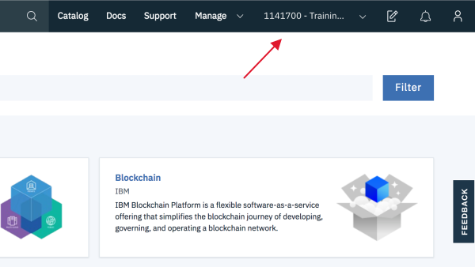

---

copyright:
  years: 2015, 2023
lastupdated: "2023-06-01"

keywords: account settings, delete account, account errors, reassign account, view tags, batch registration, transfer account ownership, upgrade, convert, trial, Lite, cancel account, terminate account, suspend account

subcollection: account

content-type: faq

---

{{site.data.keyword.attribute-definition-list}}

# FAQs about accounts
{: #accountfaqs}

FAQs for your {{site.data.keyword.cloud}} account might include questions about upgrading an account, reassigning users, resolving account errors, or tagging resources in an account. To find all FAQs for {{site.data.keyword.cloud_notm}}, see our [FAQ library](/docs/faqs).
{: shortdesc}

## How do I create an {{site.data.keyword.Bluemix_notm}} account?
{: #create-account}
{: faq}

You can create an account by [registering](/registration){: external} your email address. For identity verification, a credit card is required when you create a new account. New accounts are created as Pay-As-You-Go accounts, except purchased subscriptions. For more information, see [Account types](/docs/account?topic=account-accounts).

Feature codes aren't supported in some countries. For more information, see [personal use availability](/docs/account?topic=account-account-getting-started#signup-personalaccts).
{: note}

## Why is my credit card not authorized when I am creating an account?
{: #authorize-account}
{: faq}

A credit card is required to create a new {{site.data.keyword.Bluemix_notm}} account unless you have a subscription or feature code. In many cases, a credit card isn't accepted because your credit card issuer didn't authorize it. You might see a temporary hold on your credit card for verification and security when creating an account. This credit card hold is reversed within 24 to 72 hours. For more information about issues with credit card authorization, see [Credit Card error messages](/docs/billing-usage?topic=billing-usage-cc-error-messages).


## How do I get help with issues with creating an account?
{: #account-error}
{: faq}

If you are able to log in to an {{site.data.keyword.Bluemix_notm}} account, go to the [Support Center](/unifiedsupport/supportcenter){: external} and choose one of the following options.

* If you have advanced or premium support, click **Chat with IBM** to talk to an {{site.data.keyword.Bluemix_notm}} support representative.
* Create a support case by clicking **Create a case** from the Need more help? section.

   After you open the case, an email notification is sent to you. Follow the instructions for further communication.

If you can't log in to an {{site.data.keyword.Bluemix_notm}} account, [create an account request](https://watson.service-now.com/x_ibmwc_open_case_app.do#!/create){: external}.

## Why is a VAT ID required when I create an account?
{: #vat-id}
{: faq}

A tax identification number, such as a VAT ID, GST number, or TIN, is required to create a new personal use account with an address in specific countries or regions. For information about these requirements or where personal use accounts are not permitted, see [Personal use availability](/docs/account?topic=account-account-getting-started#signup-personalaccts). A tax identification number is also required for company accounts depending on your location. Some countries where the local government requires it, taxes are charged directly instead.

## How do I update my credit card?
{: #updatepayment}
{: faq}

If you have a Pay-As-You-Go account type that is billed in US Dollars, complete the following steps:
1. Go to the [Payments](/billing/payments) page.
2. Click **Update card**, enter the new credit card information, and click **Save**.

To switch to a different payment method, select Pay with Other and then click Submit change request. A support case to change your payment method is created for you.

 Based on your account type, you might manage your credit card outside of the console. To manage your credit card outside of the console, complete the following steps:

1. Go to [ibm.com](http://www.ibm.com){: external} and log in with the same IBMid and password that you use to log in to {{site.data.keyword.Bluemix_notm}}.
1. Click the **{{site.data.keyword.avatar}}** icon , and select **Billing**.
1. Click **Manage payment method**.
1. Enter your credit card information, and click **Register**.

If your credit card requires a MasterCard SecureCode that is sent to a mobile phone, you might see an unexpected error message after you submit the code. Refresh the manage my wallet page to verify that your new credit card information is saved.
{: note}

## How do I upgrade my account?
{: #changeacct}
{: faq}

To upgrade your Lite account, go to your [account settings](/account/settings). In the Account Upgrade section, click **Add credit card** to upgrade to a Pay-As-You-Go account, or click **Upgrade** for a Subscription account.

See [Upgrading your account](/docs/account?topic=account-upgrading-account) for more information.

## If I upgrade my Lite account, can I continue to use my existing instances?
{: #nochange}
{: faq}

Yes, when you upgrade to a Pay-As-You-Go or Subscription account, you can continue to use the instances that you created with your Lite account. However, if you want to use the capabilities that are not available in a service's Lite plan, you must [upgrade the plan](/docs/billing-usage?topic=billing-usage-changing) for the specific service. After you change a service plan, it might be necessary to restage your application.

## Can I convert my account?
{: #convertacct}
{: faq}

Yes, the following options are available depending on your account type:

* If you have a feature code from an online course or educational event, you can use it to convert your Lite account to a trial account. Go to the [Account settings](/account/settings){: external} page in the console to apply the code to your account.
* To convert your Pay-As-You-Go account to a Subscription account, contact [{{site.data.keyword.Bluemix_notm}} Sales](/catalog?contactmodule){: external}.

## Can I convert my Pay-As-You-Go account to a trial account?
{: #convertpayg-litetrial}
{: faq}

If you upgrade your trial account to a Pay-As-You-Go account by entering a credit card, it can't be converted back to a trial account.

## Can I add an educational feature code to an account after I have added a credit card?
{: #convert-education}
{: faq}

When you add a credit card to your trial account, your account is upgraded to a Pay-As-You-Go account. Educational feature codes can't be used in a Pay-As-You-Go account. In addition, a Pay-As-You-Go account can't be converted back to a trial account. For more information about educational trial accounts, see the [IBM SkillsBuild Software Downloads FAQs](https://www.ibm.com/academic/faqs/faqs){: external}.

## Can I sign up for a free trial?
{: #freetrial}
{: faq}

{{site.data.keyword.Bluemix_notm}} trial accounts are available for faculty and students at accredited academic institutions. To qualify for a trial account, go to [Harness the Power of IBM](https://ibm.biz/academic){: external} and validate your institution credentials. Trial accounts expire after 30 days.

## Can I close my account?
{: #cancelaccount}
{: faq}
{: support}

We're sad to see you go! If there's any way we can assist you before you decide to close your account, [reach out to us](/unifiedsupport/supportcenter){: external}.


* To close a Pay-As-You-Go or Subscription account, go to the [Support Center](/unifiedsupport/supportcenter), and click **Create a case** in the Contact Support center. Click **Account**, and select the **Cancel/close/suspend** subtopic. A support case is required for account security and documentation purposes. After your account is closed, all usage is stopped across all services running in your account, and the usage that is accrued in the current billing period is sent in one final invoice at the close of the billing period. Closing your account can't be undone and your data is unrecoverable.

* To close a Lite account, go to the [Account settings](/account/settings) page, and click **Close account**. You can reactivate your account if you upgrade to a Pay-As-You-Go or Subscription account. After an account is closed for 30 days, all data is deleted and all services are removed.

* You might receive a final invoice after you close your account due to incurred charges from the month before the account was closed.
* Before you request to close an account, cancel all services and resources within the account. Make sure to state that you want all services and data to be deleted immediately and that you understand all services and data are unrecoverable within the account closure case.


## Can I log in to the console with my SoftLayer ID?
{: #slid}
{: faq}

Yes, you can use your SoftLayer ID to log in to the console. Go to the [login page](/login){: external}, and click **Log in with SoftLayer ID**.

## What's a Lite pricing plan for services?
{: #whatisliteplan}
{: faq}

A Lite plan is a free quota-based service plan. You can use a service's Lite plan to build an app without incurring any charges. A Lite plan might be offered on a monthly cycle that is renewed each month or on a one-off usage basis. Lite pricing plans are available with all account types. You can have one instance of a Lite plan for each service. For more information about Lite accounts, see [Account types](/docs/account?topic=account-accounts#liteaccount).

## How many apps can I build?
{: #howmanyapps}
{: faq}

There's no limit to the number of apps you can build in a Pay-As-You-Go or Subscription account.

If you created a Lite account before 12 August 2021, you can build and deploy apps with 256 MB of instantaneous runtime memory. To get 512 MB of free instantaneous runtime memory, upgrade to a Pay-As-You-Go or Subscription account and pay only for what you use over that limit.


## What happens when my Lite plan instance reaches the monthly quota?
{: #monthlyquota}
{: faq}

Reaching any quota limit for Lite plan instances suspends the service for that month. Quota limits are per org, not instance. New instances that you create in the same org reflect any usage from previous instances. The quota limits reset on the first of every month.

You can check your usage by going to **Manage** > **Billing and usage** in the {{site.data.keyword.cloud_notm}} console, and selecting **Usage**. For more information, see [Viewing your usage](/docs/billing-usage?topic=billing-usage-viewingusage).

## How many resource groups, orgs, or spaces can I create?
{: #resourcelimit}
{: faq}

If you have a Pay-As-You-Go or Subscription account, there's no limit to the number of resource groups, orgs, or spaces that you can create. However, if you have a Lite account, you're limited to one org and one resource group.

## Can I change which notifications I receive?
{: #change-email-prefs}
{: faq}

Yes, you can update your email preferences for receiving notifications from the Email preferences page in the console. Click the **{{site.data.keyword.avatar}}** icon  > **Profile** > **Email preferences**.

For more information, see [Setting email preferences](/docs/account?topic=account-email-prefs).

## Can I reset my password?
{: #reset-password}
{: faq}

To reset your account password, click the **{{site.data.keyword.avatar}}** icon  > **Profile** in the console. Then, click **Edit** in the Account user information widget.

To reset your VPN password, complete the following steps:

1. In the {{site.data.keyword.cloud_notm}} console, go to **Manage** > **Access (IAM)**, and select **Users**.
2. Select the user.
3. From the VPN subnets section, click the **Edit** icon  to enter a new VPN password.
4. Click **Apply**.


## What can I do if I forget my password?
{: #forgot-password}
{: faq}

If you don't remember your password for your IBMid and can't log in to {{site.data.keyword.Bluemix_notm}}, you can reset your password by using our [automated system](https://www.ibm.com/account/reg/us-en/reset-password){: external}.

## Can I remove my personal data from {{site.data.keyword.Bluemix_notm}}?
{: #remove-pi}
{: faq}

To understand how {{site.data.keyword.IBM_notm}} handles your personal information, see the [{{site.data.keyword.IBM_notm}} Privacy Statement](https://www.ibm.com/privacy){: external}. In the Your Rights section, review the information about what you can request to remove. Click the link in the section to submit a request to remove your personal information.

## Why is my account deactivated?
{: #account-deactivated}
{: faq}
{: support}

Your account might be deactivated for the following reasons:

* For trial accounts, the trial period ended. To reactivate your account, log in to your account and upgrade it to a Pay-As-You-Go account.
* An authorized user closed the account.
* An account has past due invoices and several contact attempts have been made by {{site.data.keyword.cloud_notm}} Support to make payment arrangements.
* At the discretion of {{site.data.keyword.IBM_notm}}, accounts that violate the acceptable usage behavior of the {{site.data.keyword.Bluemix_notm}} services can be disabled without notice. Some services can be restored if users correct their usage behaviors after they're notified of the offensive action. For more information, see [Acceptable Internet use policy for IBM services](https://www.ibm.com/services/us/imc/html/aup1.html){: external}.

If you believe that your account was deactivated in error, contact support by calling 1-866-325-0045 and selecting the third option.

## What are my options for contacting {{site.data.keyword.cloud_notm}} Support?
{: #contactsupport}
{: faq}

From the {{site.data.keyword.Bluemix_notm}} console menu bar, click the **Help** icon  > **Support center**. The options that are available to you depend on your support plan. For more information, see [Getting support](/docs/get-support?topic=get-support-support-plans).

To contact support, you can use the following methods:
* If you have a valid Pay-As-You-Go or Subscription account, you can click **Live chat with support** to chat with a support engineer.
* Lite and Trial account support is limited to nontechnical support issues that are related to account access and billing. Users with Lite or Trial accounts can view the [{{site.data.keyword.Bluemix_notm}} documentation](/docs/get-support?topic=get-support-using-avatar), Chat with Watson, and use [Stack Overflow](https://stackoverflow.com/questions/tagged/ibm-cloud){: external}.

## Can I view a list of accounts that I own?
{: #accounts-owned}
{: faq}

The {{site.data.keyword.cloud_notm}} console menu bar lists all of the accounts that are affiliated with your IBMid, including the accounts that you own. Click the account listing in the console menu bar to see the other accounts that you own or are a member. The account name begins with the account number for Pay-As-You-Go and Subscription accounts.

{: caption="Figure 1. Account selector" caption-side="bottom"}

You can view your role in each account on the [Users page](/iam/users). The 'owner' tag next to a user name indicates the account owner. If you are the owner of the account, the 'self' tag is also listed next to your name. If you see only your name that is listed and you are not the account owner, the account owner has restricted the user list. For more information, see [Controlling user visibility](/docs/account?topic=account-iam-user-setting).Contact [{{site.data.keyword.Bluemix_notm}} Support](/unifiedsupport/supportcenter){: external} to determine the account owner.

You can also find your accounts from the CLI by running the `ibmcloud account list` command. This command lists the account that you own and any other accounts that are affiliated with your IBMid.

## Can I view my account ID, account type, and account number?
{: #account-details}
{: faq}

Go to the [Account settings](/account/settings) page in the console to view your account ID and type. The account ID is a 32 character, unique account identifier. The {{site.data.keyword.cloud_notm}} console menu bar lists all of the accounts that are affiliated with your IBMid, including the accounts that you own. The account selector displays the account name and account number.

## How can I join accounts?
{: #join-new-account}
{: faq}

The account owner, organization manager, or a user with the correct permissions can invite you to join their account.

* If you're new to {{site.data.keyword.cloud}}, you receive an email that contains all the information you need.
* As an existing member of {{site.data.keyword.cloud}}, you can accept the invitation in your notifications, by email, or by using the CLI to onboard to the new account. To accept invitations in the CLI, use the [**`ibmcloud login`**](/docs/cli?topic=cli-ibmcloud_cli#accept-invitation-to-join-a-new-account-) command.

## Can I switch between multiple accounts?
{: #switch-between-accounts}
{: faq}
{: support}

If you have access to more than one account, you can click your account name in the console menu bar to switch to another account.

{: caption="Figure 2. Account selector displays all accounts to which you have access" caption-side="bottom"}

## Can I move data between {{site.data.keyword.Bluemix_notm}} accounts?
{: #move-between-accounts}
{: faq}

Data can't be directly migrated from one {{site.data.keyword.Bluemix_notm}} account to another. But, you might be able to re-create configurations and add them to another account. Consider the following approaches:

* Save your applications and replicate them in different accounts by using GitHub or another code repository.
* Review the applicable documentation to determine whether your infrastructure services can be backed up and re-created in different accounts.
* Use manifests and other documented methods to rebuild your applications and services by using documented methods to back up and restore your data.

Users with a Basic, Advanced, or Premium support plan can open a [Support case](/unifiedsupport/supportcenter){: external}  for assistance with data migration questions.

## Can I bookmark a console page for a specific account?
{: #bookmark-page-account}
{: faq}

You can target URLs for any {{site.data.keyword.Bluemix_notm}} console page to a specific account. If you have multiple accounts, you can bookmark the account-specific URLs to easily access resources in different accounts without having to manually switch between them.

1. Switch to the account that you want to target, and go to the [Account settings](/account/settings) page in the console. In the Account section, find the account ID, such as `a1b2c3d4e5f61234567890fedcba4321`.
1. Go to the console page that you want to bookmark, and add `?bss_account=<account-id>` to the URL, replacing `<account-id>` with the ID from your account. For example,:

   ```text
   /billing/usage?bss_account=a1b2c3d4e5f61234567890fedcba4321
   ```
   {: screen}

1. Bookmark the URL in your browser.

## Can I make someone else the account owner?
{: #switch-account-owners}
{: faq}
{: support}

You can transfer ownership of your entire account, create a support case that requests to make another user in the account the new owner. For more information, see [Transferring ownership of your account](/docs/account?topic=account-transfer).

## Can I change the name or IBMid in my profile?
{: #change-profile-settings}
{: faq}
{: support}

You can change your personal information, such as name, email, or phone number, by going to the **{{site.data.keyword.avatar}}** icon  > **Profile and settings** in the console. You can't change your IBMid, but you can create a new one if appropriate. The [IBMid worldwide help desk](https://www.ibm.com/ibmid/myibm/help/us/helpdesk.html) is available to help with general ID questions that aren't specific to your {{site.data.keyword.Bluemix_notm}} account.

## Can I change my account language?
{: #switch-account-lang}
{: faq}
{: support}

The language that is used is based on your web browser settings. To view content in your native language, update your browser's language settings. The language for specific pages must be the same language that is selected for the browser's settings.

## Does {{site.data.keyword.Bluemix_notm}} support batch registration of users?
{: #batch-registration}
{: faq}

When you register users for {{site.data.keyword.Bluemix_notm}}, you must register each user individually. {{site.data.keyword.Bluemix_notm}} doesn't support batch registration of users.

## What are tags?
{: #know-about-tags}
{: faq}
{: support}

Tags are `key:value` pairs that you use to organize your resources and service IDs or control access to them.

* You can use user tags to organize and view resources and service IDs across your account and help you track usage costs.
* You can limit access to specific resources and service IDs in your account by using access management tags.

For more information, see [Working with tags](/docs/account?topic=account-tag).

## What access is required to create access management tags?
{: #permissions-create-access-tags}
{: faq}

You must be the account owner or have the following roles:

* Administrator on all account management services
* Administrator on the tagging service

For more information, see [Granting users access to tag resources](/docs/account?topic=account-access).

## What access is required to attach or detach tags?
{: #permissions-add-remove-resource-tags}
{: faq}

* To manage user tags on a resource, you must have at least the editor role for IAM-enabled resources.
* To manage user tags on a service ID, you must have at least the editor role on the IAM Identity service.
* To manage access management tags, you must have the administrator role on the targeted resource.
* To manage access management tags on service IDs, you must have the administrator role on the IAM Identity service.

For more information, see [Granting users access to tag resources](/docs/account?topic=account-access).

## Can users in my account view my tags?
{: #tags-visibility-account}
{: faq}

Yes, tags are visible throughout your account. If your account users have permission to view a resource, they can also view all tags that are attached to those resources. For more information, see [Granting users access to tag resources](/docs/account?topic=account-access).

## Can I delete my tags?
{: #delete-tag}
{: faq}

Before you can delete a tag, you must detach it from all resources. The tag might be attached to a resource that you don't have permission to view. The same tag can be attached to several resources by different users in the same billing account. Users don't have the same visibility on all resources on the account. Contact the account owner who can resolve the problem by detaching the tag from the blocking resource.

If you still can't delete it, the tag might be attached to a reclaimed resource. You can use the {{site.data.keyword.Bluemix_notm}} CLI to manage the reclamation process of specific resources. For more information, see [Using resource reclamations](/docs/account?topic=account-resource-reclamation).

When you delete an access management tag from the account, any associated IAM policies are also deleted with it.
{: note}

## How do I view my dashboard role?
{: #view-dashboard}
{: faq}

You can view the role that you are assigned on a dashboard by going to **Manage** > **Account** > **Dashboards** in the {{site.data.keyword.cloud_notm}} console. All users besides the dashboard owner have the viewer role on the dashboard.

## Can I edit the default dashboard?
{: #access-dashboard}
{: faq}

You can't edit the default dashboard directly. However, you can create a duplicate version that you can edit and personalize however you want by clicking the **Actions** icon  > **Edit** in {{site.data.keyword.Bluemix_notm}} console.

By maintaining the original version of the default dashboard, you can discover the latest widgets and functionalities, which get built and added over time. This way, you can always bring out the most of your workflow.

You can also switch between the duplicate and original versions by selecting each one from your list of dashboards that's displayed on your active dashboard.

## Can I move an org to another account?
{: #move-org-diff-account}
{: faq}

Currently, you can't move an org to a different account. However, you can re-create the org with the same credentials in a different account to mimic this functionality. For more information, see [Adding orgs and spaces](/docs/account?topic=account-orgsspacesusers#createorg).

## Why do I get logged out of my account?
{: #user-session-log-out}

The administrator of your account has customized the duration of active and inactive accounts, which requires users to enter their credentials after a specific time. For more information, see [Managing user's login session durations](/docs/account?topic=account-iam-work-sessions).

## Why can't I create a Lite account?
{: #lite-account-create}
{: faq}

Based on an update to our account registration that released starting 25 October 2021, new accounts are created as Pay-As-You-Go. As part of this update, you're asked to provide credit card information for identity verification. After you register and create your new account, you can access the full {{site.data.keyword.cloud_notm}} catalog, including all Free and Lite plans. And, you get a $200 credit that you can use on products in the first 30 days. You pay only for billable services that you use, with no long-term contracts or commitments.

If you created a Lite account before 25 October 2021, you can continue working as you always have. However, you can go ahead and [upgrade to a Pay-As-You-Go account](/docs/account?topic=account-accountfaqs#changeacct) by adding your credit card information. This way, you can gain access to all Free service plans in the catalog.

## How do I see who created a service instance and when?
{: #instance-create}
{: faq}

From the [Resource list](/resources), expand the appropriate section, and click the row for the instance that you want more details about. Additional details about the resource display including when the resource was created and by whom.

For classic infrastructure services, you can get similar information by using the [Audit log](/docs/account?topic=account-audit-log).
