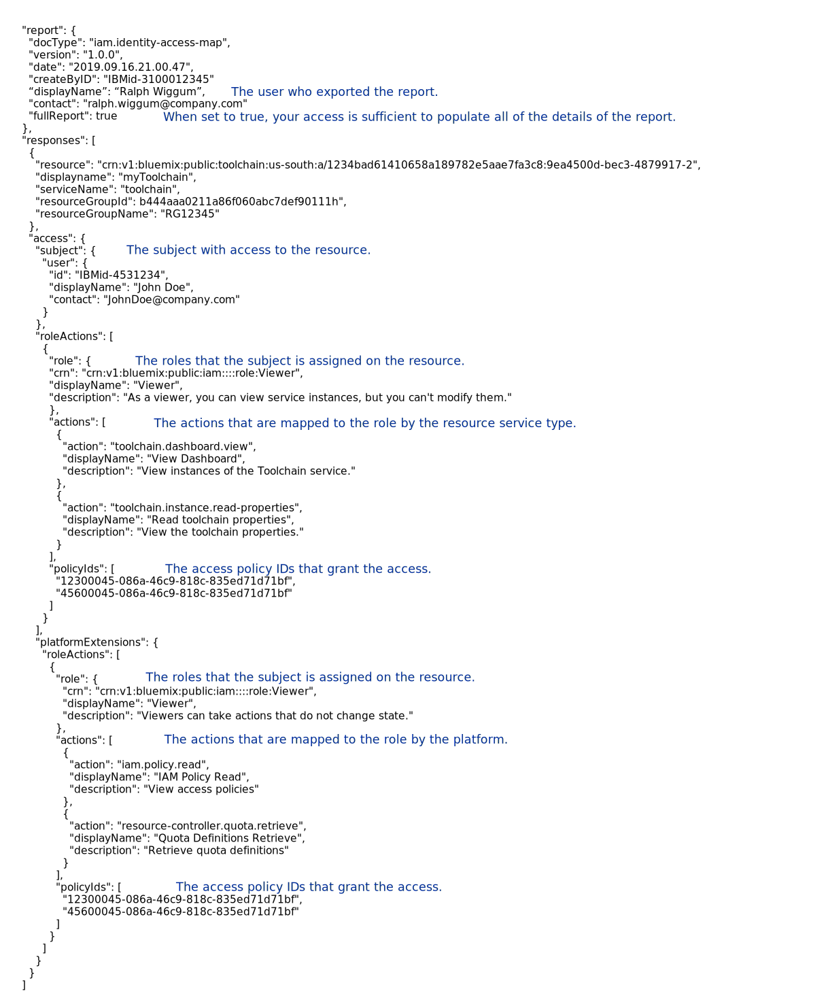

---

copyright:

  years: 2018, 2021
lastupdated: "2021-11-22"

keywords: resource access, access report, export user access, who has access, download access report, audit access

subcollection: account

---

{:shortdesc: .shortdesc}
{:codeblock: .codeblock}
{:screen: .screen}
{:tip: .tip}
{:note: .note}
{:external: target="_blank" .external}

# Auditing access to resources
{: #access-report}

If you want to determine which users, access groups, service IDs, and services can access a specific resource, you can download a report from the Resource list in your account. 
{: shortdesc}

The report includes details about the selected resource. It doesn't include details about its subresources. However, the access that is listed in the report might extend to the subresources.
{: note}

Auditing who has access to a specific resource can be helpful to ensure that you're using the principle of least privilege. This means that you're giving the least amount of access that is required to only the users who need it. Each report gives you a list of what entities have access at that time. You can use the report to determine who has access that doesn't need it, and then you can take action to reduce the number of access policies and inflated access across the account.

## Required access for exporting an access report
{: #required-access-report}

You can download the report if you have the Administrator role on the selected resource. If you have administrator access only on the resource, the report displays the IDs for the users, access groups, and services. However, you can't view the display names of the users, services, access groups, or the access group members or dynamic rules without extra access.

With the following extra access, you can view display names, access group membership, and dynamic rules in the report, depending on the report type:

* You must be a member of the account. If the account owner restricts the user list, you might be able to view details only for the users that you have access to view.
* You must have access to the access group to view the members of the group who have access. This includes any of the following types of access:
   * Viewer role for a specific access group by using the IAM Access Groups account management service
   * Viewer role for all access groups by using the IAM Access Groups account management service
   * Viewer role for all account management services

## Exporting a report
{: #export-report} 

To export the report, complete the following steps:

1. Go to the Resource list page.
2. Click the **Actions** icon  > **Export access report** for the row of the resource that you want a report for.
3. Click **Download JSON** or **Download CSV**.

Depending on your assigned access, you might be able to view just the IDs, or you might have the full detailed view. Check the value that is set for the `fullReport` flag. If it is set to `false`, then you don't have full access to view all display names, memberships, or rules.
{: note}

## Report types
{: #example-report}

There are two report formats that you can choose from: JSON or CSV. The CSV report is in an easier to read format, but it doesn't include all of the information that is available in the JSON report. The CSV reports don't include the following information that is available in the JSON reports:

* Descriptions for the roles and actions
* A separated view of roles and actions that use the platform or service categorization
* Access group dynamic rules that provide access when a user is logged in

Each type of report does include the following information:

* Resource display name
* The information for the user who exported the report
* A flag called `fullReport` that indicates if you have access to view the full detailed report. When this attribute is set to `true`, the user who downloaded the report has all of the required access.
* Subjects who have access to the resource, including the roles and actions mapped to each role by the service and the platform. 
   Actions that are mapped to the role by the specific service are separated from the platform-specific actions that are mapped to the role in the JSON report only.
   {: note}

* The IDs of the policies that provide the access. Each ID is a link so that you can go directly to editing that specific policy in case you want to change the assigned access.

### JSON report example
{: #json-report-ex}

For a simplified preview, see the following JSON example with comments added to help you understand the structure of the report.

{: caption="Figure 1. JSON report example" caption-side="bottom"}
