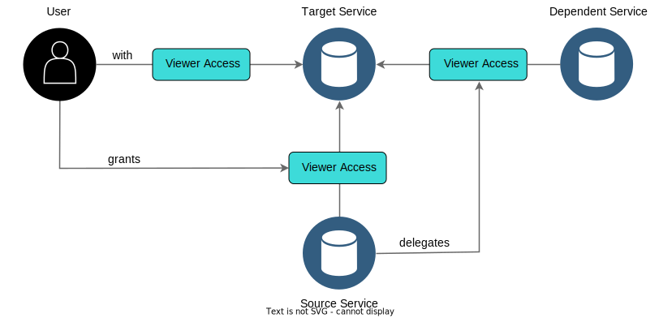

---

copyright:

  years: 2017, 2025
lastupdated: "2025-11-15"

keywords: authorizations, service to service access, access between services, dependent service, source service, target service, assigned access, access policies

subcollection: account

---

{{site.data.keyword.attribute-definition-list}}

# Using authorizations to grant access between services
{: #serviceauth}

Use {{site.data.keyword.Bluemix}} Identity and Access Management (IAM) to create or remove an authorization that grants one service access to another service. Use authorization delegation to automatically create access policies that grant access to dependent services.
{: shortdesc}

Many of the capabilities of IAM are focused on managing and enforcing user and application access to {{site.data.keyword.cloud_notm}} resources. However, you might encounter other scenarios in which you need to provide one service with access to a user's resource in another service. This type of access is called an authorization.

In an authorization, the source service is the service that is granted access to the target service. The roles that you select define the level of access for the source service. The target service is the service that you are granting permission to be accessed by the source service based on the roles that you assign. A source service can be in the same account where the authorization is created or in another account. The target service is always in the account where the authorization is created. You can view whether the source service is located in the current account or another account by viewing the Source account column for the specific authorization on the [Authorizations](/iam/authorizations) page in the {{site.data.keyword.Bluemix}} console.

## Authorizing dependent services
{: #dependent-services}

In some cases, you can authorize dependent services in addition to the source service. The source service that is enabled to access the target service depends on another service. The dependent service must be assigned access to complete the workflow. The following diagram illustrates the process of delegating access between source, target, and dependent services:

{: caption="How S2S authorizations work with dependent services" caption-side="bottom"}

For more information about roles, see [Service access roles](/docs/account?topic=account-userroles#service_access_roles).

The following example explains how the relationship between the source, target, and dependent services works. Let's say that you have an {{site.data.keyword.ibmwatson}} service that relies on an instance of {{site.data.keyword.cos_full_notm}} to store data. When you enable an authorization between your {{site.data.keyword.ibmwatson_notm}} service and {{site.data.keyword.keymanagementservicelong}} service, you might need the {{site.data.keyword.cos_short}} instance to access a key in the user's {{site.data.keyword.keymanagementserviceshort}} instance. So, while the authorization is between your {{site.data.keyword.ibmwatson_notm}} service and {{site.data.keyword.keymanagementserviceshort}} service, the {{site.data.keyword.cos_short}} service is also given access as a dependent service of the {{site.data.keyword.ibmwatson_notm}} service. By selecting the option to enable authorizations for dependent services, you don't need to take any additional action because the policies are automatically created for the dependent services.

The source service's dependent services might be in the source service's account, which means that they are not visible to you in your account. However, any access policies that are created by the source service for its dependent services are always visible to you. You can tell which authorizations a user created or a source service that is created by checking the Type column for the specific authorization on the Authorizations page.
{: tip}

## Creating an authorization in the console
{: #create-auth}
{: ui}

You must have access to the target service to create an authorization between services. You can grant only the level of access that you have as a user of the target service. For example, if you have viewer access on the target service, you can assign only the viewer role for the authorization.

1. In the {{site.data.keyword.cloud_notm}} console, click **Manage** > **Access (IAM)**, and select **Authorizations**.
1. Click **Create**.
1. Select a source account.
   * If the source that needs access to the target is in this account, select **This account**.
   * If the source that needs access to the target is in a different account, select **Another account**. Then, enter the account ID of the source account.
1. Select the service or services that need access.
   - You can select an individual service and specify whether you want the source to include all resources, instances only in a certain resource group, or only a specific instance in the account.
   - [New]{: tag-new} You can also select **All Identity and Access enabled services** and select or enter a resource group ID.

    [New]{: tag-new} Entering a resource group as the source gives the service instances in a resource group access to the target resource in your account. You might want to set up this level of access if you don't want to give direct access to a resource.
   {: tip}

1. Select a target.

1. Specify whether you want the target to include all resources or specific resources.
   If you chose specific resources as the target, you can add attributes to further scope the access. The type of attributes depends on the target service that you selected.
   {: note}

1. (Optional) Select **Enable authorization to be delegated by source and dependent services** to allow the source service to delegate its access to any dependent services. This option is displayed only if the source service has dependent services. By selecting this option, policies are automatically created by the source service for the dependent services.
1. Select a role to assign access to the source service that accesses the target service.
1. Click **Authorize**.

If you create an authorization between a service in another account and a target service in your current account, you need access only to the target resource. For the source account, you need only the account number. 
{: note}

## Creating an authorization by using the CLI
{: #auth-cli}
{: cli}

To authorize a source service access a target service, run the `ibmcloud iam authorization-policy-create` command.

The following sample uses mock data to create a policy where a specific source service instance of {{site.data.keyword.cos_full_notm}} is authorized to access a specific target service instance of {{site.data.keyword.keymanagementservicelong_notm}}:

```sh
ibmcloud iam authorization-policy-create cloud-object-storage kms Reader --source-service-instance-id 123123 --target-service-instance-id 456456
```
{: codeblock}

For more information about all of the parameters that are available for this command, see [ibmcloud iam authorization-policy-create](/docs/cli?topic=cli-ibmcloud_commands_iam#ibmcloud_iam_authorization_policy_create).

## Creating an authorization by using Terraform
{: #auth-terra}
{: terraform}

You must have access to the target service to create an authorization between services. You can grant only the level of access that you have as a user of the target service. For example, if you have viewer access on the target service, you can assign only the viewer role for the authorization.

Before you can create an authorization by using Terraform, make sure that you have completed the following:

- Install the Terraform CLI and configure the {{site.data.keyword.cloud_notm}} Provider plug-in for Terraform. For more information, see the tutorial for [Getting started with Terraform on {{site.data.keyword.cloud}}](/docs/ibm-cloud-provider-for-terraform?topic=ibm-cloud-provider-for-terraform-getting-started). The plug-in abstracts the {{site.data.keyword.cloud_notm}} APIs that are used to complete this task.
- Create a Terraform configuration file that is named `main.tf`. In this file, you define resources by using HashiCorp Configuration Language. For more information, see the [Terraform documentation](https://developer.hashicorp.com/terraform/language){: external}.

Use the following steps to create an authorization by using Terraform:

1. Create an authorization policy between services by using the `ibm_iam_authorization_policy` resource argument in your `main.tf` file.

   The following example creates an authorization between services:
   ```terraform
   resource "ibm_iam_authorization_policy" "policy" {
   source_service_name = "cloud-object-storage"
   target_service_name = "kms"
   roles               = ["Reader"]
   description         = "Authorization Policy"
   transaction_id     = "terraformAuthorizationPolicy"
   }
   ```
   {: codeblock}

   The `ibm_iam_authorization_policy` resource requires the source service, target service, and role. The source service is granted access to the target service, and the role is the level of permission that the access allows. Optionally, you can add a description for the authorization and a transaction ID.
   {: note}

   For more examples, see the [Terraform documentation for authorization resources](https://registry.terraform.io/providers/IBM-Cloud/ibm/latest/docs/resources/iam_authorization_policy){: external}.

1. After you finish building your configuration file, initialize the Terraform CLI. For more information, see [Initializing Working Directories](https://developer.hashicorp.com/terraform/cli/init){: external}.

   ```terraform
   terraform init
   ```
   {: pre}

1. Provision the resources from the `main.tf` file. For more information, see [Provisioning Infrastructure with Terraform](https://developer.hashicorp.com/terraform/cli/run){: external}.

   1. Run `terraform plan` to generate a Terraform execution plan to preview the proposed actions.

      ```terraform
      terraform plan
      ```
      {: pre}

   1. Run `terraform apply` to create the resources that are defined in the plan.

      ```terraform
      terraform apply
      ```
      {: pre}

## Creating an authorization by using the API
{: #auth-api}
{: api}

To authorize a source service access to a target service, use the [IAM Policy Management API](/apidocs/iam-policy-management#create-policy). See the following API example for Create a policy method with the `type=authorization` specified.

The supported attributes for creating an authorization policy depend on what each service supports. For more information about the supported attributes for each service, see the documentation for the services that you're using.
{: note}

```bash
curl --request POST \
  --url https://iam.cloud.ibm.com/v1/policies \
  --header 'Authorization: Bearer <token>' \
  --header 'Content-Type: application/json' \
  --data '{
    "type": "authorization",
    "subjects": [
        {
            "attributes": [
                {
                    "name": "accountId",
                    "value": "<account-id>"
                },
                {
                    "name": "serviceName",
                    "value": "<service-name>"
                },
                {
                    "name": "serviceInstance",
                    "value": "<instance-id>"
                }
            ]
        }
    ],
    "roles": [
        {
            "role_id": "crn:v1:bluemix:public:iam::::serviceRole:Reader"
        }
    ],
    "resources": [
        {
            "attributes": [
                {
                    "name": "accountId",
                    "value": "<account-id>"
                },
                {
                    "name": "serviceName",
                    "value": "<service-name>"
                },
                {
                    "name": "serviceInstance",
                    "value": "<instance-id>"
                },
                {
                    "name": "resourceType",
                    "value": "<resource-type>"
                },
                {
                    "name": "resource",
                    "value": "<id>"
                }
            ]
        }
    ]
}'
```
{: curl}
{: codeblock}

```java
SubjectAttribute accountSubjectAttribute = new SubjectAttribute.Builder()
      .name("accountId")
      .value(exampleAccountId)
      .build();

SubjectAttribute serviceNameSubjectAttribute = new SubjectAttribute.Builder()
      .name("serviceName")
      .value(exampleSourceServiceName)
      .build();

SubjectAttribute serviceInstanceSubjectAttribute = new SubjectAttribute.Builder()
      .name("serviceInstance")
      .value(exampleSourceServiceInstanceId)
      .build();

PolicySubject policySubjects = new PolicySubject.Builder()
      .addAttributes(accountSubjectAttribute)
      .addAttributes(serviceNameSubjectAttribute)
      .addAttributes(serviceInstanceSubjectAttribute)
      .build();

PolicyRole policyRoles = new PolicyRole.Builder()
      .roleId("crn:v1:bluemix:public:iam::::serviceRole:Reader")
      .build();

ResourceAttribute accountIdResourceAttribute = new ResourceAttribute.Builder()
      .name("accountId")
      .value(exampleAccountId)
      .operator("stringEquals")
      .build();

ResourceAttribute serviceNameResourceAttribute = new ResourceAttribute.Builder()
      .name("serviceName")
      .value(exampleTargetServiceName)
      .operator("stringEquals")
      .build();

ResourceAttribute serviceInstanceResourceAttribute = new ResourceAttribute.Builder()
      .name("serviceInstance")
      .value(exampleTargetInstanceId)
      .operator("stringEquals")
      .build();

ResourceAttribute resourceTypeResourceAttribute = new ResourceAttribute.Builder()
      .name("resourceType")
      .value(exampleResourceType)
      .operator("stringEquals")
      .build();

ResourceAttribute resourceResourceAttribute = new ResourceAttribute.Builder()
      .name("resource")
      .value(exampleResourceId)
      .operator("stringEquals")
      .build();

PolicyResource policyResources = new PolicyResource.Builder()
      .addAttributes(accountIdResourceAttribute)
      .addAttributes(serviceNameResourceAttribute)
      .addAttributes(serviceInstanceResourceAttribute)
      .addAttributes(resourceTypeResourceAttribute)
      .addAttributes(resourceResourceAttribute)
      .build();

CreatePolicyOptions options = new CreatePolicyOptions.Builder()
      .type("authorization")
      .subjects(Arrays.asList(policySubjects))
      .roles(Arrays.asList(policyRoles))
      .resources(Arrays.asList(policyResources))
      .build();

Response<Policy> response = service.createPolicy(options).execute();
Policy policy = response.getResult();

System.out.println(policy);
```
{: java}
{: codeblock}

```javascript
const policySubjects = [
  {
    attributes: [
      {
        name: 'accountId',
        value: exampleAccounId,
      },
      {
        name: 'serviceName',
        value: exampleSourceServiceName,
      },
      {
        name: 'serviceInstance',
        value: exampleSourceServiceInstaceId,
      },
    ],
  },
];
const policyRoles = [
  {
    role_id: 'crn:v1:bluemix:public:iam::::serviceRole:Reader',
  },
];
const accountIdResourceAttribute = {
  name: 'accountId',
  value: exampleAccountId,
  operator: 'stringEquals',
};
const serviceNameResourceAttribute = {
  name: 'serviceName',
  value: exampleTargetServiceName,
  operator: 'stringEquals',
};
const serviceInstanceResourceAttribute = {
  name: 'serviceInstance',
  value: exampleTargetServiceInstanceId,
  operator: 'stringEquals',
};
const resourceTypeResourceAttribute = {
  name: 'resourceType',
  value: exampleResourceType,
  operator: 'stringEquals',
};
const resourceResourceAttribute = {
  name: 'resource',
  value: exampleResourceId,
  operator: 'stringEquals',
};

const policyResources = [
  {
    attributes: [
      accountIdResourceAttribute,
      serviceNameResourceAttribute,
      serviceInstanceResourceAttribute,
      resourceTypeResourceAttribute,
      resourceResourceAttribute,
    ],
  },
];
const params = {
  type: 'authorization',
  subjects: policySubjects,
  roles: policyRoles,
  resources: policyResources,
};

iamPolicyManagementService.createPolicy(params)
  .then(res => {
    examplePolicyId = res.result.id;
    console.log(JSON.stringify(res.result, null, 2));
  })
  .catch(err => {
    console.warn(err)
  });
```
{: javascript}
{: codeblock}

```python
policy_subjects = PolicySubject(
    attributes=[SubjectAttribute(name='accountId', value=example_account_id),
                SubjectAttribute(name='serviceName', value=example_source_service_name),
                SubjectAttribute(name='serviceInstance', value=example_source_service_instance_id)])
policy_roles = PolicyRole(
    role_id='crn:v1:bluemix:public:iam::::serviceRole:Reader')
account_id_resource_attribute = ResourceAttribute(
    name='accountId', value=example_account_id)
service_name_resource_attribute = ResourceAttribute(
    name='serviceName', value=example_target_service_name)
service_instance_resource_attribute = ResourceAttribute(
    name='serviceInstance', value=example_target_service_instance_id)
resource_type_resource_attribute = ResourceAttribute(
    name='resourceType', value=example_resource_type)
resource_resource_attribute = ResourceAttribute(
    name='resource', value=example_resource_id)
policy_resources = PolicyResource(
    attributes=[account_id_resource_attribute,
                service_name_resource_attribute,
                service_instance_resource_attribute,
                resource_type_resource_attribute,
                resource_resource_attribute])

policy = iam_policy_management_service.create_policy(
    type='authorization',
    subjects=[policy_subjects],
    roles=[policy_roles],
    resources=[policy_resources]
).get_result()

print(json.dumps(policy, indent=2))
```
{: python}
{: codeblock}

```go
accountSubjectAttribute := &iampolicymanagementv1.SubjectAttribute{
    Name:  core.StringPtr("accountId"),
    Value: &exampleAccountID,
}
serviceNameSubjectAttribute := &iampolicymanagementv1.SubjectAttribute{
    Name:  core.StringPtr("serviceName"),
    Value: &exampleSourceServiceName,
}
serviceInstanceSubjectAttribute := &iampolicymanagementv1.SubjectAttribute{
    Name:  core.StringPtr("serviceInstance"),
    Value: &exampleSourceServiceInstanceId,
}
policySubjects := &iampolicymanagementv1.PolicySubject{
    Attributes: []iampolicymanagementv1.SubjectAttribute{*accountSubjectAttribute,
        *serviceNameSubjectAttribute, *serviceInstanceSubjectAttribute},
}
policyRoles := &iampolicymanagementv1.PolicyRole{
    RoleID: core.StringPtr("crn:v1:bluemix:public:iam::::serviceRole:Reader"),
}
accountIDResourceAttribute := &iampolicymanagementv1.ResourceAttribute{
    Name:     core.StringPtr("accountId"),
    Value:    core.StringPtr(exampleAccountID),
    Operator: core.StringPtr("stringEquals"),
}
serviceNameResourceAttribute := &iampolicymanagementv1.ResourceAttribute{
    Name:     core.StringPtr("serviceName"),
    Value:    core.StringPtr(exampleTargetServiceName),
    Operator: core.StringPtr("stringEquals"),
}
serviceInstanceResourceAttribute := &iampolicymanagementv1.ResourceAttribute{
    Name:     core.StringPtr("serviceInstance"),
    Value:    core.StringPtr(exampleTargetServiceInstanceId),
    Operator: core.StringPtr("stringEquals"),
}
resourceTypeResourceAttribute := &iampolicymanagementv1.ResourceAttribute{
    Name:     core.StringPtr("resourceType"),
    Value:    core.StringPtr(exampleResourceType),
    Operator: core.StringPtr("stringEquals"),
}
resourceResourceAttribute := &iampolicymanagementv1.ResourceAttribute{
    Name:     core.StringPtr("resource"),
    Value:    core.StringPtr(exampleResourceId),
    Operator: core.StringPtr("stringEquals"),
}
policyResources := &iampolicymanagementv1.PolicyResource{
    Attributes: []iampolicymanagementv1.ResourceAttribute{
        *accountIDResourceAttribute, *serviceNameResourceAttribute,
        *serviceInstanceResourceAttribute, *resourceTypeResourceAttribute,
        *resourceResourceAttribute},
}

options := iamPolicyManagementService.NewCreatePolicyOptions(
    "authorization",
    []iampolicymanagementv1.PolicySubject{*policySubjects},
    []iampolicymanagementv1.PolicyRole{*policyRoles},
    []iampolicymanagementv1.PolicyResource{*policyResources},
)

policy, response, err := iamPolicyManagementService.CreatePolicy(options)
if err != nil {
    panic(err)
}
b, _ := json.MarshalIndent(policy, "", "  ")
fmt.Println(string(b))
```
{: go}
{: codeblock}

Not all services support policies at the `resourceType` and individual `resource` level. Examples of services that do support these attributes are {{site.data.keyword.cos_full_notm}} and {{site.data.keyword.keymanagementservicelong_notm}}, where buckets and keys are the resource type and the ID is listed to specify the specific resource.
{: note}

### Creating authorizations that use `resource-group` as the `resourceType`
{: #resource-group-auth}

To create an authorization that uses `resource-group` as either the source or the target, use the [IAM Policy Management API](/apidocs/iam-policy-management#create-policy).

#### `resource-group` as the source
{: #rg-source}

See the following API example for Create a policy method with the `resource-group` specified as the source.

```bash
{
 "type": "authorization",
    "subjects": [
        {
            "attributes": [
                {
                    "name": "resourceGroupId",
                    "value": "<rgId>"
                },
                {
                    "name": "accountId",
                    "value": "<sourceAccountId>"
                }
            ]
        }
    ],
    "roles": [
        {
            "role_id": "crn:v1:bluemix:public:iam::::role:Viewer"
        }
    ],
    "resources": [
        {
            "attributes": [
                {
                    "name": "accountId",
                    "value": "<targetAccountId>"
                },
                {
                    "name": "serviceName",
                    "value": "<targetService>"
                },
                {
                    "name": "serviceInstance",
                    "value": "<targetServiceInstance>"
                }
            ]
        }
    ]
}
```
{: codeblock}

#### `resource-group` as the target
{: #rg-target}

See the following API example for Create a policy method with the `resource-group` specified as the target.

```bash
{
 "type": "authorization",
    "subjects": [
        {
            "attributes": [
                {
                    "name": "accountId",
                    "value": "<sourceAccountId>"
                },
                {
                    "name": "serviceName",
                    "value": "<sourceService>"
                },
                {
                    "name": "serviceInstance",
                    "value": "<sourceServiceInstance>"
                }
            ]
        }
    ],
    "roles": [
        {
            "role_id": "crn:v1:bluemix:public:iam::::role:Viewer"
        }
    ],
    "resources": [
        {
            "attributes": [
                {
                    "name": "accountId",
                    "value": "<targetAccountId>"
                },
                {
                    "name": "resourceType",
                    "value": "resource-group"
                }
            ]
        }
    ]
}
```
{: codeblock}


## Removing an authorization in the console
{: #remove-auth}
{: ui}

You can remove any authorization between services in the account if you are assigned the Administrator role on the target service. If you remove any access policies created by the source service for its dependent services, the source service is unable to complete the workflow or access the target service.

1. In the {{site.data.keyword.cloud_notm}} console, click **Manage** &gt; **Access (IAM)**, and select **Authorizations**.
2. Identify the row for the authorization that you want to remove from the account.
3. Click the **Actions** icon  > **Remove**.
4. Select **Remove**.

If the source service is removed from the account, any policies that are created by that service for its dependent services are deleted automatically. Similarly, if the dependent service is removed from the account, any access policies that are delegated to that service are also deleted.
{: note}

## Removing an authorization by using the CLI
{: #remove-auth-cli}
{: cli}

You can remove any authorization between services in the account if you are assigned the Administrator role on the target service. If you remove any access policies created by the source service for its dependent services, the source service is unable to complete the workflow or access the target service.

To authorize a source service to access a target service, run the `ibmcloud iam authorization-policy-create` command.

The following sample deletes an authorization policy:
```sh
ibmcloud iam authorization-policy-delete 12345678-abcd-1a2b-a1b2-1234567890ab
```
{: codeblock}

For more information about all of the parameters that are available for this command, see [ibmcloud iam authorization-policy-delete](/docs/cli?topic=cli-ibmcloud_commands_iam#ibmcloud_iam_authorization_policy_delete).

If the source service is removed from the account, any policies that are created by that service for its dependent services are deleted automatically. Similarly, if the dependent service is removed from the account, any access policies that are delegated to that service are also deleted.
{: note}

## Removing an authorization by using the API
{: #remove-auth-api}
{: api}

You can remove any authorization between services in the account if you are assigned the Administrator role on the target service. If you remove any access policies created by the source service for its dependent services, the source service is unable to complete the workflow or access the target service.

To delete an authorization policy, use the [IAM Policy Management API](/apidocs/iam-policy-management#delete-policy) as in the following sample request:

```bash
curl -X DELETE 'https://iam.cloud.ibm.com/v1/policies/$POLICY_ID' \
-H 'Authorization: Bearer $TOKEN' \
-H 'Content-Type: application/json'
```
{: curl}
{: codeblock}

```java
DeletePolicyOptions options = new DeletePolicyOptions.Builder()
        .policyId(examplePolicyId)
        .build();

service.deletePolicy(options).execute();
```
{: java}
{: codeblock}

```javascript
const params = {
  policyId: examplePolicyId,
};

iamPolicyManagementService.deletePolicy(params)
  .then(res => {
    console.log(JSON.stringify(res, null, 2));
  })
  .catch(err => {
    console.warn(err)
  });
```
{: javascript}
{: codeblock}

```python
response = iam_policy_management_service.delete_policy(
  policy_id=example_policy_id
).get_result()

print(json.dumps(response, indent=2))
```
{: python}
{: codeblock}

```go
options := iamPolicyManagementService.NewDeletePolicyOptions(
  examplePolicyID,
)

response, err := iamPolicyManagementService.DeletePolicy(options)
if err != nil {
  panic(err)
}
```
{: go}
{: codeblock}

If the source service is removed from the account, any policies that are created by that service for its dependent services are deleted automatically. Similarly, if the dependent service is removed from the account, any access policies that are delegated to that service are also deleted.
{: note}

## Removing an authorization by using Terraform
{: #remove-auth-tf}
{: terraform}

If you want to remove an authorization by using Terraform, you need to delete the argument from the `main.tf` file. After you delete the argument, provision your file by using the following steps:

   1. Run `terraform plan` to generate a Terraform execution plan to preview the proposed actions.

      ```terraform
      terraform plan
      ```
      {: pre}

   1. Run `terraform apply` to create the resources that are defined in the plan.

      ```terraform
      terraform apply
      ```
      {: pre}
