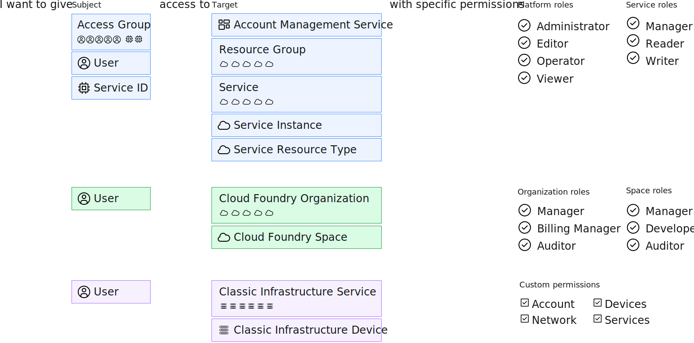

---

copyright:

  years: 2017, 2024

lastupdated: "2024-09-17"

keywords: users level of access, user control, access control, permissions, manage access, access management, platform management tasks, assign roles

subcollection: account

---

{{site.data.keyword.attribute-definition-list}}

# Access management in {{site.data.keyword.Bluemix_notm}}
{: #cloudaccess}

Access management enables you to control which users see, create, use, and manage resources in your account. To grant access, you can assign roles that allow users levels of access for completing platform management tasks and accessing account resources.
{: shortdesc}

The way that you manage access in {{site.data.keyword.Bluemix}} depends on the type of resource that you want to assign access to. {{site.data.keyword.Bluemix_notm}} Identity and Access Management (IAM) is the access management system that is used for consistently managing resources that are organized in a resource group across the {{site.data.keyword.Bluemix_notm}} platform. Classic infrastructure resources are not managed by using Cloud IAM. These resource types have their own access management systems.

If you have a combination of resource types, you manage each type separately:

* For [IAM resources](/docs/account?topic=account-userroles), go to **Manage** &gt; **Access (IAM)** in the {{site.data.keyword.cloud_notm}} console, and then select **Users**, **Access groups**, **Trusted profiles**, or **Service IDs** to get started.
* For assigning access to your [classic infrastructure resources](/docs/account?topic=account-mngclassicinfra), you set permissions within **Manage** > **Access (IAM)** on the Classic infrastructure tab for the user that you want to assign access. You can also choose to assign Classic infrastructure access by using **Trusted profiles** if your account is linked to a Softlayer account.

While each type of access is managed separately, all access policies are made up of a subject you want to assign access to, a target for the policy to scope what the subject has access to, and then finally an IAM role or classic infrastructure permission to determine the level of access the subject has on the target.

{: caption="Figure 1. Access management policies by using IAM or classic infrastructure permissions" caption-side="bottom"}

For IAM policies, the subject can be an access group, user, service ID, or trusted profile. And, the target can be an account management service, resource group, service in the account, specific service instance, or resource type within a service. Platform and service roles can be selected to scope the level of access for the subject. For classic infrastructure, a user is selected, and then the access can be scoped to a service or device with specific permissions assigned.

## {{site.data.keyword.Bluemix_notm}} IAM limits
{: #iam_limits}

The following table lists the maximum limits for IAM resources. These limits apply to any user who can create IAM resources. If a limit is exceeded, you receive an exception and are not allowed to create any new resources beyond that limit.

If you have a specific use case that requires an extended limit, you can request an increase. For more information, see [Increasing account limits](/docs/account?topic=account-account-limits).
{: note}

| Resource                               | Max  |
|----------------------------------------|------|
| Access groups per account              | 500  |
| Access groups per user                 | 50   |
| Access group templates per enterprise account | 100 |
| Access management tags per account     | 250   |
| Account settings templates per enterprise account | 10 |
| API Keys per identity                  | 20   |
| Custom roles per account               | 40   |
| Dynamic rules per access group         | 5  |
| Dynamic rules per trusted profile      | 20   |
| Dynamic rules per Identity provider (IdP) | 2000 |
| IdPs per account  | 5    |
| Policies per account [^tabletext]      | 4020 |
| Policies per subject within an account | 1000  |
| Policies with access management tags within an account   | 500   |
| Policy templates per enterprise account | 500 |
| Service IDs per account                | 2000 |
| Trusted profiles per account           | 2000 |
| Trusted profile templates per enterprise account | 100 |
| Users per trial account                | 100  |
| Users per billable account             | 7500 |
| Versions per enterprise-managed template | 100 |
{: caption="Table 1. IAM account limits" caption-side="top"}

[^tabletext]: IAM policies and context-based restrictions rules share a combined limit of 4020.

A maximum of 1,000 policies and service to service authorizations within one account is recommended to ensure optimal performance within your account. For more information about limiting the number of policies in your account, see the [Best practices for organizing resources and assigning access](/docs/account?topic=account-account_setup).
{: tip}

If you want to check the number of policies in your account, see [Viewing the total number of policies per account](/docs/account?topic=account-account-limits&interface=cli#total-number-policies-cli). To request an increase in the account limit, see [Requesting a policy and rule shared limit increase](/docs/account?topic=account-account-limits&interface=cli#limit-increase).
