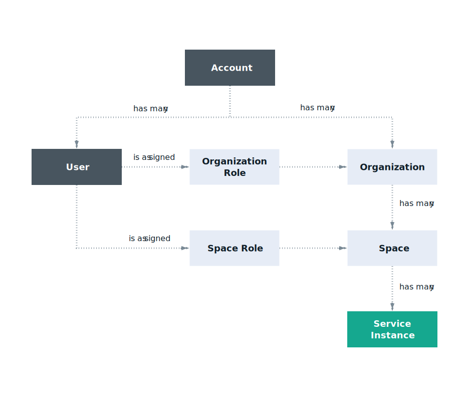
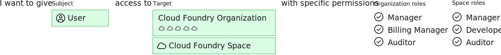

---

copyright:

  years: 2017, 2022

lastupdated: "2022-06-03"

keywords: Cloud Foundry access, assign access, add user to organization, Cloud Foundry roles

subcollection: account

---

{{site.data.keyword.attribute-definition-list}}

# Managing Cloud Foundry access
{: #mngcf}

To manage access to account organizations and spaces, you must be the account owner, organization manager, or space manager. Currently, not all services can be managed by using Cloud IAM. You can continue to use Cloud Foundry roles for access to these service instances. Users are added to the org and space to which the instance belongs with a Cloud Foundry role assigned. When Cloud Foundry services become IAM-enabled, they are eligible to be migrated to a resource group.
{: shortdesc}

IBM Cloud Foundry Public is deprecated. For more information, see the [Deprecation of IBM Cloud Foundry](/docs/cloud-foundry-public?topic=cloud-foundry-public-deprecation).
{: deprecated}

The following graphic outlines how Cloud Foundry orgs, spaces, and roles relate within an account. An account can have many users, orgs, and spaces. Each user can be assigned to as many orgs and spaces as necessary. You can set the level of access to work within each org and space by assigning a Cloud Foundry role.

{: caption="Figure 1. How access in an account works by using Cloud Foundry orgs, spaces, and roles" caption-side="bottom"}

## Cloud Foundry roles
{: #cfroles}

Cloud Foundry roles grant access to organizations and spaces within the account. Cloud Foundry roles do not enable user permissions for completing actions within the context of a service across the account.

Cloud Foundry access is assigned by adding a user to an org and space, and then assigning an org role and space role. Depending on the type of role that is assigned, that user can complete specific actions for service instances that are added to a particular space.

{: caption="Figure 2. Assigning a user access to a Cloud Foundry org and space" caption-side="bottom"}

The following roles can be assigned at the organization level:

| Organization role | Permissions                                                                                             |
|-------------------|---------------------------------------------------------------------------------------------------------|
|Manager            | Organization managers can create, view, edit, or delete spaces within the organization, view the organization's usage and quota, invite users to the organization, manage who has access to the organization and their roles in the organization, and manage custom domains for the organization. |
|Billing manager    | Billing managers can view runtime and service usage information for the organization on the Usage page. |
|Auditor            | Organization auditors can view application and service content in the organization. Auditors can also view the users in the organization and their assigned roles, and the quota for the organization. |
{: caption="Table 1. Organization roles and permissions" caption-side="top"}

The following roles can be assigned at the space level:

| Space role | Permissions |
|------------|-------------|
|Manager     | Space managers can add existing users and manage roles within the space. The space manager can also view the number of instances, service bindings, and resource use for each application in the space. |
|Developer   | Space developers can create, delete, and manage applications and services within the space. Some of the managing tasks include deploying apps, starting or stopping apps, renaming an app, deleting an app, renaming a space, binding or unbinding a service to an application, viewing the number or instances, service bindings, and resource usage for each application in the space. In addition, the space developer can associate an internal or external URL with an application in the space. |
|Auditor     | Space auditors have read-only access to all information about the space, such as information about the number of instances, service bindings, and resource use for each application in the space. |
{: caption="Table 2. Space roles and permissions" caption-side="top"}

Users that are assigned the manager or developer space role can access the VCAP_SERVICES environment variable. However, a user that is assigned the auditor role can't access VCAP_SERVICES.
{: note}

## Updating Cloud Foundry access
{: #update_cf_access}

1. In the {{site.data.keyword.cloud_notm}} console, click **Manage** > **Access (IAM)**, and select **Users**.
2. Select the name of the user that you want to assign access. 
3. Select **Cloud Foundry**.
4. From the row for the organization that you want to manage access for, select the **Actions**  menu and you can click one of three choices:
    * **Remove user** from the organization
    * **Edit** organization role
    * **View** organization details

## Adding a user to an organization
{: #add_to_org}

If you are the manager of an organization that the user is not yet a member of, you assign the user to that organization.

1. In the {{site.data.keyword.cloud_notm}} console, click **Manage** > **Access (IAM)**, and select **Users**.
2. From the row for the user that you want to assign access, click the **Actions** icon  > **Assign access**.
3. Select the **Cloud Foundry** as the service. 
4. Select the organization that you want to assign access to. 
5. Assign the user access:
   * Choose an organization to add the user to
   * Assign an organization role
   * Choose a region
   * Choose a space
   * Assign a space role
6. Click **Review**.
7. Click **Add** to add your policy configuration to your access summary. Repeat as needed to add more access.
8. Click **Assign**. 

## Reviewing your assigned access
{: #review_my_access}

If you need to review your assigned access in an account that you have been added to, complete the following steps:

1. In the {{site.data.keyword.cloud_notm}} console, click **Manage** > **Access (IAM)**, and select **Users**.
2. Select your name.
3. Click **Cloud Foundry access**.
4. Expand the org row, and review your assigned roles.

If you need additional access, you must contact the organization manager or account owner to update your assigned Cloud Foundry role.

## Migrating Cloud Foundry services to a resource group
{: #migrate_cf_services}

When Cloud Foundry services become IAM-enabled, they are eligible to be migrated to a resource group. You're notified when your Cloud Foundry services become eligible, and you're in control of the migration. Your services can't be moved from one org to another.
