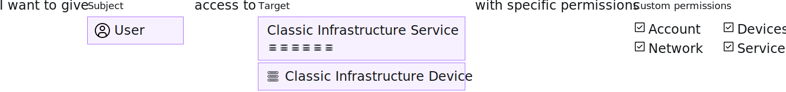

---

copyright:

  years: 2017, 2023

lastupdated: "2023-03-22"

keywords: classic infrastructure access, VPN subnet access, classic infrastructure permissions, device access

subcollection: account

---

{{site.data.keyword.attribute-definition-list}}

# Managing classic infrastructure access
{: #mngclassicinfra}

When you invite a user to your account, you can select from three classic infrastructure permission sets that assign bulk access: View only, Basic user, Super user. You can update permissions for classic infrastructure services or add device and VPN subnet access for a user at any time. To access the classic infrastructure permissions, go to **Manage** &gt; **Access (IAM)** in the {{site.data.keyword.cloud}} console, select **Users**. Then, select the user's name that you want to update access for, and click **Classic infrastructure**.
{: shortdesc}

## Classic infrastructure permissions
{: #how-classic-infra-permissions-work}

When you invite someone to the account, only you, the account owner, or a user with the Manage user classic infrastructure permission, can adjust the permissions for the user. You can assign only the level of permissions or a subset of the permission that you're already assigned, if you're not the account owner. An account owner can update anyone's permissions in the account to have any level of access.

Extra permissions can be set after the user accepts the invitation. For example, the initial permission set assigned on the invitation doesn't grant access to devices. So, you must grant device access after the user accepts the invitation.

Support center account management access is recommended for users working with classic infrastructure resources. To perform many tasks when working with classic infrastructure resources, such as creating or deleting a virtual server instance, users must have access to work with support cases. For more information about assigning this type of access, see [Assigning access to account management services](/docs/account?topic=account-account-services).
{: tip}

The following graphic shows how classic infrastructure permissions are assigned per user. You can grant each user access to a classic infrastructure service or device by selecting from the granular permission options to customize each user's access.

{: caption="Figure 1. Assigning classic infrastructure access by selecting a user, device, or service, then any combination of granular permissions" caption-side="bottom"}

There are four main categories of permissions to choose from: account, devices, network, and services. The following lists provide examples from each category highlighting some of the commonly assigned permissions from each. To view all of the available permissions from each category, go to **Manage** > **Access (IAM)** > **Users** in the {{site.data.keyword.cloud_notm}} console. Then, select a user's name from the list that you can manage access for, then click **Classic infrastructure**.

Account
- Add and upgrade storage
- Manage users
- Add and upgrade services
- Add server

Devices
- Upgrade server
- Manage load balancers
- Manage Firewalls

Network
- Add IP addresses
- VPN administration
- Network gateways
- Security groups
- Manage private endpoint service

Services
- Upgrade services
- Manage DNS
- Manage SSH keys
- Manage certificates

### Migrated classic infrastructure permissions
{: #predefined}

A set of classic infrastructure permissions for viewing and managing billing information and working with support cases are now migrated to access groups. The users in your account who were previously assigned these permissions are now assigned to the respective migrated permission access group. As a result, the classic infrastructure permissions can be directly managed by using IAM access policies. For more information about the migrated permissions and the access groups that are used for each, see [Managing migrated SoftLayer account permissions](/docs/account?topic=account-migrated_permissions).

## Assigning classic infrastructure permissions
{: #assign-classic-infra}

You must be assigned the Manage users classic infrastructure permission and be an ancestor of the user within the classic infrastructure user hierarchy. Account owners have full access to the account, so they do not see the permissions on the page. Individual users can't edit their own permissions, and they also don't see permissions on the page.

When a classic infrastructure user invites another user to the account, the classic infrastructure user becomes the parent user. When a child of a parent invites other users to the account, those users become descendants of the original parent, who is now considered their ancestor.
{: note}

1. In the {{site.data.keyword.cloud_notm}} console, go to **Manage** &gt; **Access (IAM)**, select **Users**. Then, select the user's name that you want to update access for, and click **Classic infrastructure**.

1. Select **Permissions** to update the user's permissions. You can select from four types of permissions: account, devices, network, and services. Individually select permissions from each category, or use a permission set option to assign permissions in bulk.

   The account management and support permissions that you previously assigned to users in your account are now migrated from classic infrastructure permissions to migrated IAM access groups. For more information, see [Managing migrated SoftLayer account permissions](/docs/account?topic=account-migrated_permissions).

1. To grant a user device access, select **Devices**, and assign the access to specific devices and device types as needed.

   Access to devices is assigned after the user is invited to the account. The device permissions apply to the specific devices that are assigned for the user. You can select specific devices from the list, or you can assign access by device type. If you assign access by device type, you might want to use the **Enable future access** options to ensure that each time new devices of a specific type are added, the user automatically gets assigned access to those devices.

1. To update a user's access to VPN subnets, select **VPN subnets**.

   You must have the following type of access to assign VPN access:

   * To update your own access, you must have the VPN Administration permission or be the master user.
   * To update a user to which you are a parent, you must have the VPN Administration permission.
   * To update any user's access, you must have the VPN Administration permission and an IAM policy on the User management service with Viewer role or higher assigned or be the master user.

   Use the **Auto-assign** option to set how the user gets access to VPN subnets based on their device access. If this option is set to on, the user is automatically assigned access to all subnets for the devices they already have access to. You can set this option to off to manually select subnets from the list.

   You can define the type of VPN subnets that the user has access to by using the **VPN type** option. If you select **None**, no VPN access can be assigned. If you have the correct access, you can define the type of VPN subnets that the user has access to by using the VPN type option. If you select None, no VPN access can be assigned.
