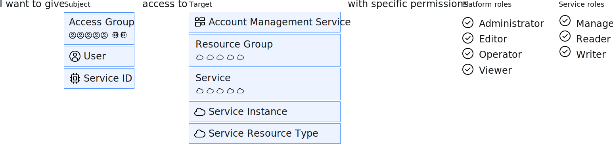

---

copyright:

  years: 2015, 2023

lastupdated: "2023-12-15"

keywords: IAM access, access policy, IAM roles, platform management roles, service access roles, types of access policies

subcollection: account

---

{{site.data.keyword.attribute-definition-list}}


# What are IAM policies and who can assign them?
{: #iamusermanpol}

A policy grants a subject one or multiple roles to a set of resources so that specific actions can be taken within the context of the specified target resources.

The following graphic helps to explain how the IAM policy is created. Policies are always created by specifying the subject first. The subject is a specific user, service ID, access group, or a trusted profile. Next, the target of the policy is selected which is what you are allowing the user to access, for example: all services in a resource group, all IAM-enabled services in the account, account management services, or a particular service instance. Finally, you complete your access policy by selecting from the available roles. These roles define exactly what actions that a user can complete. More configuration options might be available, depending on the service you select.

{: caption="Figure 1. How IAM access policies are created by using a subject, target, and role" caption-side="bottom"}

You can assign and manage policies if you have the proper role. The following table shows policy management tasks and the role that is required for each.

| Action                                                       | Required role                                                                                                            |
|--------------------------------------------------------------|--------------------------------------------------------------------------------------------------------------------------|
| Create a policy in an account for all services and instances | Account owner or administrator on all account management services and all Identity and Access enabled services           |
| Create a policy on a service in an account                   | Account owner, administrator on all Identity and Access enabled services, or administrator on the service in the account |
| Create a policy on a service instance                        | Account owner, administrator on all Identity and Access enabled services, administrator on the service in the account, administrator on all services in the relevant resource group, or administrator on the service instance |
{: caption="Table 1. Users allowed to create access policies" caption-side="top"}


## Common access policy types
{: #policytypes}

You can provide fine-grained access for users, service IDs, or access groups by assigning the following types of access policies:

* All Account Management services
* A specific account management service
* All IAM Account Management services, which are a subset of account management services that includes IAM Identity, IAM Access Management, IAM User Management, and IAM Groups
* A specific IAM service
* All resources within the account
* All resources within all services that belong to an individual resource group with the ability to manage the resource group
* All resources within a single service in a resource group with the ability to manage the resource group
* All resources within a single service across the account, regardless of the resource group they're assigned to
* Resources in an individual instance
* A single resource type within an instance, for example, a bucket in an {{site.data.keyword.objectstorageshort}} instance

If you want to enable a user full administrator access to complete the [account management tasks](/docs/account?topic=account-account-services#account-services), such as inviting and removing users, viewing billing and usage, managing service IDs, managing access groups, managing user access, and access to all account resources, you must assign a user the following access:
* A policy for **All Identity and Access enabled services** within the account with the administrator and manager roles assigned.
* A policy with the administrator role assigned on **All Account Management services**.

## Assigning {{site.data.keyword.cloud_notm}} access policies
{: #policy-details}

To help you further understand how access is assigned by using access policies in {{site.data.keyword.cloud_notm}} in relation to other cloud providers that you might be familiar with, check out the following details and example of an access policy.

{{site.data.keyword.cloud_notm}} IAM policies consist of the identity who (subject) is being given access, such as the user or service ID, the specific resources or services (target) to which they are being given access, and roles that define what actions are allowed within the context of the selected resource or service.

In {{site.data.keyword.cloud_notm}}, a user, service ID, or the members of an access group don't have any access by default. The {{site.data.keyword.cloud_notm}} access model is simple when it comes to understanding how you get permitted or denied completing specific actions. It isn't until an administrator assigns an access policy with a particular access role that access is granted. The IAM system doesn't have to evaluate permit and deny policies to determine what actions are allowed, instead the system just evaluates what resources you have policies for and what level of access is allowed by your assigned roles.

To reduce the number of policies in the account and keep only the minimum access that is required for each user, you can identify and remove the infrequently used access policies. For more information, see [Managing inactive policies](/docs/account?topic=account-iam-audit-policies#iam-audit-policies-list).
{: tip}

When you specify a resource in a policy because {{site.data.keyword.cloud_notm}} is [attribute-based](/docs/account?topic=account-access-management-overview#access-management-system), you can specify a broad set of resources for a user to have access to, for example all resources in a resource group. Or, you can narrow the user's access to a specific instance of a single service or even a subresource type, such as a {{site.data.keyword.cos_short}} bucket. {{site.data.keyword.cloud_notm}} IAM provides a high level of flexibility and granularity to help you assign only the type of access that is required. A few examples of the different levels of access that you can assign by using attributes in an access policy are the following:

* All Account Management services
* A specific account management service
* All Identity and Access Enabled services within the account, which includes all catalog services that use IAM for access management
* All resources that belong to a resource group
* All resource types of a single service across the entire account, regardless of resource group assignment
* A specific instance of a service in the account
* A single subresource type within an instance, for example, a bucket in an {{site.data.keyword.cos_short}} instance

If a specific predefined platform or service role doesn't fit what you're looking for when assigning the level of access, you can create a [custom role](/docs/account?topic=account-custom-roles) for a specific service and then choose from the available actions to create a role that fits your organization's needs.
{: tip}

### Policy example
{: #ibmcloud-policy-example}

This policy example gives access to all service resources that belong to a resource group named `default` with an ID of `abcd2e6fg1h74i44j5kl467m701n5289` with the `Viewer` platform role assigned. This policy can be assigned to a user, service ID, or access group. In this case, it is assigned to a user with an iam_id of `IBMid-3IAMISBEST1`.

Access groups are not identities like a user or service ID; however, they are a grouping mechanism for identities. An access group can be defined as a subject of an access policy, and the assigned access on the group applies to all members added to it.
{: note}

```json
{
  "type": "access",
  "subjects": [
    {
      "attributes": [
        {
          "name": "iam_id",
          "value": "IBMid-3IAMISBEST1"
        }
      ]
    }
  ],
  "roles": [
    {
      "role_id": "crn:v1:bluemix:public:iam::::role:Viewer"
    }
  ],
  "resources": [
    {
      "attributes": [
        {
          "name": "accountId",
          "value": "7e522a19eb77477e88e96a600c44fb22"
        },
        {
          "name": "resourceGroupId",
          "value": "abcd2e6fg1h74i44j5kl467m701n5289"
        }
      ]
    }
  ]
}
```
{: codeblock}

In addition to an access policy for a user, service ID, or access group that can provide access to a service, specific resource, or resource group in the account, {{site.data.keyword.cloud_notm}} also provides the capability to assign an access policy that is called a service to service authorization, which provides access between services. For an example of this policy type, see [Creating an authorization by using the API](/docs/account?topic=account-serviceauth#auth-api).
