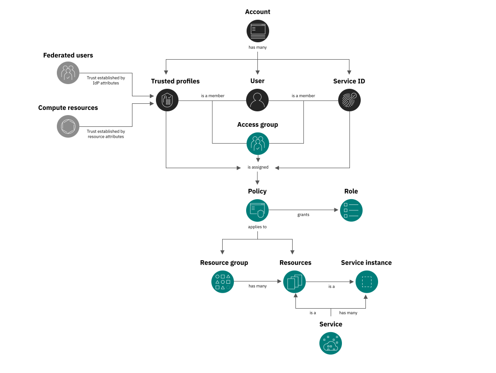

---

copyright:

  years: 2017, 2025
lastupdated: "2025-11-15"

keywords: what is IAM, IAM features, IAM API, how IAM works

subcollection: account

---

{{site.data.keyword.attribute-definition-list}}

# How {{site.data.keyword.cloud_notm}} IAM works
{: #iamoverview}

Learn about what {{site.data.keyword.cloud_notm}} Identity and Access Management (IAM) is, how IAM works, what features are available, and how to access the console, CLI, and APIs to work with IAM in your account.
{: shortdesc}

IAM enables you to securely authenticate users for platform services and control access to resources consistently across {{site.data.keyword.cloud_notm}}. A set of {{site.data.keyword.cloud_notm}} services is enabled to use {{site.data.keyword.cloud_notm}} IAM for access control, and are organized into [resource groups](/docs/account?topic=account-rgs) within your account so you can give users access quickly to more than one resource at a time. Each of these services is labeled as "IAM-enabled" in the catalog. You can use IAM access policies to assign users, service IDs, and trusted profiles access to resources within your account. And, you can group users, service IDs, and trusted profiles into an [access group](/docs/account?topic=account-groups) to easily give all members of the group the same level of access.

You can use [trusted profiles](/docs/account?topic=account-create-trusted-profile) to automate the grouping and granting of access to users, services, and app identities. By specifying conditions based on SAML attributes for users whose identity is federated from your external identity provider (IdP), users can be granted access to resources without having to be invited to the account if they meet those conditions. For service and app identities, you can define fine-grained authorization for all applications that are running in a compute resource without creating service IDs or managing the API key lifecycle for applications.

{: caption="How IAM access works in an account by using access groups. Service IDs and select {{site.data.keyword.cloud_notm}} can also asssume trusted profiles." caption-side="bottom"}

For classic infrastructure that doesn't support the use of {{site.data.keyword.cloud_notm}} IAM policies for managing access, you can use the [classic infrastructure permissions](/docs/account?topic=account-mngclassicinfra) documentation.
{: note}

## What features are provided?
{: #features}

{{site.data.keyword.cloud_notm}} IAM provides a wide range of features for your identity and access management needs.

### User management
{: #usermgmt-feature}

With unified user management, you can add and delete users in an account for both platform and classic infrastructure services. You can organize a group of users in an access group to make assigning access for more than one user or service ID at a time a quick and easy task.

### Fine-grained access control
{: #fgaccess-feature}

Access for users, service IDs, access groups, and trusted profiles are defined by a policy. Within the policy, the scope of access can be assigned to a set of resources in a resource group, a single resource, or account management services. After the target is set, you can define what actions are allowed by the subject of the policy by selecting access roles. Roles provide a way to tailor the level of access that is granted for the subject of the policy to perform actions on the target of policy, whether it is platform management tasks within the account or accessing a service's UI or completing API calls.

You can also add time-based conditions to a policy that defines when the policy grants access, whether you want to grant temporary access to resources in your account or allow access during recurring time windows. For more information, see [Limiting access with time-based conditions](/docs/account?topic=account-iam-time-based&interface=ui).

### Access groups for streamlined access management
{: #access-groups-quick-access}

Quickly and easily assign access for a group of users, service IDs, or trusted profiles that are organized in an access group by assigning access to the group, and then add or remove identities as needed to grant or deny access to account resources. Access groups enable you to manage a minimal number of policies in the account. For more information, see [Setting up access groups](/docs/account?topic=account-groups).

### Trusted profiles for eliminating the need to manage credentials
{: #trusted-profiles-feature}
{: support}
{: help}

Automatically grant federated users access to your account with conditions based on SAML attributes from your corporate directory. Trusted profiles can also be used to set up fine-grained authorization for applications that are running in compute resources. This way, you aren't required to create service IDs or API keys for the compute resources. Assign access to the profile by adding it to an access group or by assigning individual policies, and then add or remove conditions as needed to grant or deny access to account resources. By using trusted profiles, you can centrally manage the access lifecycle to multiple {{site.data.keyword.cloud_notm}} assets. For more information, see [Creating trusted profiles](/docs/account?topic=account-create-trusted-profile).

#### Federated users
{: #trusted-profiles-feature-fedusers}

Your users might already have identities outside of {{site.data.keyword.cloud_notm}} in your corporate directory. If your users need to work with {{site.data.keyword.cloud_notm}} resources or work with applications that access those resources, then those users also need {{site.data.keyword.cloud_notm}} credentials. You can use a trusted profile to specify permissions for users whose identity is federated from your organization or an external IdP. By using your IdP, you can provide a way for users in your company to use single sign-on (SSO). To connect your federated users with {{site.data.keyword.cloud_notm}} resources, see [Federating users to {{site.data.keyword.cloud_notm}}](/docs/account?topic=account-identity-overview#users-bestpract).

{: video output="iframe" data-script="#video-transcript-tp" id="mediacenterplayer" frameborder="0" width="560" height="315" allowfullscreen webkitallowfullscreen mozAllowFullScreen}

#### Video transcript
{: #video-transcript-tp}
{: notoc}

We are excited to introduce the latest and greatest identity type: IBM Cloud trusted profiles. You expect the most reliable and efficient way to manage access to your account, so let’s learn about how you can use trusted profiles.

Previously, organizing identities and assigning access was limited to access groups, where each user is added to the account manually.

As an account owner, you can save time and automatically grant federated users access to your accounts by leveraging the attributes that already exist in your corporate directory.

Simply add conditions based on SAML attributes to define which federated users can apply a profile. This way, changes in your directory immediately affect access to resources.

As a federated user, you might have the option to apply one of many trusted profiles. After you log in, you can apply a profile, or continue to the console. 

Imagine a scenario where you want to complete developer-related tasks, like working with the service instances from your application components. You can select the Developer profile when logging in to ensure that you have the access you need.

Similarly, if you want to complete an administrator-related task, you can select the Admin profile that has privileged permissions. This way, you reduce the risk of taking privileged actions by mistake.

You also have the option to log in to the account without applying a profile by continuing to the console. 

To learn more about how trusted profiles work check out our IBM Cloud Identity and Access Management documentation which includes tutorials and other helpful resources to get started!

#### Compute resources
{: #trusted-profiles-feature-resources}

By using trusted profiles, you can define fine-grained authorization for all applications that are running in a compute resource without creating service IDs or managing the API key lifecycle for applications. The trusted profiles provide better control for granting access to compute resources.

    *  Application developers can programmatically retrieve a token that is associated with the compute resource identity that they are running on. That token is used to get the trusted profile identity token, which is used to access services and resources on {{site.data.keyword.cloud_notm}}.
    *  Applications running on a compute resource can have a flexible, but secure way to access other {{site.data.keyword.cloud_notm}} services from within compute resources. For example, it's more secure not having to store API keys.
    *  All compute resource instances that share certain conditions such as name, namespace, tags, or location, their identities are mapped to a common profile and can share access to {{site.data.keyword.cloud_notm}} resources. This common identity makes it possible to give the applications within various compute resources access to an external resource one time rather than cluster-by-cluster.

### Enterprise-managed IAM templates for centrally managing access in enterprises
{: #enterprise-templates-feature}

Your enterprise can easily scale access management and ensure consistent account security settings throughout the organizaiton by using enterprise-managed IAM templates. You can create templates for IAM resources like access groups, trusted profiles, and account security settings that you assign throughout the enterprise. When you assign an IAM template to child accounts, enterprise-managed IAM resources are created in the child accounts you select.

For example, there might be a certain job role in every child account that requires the same permissions. You can create an access group template with the necessary access polices and assign the template to all of the child accounts in your enterprise. This way, you reduce policy drift and can be certain that users with that job role have only the access that is necessary in each account.

For more information, see [How enterprise-managed IAM works](/docs/enterprise-management?topic=enterprise-management-access-enterprises#how-enterprise-iam).

### API keys for user authentication
{: #apikey-feature}

You can create multiple API keys for a user to support key rotation scenarios, and the same key can be used for accessing multiple services. {{site.data.keyword.cloud_notm}} API keys enable users who use two-factor authentication or a federated ID to automate authentication to the console from the command line. A user can also have a single classic infrastructure API key that can be used to access classic infrastructure APIs; however, this is not required as you can use {{site.data.keyword.cloud_notm}} API keys to access the same APIs. For more information, see [Understanding API keys](/docs/account?topic=account-manapikey).

### Service IDs
{: #svcid-feature}

A service ID identifies a service or application similar to how a user ID identifies a user. These are IDs that can be used by applications to authenticate with an {{site.data.keyword.cloud_notm}} service. Policies can be assigned to each service ID to control the level of access that is allowed by an application that uses the service ID, and an API key can be created to enable the authentication. For more information, see [Creating and working with service IDs](/docs/account?topic=account-serviceids).

Infrastructure-as-a-Service (IaaS) doesn't support operations that are made by service IDs. If an account includes IaaS and PaaS, administrative functions that are made by a service ID might not work as intended if the operation depends on API calls to IaaS. In an account that includes IaaS, be sure that account administrators complete the administrative functions. For example, functional IDs can be used for administrative functions. In some cases, 	{{site.data.keyword.IBM_notm}} support might be able to assist with some administrative functions that span both IaaS and PaaS.
{: note}

### Multifactor authentication
{: #mfa-feature}

You can require multifactor authentication (MFA) for every user in the account or just users with non-federated IDs who do not use SSO. All users with an IBMid use a time-based one-time passcode (TOTP) MFA factor, and any users with a different type of ID must be enabled to use the TOTP, security questions, or external authentication factor separately. For more information, see [Types of multifactor authentication](/docs/account?topic=account-types).

### Service to service authorizations
{: #service-authorizations-feature}

In a scenario that you need to provide one service access to another, you can create a policy by using a service to service authorization. For more information, see [Using authorizations to grant access between services](/docs/account?topic=account-serviceauth).

### Related access management controls
{: #related-access-feature}

IAM is the foundation for identity and access management in {{site.data.keyword.cloud_notm}}, but you can extend your security strategy by building on IAM access controls with context-based restriction. These restrictions work with traditional IAM policies, which are based on identity, to provide an additional layer of protection. For more information, see [What are context-based restrictions?](/docs/account?topic=account-context-restrictions-whatis).

## How do I use {{site.data.keyword.cloud_notm}} IAM?
{: #howto}

You can access and use {{site.data.keyword.cloud_notm}} IAM through the Access (IAM) UI, CLI, or API.

* To access {{site.data.keyword.cloud_notm}} IAM by using the console, go to **Manage** > **Access (IAM)**.
* Go to [Managing IAM access, API keys, service IDs, and access groups](/docs/cli?topic=cli-ibmcloud_commands_iam) to review the available CLI commands.
* Go to the following API docs to review the available APIs:

      * [IAM Identity Services API](/apidocs/iam-identity-token-api){: external}
      * [IAM Access Groups API](/apidocs/iam-access-groups){: external}
      * [IAM Policy Management API](/apidocs/iam-policy-management){: external}
