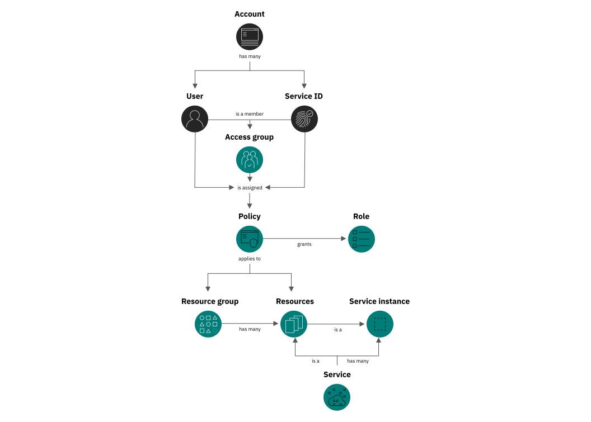
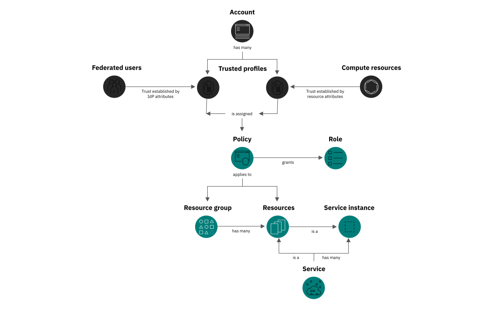

---

copyright:

  years: 2017, 2021

lastupdated: "2021-09-28"

keywords: what is IAM, IAM features, IAM API, how IAM works

subcollection: account

---

{:shortdesc: .shortdesc}
{:codeblock: .codeblock}
{:screen: .screen}
{:external: target="_blank" .external}
{:note: .note}
{:important: .important}
{:tip: .tip}


# What is {{site.data.keyword.cloud_notm}} Identity and Access Management?
{: #iamoverview}

Learn about what IBM Cloud Identity and Access Management (IAM) is, how IAM works, what features are available, and how to access the console, CLI, and APIs to work with IAM in your account.
{: shortdesc}

IAM enables you to securely authenticate users for platform services and control access to resources consistently across {{site.data.keyword.cloud_notm}}. A set of {{site.data.keyword.cloud_notm}} services is enabled to use {{site.data.keyword.cloud_notm}} IAM for access control, and are organized into [resource groups](/docs/account?topic=account-rgs) within your account so you can give users access quickly to more than one resource at a time. Each of these services is labeled as "IAM-enabled" in the catalog. You can use IAM access policies to assign users and service IDs access to resources within your account. And, you can group users and service IDs into an [access group](/docs/account?topic=account-groups) to easily give all members of the group the same level of access.

{: caption="Figure 1. How IAM access works in an account by using access groups" caption-side="bottom"}

You can also use [trusted profiles](/docs/account?topic=account-create-trusted-profile) to group and grant access to users, service, and app identities. By specifying conditions based on SAML attributes for users whose identity is federated from your external identity provider (IdP), users can be granted access to resources without having to be invited to the account if they meet those conditions. For service and app identities, you can define fine-grained authorization for all applications that are running in a compute resource without creating service IDs or manage the API key lifecycle for applications.

{: caption="Figure 2. How IAM access works in an account by using trusted profiles" caption-side="bottom"}

For services that don't support the use of {{site.data.keyword.cloud_notm}} IAM policies for managing access, you can use [Cloud Foundry access](/docs/account?topic=account-cfaccess) or [classic infrastructure permissions](/docs/account?topic=account-infrapermission).
{: note}

The two major concepts of {{site.data.keyword.cloud_notm}} IAM are identity and access management. For more information, review the following sections.

## Identity
{: #identity-overview}

The identity concept consists of user identities, service and app identities, API keys, resources, and trusted profiles. Users are identified by their IBMid, SoftLayer, {{site.data.keyword.appid_short}} user ID, or federated user attributes. Service IDs are a second type of identity that is used in an account. Service IDs are used to provide a separate identity for services and applications. You can create a service ID to be used by an application that needs access to your {{site.data.keyword.cloud_notm}} services so that individual user credentials don't need to be used. As an alternative to creating service IDs and managing the API key lifecycle for applications, you can create [trusted profiles for compute resources](https://test.cloud.ibm.com/docs/account?topic=account-iamoverview#trusted-profiles-feature-resources) to define fine-grained authorization for all applications that are running in a compute resource.

Similar to other identities within IAM, trusted profiles are treated as a subject in IAM policies. Usually, for a user to take an action on a resource within an account, that identity must explicitly be added to the account. With trusted profiles, it is possible for a user to complete such actions without being invited to an account. Instead, they are automatically granted access to resources when they apply the trusted profile identity during login. Only users federated by an external IdP can be mapped to trusted profiles during login by evaluating SAML-based attributes to determine which profiles their identity can apply. 

Likewise, instead of having to create a service ID, generate an API key, and get the application to store and validate that key, you can assign an IAM trusted profile identity directly to a compute resource instance and acquire identity tokens. Trust with compute resources is established by way of conditions based on resource attributes, or creating a direct link to a specific resource.

{{site.data.keyword.cloud_notm}} API keys are used to authenticate with an API or CLI as a user or service ID. These API keys are provided through {{site.data.keyword.cloud_notm}} IAM and can't be used generally to authenticate with IBMid outside of {{site.data.keyword.cloud_notm}}. You can also use a single classic infrastructure API key to access classic infrastructure APIs; however, this is not required as you can use {{site.data.keyword.cloud_notm}} API keys to access the same APIs.

The final piece of the identity concept in IAM is {{site.data.keyword.cloud_notm}} resources, which are identified by their cloud resource names (CRN). CRNs are used for service-to-service authorizations. For more information, see [Cloud Resource Names](/docs/account?topic=account-crn).


## Access management
{: #access-management-overview}

The concept of access management consists of a few interrelated components, including users, service IDs, access groups, trusted profiles, resources, policies, roles, actions, and the {{site.data.keyword.cloud_notm}} IAM control system, which allows users to take actions on resources within an account.

{{site.data.keyword.cloud_notm}} IAM follows an [eventually consistent](https://en.wikipedia.org/wiki/Eventual_consistency){: external} pattern that is common to many cloud-native services. As a result, IAM remains highly available and performant across multiple global regions. Changes that are made to IAM access policies, authorizations, service IDs, API keys, access groups, trusted profiles, resource groups, users, or any other access controls are recorded and propagated across all IAM components and IAM-enabled services worldwide. Access changes might not take effect until the propagation process is complete.

### Access groups
{: #access-groups-iam}

A group of users and service IDs can be organized so that the same access can be assigned to all members within the group by using one or more policies. With access groups, you can streamline the access assignment process so that you can manage a smaller number of policies and reduce the number of policies in an account, which in turn increases performance. Access groups allow you to grant and revoke access by simply adding or removing users or service IDs in the access group. After your groups are set up, you can start assigning policies by selecting an access group as the subject of the policy. For more information, see [Access groups for streamlined access management](#access-groups-quick-access).

### Trusted profiles
{: #trusted-profiles-iam}

With trusted profiles, you manage the identities of your users within your own corporate directory. And, you can centrally manage the access lifecycle to multiple {{site.data.keyword.cloud_notm}} accounts and assets for federated users without the need to configure access policies for each entity within each account. You don't need to invite users to your account to give them to access your {{site.data.keyword.cloud_notm}} resources. 

You can also define fine-grained authorization for all applications that are running in a compute resource without creating service IDs or managing the API key lifecycle for applications. To start creating trusted profiles for your organization, see [Trusted profiles for eliminating the need to manage credentials](#trusted-profiles-feature).

### Resources
{: #resources-access-management}

Account resources are the provisioned service offerings that are selected from the catalog or finer-grained resources within a service instance, such as an {{site.data.keyword.cos_full}} bucket. IAM-enabled resources are added to a resource group when they are created from the catalog.

IAM access management enables fine-grained access, which means that a policy can be set on a wide scale to all resources in a resource group, for example, or to a specific service instance in the account and even a resource type like a {{site.data.keyword.cos_full_notm}} bucket within a specific instance.

### Access policies
{: #access-policies-concept}

Access policies are how users, [service IDs](/docs/account?topic=account-serviceids), access groups, and trusted profiles in the account are given permission to access and take actions on account resources. Policies include a subject, target, and role. The subject is the user, service ID, or access group that you are providing access. The target of the policy is the resource to which you want to provide access. And, the IAM roles define the level of access or allowed actions on the target of the policy. 

A policy assigns the subject one or more roles that define the level of access and one or more attributes that define the target that the policy allows access to. The policy can provide access to a single service at the instance level, to a set of resources that are organized together in a resource group or to any set of resources that can be defined by a set of attributes such as location or resource type. A policy can also provide access to account management services. Depending on the IAM roles that you assign, the subject is allowed varying levels of access for completing account management tasks, working with service instances, or accessing a service by using the console or completing API calls.

There are different types of policies that allow access to account resources for users and service IDs: a resource group policy, a resource instance policy, an account-wide policy for access to all IAM-enabled services or all instances of a specified service, and a policy on all or one account management services. Depending on your selections, custom configuration options, such as defining access to resources in a specific location or defining access to the granular level of a service-specific resource within an instance, might be available.

In addition to access policies for users and service IDs, there is a policy type that is called an authorization that allows specific services or instances of services access to other services. You can learn more about assigning access between services in the [Using authorizations to grant access between services](/docs/account?topic=account-serviceauth) documentation.

### Roles
{: #iam-roles-concept}

{{site.data.keyword.cloud_notm}} access roles are a group of actions. Access roles allow users and service IDs to complete specific tasks within the context of the target resources that are defined in the policy. There are two types of predefined access roles: platform management and service access. The third type of access role is a custom role that you can create for a service to combine any set of available actions to meet your organizational needs.

Platform management roles define allowable actions, such as assigning user access and creation of service instances, for managing resources at the platform level. Platform roles also apply to actions that can be taken within the context of account management services, such as inviting and removing users, managing access groups, managing service IDs, and private catalog offerings. 

Service access roles define allowable actions, such as calling service APIs or accessing a service's dashboard. These roles are customized based on the service that is selected within the policy.

When you assign access within the console, next to the role you can see the number of actions that are mapped to each role and drill down into that list to see exactly what each role allows.
{: tip}

For more information, see [IAM roles](/docs/account?topic=account-userroles#iamusermanrol).

### Actions
{: #iam-roles-actions}

Actions are mapped to {{site.data.keyword.cloud_notm}} IAM roles so that users can perform only specific tasks when they are assigned the different roles. Sometimes actions are also referred to as permissions or operations. Allowable actions for each role change based on the service that is being accessed because each service defines how that role maps to the use of the service. For more information, see [IAM roles and actions](/docs/account?topic=account-iam-service-roles-actions).

### Access management system
{: #access-management-system}

The {{site.data.keyword.cloud_notm}} IAM control system allows or denies actions by users or service IDs within the context of a service based on their assigned access policies. By default, every user and service ID has no access. Each access policy that is added enables the user or service ID to perform an action within the account based on the specified target and role that is selected in the access policy. When a user tries to complete a specific action, the control system uses the attributes that are defined in the policy to determine whether the user has permission to perform that task. For more information about this process, check out the next section on How {{site.data.keyword.cloud_notm}} IAM works. 

## How does {{site.data.keyword.cloud_notm}} IAM work?
{: #how-iam-works}

There are two common types of IAM systems in cloud providers and understanding each of these models can help you gain a better understanding of how IAM works in {{site.data.keyword.cloud_notm}}.

* Attribute-based access control (ABAC) uses attributes from identities, such as users and service IDs, environments, and resources. These attributes are used by an access decision engine to determine whether an access request should be permitted or denied. ABAC provides more flexibility, control, and features than role-based access control systems. ABAC is typically used when fine-grained access control is needed, or if a wide variety of access control use cases needs to be solved by the same decision engine. ABAC helps reduce security risks by providing fine-grained access control and is typically more complex, especially during initial setup.

* Role-based access control (RBAC) uses a mapping from an identity, such as a user or service ID, to a role. The RBAC role defines the type of access that an identity with the RBAC role can take against a resource. Typically access can be granted for a resource type or a grouping of resources. RBAC roles are usually defined based on job responsibilities within an organization. The RBAC role grants the access that is needed for an identity to do its job. This is a simple model because IAM administrators manage the mapping of RBAC roles to an identity. RBAC roles setup can be simpler than ABAC initial setup.

{{site.data.keyword.cloud_notm}} IAM uses an ABAC model by using identity and resource attributes. {{site.data.keyword.cloud_notm}} IAM uses access policies to store the attribute information that is needed by the IAM access decision engine. And, the access policies tell the IAM decision engine, which attributes the author of the policy requires to grant access to a resource. 

The supported attributes for identities are iam_id and access group ID. The supported attributes for resources belong to one of the following categories:

* Fields defined in the resource [CRN](/docs/account?topic=account-crn), for example the service name.
* System-wide defined resource attributes, such as resource groups.
* Service-specific resource attributes such as namespaces or buckets.

Each service defines the supported attributes for resources it manages. For more information, see the documentation for the service you're using.
{: note}

A best practice in {{site.data.keyword.cloud_notm}} IAM is to use access groups to manage access for identities. After the access group access policies are defined, granting, and revoking access is simply a matter of adding and removing identities to or from access groups. A user or service ID can belong to as many access groups as the administrator wants, and the members of the group inherit all access that is assigned to the access group. This approach provides the fine-grained access benefits of ABAC with the simplicity of RBAC.

IAM administrators familiar with RBAC might use access groups to mimic an RBAC model. Conceptually an access group is similar to an RBAC role. If you're more familiar with using traditional RBAC roles like system administrator, network administrator, or storage administrator, these can be defined in {{site.data.keyword.cloud_notm}} IAM by using access groups with specific access policies that are assigned to each. For more information about using access groups and the best practices for assigning access, see [Best practices for organizing resources and assigning access](/docs/account?topic=account-account_setup). 
{: tip}

For example, you can create an access group called `Storage Administrators`. When it is first created, no access is granted to any members of the access group. The access group can then be assigned policies granting the Administrator role to all storage resources in the account that are currently provisioned as well as any that will be created in the future. If a new user joins the team and their job in the organization is a storage administrator for the account, then they can simply be added to the access group and have all of the access that they need to do their job.

This is a simple example, but the approach can be applied to any job, role, or responsibility in an organization. The access policies assigned to the access group can be fine-grained allowing for use cases like storage administrator of all storage in a specific resource group, and even for only a specific storage type.

For more information about getting up and running quickly with {{site.data.keyword.cloud_notm}} IAM by setting up access groups for quick access assignments, inviting users to your account, and managing their access, see [Assigning access to resources](/docs/account?topic=account-access-getstarted).

## What features are provided?
{: #features}

{{site.data.keyword.cloud_notm}} IAM provides a wide range of features for your identity and access management needs. 

### User management
{: #usermgmt-feature}

With unified user management, you can add and delete users in an account for both platform and classic infrastructure services. You can organize a group of users in an access group to make assigning access for more than one user or service ID at a time a quick and easy task.

### Fine-grained access control
{: #fgaccess-feature}

Access for users, service IDs, access groups, and trusted profiles are defined by a policy. Within the policy, the scope of access can be assigned to a set of resources in a resource group, a single resource, or account management services. After the target is set, you can define what actions are allowed by the subject of the policy by selecting access roles. Roles provide a way to tailor the level of access that is granted for the subject of the policy to perform actions on the target of policy, whether it is platform management tasks within the account or accessing a service's UI or completing API calls.

### Access groups for streamlined access management
{: #access-groups-quick-access}

Quickly and easily assign access for a group or users or service IDs organized in an access group by assigning access to the group, and then add or remove users or service IDs as needed to grant or deny access to account resources. Access groups enable you to manage a minimal number of policies in the account. For more information, see [Setting up access groups](/docs/account?topic=account-groups).

### Trusted profiles for eliminating the need to manage credentials
{: #trusted-profiles-feature}

Quickly and easily assign access for a group of federated users or compute resources that are organized in a trusted profile. You assign access to the profile, and then add or remove conditions as needed to grant or deny access to account resources. By using trusted profiles, you can centrally manage the access lifecycle to multiple {{site.data.keyword.cloud_notm}} assets. For more information, see [Setting up trusted profiles](/docs/account?topic=account-create-trusted-profile).

#### Federated users
{: #trusted-profiles-feature-fedusers}

Your users might already have identities outside of {{site.data.keyword.cloud_notm}}, in your corporate directory. If your users need to work with {{site.data.keyword.cloud_notm}} resources or work with applications that access those resources, then those users also need {{site.data.keyword.cloud_notm}} credentials. You can use a trusted profile to specify permissions for users whose identity is federated from your organization or an external IdP. By using your IdP, you can provide a way for users in your company to use single sign-on (SSO). To connect your federated users with {{site.data.keyword.cloud_notm}} resources, see [Federating users to {{site.data.keyword.cloud_notm}}](#federation-iam).

#### Compute resources
{: #trusted-profiles-feature-resources}

By using trusted profiles, you can define fine-grained authorization for all applications that are running in a compute resource without creating service IDs or managing the API key lifecycle for applications. The trusted profiles provide better control for granting access to compute resources.

*  Application developers can programmatically retrieve a token that is associated with the compute resource identity that they are running on. That token is used to get the trusted profile identity token, which is used to access services and resources on {{site.data.keyword.cloud_notm}}.
*  Applications running on a compute resource can have a flexible, but secure way to access other {{site.data.keyword.cloud_notm}} services from within compute resources. For example, it's more secure not having to store API keys.
*  All compute resource instances that share certain conditions such as name, namespace, tags, or location, their identities are mapped to a common profile and can share access to {{site.data.keyword.cloud_notm}} resources. This common identity makes it possible to give the applications within various compute resources access to an external resource one time rather than cluster-by-cluster.

You can monitor which federated users and compute resources apply a trusted profile by looking at {{site.data.keyword.at_short}}. The fields `Initiator.authnId` and `Initiator.authnName` hold the details for the authenticated user that applies a profile, while `Initiator.id` and `Initiatior.name` hold the details of the profile that is applied. For compute resources the `authn` fields hold the CRN that uniquely identifies the resource that applies a profile. For more information, see [Required AT field events](https://test.cloud.ibm.com/docs/observability?topic=observability-at_req_fields#initiator.authnId).
{: note}

### API keys for user authentication
{: #apikey-feature}

You can create multiple API keys for a user to support key rotation scenarios, and the same key can be used for accessing multiple services. {{site.data.keyword.cloud_notm}} API keys enable users who use two-factor authentication or a federated ID to automate authentication to the console from the command line. A user can also have a single classic infrastructure API key that can be used to access classic infrastructure APIs; however, this is not required as you can use {{site.data.keyword.cloud_notm}} API keys to access the same APIs. For more information, see [Understanding API keys](/docs/account?topic=account-manapikey).

### Service IDs
{: #svcid-feature}

A service ID identifies a service or application similar to how a user ID identifies a user. These are IDs that can be used by applications to authenticate with an {{site.data.keyword.cloud_notm}} service. Policies can be assigned to each service ID to control the level of access that is allowed by an application that uses the service ID, and an API key can be created to enable the authentication. For more information, see [Creating and working with service IDs](/docs/account?topic=account-serviceids).

### Multifactor authentication
{: #mfa-feature}

You can require multifactor authentication (MFA) for every user in the account or just users with non-federated IDs who do not use SSO. All users with an IBMid use a time-based one-time passcode (TOTP) MFA factor, and any users with a different type of ID must be enabled to use the TOTP, security questions, or external authentication factor separately. For more information, see [Types of multifactor authentication](/docs/account?topic=account-types).

### Service to service authorizations
{: #service-authorizations-feature}

In a scenario that you need to provide one service access to another, you can create a policy by using a service to service authorization. For more information, see [Using authorizations to grant access between services](/docs/account?topic=account-serviceauth).

## How do I use {{site.data.keyword.cloud_notm}} IAM?
{: #howto}

You can access and use {{site.data.keyword.cloud_notm}} IAM through the Access (IAM) UI, CLI, or API.

* To access {{site.data.keyword.cloud_notm}} IAM by using the console, go to **Manage** > **Access (IAM)**.
* Go to [Managing IAM access, API keys, service IDs, and access groups](/docs/cli?topic=cli-ibmcloud_commands_iam) to review the available CLI commands.
* Review the available APIs:
    * [IAM Identity Services API](/apidocs/iam-identity-token-api){: external} 
    * [IAM Access Groups API](/apidocs/iam-access-groups){: external} 
    * [IAM Policy Management API](/apidocs/iam-policy-management){: external} 

## Mapping {{site.data.keyword.cloud_notm}} IAM concepts to other cloud providers
{: #iam-compare}

Identity and access management is used to securely authenticate users and provide access to cloud resources. While IAM across cloud providers is a consistent way of securing authentication and access, the concepts within each cloud provider and how they apply might differ. Review the following information in the table to learn more about how concepts in {{site.data.keyword.cloud_notm}} IAM relate or compare to those of other cloud providers to help you onboard smoothly with {{site.data.keyword.cloud_notm}}. 

The following mappings of {{site.data.keyword.cloud_notm}} IAM concepts to those of other cloud providers, such as Amazon Web Services (AWS), Google Cloud Platform, and Microsoft Azure, might not be an exact one-to-one match. However, if you are familiar with a particular concept within another provider, this mapping is intended to help you find the closest related concept in {{site.data.keyword.cloud_notm}}.
{: note}


|  {{site.data.keyword.cloud_notm}} concept | {{site.data.keyword.cloud_notm}} description  | AWS   | Azure | Google Cloud Platform  | 
|-----------|----------------|-------|-------|------------------------|
| Identities  | Users and service IDs |  Users, groups, and roles | User, group, service principal, managed identity | User accounts and service accounts. Supported identity types: Google Account, Service account, Google group, G Suite domain, Cloud Identity domain | 
| Users  | Managed outside IAM. Users are uniquely identified in {{site.data.keyword.cloud_notm}} with the iam_id value, but can come from IBMid, {{site.data.keyword.appid_short}}, or SoftLayer | Managed in IAM. Identity federated to external identity management system.  | Managed in Active Directory | Managed outside IAM. Identity federated to external identity management system. | 
| Service IDs | An ID for an app or service.  | Roles that are assigned to an app | User-assigned identity | Service accounts  | 
| API key | A credential that is used for a user or service ID  | Access Key  | api-key | API key | 
| Access groups  |  A way to organize users and service IDs where all members of the group are assigned the same access.  |Groups, roles | Active Directory groups | Google Groups |
| Trusted profiles  |  A way to assign access to federated users based on SAML attributes or for all applications running in a compute resource without the need of managing and rotating credentials.  |Roles | Managed identity | Workload identity | 
| Policy  | Access assignment made up of a subject, target, and role. |  Policy  | Role assignment | Policy | 
| Policy subject  | A user, service ID, or access group |  An IAM user, group, or a role | Security principal | A resource|
| Roles| A role is a collection of actions for a specific resource that are used as a building block to make an access policy.   | AWS-managed policy  | Role definition | Predefined roles | 
| Custom roles | Customer-defined and named role, including only the actions chosen by the user.  |Customer-managed policies  | Custom roles | Custom roles  | 
| Actions | What is allowed to be completed within the context of the platform or service | Actions | Permissions | Permissions  | 
| Resources | Target of an access policy | Resources | Resources | Resources | 
| Resource groups  | Logical organization container for IAM-enabled services | Tags  | Resource groups | Projects | 
| Public access | Public access to specific resources is enabled through a default access group called Public Access. This feature can be disabled on each account. | Feature of Amazon S3 that can be enabled for specific resources, and can be disabled at the account or bucket level. | Public read access can be enabled for specific account types or resources. It can be disabled at the storage account or container level. | Google has an identifier for allAuthenticatedUsers that represents all service accounts and all users who are authenticated with a Google Account, which can also be granted access. |
| Auditing | Audit with Activity Tracker | Audit with AWS CloudTrail | Azure Logging and Auditing Activity logs | Audit with Audit logging | 
{: row-headers}

{: caption="Table 1. {{site.data.keyword.cloud_notm}} IAM concept comparison" caption-side="top"}
{: summary="The rows are read from left to right. The first column is {{site.data.keyword.cloud_notm}} IAM concept. Then, each of the following columns has details as that concept relates the specific cloud provider that is listed in the column header."}

### {{site.data.keyword.cloud_notm}} access policies
{: #policy-details}

To help you further understand how access is assigned by using access policies in {{site.data.keyword.cloud_notm}} in relation to other cloud providers that you might be familiar with, check out the following details and example of an access policy.

{{site.data.keyword.cloud_notm}} IAM policies consist of the identity who (subject) is being given access, such as the user or service ID, the specific resources or services (target) to which they are being given access, and roles that define what actions are allowed within the context of the selected resource or service.

In {{site.data.keyword.cloud_notm}}, a user, service ID, or the members of an access group don't have any access by default. The {{site.data.keyword.cloud_notm}} access model is simple when it comes to understanding how you get permitted or denied to complete specific actions. It isn't until an administrator assigns an access policy with a particular access role that access is granted. The IAM system doesn't have to evaluate permit and deny policies to determine what actions are allowed, instead the system just evaluates what resources you have policies for and what level of access is allowed by your assigned roles.

When you specify a resource in a policy because {{site.data.keyword.cloud_notm}} is [attribute-based](#how-iam-works), you can specify a broad set of resources for a user to have access to, for example all resources in a resource group. Or, you can narrow the user's access to a specific instance of a single service or even a subresource type, such as a {{site.data.keyword.cos_short}} bucket. {{site.data.keyword.cloud_notm}} IAM provides a high level of flexibility and granularity to help you assign only the type of access that is required. A few examples of the different levels of access that you can assign by using attributes in an access policy are the following:

* All account management services
* A specific account management service
* All IAM resources within the account
* All resources that belong to a resource group 
* All resource types of a single service across the entire account, regardless of resource group assignment
* A specific instance of a service in the account
* A single subresource type within an instance, for example, a bucket in an {{site.data.keyword.cos_short}} instance

If a specific predefined platform or service role doesn't fit what you're looking for when assigning the level of access, you can create a [custom role](/docs/account?topic=account-custom-roles) for a specific service and then choose from the available actions to create a role that fits your organization's needs.
{: tip}

#### Policy example
{: #ibmcloud-policy-example}

This policy example gives access to all service resources that belong to a resource group named `default` with an ID of  `abcd2e6fg1h74i44j5kl467m701n5289` with the `Viewer` platform role assigned. This policy can be assigned to a user, service ID, or access group. In this case, it is assigned to a user with an iam_id of `IBMid-3IAMISBEST1`.

Access groups are not identities like a user or service ID; however, they are a grouping mechanism for identities. An access group can be defined as a subject of an access policy, and the assigned access on the group applies to all members added to it.
{: note}

```bash
{
  "type": "access",
  "subjects": [
    {
      "attributes": [
        {
          "name": "iam_id",
          "value": "IBMid-3IAMISBEST1"
        }
      ]
    }
  ],
  "roles": [
    {
      "role_id": "crn:v1:bluemix:public:iam::::role:Viewer"
    }
  ],
  "resources": [
    {
      "attributes": [
        {
          "name": "accountId",
          "value": "7e522a19eb77477e88e96a600c44fb22"
        },
        {
          "name": "resourceGroupId",
          "value": "abcd2e6fg1h74i44j5kl467m701n5289"
        }
      ]
    }
  ]
}
```
{: codeblock}

In addition to an access policy for a user, service ID, or access group that can provide access to a service, specific resource, or resource group in the account, {{site.data.keyword.cloud_notm}} also provides the capability to assign an access policy that is called a service to service authorization, which provides access between services. For an example of this policy type, see [Creating an authorization by using the API](/docs/account?topic=account-serviceauth#auth-api).


### Federating users to {{site.data.keyword.cloud_notm}} 
{: #federation-iam}

{{site.data.keyword.cloud_notm}} offers two ways for you to federate your corporate identity provider (IdP), which simplifies login by giving your employees access to {{site.data.keyword.cloud_notm}} with their company username and password. The first option is to [federate with IBMid](https://ibm.box.com/v/IBMid-Federation-Guide){: external}, and the other option is to create an {{site.data.keyword.appid_full_notm}} service instance and use that as a way to federate users into an {{site.data.keyword.cloud_notm}} account. For more information, see [Enabling authentication from an external identity provider](/docs/account?topic=account-idp-integration).

In both types of federation, the user must be a member of the account, or have access to the account by a trusted profile to be able to complete operations. If trusted profiles are not configured, the account owner or administrator must invite individual IBMids into the {{site.data.keyword.cloud_notm}} account. Only if the invited IBMid accepts the invitation is the user added the account as an active user. In the case of {{site.data.keyword.appid_short}}, the user is automatically onboarded to {{site.data.keyword.cloud_notm}} without a need to invite each user to the account. In both types of federation, the users are active {{site.data.keyword.cloud_notm}} account users that can access the platform, including IAM-enabled resources, Cloud Foundry, and classic infrastructure all depending on their assigned access.

Trusted profiles deal with federated users differently. If the customer federates their corporate IdP, users from that IdP aren't added to an account as what we might consider a normal user. Instead, users' SAML-based IdP attributes are evaluated at login and if they meet all of the conditions for a trusted profile, they are prompted to apply one or more trusted profiles. Trusted profiles grant users the level of access they need to complete a specialized and specific set of tasks in a limited time-period, for example, 1-4 hours. These are usually critical tasks that you would want to avoid doing unintentionally in daily work. Users don't need to onboard to {{site.data.keyword.cloud_notm}}, they're automatically added by way of the trust relationship. If a user leaves your company, you can simply delete the user's corporate identity in your directory, which then also revokes access to {{site.data.keyword.cloud_notm}}. Time-based access allows frequent authentication checks for reduced security risks.
