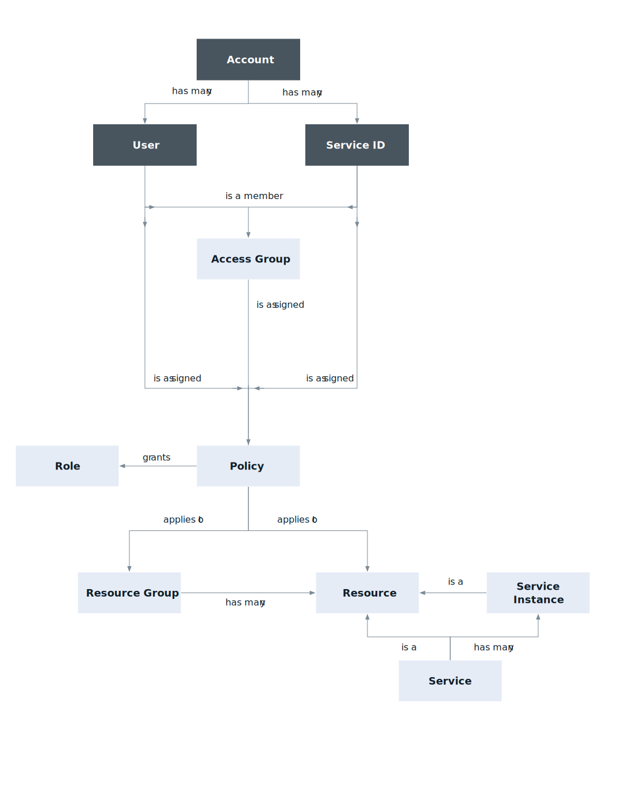

---

copyright:

  years: 2017, 2020

lastupdated: "2020-07-08"

keywords: what is IAM, IAM features, IAM API

subcollection: account

---

{:shortdesc: .shortdesc}
{:codeblock: .codeblock}
{:screen: .screen}
{:external: target="_blank" .external}

# What is {{site.data.keyword.Bluemix_notm}} Identity and Access Management?
{: #iamoverview}

Learn about what {{site.data.keyword.Bluemix}} Identity and Access Management (IAM) is, what features are available to you, and how to access the console, CLI, and APIs to work with IAM in your account.
{:shortdesc}

{: #what_is_IAM}
IAM enables you to securely authenticate users for platform services and control access to resources consistently across {{site.data.keyword.Bluemix_notm}}. A set of {{site.data.keyword.Bluemix_notm}} services are enabled to use {{site.data.keyword.Bluemix_notm}} IAM for access control, and are organized into [resource groups](/docs/account?topic=account-rgs) within your account so you can give users quick and easy access to more than one resource at a time. You can use {{site.data.keyword.Bluemix_notm}} IAM access policies to assign users and service IDs access to the resources within your account. You can group users and service IDs into an [access group](/docs/account?topic=account-groups) to easily give all entities within the group the same level of access.

{: caption="Figure 1. How access management works in an account by using IAM" caption-side="bottom"}

For services that do not support creating {{site.data.keyword.Bluemix_notm}} IAM policies for managing access, you can use [Cloud Foundry access](/docs/account?topic=account-cfaccess) or [Classic infrastructure permissions](/docs/account?topic=account-infrapermission).

Two major concepts of {{site.data.keyword.Bluemix_notm}} IAM are identity and access management. For more information, review the following sections.

## Identity

The identity concept consists of user identities, service and app identities, API keys, and resources. Users are identified by their IBMid or SoftLayer account ID. Service IDs are a
second type of identity that is used in an account. Service IDs are used to provide a separate identity for services and applications. You can create a service ID to be used by an application that needs access to your {{site.data.keyword.Bluemix_notm}} services so that individual user credentials do not have to be used.

You can use {{site.data.keyword.cloud_notm}} API keys to authenticate with an API or CLI as a user or service ID. These API keys are provided through {{site.data.keyword.Bluemix_notm}} IAM and therefore cannot be used generally to authenticate with IBMid outside of {{site.data.keyword.cloud_notm}}. You can also use a single classic infrastructure API key to access classic infrastructure APIs; however, this is not required as you can use {{site.data.keyword.cloud_notm}} API keys to access the same APIs.

The final piece of the identity concept in IAM is {{site.data.keyword.Bluemix_notm}} resources, which are identified by their cloud resource names (CRN). For more information, see [Cloud Resource Names](/docs/account?topic=account-crn).

## Access management

The concept of access management consists of a few interrelated components, including users, resources, policies, roles, actions, and the {{site.data.keyword.Bluemix_notm}} IAM control system, which allows users to take actions on resources within an account.

{{site.data.keyword.Bluemix_notm}} IAM follows an [eventually consistent](https://en.wikipedia.org/wiki/Eventual_consistency){: external} pattern that is common to many cloud-native services. As a result, IAM remains highly available and performant across multiple global regions. Changes that are made to IAM access policies, authorizations, service IDs, API keys, access groups, resource groups, users, or any other access controls are recorded and propagated across all IAM components and IAM-enabled services worldwide. Access changes might not take effect until the propagation process is complete.

### Access groups
{: #access-groups-iam}

A group of users and service IDs can be created by so that the same access can be assigned to all entities within the group with one or more policies. By using access groups, you can streamline the access assignment process so that you can manage a smaller number of policies and reduce the number of policies in an account, which increases performance. After your groups are set up, you can start assigning policies by selecting an access group as the subject of the policy. For more information, see [Setting up access groups](/docs/account?topic=account-groups).

### Resources
{: #resources-access-management}

Account resources are the provisioned service offerings that are selected from the catalog or finer-grained resources within a service instance. These resources are added to a resource group when they are created from the catalog. IAM access management enables fine-grained access, which means that a policy can be set on a wider scale, to all resources in a resource group, for example, or to a specific resource type like a {{site.data.keyword.cos_full_notm}} bucket within a specific instance.

### Access policies
{: #access-policies-concept}

Access policies are how users, [service ID](/docs/account?topic=account-serviceids), and access groups in the account are given permission to access account resources. Policies include a subject, target, and role. The subject is the user, service ID, or access group that you are providing access. The target of the policy is the resource to which you want to provide access. And, the IAM roles define the level of access or allowed actions on the target of the policy. 

A policy assigns the subject one or more roles with a combination of attributes that define the scope of access to a target. The policy can provide access to a single service at the instance level, to a set of resources organized together in a resource group, or to account management services. Depending on the IAM roles that you assign, the subject is allowed varying levels of access for completing account management tasks, working with service instances, or accessing a service by using the UI or completing API calls.

There are different types of policies that allow access to account resources: a resource group policy, a resource instance policy, an account-wide policy for access to all IAM-enabled services, and a policy on all or one account management services. Depending on your selections, custom configuration options, such as defining access to resources in a specific region or defining access to the granular level of a service-specific resource within an instance, might be available.

### Roles
{: #iam-roles-concept}

{{site.data.keyword.Bluemix_notm}} IAM access roles allow a user to complete specific tasks on the resource that is defined in the policy. There are two types of access roles: platform management and service access. 

Platform management roles define allowable actions, such as user access and creation of service instances, for managing resources at the platform level. Platform roles also apply to actions that can be taken within the context of account management services, such as inviting and removing users, managing access groups, managing service IDs, and private catalog offerings. 

Service access roles define allowable actions, such as calling service APIs, within the context of using the service. These roles are customized based on the service that is selected within the policy.

For more information, see [IAM roles](/docs/account?topic=account-userroles).

### Actions
{: #iam-roles-actions}

Actions are mapped to the {{site.data.keyword.Bluemix_notm}} IAM roles so that users perform only specific tasks when they are assigned the different roles. Sometimes actions are also referred to as permissions. Allowable actions for each role might change based on the service that is being accessed because each service defines how that role maps to the use of the service.

### Access management system
{: #access-management-system}

The {{site.data.keyword.Bluemix_notm}} IAM control system allows or denies actions by users within the context of a service based on the assigned policy. When a user tries to complete a specific action, the control system uses the attributes that are defined in the policy to determine whether the user has permission to perform that task.

## What features are provided?
{: #features}

{{site.data.keyword.Bluemix_notm}} IAM provides a wide range of features for your identity and access management needs. 

### User management
{: #usermgmt-feature}

With unified user management, you can add and delete users in an account for both platform and classic infrastructure services. You can organize a group of users in an access group to make assigning access for more than one user at a time a quick and easy task.

### Fine-grained access control
{: #fgaccess-feature}

Access for users, service IDs, and access groups is defined by a policy. Within the policy, the scope of access can be assigned to a set of resources in a resource group, a single resource, or account management services. After the scope is set, you can define what actions are allowed by the subject of the policy by selecting access roles. Roles provide a way to tailor the level of access that is granted for the subject of the policy to perform actions on the target of policy, whether it is platform management tasks within the account or accessing a service's UI or completing API calls.

### API keys for user authentication
{: #apikey-feature}

You can create multiple API keys for a user to support key rotation scenarios, and the same key can be used for accessing multiple services. {{site.data.keyword.cloud_notm}} API keys enable users who use two-factor authentication or a federated ID to automate authentication to the console from the command line. A user can also have a single classic infrastructure API key that can be used to access classic infrastructure APIs; however, this is not required as you can use {{site.data.keyword.cloud_notm}} API keys to access the same APIs.

### Service IDs
{: #svcid-feature}

A service ID identifies a service or application similar to how a user ID identifies a user. These are IDs that can be used by applications to authenticate with an {{site.data.keyword.Bluemix_notm}} service. Policies can be assigned to each service ID to control the level of access that is allowed by an application that uses the service ID, and an API key can be created to enable the authentication.

### Multifactor authentication
{: #mfa-feature}

You can require multifactor authentication (MFA) for every user in the account or just users with non-federated IDs who do not use SSO. All users with an IBMid use a time-based one-time passcode (TOTP) MFA method, and any users with a different type of ID must be enabled to use the TOTP, security questions, or external authentication method separately.

## How do I use {{site.data.keyword.Bluemix_notm}} IAM?
{: #howto}

You can access and use {{site.data.keyword.Bluemix_notm}} IAM through the Access (IAM) UI, CLI, or API.

* To access {{site.data.keyword.Bluemix_notm}} IAM by using the console, go to **Manage** &gt; **Access (IAM)**.
* Go to [Managing IAM access, API keys, service IDs, and access groups](/docs/cli?topic=cli-ibmcloud_commands_iam) to review the available CLI commands.
* Go to the following API docs to review the available APIs:
    * [IAM Identity Services API](https://{DomainName}/apidocs/iam-identity-token-api){: external} 
    * [IAM Access Groups API](https://{DomainName}/apidocs/iam-access-groups){: external} 
    * [IAM Policy Management API](https://{DomainName}/apidocs/iam-policy-management){: external} 
    

    
