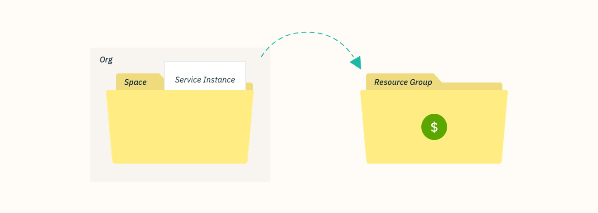

---

copyright:

  years: 2017, 2018

lastupdated: "2018-04-26"

---

{:shortdesc: .shortdesc}
{:codeblock: .codeblock}
{:screen: .screen}
{:new_window: target="_blank"}
{:gif: data-image-type='gif'}
{:tip: .tip}

# Migrating Cloud Foundry service instances to a resource group
{: #migrate}

As services move off of using Cloud Foundry orgs, spaces, and roles to using Cloud Identity and Access Management (IAM) and resource groups, you can migrate your Cloud Foundry service instances to a [resource group](/docs/account/resourcegroups.html#rgs). Migrating service instances to a resource group have several benefits including finer-grained access control by using IAM roles and connecting service instances to apps and services across different regions.

When a service moves off Cloud Foundry, you are prompted to migrate your existing service instances by a message on your dashboard. You can identify the services that are ready to be migrated by the  icon.
{:shortdesc}

When you migrate existing Cloud Foundry service instances to a resource group, the group that you choose can't be changed after the migration is complete. So, make sure that you plan how you want to organize resources in the account before you migrate. This might mean that you need to create one or more resource groups, if you have a billable account, before migrating. You can try organizing your resources into resource groups the same way you organized resources in Cloud Foundry spaces.
{: tip}

## Why migrate service instances?

Services that support Cloud IAM access control and organization within resource groups have several benefits such as the ability to connect to apps and services in any Cloud Foundry space, which allows connections for apps and services from different regions. To create the connection, you can create an alias of an instance from a resource group in a Cloud Foundry space. When you migrate, the connection is done automatically by turning your original Cloud Foundry service instance into an alias and creating a linked instance in a resource group of your choice.

In addition, each instance that is managed by Cloud IAM belongs to a resource group. Resource groups are not scoped by region, so you can provision apps and services from different regions into the same resource group. You can also take advantage of fine-grained access control at an individual instance level.

## Who can migrate service instances?
{: #whocanmigrate}

Users must have specific access to migrate Cloud Foundry service instances to a resource group:

* A user must have the Developer role on the Cloud Foundry space or the Organization manager Cloud Foundry role on the organization to which the instance belongs.
* A user must have at least the Viewer IAM role for managing the resource group to which the instance is going to be migrated.
* A user must have at least the Editor IAM role on the service.

For more information about assigning the correct access, see [Cloud Foundry access](/docs/iam/cfaccess.html#cfaccess) and [IAM access](/docs/iam/users_roles.html#platformrolestable).

To check out what access you have, from the menu bar click **Manage** &gt; **Security** &gt; **Identity and Access**, and then click **Users**. Then, click on your name and review your **Access policies** for assigned IAM roles and **Cloud Foundry access** to see which orgs you have access to and your assigned Cloud Foundry roles.
{: tip}

## How does migration work?

When you migrate a service instance from a Cloud Foundry org and space to a resource group, a new linked service instance is created in the resource group. The original instance in the Cloud Foundry org and space becomes an [alias](/docs/cfapps/connecting_apps.html#what_is_alias). The alias counts towards the quota for your organization, but you are billed for your usage of the service instance in the resource group.

{: gif}

You can migrate your service instances one at a time when you are notified on the dashboard by the  icon that is associated with your Cloud Foundry service instance.

1. Open the **More actions** menu.
2. Select **Migrate to a resource group** to get started.
3. Select a resource group.
4. Click **Migrate** and the instance is migrated for you.
5. Since you can migrate only one instance at a time, you can continue migrating eligible instances after you migrate the first one.

After you successfully migrate an instance, you see it reflected in the Services section of your dashboard. The alias remains in the Cloud Foundry section of the dashboard. You can use the  in the Cloud Foundry section of the dashboard to identify the aliases.

## Troubleshooting

If you run into any issues with migrating Cloud Foundry service instances, check out [Troubleshooting migrating service instances](/docs/troubleshoot/ts_migration.html).
