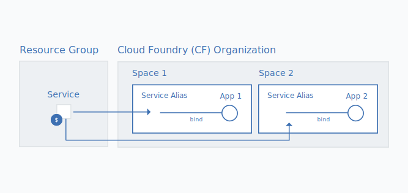

---

copyright:

  years: 2017, 2022

lastupdated: "2022-06-13"

keywords: migrate, migrating to a resource group, migrate Cloud Foundry

subcollection: account

---

{{site.data.keyword.attribute-definition-list}}

# Migrating Cloud Foundry service instances and apps to a resource group
{: #migrate}

To make your experience with using {{site.data.keyword.Bluemix}} simpler and more flexible, we introduced [resource groups](/docs/account?topic=account-rgs), which are conceptually similar to Cloud Foundry spaces. However, resource groups include several extra benefits, such as finer-grained access control by using IBM Cloud Identity and Access Management (IAM), the ability to connect service instances to apps and service across different regions, and an easy way to view usage per group.
{: shortdesc}

We're starting to move services from Cloud Foundry to benefit from resource groups, which means when you see the **Migrate** icon  next to one of your services on the Resource list page, you must start a migration plan for your service instances or apps that are created through the [{{site.data.keyword.Bluemix_notm}} {{site.data.keyword.dev_console}}](https://cloud.ibm.com/developer/appservice/dashboard){: external} to move from their current Cloud Foundry org and space to a resource group. Until an {{site.data.keyword.Bluemix_notm}} service moves from using Cloud Foundry orgs, spaces, and roles to using IAM and resource groups, you can’t migrate your existing Cloud Foundry service instances to a resource group.

When you migrate existing Cloud Foundry service instances or {{site.data.keyword.dev_console}} apps to a resource group, the group that you choose can't be changed after the migration is complete. So, it's essential to plan how you want to organize resources in the account before you migrate. This might mean that you need to create one or more resource groups, if you have a billable account, before migrating.

You can try organizing your resources in resource groups the same way you organized resources in Cloud Foundry spaces. For more information about using resource groups, see [Best practices for organizing resources and assigning access](/docs/account?topic=account-account_setup).
{: tip}

## Why migrate?
{: #why_migrate}

### Cloud Foundry service instances
{: #cf_instances}

Services that support Cloud IAM access control and organization within resource groups have several benefits:

* By using fine-grained access control, you can set access to individual service instances or a group of resources that are organized in a resource group.
* By using access groups and resource groups to organize users and resources, you set only the minimum number of access policies. For example, if you have a set of developers that you want to all have access to resources for a development environment, you can organize all of those users into a developers access group and then add all the resources that they need access to into a single resource group. Then, you can set a single policy for the access group to have access to all resources in the resource group.
* You can view usage by resource group similar to the way you might view usage by Cloud Foundry orgs.
* You can connect to apps and services in any Cloud Foundry space, which allows connections for apps and services from different regions. When you migrate, the connection is done automatically when you turn your original Cloud Foundry service instance into an alias and creating a linked instance in a resource group of your choice. The following graphic shows how the connection by using an alias works.

{: caption="Figure 1. Binding a service instance to a Cloud Foundry space to create an alias" caption-side="bottom"}

### {{site.data.keyword.dev_console}} apps
{: #app_services}

Previously, {{site.data.keyword.dev_console}} apps might be associated only with Cloud Foundry service instances. Now, if you migrate your apps to a resource group, you can associate your apps with service instances that belong to a resource group and support Cloud IAM access control.

## Who can migrate?
{: #whocanmigrate}

### Required access for service instances
{: #required_access_instances}

Users must have specific access to migrate Cloud Foundry service instances to a resource group:

* A user must have the Developer role on the Cloud Foundry space or the Organization manager Cloud Foundry role on the organization to which the instance belongs.
* A user must have at least the Viewer IAM role for managing the resource group to which the instance is going to be migrated.
* A user must have at least the Editor IAM role on the service.

For more information about assigning the correct access, see [Cloud Foundry access](/docs/account?topic=account-mngcf) and [IAM access](/docs/account?topic=account-userroles).

To check out what access you have, in the {{site.data.keyword.cloud}} console, go to **Manage** > **Access (IAM)** from the console menu bar, and then click **Users**. Click your name and review your **Access** for assigned IAM roles and **Cloud Foundry** to see which orgs you have access to and your assigned Cloud Foundry roles.
{: tip}

### Required access for {{site.data.keyword.dev_console}} apps
{: #required_access_apps}

Any user who can access an {{site.data.keyword.dev_console}} app can migrate it. However, migrating an app doesn't migrate services that are associated with the app. Service instances must be migrated separately.

## How does migration work?
{: #how}

### Migrating service instances
{: #migrate_instances}

When you migrate a service instance from a Cloud Foundry org and space to a resource group, a new linked service instance is created in the resource group. The original instance in the Cloud Foundry org and space becomes an [alias](/docs/account?topic=account-connect_app#what_is_alias). The alias counts towards the quota for your organization, but you're billed for your usage of the service instance in the resource group.

{: video controls loop height="300"}

Service instances are migrated one at a time when you're notified on the Resource list page by the  icon that is associated with your Cloud Foundry service instance.

Before you start the migration process, review your service documentation to see whether any additional, service-specific changes that you might have to make when you migrate your service instance to a resource group. For example, you might need to migrate data from old instances to new instances or update the credentials that are used for your app if you delete the Cloud Foundry alias. Applications that make a direct call to the API of a service that is migrated need to update the API call to use either an IAM API key or access token.
{: tip}

1. Open the **More actions** menu.
2. Select **Migrate to a resource group** to get started.
3. Select a resource group.
4. Click **Migrate** and the instance is migrated for you.
5. Since you can migrate only one instance at a time, you can continue migrating eligible instances after you migrate the first one.

After you successfully migrate an instance, you see it in the Services section of the Resource list page. The alias stays in the Cloud Foundry section. You can use the **Link** icon  in the Cloud Foundry section of the Resource list page to identify the aliases.

### Migrating {{site.data.keyword.dev_console}} apps
{: #migrate_apps}

Apps are migrated one at a time by clicking the  icon associated with each entry in your App List view.

1. Select the **Navigation menu** icon , and select the developer portal of interest such as Watson or App Development, for example.
2. Select **Apps**, which displays the lists **Apps (Action required)** and **Apps (migrated)**.
3. For each entry in the **Apps (Action required)** list, click the **Migrate** icon .
4. Select or create a new resource group.
5. Click **Migrate**, and the app is migrated for you.
6. Confirm that the app now shows in the **Apps (migrated)** list.
7. Since you can migrate only one app at a time, you can continue migrating eligible apps after you migrate the first one.

## Next steps
{: #migrate_next_steps}

After you migrate your Cloud Foundry service instances to a resource group, you need to ensure that the users in your account have the required level of access to the resources in the account resource groups. You might also want to provide access to manage the resource group so that users can create new service instances in the account resource groups.

For more information about assigning access to resources in your resource groups, see [Managing access to resources](/docs/account?topic=account-assign-access-resources#assign-access-resources).

Also, make sure to review the documentation for your service to see whether any updates for your existing apps must be made after the migration is complete.

## Troubleshooting
{: #ts_migration}

If you run into any issues with migrating Cloud Foundry service instances, check out [Why can't I migrate a Cloud Foundry service instance to a resource group?](/docs/account?topic=account-ts_migrate_instance).
