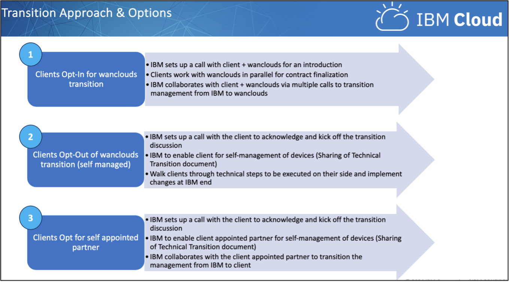

---

copyright:

  years: 2019, 2025
lastupdated: "2025-08-19"

keywords: managed services transition, managed services

subcollection: account

---

# Legacy {{site.data.keyword.cloud_notm}} Managed Services offering transition
{: #legacy-managed-services-transition}

{{site.data.keyword.cloud_notm}} is transitioning its Managed Services support offering, a legacy offering, from managed by IBM to managed by Wanclouds, an IBM partner, or to self-managed by the client. The effective date for this change is 1 January 2025. In most cases, changes, where changes may be needed, will be minor and should not interrupt your operations.

If you use the Managed Services offering, you should [open a support case](/docs/account?topic=account-open-case&interface=ui) in the Support Center no later than 1 November 2024 to provide information on which transition option you choose and to coordinate with IBM on the changes. Because IBM requires a minimum of eight weeks to transition or enable the clients, either opting in or out, IBM requests your decision by November 1st.

As this transition approaches, help is available to assist you. If you have questions, contact us by opening a support case or by reaching out to your IBM representative in Technical Account Management (TAMs), Client Services (CSMs), or Sales for assistance.

## Transition approach and options
{: #transition-approach}

You have the following options for this transition:

- Opt in to partner with Wanclouds and to transition your management of a managed hosting environment to Wanclouds
- Opt out to a self-managed environment that you manage yourself
- Opt out to a self-managed environment with a self-appointed business partner

{: caption="Details about transition options." caption-side="bottom"}

## Timeline
{: #timeline}

The following table describes important dates that you need to be aware of if you use the Managed Services support offering.

| Date | Managed Services transition milestone |
|------|---------------------------------------|
| 26 August 2024 | Affected clients received a notification dated 26 August 2024 with information on this change |
| 1 November 2024 | Last date to open a support case with your transition decision |
| 30 November 2024 | Last date to add servers to the existing setup and have them be included in the transition |
| 1 January 2025 | - IBM no longer provides a managed level of support for server, security, storage, and database management services that were in scope as part of the Managed Services offering \n - IBM is no longer able to log into your devices with IBM’s administrative domain accounts.  IBM demotes and removes its controllers and services from the client’s domain as part of the decommission. \n Any remaining billing for the Managed Services offering ends. Billing for devices continues within the normal IBM billing process. \n Any remaining domain-based resources that were not transitioned might begin to experience failures because the infrastructure will be disabled \n - If you opt in to partnering with Wanclouds the domain moves to and remains on the Wanclouds controllers without impact or interruption \n - If you opt out to a self-managed environment the responsibility for managing the devices reverts solely to you as self-managed devices |
{: caption="Manage Servies transition milestones" caption-side="top"}

## Steps for opting in with Wanclouds
{: #opt-in-wanclouds}

You can expect the following tasks to be part of the transition to partnering with Wanclouds:

- The client will confirm their intent to opt in via a proactive support case.
- As soon as the case is created TAMs/CSM will reach out to the clients and initiate a kickoff call along with IBM & Wanclouds.
- IBM will configure servers that Wanclouds deploy on their own account and promote them to Domain Controllers for the management domain, which will automatically sync the current domain information to them as well as propagate any changes that may get made at any point through the overall customer transition process.
- This approach will ensure that Clients and IBM won’t have to recreate any users or worry about passwords being correct, as the current/existing information will be synced up and will be same (similar to the existing client setup).
- IBM will work with Clients and Wanclouds to ensure any access or rules that may need to be created or updated to allow Wanclouds’ admins the ability to manage these devices for the customer, as well as network communication between the customer’s environment and Wanclouds, is set up and verified.
- To enact the transition, at a time scheduled with the Client IBM will assign the customer’s subnets to a zone defined within the management domain for the Wanclouds controllers and change the DNS servers on the customer’s servers to point to the Wanclouds controllers.
- These actions do not require a reboot or cause interruption, and we would verify proper connectivity between the customer and Wanclouds servers beforehand.
- IBM will not remove anything on its end, so in the unlikely event of unexpected results, reverting for investigation, if necessary, will be seamless.
- IBM will also remove its monitoring agents (Zabbix), which will not impact servers.
- Effective January 1st, 2025, IBM will no longer be able to log into client devices with our Administrative domain accounts, and any remaining domain-based resources will begin to experience failures (if the above steps are not executed) as the infrastructure will be disabled.
- On January 31st, 2025 IBM will demote and remove our controllers and servers from the domain as part of our decommission, and the domain will remain on the Wanclouds controllers without impact or interruption.

For more details on Wanclouds introduction and the scope that they will be offering as part of the transition, see [Empower Your Business with:
Multi-Cloud Managed Service by Wanclouds](https://www.wanclouds.net/solution-briefs/solution-brief-for-multi-cloud-managed-service%20for-ibm-cloud.pdf){: external}.

## Steps for opt out to self-managed
{: #opt-out-self-manage}

You can expect the following tasks to be part of the transition to a self-managed environment:

- The client will confirm their intent to opt out via a proactive support case.
- As soon as the case is created TAMs/CSM will reach out to the clients and initiate a kickoff call along with IBM & Wanclouds.
- For clients Opting out, there will be a discovery phase to understand the client setup and plan next steps.
- Once Client confirms their intent to opt out, IBM will work with the Client to identify which users are active on which servers and where they need to be recreated locally.
- Clients will need to identify what resources, such as users, they are using from our management Active Directory domain, mhsl01.mhsl.local (already known to the client), and replace them with their own users.
- IBM will provide a list of users that have been created for each account, as requested.
- Once confirmed and acknowledged by the client, IBM will remove the servers from our domain and client will be able to self-manage these servers basis of the users created locally.
- For Windows servers moving the servers from IBM domain will require at least one reboot.  For Linux it is not necessary, but IBM recommends to schedule a reboot for validation.
- Clients who already have their own domain servers configured will not be required to go through above steps of user identification and domain transfer.
- IBM will also remove its monitoring agents (Zabbix), which will not impact servers.
- Once client confirms and acknowledges the above steps  the fees for the monitoring service will be removed.
- Effective January 1st, 2025, IBM will no longer be able to log into client devices with our Administrative domain accounts, and any remaining domain-based resources will begin to experience failures as the infrastructure is disabled.
- On January 31st, 2025 IBM will demote and remove our controllers and servers from the domain as part of our decommission, and the domain will remain on the Wanclouds controllers without impact or interruption.

## FAQ about managed services transition
{: #faqs-managed-services}

The following are FAQ about managed services transition.

### What does this transition mean to clients
{: #transition-clients}

Effective January 1st, 2024 The Managed Services support offering will transition from managed by IBM to managed by our trusted partner, Wanclouds.

- Only the management of devices is being transitioned.
- Devices will stay with IBM and will have no impact and there will be no changes to existing Customer accounts (except the line item for managed services will be excluded from the invoice).

Clients have the following option with reference to this transition:

1. Clients can opt-in for transition to Wanclouds
1. Clients can opt-out of the transition to Wanclouds and can be enabled by IBM to self-manage the environment
1. Clients can opt-out of the transition and can appoint their own provider to manage the environment for them. IBM will work with the new partner to enable them

IBM will ensure that all existing clients are seamlessly transitioned, irrespective of their selected option.

### Will this transition incur any additional charges to clients?
{: #additional-charges}

No. transition to Wanclouds and existing environment are at no additional costs

### Will the existing scope or deliverables for Managed Hosting Service Management change?
{: #scope-deliverables}

No. Wanclouds has agreed to offer the same scope and deliverables that is been currently provided by IBM

### How do I contact Wanclouds if I have any issues?
{: #contact-wanclouds}

Wanclouds can be contacted by any one of the following options:

- Website: https://support.Wanclouds.net
- Email : support@Wanclouds.net
- Phone: +1 (415) 347-6739

### How will the transition and engagement be with Wanclouds?
{: #transition-engagement-wanclouds}

Once client confirm the decision for opting in for the transition. IBM will set up a call with the partner and will actively collaborate with clients and Wanclouds for seamless transition

### What if I don't opt for the transition?
{: #no-transition}

Once client confirm the decision for opting in. IBM will setup a call with the client and guide and ensure that clients are enabled to self-manage the environment with no IBM involvement

### How will clients convey their decision to opt in or opt out?
{: #client-opt-out}

Clients can convey their decision by opening a proactive support center case with IBM or getting in touch with their IBM account/ sales representative

### What will be the impact to my infrastructure?
{: #impact-infrastructure}

All Client devices and Infrastructure will be retained with IBM. Clients will have an option to contact Wanclouds/ self-appointed provider (opening cases) for any issues related to management of devices

For any Device/ infrastructure related issues, clients will continue following the existing case management process with IBM by raising cases directly with IBM

### Will this transition change how a customer uses their devices?
{: #change-devices}

No. Some settings may need to be changed to facilitate the transition, but they will not be noticeable to the customer. It will not change how the customer users their servers or how the servers function

### How will a customer get support after this transition?
{: #get-support-after}

For requests or issues for the managed service the customer will be able to engage Wanclouds for direct support. The devices themselves will remain on the customer's account with {{site.data.keyword.cloud_notm}}, along with any other products or services they have with us, and they would continue to engage IBM as they currently do.

### Once a customer transitions to Wanclouds, how will billing be handled?
{: #wancloud-billing}

As part of the transition, we will remove billing from the customer's {{site.data.keyword.cloud_notm}} account for the managed service itself, but the devices will remain and continue to get billed normally by IBM. The customer will set up a separate billing with Wanclouds/provider for their managed services as per their agreement/contract with Wanclouds going forward.

### The managed service came with 60GB of {{site.data.keyword.cloud_notm}} Backup storage at no additional cost. What happens to that if a customer opts not to transition?
{: #backup-storage}

The client will be able to retain the 60GB of {{site.data.keyword.cloud_notm}} Backup storage as part of this transition.

### What if I need to add a new device/server to my existing setup?
{: #add-new}

The client will have an option to add servers to their existing setup by November 30th 2024. IBM requests you to inform us of the additions with as much notice as possible so that we can add new devices, test and ensure seamless transition.

### Do I have to wait until January 1st, 2025 for the transition to Wanclouds?
{: #wait-to-transition}

No. We require eight weeks from clients opting in for the transition. IBM & Wanclouds can ensure that the transition is as soon as possible.
