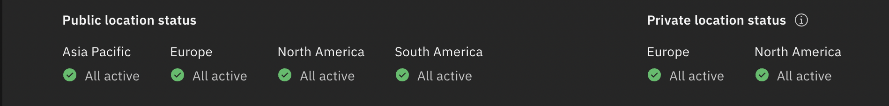

---

copyright:

  years: 2025
lastupdated: "2025-11-15"

keywords: cloud status, view cloud status, planned maintenance, RSS feed, unfied notifications, iaas notifications, classic infrastructure notifications, incident reports, MZR, private MZR, status page, status query, incident, maintenance, search query, notifications, view notifications, set notifications,

subcollection: account

---

{{site.data.keyword.attribute-definition-list}}

# Monitoring notifications and status
{: #viewing-cloud-status}

The {{site.data.keyword.cloud_notm}} [Status page](/status){: external} is the central place to find details about major incidents that affect the {{site.data.keyword.Bluemix}} platform and services. Other incidents, planned maintenance, announcements, release notes, and security bulletins are posted on the Notifications page, where you can easily view them.
{: shortdesc}

To get notified about key events that are specifically affecting your account, go to the [Notifications page](/notifications){: external}. The {{site.data.keyword.cloud_notm}} Notifications page is a centralized place to view and control all incidents, maintenance, announcements, and security bulletins. Events that are displayed on the Notifications page are ones that specifically impact users based on the preferences that the account owner or administrator sets. You can also view events from the past year that are now completed on the [History page](/status/history){: external}.

Pages specific to the {{site.data.keyword.cloud_notm}} classic infrastructure are deprecated. The Notifications page hosts all classic infrastructure notifications. You can view classic infrastructure history for planned and unplanned incidents and announcements on the Notifications page.
{: note}

## Viewing status
{: #view-status-page}

To view the Status page, complete the following steps:

1. In the {{site.data.keyword.cloud_notm}} console, click the **Notifications** icon  in the menu bar.
1. Click **View cloud status**.
1. From the side navigation pane, you can select to view planned maintenance, security bulletins, announcements, release notes, and history.

   To view planned maintenance and report outages for your account, you must be logged in to your authorized account.
   {: note}

   * Click **Planned maintenance** to see any upcoming scheduled maintenance.
   * Click **Security bulletins** to view a list of security bulletins that might affect various {{site.data.keyword.cloud_notm}} services or the platform.
   * Click **Announcements** to view a list of announcements that might be of general interest to you.
   * Click **Release notes** to view release entries for the last year.
   * Click **History** to view a list of completed events from the past year.

   If any issue occurs with the Status page, contact [{{site.data.keyword.cloud_notm}} Support](/unifiedsupport/supportcenter){: external}.
   {: note}

1. You can filter the lists by selecting specific components, locations, dates, types of ongoing events, or by using keyword searches. Click each item to get more details about the changes and why, and how they impact your environment.

## Advanced status search
{: #adv-search}

You can build URL search values by using query parameters from outside the console.

The following list includes examples of URL search options:

* Load the page with the Status tab selected: `console.cloud.ibm.com/status?selected=status`
* Load the page with the Planned maintenance tab selected: `console.cloud.ibm.com/status?selected=maintenance`
* Load the page with the Security bulletin tab selected: `console.cloud.ibm.com/status?selected=security`
* Load the page with the Announcements tab selected: `console.cloud.ibm.com/status?selected=announcement`
* Load the page with a search query entered: `console.cloud.ibm.com/status?selected=<selected>&query=<query>`
* Land on the page with filters selected. For example, you can set the geographic location to North America by using the following URL search: `console.cloud.ibm.com/status?selected=status&region=na`

* Use unique notification identifiers as a search parameter to go directly to the details for the notification. For example, `query=INC1000001` targets items with the ID: `INC1000001`. In this example, `INC1000001` is the case number for a maintenance notification.

### URL query filters:
{: #url-query}

The following table provides information on URL query filters that you can use to search across all tabs on the status page.

| URL Query Parameter | Description                                                                                                                         | Values                      |
|---------------------|-------------------------------------------------------------------------------------------------------------------------------------|-----------------------------|
| `?type`             | A filter that applies only to the Status tab. Use the `?type` query to filter the Status tab by incidents or maintenance.           | `=incident`, `=maintenance` |
| `?region`           | Filter the page by geographic location.                                                                                             | `=na`, `=eu`, `=sa`, `=ap`  |
| `?component`        | Filter the page by {{site.data.keyword.cloud_notm}} components. For example, you might filter by a service you are interested in. | Applies to most global catalog IDs; for example, `?component=iotf-service` filters the page and display events that affect Internet of Things Platform |
{: caption="URL query filters" caption-side="top"}

You can always use the **Filter by** filters, and then copy or bookmark the URL query that is generated. The filters are displayed in your URL and can help you build future queries.
{: tip}

## Viewing the status of a dedicated multizone region (MZR)
{: #view-private-mzr}

As a user in an account that has access to a dedicated [MZR](#x9774820){: term}, you are able to view incidents, planned maintenance, security bulletins, and announcements that are related to the resources within that MZR in addition to the public regions on the {{site.data.keyword.cloud_notm}} Status page. Also, on the History page, users in the account can view past status-related items that impact the dedicated MZR.

To view the status of a dedicated MZR, complete the following steps:

1. In the {{site.data.keyword.cloud_notm}} console, click the **Notifications** icon  in the menu bar.
1. Click **View cloud status**.
1. Select from the services that are available within the dedicated MZR to view the status of the MZR in the **Private location status** section. To view planned maintenance, security bulletins and announcements that are related only to your dedicated MZR, use the location filter on the appropriate page.

If an incident occurs that affects the dedicated MZR, you can see the following status on the {{site.data.keyword.cloud_notm}} Status page, which shows you the continent where your private MZR is located, and the status of your private region:

{: caption="An example of the Status page when there is an active incident that affects the dedicated MZR" caption-side="bottom"}

If no active incident occurs that affects the dedicated MZR, you can see the following status on the {{site.data.keyword.cloud_notm}} Status page:

{: caption="An example of the Status page when there is no incident that affects the dedicated MZR" caption-side="bottom"}

## Subscribing to an RSS feed
{: #subscribing-rss-feed}

You can stay up to date about the events by subscribing to the RSS feed for the [Status page](https://cloud.ibm.com/status){: external}. Ongoing incidents or planned maintenance windows that impact a finite set of accounts do not display on the Status page.

{{site.data.keyword.cloud_notm}} typically has approximately 50 updates per month.
{: note}

To subscribe to the {{site.data.keyword.cloud_notm}} Notifications RSS feed, complete the following steps:

1. Access your RSS reader.
1. Copy and paste the feed URL into your RSS reader.
    ```sh
    https://cloud.ibm.com/status/api/notifications/feed.rss
    ```
    {: pre}

1. Optional: Apply notification filters and rules if your reader supports them.

## Checking incident reports
{: #status-incident-report}

The {{site.data.keyword.cloud_notm}} [Incident reports page](/status/incident-reports){: external} provides a way for you to review technical details of major outages for {{site.data.keyword.cloud_notm}} services. These Customer Incident Reports (CIR) provide Root Cause Analysis (RCA), which is a problem-solving process that is used for identifying the root causes of an incident and describing the problem. They are publicly available for all major outages.

You can view and download the incident reports from the service health dashboard about any events that affect {{site.data.keyword.cloud_notm}} availability.

The downloadable reports are in PDF file formats. These reports are available for 5 years starting from the date when the event occurred.
{: note}

The events can be region-specific, global, or they might have an unspecified location.

To view the incident reports page and check RCAs, complete the following steps:

1. In the {{site.data.keyword.cloud_notm}} console, click the **Notifications** icon  in the menu bar.
1. Click **View cloud status**.
1. Select **Incident reports**.
1. See the table for the incident reports and click the **Download** icon  to download each report.

## Viewing notifications
{: #view-notifications}

Access essential account information by clicking the **Notifications** icon  in the console menu bar. To help you stay up to date with the latest announcements, maintenance plans, and other impacts to your account experience, a visual indicator is displayed next to the icon when a new notification is available.
  
Notifications are scoped to the specific account in which you are working. Use the list of accounts that's displayed in the console menu bar to view notifications related to other accounts you have access to.
{: tip}

* The severity or impact is listed for each notification and will vary by type.
* To access a specific notification, search or filter by notification type. To access the scoped view in the future, make sure you save the URL after your search or filter options are applied.
* Navigate to a specific notification by using the unique URL that's associated with each notification. You can save and share the URL with users in the account.
* To receive future updates about a specific type of notification, click the **Email** icon that's displayed next to each notification item in the list.

### Notification types
{: #notification-types}

The following table describes the different types of notifications that are displayed.

| Notification Type | Description |
|-------------------|-------------|
| Planned maintenance | Scheduled maintenance that is required to keep the {{site.data.keyword.cloud_notm}} platform and infrastructure operating at optimal status. |
| Security bulletins | Announcements about security vulnerabilities and the required actions. |
| Announcements | Updates on new infrastructure features and services in {{site.data.keyword.cloud_notm}}. |
| Incidents | Unexpected impacting events that can cause an outage or restrict functionality. |
| Account | Invitation email, or console notifications for inviting users to the {{site.data.keyword.cloud_notm}} platform.  |
{: caption="Notification types" caption-side="top"}

## Viewing impacted devices
{: #viewing-impacted-devices}

Identify which of your devices are affected by the scheduled or ongoing maintenance activity in {{site.data.keyword.cloud_notm}}.

To obtain a list of devices impacted under the maintenance activity, complete the following steps: 

1. Log in to {{site.data.keyword.cloud_notm}} by using your credentials. 
1. Click the **Notifications** icon  to view a list of open and completed maintenance's for your account in the past 30 days. 

You can directly go to the maintenance notification page through [{{site.data.keyword.cloud_notm}} Notifications](https://cloud.ibm.com/notifications){: external}
{: note}

1. Select the maintenance activity, and click **View all affected instances** to get a list of all your devices that are being impacted under maintenance.

## Subscribing to email notifications
{: #subscring-email-notifications}

You can select whether to receive email notifications about {{site.data.keyword.cloud_notm}} platform-related items, such as announcements, billing and usage, additional notification preferences, and ordering. Or, about resource-related items, such as incidents, maintenance, security bulletins, and resource activity. Additionally, if you have a Pay-As-You-Go or Subscription account, you can choose whether to receive {{site.data.keyword.cloud_notm}} infrastructure service updates about changes, such as OS reloads, assigned IPs, and image and firmware updates. For more information, see [Setting email preferences for notifications](/docs/account?topic=account-email-prefs).

You cannot set email preferences for receiving account type notifications. On the {{site.data.keyword.cloud_notm}} Notifications page, you can use the search field to locate an invitation or filter by the notification type called account.

Users already present in {{site.data.keyword.cloud_notm}} receives an email and a notification with an invitation link. If an email address does not correspond to a known user in {{site.data.keyword.cloud_notm}}, an invitation email gets sent to accept, but users can also choose not to accept the invitation. For more information, see [Inviting users to an account](/docs/account?topic=account-iamuserinv).

The invitations expire after 30 days. New users to {{site.data.keyword.cloud_notm}} can accept an invitation only by using the invitation link that they received through email.
{: note}

## Checking the delivery status of email notifications and viewing email history
{: #view-email-history}

On the [Communication history page](/messaging){: external}, you can check the status of all email notifications that are sent to you, and you can verify whether the emails are delivered successfully. You can also view the last 90 days of {{site.data.keyword.cloud_notm}} email history, which can help you save time by troubleshooting any delivery issues without you having to contact {{site.data.keyword.IBM_notm}} support.

To view your email notification history and check the delivery status of an {{site.data.keyword.cloud_notm}} email, complete the following steps:

1. In the {{site.data.keyword.cloud_notm}} console, click the **Notifications** icon  in the menu bar.
1. Click **Actions > View communication history**.
1. In the **Subject** field, enter any keyword that applies to the email that you want to check.
1. Specify the date range of the email notification, and click **Submit**.
1. Filter the email notifications by the delivery status:
   * Select **Delivered** to find emails that were successfully delivered to you.
   * Select **Not delivered** to find emails that were sent to you, but weren't delivered successfully.
   * Select **All** to find both delivered and not delivered emails with the same subject.

## Getting advanced notice for disruptive maintenance
{: #disruptive-maintenance}

{{site.data.keyword.cloud_notm}} tries to limit disruptive, required maintenance for Platform as a Service (PaaS), Infrastructure as a Service (IaaS), and Software as a Service offerings. Most maintenance is done in a nondisruptive manner to avoid the impact to your business, but when disruptive maintenance is necessary, we provide as much advanced notice as possible.

### Iaas
{: #iaas}

For IaaS offerings, {{site.data.keyword.cloud_notm}} provides advanced notice that's dependent on the severity of the impact. The following table defines the types and levels of the possibility of an impact.

| Possibility of impact | Definition | Advanced Notice Guidelines |
|-----------------------|------------|----------------------------|
| Emergency             | Customer Impacting Event (CIE) | a minimum of 24 hours |
| High                  | Certain, likely, or has the potential to cause an extended or brief service disruption. | a minimum of 30 days |
| Low                   | None to negligible chance of a disruption or routine change. No assumed risk or a disruption that is isolated to a single customer. | offering-specific |
{: caption="IaaS offerings impact possibility definitions" caption-side="top"}

### PaaS
{: #paas}

For PaaS offerings, IBM Cloud provides advanced notice that's dependent on the severity of the impact. The following table defines the types and levels of the possibility of an impact.

| Possibility of impact | Definition | Advanced Notice Guidelines |
|-----------------------|------------|----------------------------|
| Emergency             | Customer Impacting Event (CIE) | a minimum of 24 hours |
| Disruptive            | Certain, likely, or has the potential to cause an extended or brief service disruption. | a minimum of 30 days |
| Nondisruptive                | None to negligible chance of a disruption or routine change. No assumed risk or a disruption that is isolated to a single customer. | None |
{: caption="PaaS offerings impact possibility definitions" caption-side="top"}

### SaaS
{: #saas}

For SaaS offerings, IBM Cloud provides advanced notice that's dependent on the severity of the impact. The following table defines the types and levels of the possibility of an impact.

| Possibility of impact | Definition | Advanced Notice Guidelines |
|-----------------------|------------|----------------------------|
| Emergency             | Customer Impacting Event (CIE) | a minimum of 24 hours |
| Disruptive            | Certain, likely, or has the potential to cause an extended or brief service disruption. | a minimum of 7 days |
| Nondisruptive                | None to negligible chance of a disruption or routine change. No assumed risk or a disruption that is isolated to a single customer. | None |
{: caption="SaaS offerings impact possibility definitions" caption-side="top"}
