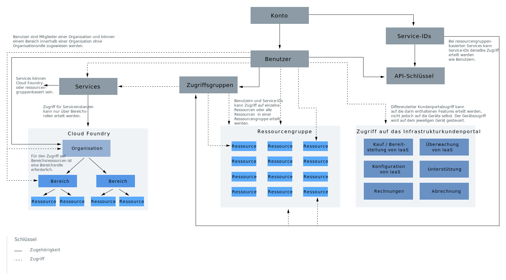

---

copyright:
  years: 2019
lastupdated: "2019-06-19"

keywords: IBM Cloud account, account differences, account overview, account components, how access works

subcollection: account

---

{:shortdesc: .shortdesc}
{:codeblock: .codeblock}
{:screen: .screen}
{:tip: .tip}
{:new_window: target="_blank"}

# Was ist in einem Konto enthalten?
{: #overview}

Das {{site.data.keyword.Bluemix}}-Konto umfasst zahlreiche Komponenten und Systeme, die interagieren. Konzepte wie z. B. die Vorgehensweise zum Verbinden von Komponenten oder wie der Zugriff funktioniert, geben Ihnen eine Verständnisgrundlage für das Einrichten Ihres Kontos.
{:shortdesc}

Abbildung 1. Kontokomponenten und -systeme

Das Diagramm enthält zwei Hauptkonzepte für die Komponenten in der Kontohierarchie, die von zentraler Bedeutung sind. Mithilfe der durchgezogenen und der gepunkteten Linien wird dargestellt, dass einige Komponenten in anderen Komponente enthalten sind. Ein Beispiel hierfür sind Benutzer, die zu Zugriffsgruppen oder Cloud Foundry-Organisationen hinzugefügt werden. Einige Komponenten interagieren jedoch mit anderen Komponenten, um Zugriff zu ermöglichen, nicht weil eine Zugehörigkeit besteht. Ein Beispiel hierfür sind Benutzer, die Zugriff auf Ressourcengruppen erhalten. Die Benutzer sind jedoch keine Mitglieder einer Ressourcengruppe wie sie beispielsweise Mitglieder einer Zugriffsgruppe sind. Diese Konzepte werden auch in den folgenden Abschnitten erläutert.

<dl>
<dt>Benutzer</dt>
<dd>Benutzer werden zum Konto eingeladen und erhalten Zugriff auf die Ressourcen im Konto.</dd>
<dt>Service-IDs</dt>
<dd>Eine Service-ID dient (ähnlich wie eine Benutzer-ID, die einen Benutzer identifiziert) zur Identifikation eines Service oder einer Anwendung. Sie können eine von Ihnen erstellte Service-ID dazu verwenden, einer Anwendung außerhalb von {{site.data.keyword.Bluemix_notm}} den Zugriff auf Ihre Services zu erteilen. Sie können der Service-ID spezielle Zugriffsrichtlinien zuweisen, die die Berechtigungen zur Verwendung bestimmter Services einschränken, oder auch die Berechtigungen für den Zugriff auf unterschiedliche Services kombinieren. Da Service-IDs nicht an bestimmte Benutzer gebunden sind, bleibt die Service-ID bestehen, wenn der zugehörige Benutzer Ihre Organisation verlässt und sein Konto deshalb gelöscht wird. Auf diese Weise wird sichergestellt, dass Ihre Anwendung oder Ihr Service weiterhin funktionsbereit bleibt. Weitere Informationen finden Sie in [Service-IDs erstellen und verwenden](/docs/iam?topic=iam-serviceids#serviceids).</dd>
<dt>Serviceinstanzen oder Ressourcen</dt>
<dd>Services in {{site.data.keyword.Bluemix_notm}} sind entweder ressourcengruppenbasiert oder Cloud Foundry-basiert. Serviceinstanzen, die zu einer Ressourcengruppe hinzugefügt und mithilfe von {{site.data.keyword.Bluemix_notm}} Identity and Access Management (IAM) verwaltet werden können, werden als Ressourcen bezeichnet. Serviceinstanzen, die zu Cloud Foundry-Organisationen und -Bereichen hinzugefügt werden, werden mithilfe eines anderen Zugriffsmanagementsystems über Cloud Foundry-Rollen verwaltet. Weitere Informationen finden Sie in [Was ist eine Ressource?](/docs/resources?topic=resources-resource#resource)</dd>
<dt>API-Schlüssel</dt>
<dd>Bei einem API-Schlüssel handelt es sich um einen eindeutigen Code, der in eine API eingegeben wird, um die aufrufende Anwendung oder den aufrufenden Benutzer zu identifizieren. Sie können Plattform-API-Schlüssel verwenden, die mit Benutzeridentitäten verknüpft sind, und Sie können andere API-Schlüssel für Service-IDs erstellen. Weitere Informationen finden Sie in [Informationen zu API-Schlüsseln](/docs/iam?topic=iam-manapikey#manapikey).</dd>
<dt>Zugriffsgruppen</dt>
<dd>Sie können eine Zugriffsgruppe erstellen, um eine Reihe von Benutzern und Service-IDs in einer einzelnen Entität zusammenzufassen und das Zuweisen von Berechtigungen zu vereinfachen. Sie können der Gruppe eine einzige Richtlinie zuweisen, anstatt denselben Zugriff mehrmals für den einzelnen Benutzer oder die einzelne Service-ID zuzuweisen. Weitere Informationen finden Sie in [Zugriffsgruppen einrichten](/docs/iam?topic=iam-groups#groups).</dd>
<dt>Ressourcengruppen</dt>
<dd>Ressourcengruppen bieten Ihnen die Möglichkeit, Ihre Kontoressourcen in anpassbaren Gruppierungen zu organisieren, sodass Sie den Benutzern schnell Zugriff auf mehrere Ressourcen gleichzeitig zuordnen können. Jede Kontoressource, die mithilfe der IAM-Zugriffssteuerung verwaltet wird, gehört einer Ressourcengruppe innerhalb Ihres Kontos an. Benutzer werden nicht zu Ressourcengruppen hinzugefügt. Sie erhalten jedoch Zugriff auf die darin enthaltenen Ressourcen oder können die Ressourcengruppe verwalten. Benutzer, die Verwaltungszugriff auf die Ressourcengruppe erhalten, können neue Instanzen innerhalb der Gruppe erstellen, den Zugriff anderer Benutzer steuern, die mit der Gruppe arbeiten, oder den Gruppennamen auf der Basis der zugewiesenen IAM-Rolle bearbeiten. Weitere Informationen finden Sie in [Ressourcengruppen verwalten](/docs/resources?topic=resources-rgs#rgs) und [Bewährte Verfahren für die Organisation von Ressourcen in Ressourcengruppen](/docs/resources?topic=resources-bp_resourcegroups#bp_resourcegroups).</dd>
<dt>Cloud Foundry-Organisationen</dt>
<dd>Als Kontoeigner oder Organisationsmanager können Sie Organisationen und Bereiche über die Seite 'Cloud Foundry-Organisationen' in der Konsole hinzufügen. Services, die die Verwendung von Cloud Foundry-Organisationen und -Bereichen unterstützen, werden zu einer Organisation und einem Bereich hinzugefügt, wenn Sie sie über den Katalog erstellen. Organisationen enthalten Benutzer, Domänen und Kontingente. Innerhalb der einzelnen Organisationen werden Bereiche hinzugefügt, die die Serviceinstanzen enthalten. Weitere Informationen finden Sie in [Organisationen und Bereiche hinzufügen](/docs/account?topic=account-orgsspacesusers#orgsspacesusers).</dd>
<dt>Cloud Foundry-Bereiche</dt>
<dd>Innerhalb einer Organisation können Sie Bereiche verwenden, um eine Reihe von Anwendungen, Services und Benutzern zu gruppieren. Bereiche sind an eine bestimmte Region in {{site.data.keyword.Bluemix_notm}} gebunden. Sie können auf der Basis des Bereitstellungslebenszyklus Bereiche in einer Organisation erstellen. Sie können z. B. einen Bereich 'dev' als Entwicklungsumgebung, einen Bereich 'test' als Testumgebung und einen Bereich 'production' als Produktionsumgebung erstellen. Anschließend können Sie Ihre Apps den Bereichen zuordnen. Weitere Informationen finden Sie in [Organisationen und Bereiche hinzufügen](/docs/account?topic=account-orgsspacesusers#orgsspacesusers).</dd>
</dl>

Ein weiterer wichtiger Aspekt des vorherigen Diagramms ist die Darstellung der drei Zugriffsverwaltungssystemtypen, die verwendet werden können, um Kontobenutzern Zugriff auf Ressourcen innerhalb des Kontos zu ermöglichen.

  * [IAM-Zugriffsrollen](/docs/iam?topic=iam-userroles#iamusermanrol) können dazu verwendet werden, Benutzern Zugriff auf alle Ressourcen zu ermöglichen, die zu einer Ressourcengruppe gehören. Diese Zugriffsrollen werden auch dazu verwendet, Benutzern Zugriffsberechtigungen zu erteilen, mit denen sie Ressourcengruppen verwalten und neue Serviceinstanzen erstellen können, die einer Ressourcengruppe zugewiesen werden.
  * [Cloud Foundry-Organisations- und -Bereichsrollen](/docs/iam?topic=iam-cfaccess#cfroles) können dazu verwendet werden, Benutzern Zugriff auf Serviceinstanzen zu ermöglichen, die sich in einem Cloud Foundry-Bereich befinden.
  * Berechtigungen der klassischen Infrastruktur können dazu verwendet werden, Benutzern differenziertere [Berechtigungen](/docs/iam?topic=iam-infrapermission#infrapermission) für die klassische Infrastruktur zu erteilen. Gerätezugriff und VPN-Teilnetzzugriff werden separat zugewiesen.
