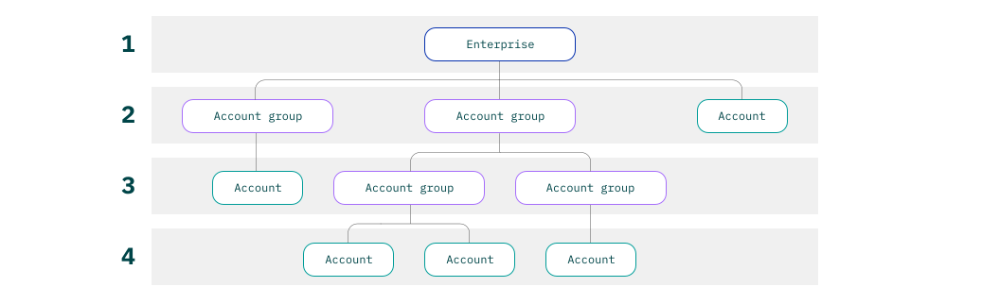

---

copyright:
  years: 2019
lastupdated: "2019-07-25"

keywords: enterprise, create account group, organize accounts, move accounts

subcollection: account

---

{:shortdesc: .shortdesc}
{:new_window: target="_blank"}
{:codeblock: .codeblock}
{:important: .important}
{:tip: .tip}
{:note: .note}

# Konten in einem Unternehmen organisieren
{: #enterprise-organize}

Sie können Kontogruppen verwenden, um zusammengehörige Konten in Ihrem {{site.data.keyword.Bluemix}}-Unternehmen zu organisieren. Sie können eine Unternehmenshierarchie mit mehreren Ebenen erstellen, indem Sie Kontogruppen innerhalb einer Kontogruppe verschachteln. Bei Bedarf ist auch eine Reorganisation möglich; in diesem Fall können Sie Konten zwischen den Kontogruppen verschieben.
{:shortdesc}

Das folgende Diagramm zeigt zum Beispiel ein Unternehmen mit vier Ebenen, das Sie durch das Verschachteln von Kontogruppen einrichten können. Zuerst erstellen Sie zwei Kontogruppen, die das Unternehmen als übergeordnetes Element haben. Anschließend können Sie zwei zusätzliche Kontogruppen erstellen, denen eine dieser Kontogruppen übergeordnet ist. Sie können Konten innerhalb der Kontogruppen frei verschieben, egal, auf welcher Ebene sie sich befinden. Kontogruppen können jedoch nicht verschoben werden.



Die Art und Weise, wie Sie Ihr Unternehmen organisieren, hat einen Einfluss darauf, wie Sie die Nutzungskosten verfolgen können. Weitere Informationen finden Sie unter [Abrechnung und Nutzung zentral mit Unternehmen verwalten](/docs/billing-usage?topic=billing-usage-enterprise).
{: tip}

## Kontogruppen erstellen
{: #create-account-group}

Zum Erstellen einer Kontogruppe benötigen Sie die Rolle "Administrator" oder "Bearbeiter" für den Unternehmensservice im Unternehmenskonto.

1. Klicken Sie im Dashboard für das Unternehmen auf **Konten**, um die Konten und Kontogruppen im Unternehmen anzuzeigen.
1. Klicken Sie im Abschnitt "Kontogruppen" auf **Erstellen**.
1. Geben Sie einen Namen für die Kontogruppe ein, der auf die Konten Bezug nimmt, die sie enthalten soll. Beispiele zum Organisieren von Konten finden Sie unter [Wie kann ich ein Unternehmen verwenden?](/docs/account?topic=account-enterprise#enterprise-use-cases).
1. Wenn Sie einen anderen Unternehmensbenutzer als sich selbst zum primären Kontakt für die Kontogruppe bestimmen möchten, wählen Sie im Menü **Kontakt** die IBMid des betreffenden Benutzers aus. Wenn sich ein Benutzer, den Sie als Kontakt zuordnen möchten, nicht im Unternehmen befindet, laden Sie ihn zunächst für das Unternehmenskonto ein. Der Kontakt kann nicht geändert werden, nachdem Sie die Kontogruppe erstellt haben. Weitere Informationen finden Sie unter [Benutzer einladen](/docs/iam?topic=iam-iamuserinv).

   Der Kontakt unterscheidet sich von einem Kontoeigner dadurch, dass er keinen zusätzlichen Zugriff innerhalb der Kontogruppe oder der zugehörigen Konten hat. Der Benutzer, den Sie als Kontakt auswählen, fungiert als Ansprechpartner für alle im Zusammenhang mit der Kontogruppe auftretenden Probleme. Wenn ein Finanzverantwortlicher beispielsweise feststellt, dass die Nutzungskosten der Kontogruppe höher als erwartet ausfallen, kann er sich an den Ansprechpartner für die Kontogruppe wenden.


1. Wenn die Kontogruppe in einem anderen Teil Ihrer Unternehmenshierarchie enthalten sein soll, wählen Sie ein anderes übergeordnetes Element aus.

  Kontogruppen können von dort, wo Sie sie erstellen, weder gelöscht noch verschoben werden.
  {: note}
1. Klicken Sie auf **Erstellen**.

Wenn Sie eine neue Ebene in Ihrer Unternehmenshierarchie erstellen möchten, erstellen Sie neue Kontogruppen innerhalb der Kontogruppe. Sie können Konten, die sich bereits im Unternehmen befinden, in die Kontogruppe verschieben, oder Sie können Konten in sie importieren oder in ihr erstellen. Weitere Informationen zum Importieren und Erstellen von Konten finden Sie unter [Konten zu einem Unternehmen hinzufügen](/docs/account?topic=account-enterprise-add).

### Kontogruppen über die Befehlszeilenschnittstelle erstellen
{: #create-account-groups-cli}

Sie können eine Kontogruppe erstellen, indem Sie den folgenden Befehl ausführen. Wenn Sie eine Kontogruppe in einer anderen Kontogruppe verschachteln möchten, geben Sie den Namen der Kontogruppe in der Option `--parent-account-group` an. Wenn Sie möchten, dass ein anderer Benutzer der Kontakt für die Kontogruppe wird, geben Sie die entsprechende IBMid für die Option `--primary-contact-id` an.

```
ibmcloud enterprise account-group-create NAME
[--parent-account-group ACCOUNT_GROUP_NAME] [--primary-contact-id USER_ID]
```
{: codeblock}

### Kontogruppen über die Anwendungsprogrammierschnittstelle erstellen
{: #create-account-groups-api}

Sie können programmgesteuert eine Kontogruppe im Unternehmen erstellen, indem Sie die Unternehmensverwaltungs-API aufrufen. 

Die folgende Beispielanforderung erstellt eine Kontogruppe direkt unter der Unternehmensebene. Wenn Sie die API aufrufen, ersetzen Sie die ID-Variablen durch die Werte aus Ihrem Unternehmen. Wenn Sie die Kontogruppe in einer anderen Kontogruppe verschachteln möchten, geben Sie die ID der Kontogruppe im Cloudressourcennamen (Cloud Resource Name, CRN) im folgenden Format ein: `crn:v1:bluemix:public:enterprise::a/$ENTERPRISE_ACCOUNT_ID::account-group:$ACCOUNT_GROUP_ID`.

```
curl -X POST \
"https://enterprise.cloud.ibm.com/v1/account-groups \
-H "Authorization: Bearer <IAM_Token>" \
-H 'Content-Type: application/json' \
-d '{
  "parent": "crn:v1:bluemix:public:enterprise::a/$ENTERPRISE_ACCOUNT_ID::enterprise:$ENTERPRISE_ID",
  "name": "Sample Account Group",
  "primary_contact_iam_id": "IBMid-0123ABC"
}'
```
{: codeblock}

Detaillierte Informationen zur API finden Sie in [Unternehmensverwaltungs-API](https://{DomainName}/apidocs/enterprise-apis/enterprise#create-an-account-group){: external}.

## Konten innerhalb des Unternehmens verschieben
{: #move-accounts}

Sie können Konten überall in Ihrem Unternehmen verschieben. Sie können beispielsweise ein Konto aus einer unteren Kontogruppe in die ihr übergeordnete Kontogruppe oder direkt unter das Unternehmen verschieben. Konten können nur innerhalb des Unternehmens verschoben werden. Sie können nicht in ein anderes Unternehmen verschoben oder aus dem Unternehmen entfernt werden, um so ein eigenständiges Konto zu werden.

Um ein Konto zu verschieben, benötigen Sie die Rolle "Administrator" für den Abrechnungsservice im Unternehmenskonto und die Rolle "Bearbeiter" oder "Administrator" für das gesamte Unternehmen oder sowohl für die Ausgangs- als auch die Zielkontogruppe.

1. Klicken Sie im Dashboard für das Unternehmen auf **Konten**.
1. Klicken Sie im Abschnitt 'Konten' auf das Symbol 'Aktionen' in der Zeile für das Konto und wählen Sie **Konto verschieben** aus.
1. Wählen Sie das neue übergeordnete Element für das Konto aus und klicken Sie auf **Speichern**.

### Konto über die Befehlszeilenschnittstelle verschieben
{: #move-accounts-cli}

1. Sie können den Namen und die ID eines Kontos suchen, indem Sie alle Konten in Ihrem Unternehmen auflisten.

   ```
   ibmcloud enterprise accounts --recursive
   ```
   {: codeblock}
1. Wenn Sie das Konto in eine Kontogruppe verschieben, suchen Sie den Namen und die ID der Kontogruppe.

   ```
   ibmcloud enterprise account-groups
   ```
   {: codeblock}
1. Verschieben Sie das Konto, indem Sie das neue übergeordnete Element in der zugehörigen Option angeben.

   Wenn Sie das Konto in eine Kontogruppe verschieben möchten, geben Sie den Namen der Kontogruppe in der Option `--parent-account-group` an.

   ```
   ibmcloud enterprise account-move -n NAME --parent-account-group ACCOUNT_GROUP_NAME
   ```
   {: codeblock}

   Um das Konto direkt unter das Unternehmen zu verschieben, geben Sie die Option `--parent-enterprise` an.

   ```
   ibmcloud enterprise account-move -n NAME --parent-enterprise
   ```
   {: codeblock}

### Konten über die Anwendungsprogrammierschnittstelle (API) verschieben
{: #move-account-api}

Sie können ein Konto verschieben, indem Sie die Unternehmensverwaltungs-API aufrufen, wie in der folgenden Beispielanforderung dargestellt. Ersetzen Sie das IAM-Token und die ID-Variablen durch die Werte aus Ihrem Unternehmen.

```
curl -X PATCH \
"https://enterprise.cloud.ibm.com/v1/accounts/$ACCOUNT_ID" \
-H "Authorization: Bearer <IAM_Token>" \
-H 'Content-Type: application/json' \
-d '{
  "parent": crn:v1:bluemix:public:enterprise::a/$ENTERPRISE_ACCOUNT_ID::account-group:$ACCOUNT_GROUP_1"",
}'
```
{: codeblock}

Detaillierte Informationen zur API finden Sie in [Unternehmensverwaltungs-API](https://{DomainName}/apidocs/enterprise-apis/enterprise#move-an-account-with-the-enterprise){: external}.
