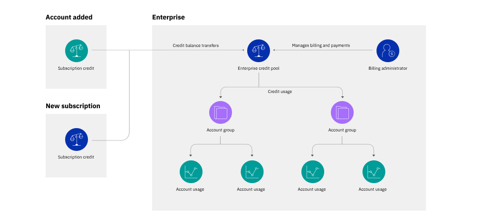

---

copyright:
  years: 2019
lastupdated: "2019-07-25"

keywords: enterprise, enterprise account, multiple accounts, organization, hierarchy

subcollection: account

---

{:shortdesc: .shortdesc}
{:new_window: target="_blank"}
{:codeblock: .codeblock}
{:important: .important}
{:tip: .tip}
{:note: .note}

# Was ist ein Unternehmen?
{: #enterprise}

In {{site.data.keyword.Bluemix}} bieten sogenannte Unternehmen (Enterprises) die Möglichkeit, die Abrechnung und Ressourcennutzung über mehrere Konten hinweg zentral zu verwalten. In einem Unternehmen können Sie eine Kontenhierarchie mit mehreren Ebenen erstellen - einschließlich Abrechnung und Zahlungen für alle Konten, die auf Unternehmensebene verwaltet werden.
{:shortdesc}

Im Vergleich zur Verwendung mehrerer eigenständiger Konten bieten Unternehmen folgende Vorteile:
- Zentralisierte Kontoverwaltung: Sie können Ihre gesamte Unternehmenshierarchie auf einen Blick anzeigen, ohne zwischen Konten wechseln zu müssen. Sie können vorhandene Konten hinzufügen oder neue Konten direkt im Unternehmen erstellen.
- Konsolidierte Abonnementabrechnung: Sie können Ihre Abonnements und die Ausgaben von Guthaben für alle Konten in einer einzelnen Ansicht verfolgen. Ihr Abonnementguthaben wird in einem Pool zusammengefasst und von den Konten im Unternehmen gemeinsam genutzt.
- Nutzungsberichte mit ansteigendem Detaillierungsgrad: Von Ihrem Unternehmenskonto aus können Sie die Nutzung aller Konten in Ihrem Unternehmen anzeigen (organisiert nach Kontogruppe).

## Unternehmenshierarchie
{: #enterprise-hierarchy}

Ein Unternehmen besteht im Prinzip aus drei Hauptbausteinen:
- Dem Unternehmenskonto, das allen anderen Konten im Unternehmen übergeordnet ist. Das Unternehmenskonto verwaltet die Abrechnung für das gesamte Unternehmen, wobei die Nutzungskosten aus allen Konten zusammengefasst und aus dem Unternehmenskonto bezahlt werden.
- Kontogruppen, die Sie zum Organisieren der zugehörigen Konten verwenden können. Kontogruppen können selbst keine Ressourcen enthalten, aber Sie können die Kosten für die Ressourcennutzung anhand der Konten sehen, die sie enthalten.
- Konten, die genauso wie eigenständige {{site.data.keyword.Bluemix_notm}}-Konten Ressourcen und Ressourcengruppen, Cloud Foundry-Organisationen und -Bereiche sowie unabhängige Zugriffsberechtigungen enthalten. Ein wesentlicher Unterschied besteht jedoch darin, dass die einzelnen Konten in einem Unternehmen die eigene Abrechnung oder die eigenen Zahlungen nicht selbst verwalten, da diese auf der Ebene des Unternehmenskontos bearbeitet werden.

Sie erstellen Ebenen in Ihrem Unternehmen, indem Sie eine Kontogruppe innerhalb einer anderen Kontogruppe verschachteln.

Ein Unternehmen kann bis zu zehn Ebenen von Konten und Kontogruppen enthalten. In seiner einfachsten Form hat ein Unternehmen zwei Ebenen: Das Unternehmenskonto und ein einzelnes untergeordnetes Konto.

Ihre Unternehmensstruktur ist flexibel, kann erweitert werden und sich entsprechend Ihren Anforderungen ändern. Sie können Kontogruppen hinzufügen und entfernen und Konten zwischen Kontogruppen verschieben. Wenn sich der Zweck einer Kontogruppe ändert, können Sie sie umbenennen, damit die Bezeichnung den enthaltenen Konten besser entspricht.

## Konsolidierte Abrechnung
{: #enterprise-billing}

In einem Unternehmen erfolgt die gesamte Abrechnung über das übergeordnete Unternehmenskonto. Unternehmen erfordern eine [Abonnementabrechnung](/docs/account?topic=account-accounts#subscription-account), d. h. Sie erwerben ein Abonnement für ein bestimmtes Guthaben, das während der Laufzeit des Abonnements ausgegeben wird, und die Nutzung wird vom Abonnementguthaben zu einem ermäßigten Satz abgezogen. Das Abonnementguthaben sowie Guthaben aus Werbeaktionen werden dem Guthabenpool des Unternehmens hinzugefügt, der von allen Konten im Unternehmen gemeinsam genutzt wird. Da Konten Ressourcen verwenden, wird Guthaben aus dem Guthabenpool ausgegeben.

Da die Abrechnung konsolidiert wird, vereinfachen Unternehmen die Rechnungsstellung und die Zahlungen über mehrere Konten hinweg mit den folgenden Vorteilen:
* Ein Guthabenpool von Abonnements, die sich über mehrere Konten erstrecken, sodass Sie Ihre Abonnements für Ihre gesamte Nutzung und nicht für die Nutzung pro Konto auslegen können
* Nur eine Rechnung für die gesamte Nutzung im Unternehmen, sodass die Kosten leichter nachvollziehbar sind
* Ein zentraler Ort zur Verwaltung der Zahlungsmethoden, sodass alle Konten gleichzeitig aktualisiert werden

Weitere Informationen finden Sie unter [Abrechnung und Nutzung zentral mit Unternehmen verwalten](/docs/billing-usage?topic=billing-usage-enterprise).

## Ressourcenmanagement
{: #enterprise-resources}

Ressourcen und Services in einem Unternehmen funktionieren genauso wie in eigenständigen Konten. Jedes Konto in einem Unternehmen kann Ressourcen in Ressourcengruppen und Services in Cloud Foundry-Organisationen und -Bereichen enthalten. Kontogruppen können keine Ressourcen enthalten. Weitere Informationen finden Sie unter [Mit Ressourcen und Services arbeiten](/docs/resources?topic=resources-resource).

Wie bei allen Konten sind die Ressourcen an die Ressourcengruppe und das Konto gebunden, in dem sie erstellt wurden. Daher können sie nicht zwischen den Konten im Unternehmen verschoben werden. Aufgrund der flexiblen Kontenstruktur des Unternehmens können Sie jedoch Ressourcen innerhalb des Unternehmens verschieben, indem Sie die Konten verschieben, die sie enthalten.

## Nutzungsberichte mit ansteigendem Detaillierungsgrad
{: #enterprise-usage}

Über das Unternehmenskonto können Sie die Ressourcennutzung von allen Konten im Unternehmen anzeigen. Ausgehend von der Unternehmensebene sehen Sie die geschätzten Nutzungskosten, die nach Konto und Kontogruppen aufgeschlüsselt sind. Sie können innerhalb der Unternehmensstruktur nach unten navigieren, um die Kosten innerhalb der einzelnen Ebenen anzuzeigen. Auf der Kontoebene können die Benutzer des Unternehmens die Kosten für jeden Ressourcentyp oder Service im Konto anzeigen.

Da der Zugriff im Unternehmen vom Zugriff in jedem Konto getrennt ist, können Unternehmensbenutzer Ressourcen innerhalb der untergeordneten Konten nicht automatisch erstellen oder verwalten. Entsprechend können Benutzer in jedem Konto weiterhin ihre frühere und aktuelle Nutzung über die Seite "Nutzung" anzeigen, unabhängig davon, ob sie über einen Unternehmenszugriff verfügen.

Weitere Informationen finden Sie unter [Nutzung in einem Unternehmen anzeigen](/docs/billing-usage?topic=billing-usage-enterprise-usage).

## Isoliertes Benutzer- und Zugriffsmanagement
{: #enterprise-access}

Bei Unternehmen sind die Benutzer- und Zugriffsverwaltung zwischen dem Unternehmen und seinen untergeordneten Konten getrennt, um die Sicherheit Ihrer Kontendaten zu erhöhen. Die Benutzer und der ihnen zugewiesene Zugriff auf das Unternehmenskonto sind vollständig von denen in den untergeordneten Konten isoliert und es wird kein Zugriff automatisch zwischen den beiden Arten von Konten übernommen.

Die Benutzerlisten für jedes Konto sind nur für die Benutzer sichtbar, die für das Konto eingeladen wurden. Wenn ein Benutzer eingeladen wird und Zugriff auf die Verwaltung des gesamten Unternehmens erhält, bedeutet dies nicht, dass er die Benutzer anzeigen kann, die zu jedem untergeordneten Konto eingeladen wurden. Die Benutzerverwaltung in jedem Unternehmen und in jedem Konto ist vollständig voneinander getrennt und muss vom Kontoeigner oder von einem Benutzer verwaltet werden, dem die Rolle "Administrator" für den Benutzerverwaltungs- und Kontoverwaltungsservice in dem spezifischen Konto zugewiesen wurde.

So, wie die Benutzerverwaltung in jedem Konto und dem Unternehmen selbst völlig isoliert ist, ist dies auch bei der Zugriffsverwaltung der Fall. Diese Trennung bedeutet, dass Benutzer, die Ihr Unternehmen verwalten, nicht auf Kontoressourcen in den untergeordneten Konten zugreifen können, es sei denn, Sie geben ihnen ausdrücklich die Berechtigung dazu. Beispielsweise kann Ihr Finanzverantwortlicher über die Rolle "Administrator" für den Abrechnungskontoverwaltungsservice innerhalb des Unternehmenskontos verfügen, wodurch er Zugriff auf die Abrechnungs- und Zahlungsinformationen sowie die Nutzungsdaten für den Ressourcentyp erhält. Wenn er aber für ein untergeordnetes Konto eingeladen wird und Zugriff auf den Abrechnungskontoverwaltungsservice für dieses Konto erhält, kann er keine Angebote anzeigen oder Ausgabengrenzen für das untergeordnete Konto aktualisieren.

Weitere Informationen finden Sie unter [Benutzermanagement für Unternehmen](/docs/iam?topic=iam-enterprise-access).

## Wie kann ich ein Unternehmen verwenden?
{: #enterprise-use-cases}

Unternehmen können dazu beitragen, das Konten- und Abrechnungsmanagement für ansonsten komplexe Szenarien zu vereinfachen. Unternehmen können für die Verwaltung jeder größeren Organisation von Vorteil sein, sie eignen sich aber besonders für große Firmen und Bildungseinrichtungen.

Wie Sie Ihr Unternehmen strukturieren, hängt davon ab, wie Sie die Nutzung und die Kosten analysieren möchten, z. B. die Kostenerstattung bei einer bestimmten Gruppe. Organisieren Sie Ihr Unternehmen entsprechend der Art und Weise, wie Sie die Abrechnung und Nutzung verfolgen und verwalten möchten.
{:tip}

### Große Firmen oder Organisationen
{: #enterprise-orgs}

Unternehmen können für große Organisationen von Nutzen sein, die ansonsten mehrere getrennte Konten für ihre Abteilungen oder Teams benötigen. Durch die Verwendung von Kontogruppen können Sie Ihre Unternehmenshierarchie nach der Struktur Ihrer Organisation modellieren.

#### Nach Abteilung organisieren
{: #enterprise-by-dept}

Wenn Ihre Organisation über globale Teams verfügt, die ein Budget gemeinsam nutzen, können Sie Ihre Unternehmensstruktur nach den Abteilungen modellieren. Mit dieser Struktur können Sie Nutzungskosten anzeigen, die für jede Abteilung zusammengefasst sind.

#### Nach Geografie organisieren
{: #enterprise-by-geo}

Wenn Ihre Organisation über nach Geografie getrennte Budgets verfügt, können Sie Ihr Unternehmen so strukturieren, dass die Kosten für jede geografische Entität gruppiert werden.

### Bildungseinrichtungen
{: #enterprise-edu}

Bildungseinrichtungen können für ihre Studierenden {{site.data.keyword.Bluemix_notm}}-Konten bereitstellen, damit sie anhand von praktischen Übungen, die {{site.data.keyword.Bluemix_notm}}-Services verwenden, wertvolle Fähigkeiten erlernen können. Für diese Einrichtungen (wie z. B. traditionelle Universitäten oder Onlineplattformen) können Sie Konten nach Abteilung oder Fachbereich gruppieren und dann für jeden Kurs Konten erstellen.

Innerhalb jedes Kontos können die Studierenden Ressourcen erstellen, um ihre Projekte einzurichten und mit anderen Studierenden im Konto zusammenzuarbeiten. Die Universität hat einen vollständigen Überblick über die Kosten für jede Abteilung und jeden Kurs.

