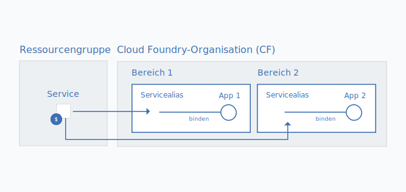

---

copyright:

  years: 2017, 2018

lastupdated: "2018-04-26"

---

{:shortdesc: .shortdesc}
{:codeblock: .codeblock}
{:screen: .screen}
{:new_window: target="_blank"}
{:gif: data-image-type='gif'}
{:tip: .tip}

# Cloud Foundry-Serviceinstanzen in eine Ressourcengruppe migrieren
{: #migrate}

Wenn Services von Cloud Foundry-Organisationen, -Bereichen und -Rollen auf die Verwendung von Cloud Identity and Access Management (IAM) und Ressourcengruppen übergehen, können Sie Ihre Cloud Foundry-Serviceinstanzen zu einer [Ressourcengruppe](/docs/account/resourcegroups.html#rgs) migrieren. Die Migration von Serviceinstanzen zu einer Ressourcengruppe hat verschiedene Vorteile, darunter eine differenziertere Zugriffssteuerung mithilfe von IAM-Rollen und das Verbinden von Serviceinstanzen mit Apps und Services in verschiedenen Regionen.

Wenn ein Service von Cloud Foundry abgezogen wird, werden Sie in einer Nachricht in Ihrem Dashboard dazu aufgefordert, Ihre vorhandenen Serviceinstanzen zu migrieren. Sie können die Services, die bereit sind für die Migration, anhand des Symbols  identifizieren.
{:shortdesc}

Wenn Sie vorhandene Cloud Foundry-Serviceinstanzen in eine Ressourcengruppe migrieren, kann die ausgewählte Gruppe nicht mehr geändert werden, nachdem die Migration abgeschlossen ist. Sie sollten also vor der Migration planen, wie Sie Ressourcen im Konto organisieren möchten. Dies könnte bedeuten, dass Sie vor der Migration eine oder mehrere Ressourcengruppen erstellen müssen, wenn Sie ein abrechnungsfähiges Konto haben. Sie können versuchen, Ihre Ressourcen in Ressourcengruppen zu organisieren, genauso wie Sie Ressourcen in Cloud Foundry-Bereichen organisiert haben.
{: tip}

## Warum sollte ich Serviceinstanzen migrieren?

Services, die Cloud IAM-Zugriffssteuerung und Organisationen innerhalb von Ressourcengruppen unterstützen, bieten verschiedene Vorteile, einschließlich der Möglichkeit zur Herstellung von Verbindungen zu Apps und Services in einem beliebigen Cloud Foundry-Bereich. Auf diese Weise können Sie Verbindungen für Apps und Services aus unterschiedlichen Regionen herstellen. Um die Verbindung herzustellen, können Sie einen Alias einer Instanz aus einer Ressourcengruppe in einem Cloud Foundry-Bereich erstellen. Wenn Sie die Migration ausführen, wird die Verbindung automatisch hergestellt, indem Sie Ihre ursprüngliche Cloud Foundry-Serviceinstanz in einen Alias umwandeln und in einer Ressourcengruppe Ihrer Wahl eine verknüpfte Instanz erstellen.

Darüber hinaus gehört jede von Cloud IAM verwaltete Instanz zu einer Ressourcengruppe. Da Ressourcengruppen nicht auf eine bestimmte Region bezogen sind, können Sie Apps und Services aus verschiedenen Regionen in derselben Ressourcengruppe bereitstellen. Sie können von der differenzierten Zugriffssteuerung auch auf der Ebene einzelner Instanzen profitieren.

## Wer kann Serviceinstanzen migrieren?
{: #whocanmigrate}

Benutzer müssen über bestimmte Zugriffsrechte verfügen, um Cloud Foundry-Serviceinstanzen in eine Ressourcengruppe zu migrieren:

* Einem Benutzer muss die Entwicklerrolle des Cloud Foundry-Bereichs oder die Cloud Foundry-Rolle eines Organisationsmanagers für die Organisation zugeordnet sein, zu der die Instanz gehört.
* Einem Benutzer muss mindestens die IAM-Rolle eines Anzeigeberechtigten zugeordnet sein, um die Ressourcengruppe verwalten zu können, zu der die Instanz migriert wird.
* Einem Benutzer muss mindestens die IAM-Rolle eines Bearbeiters für den Service zugeordnet sein.

Weitere Informationen zum Zuordnen des korrekten Zugriffs finden Sie unter [Cloud Foundry-Zugriff](/docs/iam/cfaccess.html#cfaccess) und [IAM-Zugriff](/docs/iam/users_roles.html#platformrolestable).

Finden Sie heraus, welchen Zugriff Sie haben, indem Sie in der Menüleiste auf **Verwalten** &gt; **Sicherheit** &gt; **Identität und Zugriff** und dann auf **Benutzer** klicken. Klicken Sie anschließend auf Ihren Namen und prüfen Sie Ihre **Zugriffsrichtlinien** für zugewiesene IAM-Rollen und den **Cloud Foundry-Zugriff**, um die Organisationen, auf die Sie Zugriff haben, und Ihre zugeordneten Cloud Foundry-Rollen anzuzeigen.
{: tip}

## Wie funktioniert Migration?

Bei der Migration einer Serviceinstanz aus einer Cloud Foundry-Organisation und einem Cloud Foundry-Bereich zu einer Ressourcengruppe wird eine neue verknüpfte Serviceinstanz in der Ressourcengruppe erstellt. Die ursprüngliche Instanz in der Cloud Foundry-Organisation und dem Cloud Foundry-Bereich wird zu einem [Aliasnamen](/docs/cfapps/connecting_apps.html#what_is_alias). Der Alias wird zum Quota Ihrer Organisation hinzugezählt, aber Ihnen wird die Verwendung der Serviceinstanz in der Ressourcengruppe in Rechnung gestellt.

{: gif}

Sie können Ihre Serviceinstanzen einzeln migrieren, wenn Sie im Dashboard über das Symbol  benachrichtigt werden, das Ihrer Cloud Foundry-Serviceinstanz zugeordnet ist.

1. Öffnen Sie das Menü **Weitere Aktionen**.
2. Wählen Sie **Zu einer Ressourcengruppe migrieren** aus, um den Prozess zu starten.
3. Wählen Sie eine Ressourcengruppe aus.
4. Klicken Sie auf **Migrieren** und die Instanz wird für Sie migriert.
5. Da Sie immer nur eine Instanz migrieren können, können Sie weitere infrage kommende Instanzen migrieren, nachdem die erste erfolgreich abgeschlossen wurde.

Nachdem Sie eine Instanz erfolgreich migriert haben, wird sie im Bereich 'Services' Ihres Dashboards angezeigt. Der Aliasname verbleibt im Abschnitt 'Cloud Foundry' des Dashboards. Sie können den Link  im Cloud Foundry-Abschnitt des Dashboards verwenden, um die Aliase zu ermitteln.

## Fehlerbehebung

Wenn bei der Migration von Cloud Foundry-Serviceinstanzen Probleme auftreten, finden Sie weitere Informationen unter [Fehlerbehebung für die Migration von Serviceinstanzen](/docs/troubleshoot/ts_migration.html).
