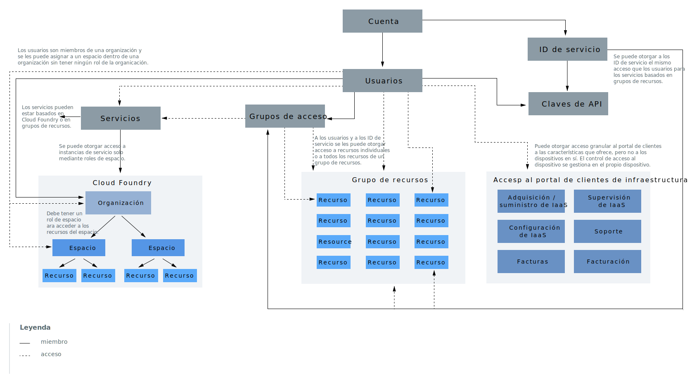

---

copyright:

  years: 2018
lastupdated: "2018-10-08"

---

{:shortdesc: .shortdesc}
{:codeblock: .codeblock}
{:screen: .screen}
{:tip: .tip}
{:new_window: target="_blank"}

# Jerarquía de cuentas
{: #overview}

Su cuenta de {{site.data.keyword.Bluemix}} incluye varios componentes y sistemas que interactúan. El siguiente diagrama y la explicación de cada componente están pensados para ayudarle a comprender la conexión entre ciertos componentes y cómo funciona el acceso en la cuenta. 

Dentro del diagrama, hay dos conceptos principales correspondiente a la jerarquía de cuentas que debe comprender. El uso de líneas continuas y de líneas de puntos ayuda a mostrar que algunos componentes están contenidos dentro de otros; por ejemplo, los usuarios se añaden a grupos de usuarios o a organizaciones de Cloud Foundry. Sin embargo, algunos componentes interactúan con otros a fin de ofrecer acceso en lugar de pertenencia a grupo. Por ejemplo, se otorga a los usuarios acceso a grupos de recursos, pero no son miembros de un grupo de recursos del mismo modo que lo son de los grupos de acceso. Estos conceptos se explican en las secciones siguientes.

<dl>
<dt>Usuarios</dt>
<dd>Se invita a los usuarios a la cuenta y se les otorga acceso a los recursos de la cuenta.</dd>
<dt>ID de servicio</dt>
<dd>Un ID de servicio identifica un servicio o una aplicación de forma similar a cómo un ID de usuario identifica un usuario. Puede utilizar un ID de servicio que cree para habilitar una aplicación fuera del acceso de {{site.data.keyword.Bluemix_notm}} a sus servicios de {{site.data.keyword.Bluemix_notm}}. Puede asignar políticas de acceso específicas al ID de servicio que restrinjan permisos para utilizar servicios específicos, o incluso combinar permisos para acceder a servicios distintos. Puesto que los ID de servicio no están vinculados a un usuario específico, si un usuario abandona una organización y se suprime de la cuenta, el ID de servicio seguirá garantizando que su aplicación o servicio permanece activo y en ejecución. Para obtener más información, consulte [Cómo crear y trabajar con ID de servicio](/docs/iam/serviceid.html#serviceids).</dd>
<dt>Instancias de servicio o recursos</dt>
<dd>Los servicios de {{site.data.keyword.Bluemix_notm}} se pueden basar en grupo de recursos o en Cloud Foundry. Las instancias de servicio que se pueden añadir a un grupo de recursos y gestionar mediante {{site.data.keyword.Bluemix_notm}} Identity and Access Management (IAM) se denominan recursos. Las instancias de servicio que se añaden a organizaciones y espacios de Cloud Foundry tienen otro sistema de gestión de acceso mediante el uso de roles de Cloud Foundry. Para obtener más información, consulte [¿Qué es un recurso?](/docs/resources/acct_resources.html#resource)</dd>
<dt>Claves de API</dt>
<dd>Una clave de interfaz de programación de aplicaciones (clave de API) es un código exclusivo que se pasa en una interfaz de programación de aplicaciones (API) para identificar la aplicación de llamada o el usuario. Algunas claves de API de la plataforma están asociadas a identidades de usuario y se pueden crear otras claves de API para los ID de servicio. Para obtener más información, consulte [Cómo trabajar con claves de API](/docs/iam/apikeys.html#manapikey).</dd>
<dt>Grupos de acceso</dt>
<dd>Puede crear un grupo de acceso para organizar un conjunto de usuarios e ID de servicio en una sola entidad, lo que le facilita la asignación de permisos. Puede asignar una única política al grupo en lugar de asignar el mismo acceso varias veces por usuario individual o ID de servicio. Para obtener más información, consulte el apartado [Configuración de grupos de acceso](/docs/iam/groups.html#groups).</dd>
<dt>Grupos de recursos</dt>
<dd>Un grupo de recursos es una manera de organizar sus recursos de cuenta en agrupaciones personalizables para que pueda asignar accesos de usuario rápidamente a más de un recurso a la vez. Cualquier recurso de cuenta que se gestione mediante el control de acceso de IAM pertenece a un grupo de recursos dentro de su cuenta. Los usuarios no se añaden a grupos de recursos, sino que se les otorga acceso a los recursos que contienen o bien pueden gestionar el grupo de recursos. Los usuarios a los que se otorga acceso para gestionar el grupo de recursos pueden crear nuevas instancias dentro del grupo, gestionar el acceso de otros usuarios para que trabajen con el grupo o editar el nombre del grupo en función de rol de IAM asignado. Para obtener más información, consulte [Gestión de grupos de recursos](/docs/resources/resourcegroups.html#rgs) y [Prácticas recomendadas para organizar recursos en grupos de recursos](/docs/resources/bestpractice_rgs.html#bp_resourcegroups).</dd>
<dt>Organizaciones de Cloud Foundry</dt>
<dd>Como propietario de una cuenta o gestor de la organización, puede añadir organizaciones y espacios desde la página Organizaciones de Cloud Foundry de la consola. Los servicios que permiten utilizar organizaciones y espacios de Cloud Foundry se añaden a una organización o espacio cuando se crean desde el catálogo. Las organizaciones contienen usuarios, dominios y cuotas. Dentro de cada organización se añaden espacios, que contienen las instancias de servicio. Para obtener más información, consulte [Adición de organizaciones y espacios](/docs/account/orgs_spaces.html#orgsspacesusers).</dd>
<dt>Espacios de Cloud Foundry</dt>
<dd>En el seno de una organización, podrá utilizar espacios para agrupar un conjunto de aplicaciones, servicios y usuarios. Los espacios están vinculados a una región específica en {{site.data.keyword.Bluemix_notm}}. Puede crear espacios en una organización en función del ciclo de vida de entrega. Por ejemplo, puede crear un espacio dev como entorno de desarrollo, un espacio test como entorno de prueba y un espacio production como entorno de producción. Luego puede asociar sus apps a los espacios. Para obtener más información, consulte [Adición de organizaciones y espacios](/docs/account/orgs_spaces.html#orgsspacesusers).</dd>
</dl>

Otro aspecto importante del diagrama es la representación de los tres tipos de sistemas de gestión de acceso que puede utilizar para otorgar a los usuarios de la cuenta acceso a los recursos de la misma. 

* Los [roles de acceso](/docs/iam/users_roles.html#iamusermanrol) de IAM se utilizan para otorgar a los usuarios acceso a todos los recursos pertenecientes a un grupo de recursos. Estos roles de acceso también se utilizan para otorgar a los usuarios acceso para gestionar grupos de recursos y para crear nuevas instancias de servicio que se asignan a un recurso.
* Los [roles de organización y de espacio](/docs/iam/cfaccess.html#cfroles) de Cloud Foundry se utilizan para otorgar a los usuarios acceso a cualquier instancia de servicio que resida en un espacio de Cloud Foundry.
* También dispone de permisos del [portal de clientes](/docs/customer-portal/cpwhatis.html#customerportal_whatisCP) de la infraestructura para otorgar a los usuarios [permisos](/docs/iam/infrastructureaccess.html#infrapermission) granulares sobre el acceso al portal de clientes y a las características que contiene, como facturas, datos de facturación, configuración de IaaS, supervisión de IaaS, adquisición de IaaS y soporte. El acceso a dispositivos se gestiona por separado desde el propio dispositivo.
