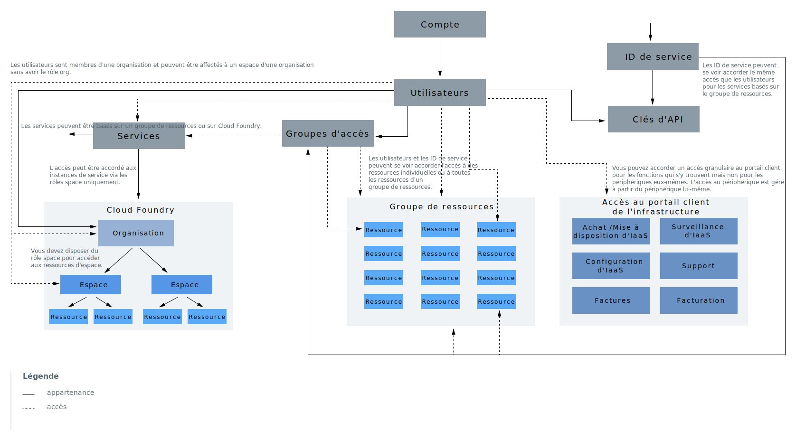

---

copyright:
  years: 2019
lastupdated: "2019-02-12"

keywords: IBM Cloud account, account differences, resources, access

subcollection: account

---

{:shortdesc: .shortdesc}
{:codeblock: .codeblock}
{:screen: .screen}
{:tip: .tip}
{:new_window: target="_blank"}

# Hiérarchie de compte
{: #overview}

Votre compte {{site.data.keyword.Bluemix}} inclut plusieurs composants et systèmes interagissant les uns avec les autres. Découvrez comment certains composants sont connectés et comment l'accès fonctionne dans votre compte.
{:shortdesc}

Le diagramme présente deux principaux concepts s'appliquant aux composants de la hiérarchie de compte qu'il est important de bien connaître. L'utilisation de lignes continues et de lignes pointillées indique que certains composants sont inclus dans d'autres. Par exemple, les utilisateurs sont ajoutés à des groupes d'accès ou à des organisations Cloud Foundry. Toutefois, certains composants interagissent avec d'autres afin de fournir l'accès à un élément et non une adhésion à ce dernier. Par exemple, les utilisateurs se voient accorder l'accès à des groupes de ressources mais ne sont pas membres d'un groupe de ressources comme ils le sont d'un groupe d'accès. Ces concepts sont également présentés dans les sections suivantes.

<dl>
<dt>Utilisateurs</dt>
<dd>Les utilisateurs sont invités dans le compte et se voient accorder l'accès aux ressources du compte.</dd>
<dt>ID de service</dt>
<dd>Un ID de service identifie un service ou une application de la même façon qu'un ID utilisateur identifie un utilisateur. Vous pouvez utiliser un ID de service que vous créez pour permettre à une application située hors d'{{site.data.keyword.Bluemix_notm}} d'accéder à vos services. Vous pouvez affecter des règles d'accès spécifiques à l'ID de service qui limitent les droits d'utilisation à des services spécifiques ou bien combiner des droits d'accès à différents services. Les ID de service n'étant pas liés à un utilisateur spécifique, si un utilisateur quitte une organisation et est supprimé du compte, l'ID de service est conservé de sorte que votre application ou votre service reste opérationnel. Pour plus d'informations, voir [Création et utilisation des ID de service](/docs/iam?topic=iam-serviceids#serviceids).</dd>
<dt>Ressources ou instances de service</dt>
<dd>Les services dans {{site.data.keyword.Bluemix_notm}} s'appuient sur un groupe de ressources ou sur Cloud Foundry. Les instances de service pouvant être ajoutées à un groupe de ressources et gérées via l'utilisation d'{{site.data.keyword.Bluemix_notm}} Identity and Access Management (IAM) sont appelées des ressources. Les instances de service ajoutées à des espaces et à des organisations Cloud Foundry ont un autre système de gestion lorsqu'ils utilisent des rôles Cloud Foundry. Pour plus d'informations, voir [Qu'est-ce qu'une ressource ?](/docs/resources?topic=resources-resource#resource)</dd>
<dt>Clés d'API</dt>
<dd>Une clé d'API est un code unique qui est transmis à une API pour identifier l'utilisateur ou l'application à l'origine de l'appel. Vous pouvez utiliser des clés d'API de plateforme, qui sont associées à des identités utilisateur. Vous pouvez également créer d'autres clés d'API pour les ID de service. Pour plus d'informations, voir [Gestion des clés d'API](/docs/iam?topic=iam-manapikey#manapikey).</dd>
<dt>Groupes d'accès</dt>
<dd>Vous pouvez créer un groupe d'accès pour organiser un ensemble d'utilisateurs et d'ID de service dans une seule entité et faciliter l'affectation de droits d'accès. Vous pouvez affecter une seule règle au groupe au lieu d'affecter individuellement le même accès plusieurs fois pour chaque utilisateur ou ID de service. Pour plus d'informations, voir [Configuration de groupes d'accès](/docs/iam?topic=iam-groups#groups).</dd>
<dt>Groupes de ressources</dt>
<dd>Vous pouvez utiliser un groupe de ressources pour organiser vos ressources de compte en regroupements personnalisables de manière à pouvoir affecter rapidement aux utilisateurs un accès à plusieurs ressources à la fois. Chaque ressource de compte gérée à l'aide du contrôle d'accès IAM appartient à un groupe de ressources de votre compte. Les utilisateurs ne sont pas ajoutés aux groupes de ressources mais ils peuvent accéder aux ressources qui s'y trouvent ou peuvent gérer le groupe de ressources. Les utilisateurs disposant de l'accès permettant de gérer le groupe de ressources peuvent créer des instances dans le groupe, gérer les autorisations permettant à d'autres utilisateurs d'utiliser le groupe ou modifier le nom du groupe en fonction du rôle IAM affecté. Pour plus d'informations, voir [Gestion des groupes de ressources](/docs/resources?topic=resources-rgs#rgs) et [Meilleures pratiques pour l'organisation des ressources dans un groupe de ressources](/docs/resources?topic=resources-bp_resourcegroups#bp_resourcegroups).</dd>
<dt>Organisations Cloud Foundry</dt>
<dd>En tant que propriétaire de compte ou responsable de l'organisation, vous pouvez ajouter des organisations et des espaces depuis la page Organisations Cloud Foundry dans la console. Les services prenant en charge l'utilisation des espaces et des organisations Cloud Foundry sont ajoutés à un espace et une organisation lorsque vous les créez à partir du catalogue. Les organisations contiennent des utilisateurs, des domaines et des quotas. Dans chaque organisation, des espaces contenant des instances de service sont ajoutés. Pour plus d'informations, voir [Ajout d'organisations et d'espaces](/docs/account?topic=account-orgsspacesusers#orgsspacesusers).</dd>
<dt>Espaces Cloud Foundry</dt>
<dd>Dans une organisation, vous pouvez utiliser des espaces pour regrouper un ensemble d'applications, de services et d'utilisateurs. Les espaces sont liés à une région spécifique dans {{site.data.keyword.Bluemix_notm}}. Vous pouvez créer des espaces dans une organisation en fonction du cycle de vie de distribution. Par exemple, vous pouvez créer un espace dev en tant qu'environnement de développement, un espace test en tant qu'environnement de test et un espace production en tant qu'environnement de production. Ensuite, vous pouvez associer vos applications à des espaces. Pour plus d'informations, voir [Ajout d'organisations et d'espaces](/docs/account?topic=account-orgsspacesusers#orgsspacesusers).</dd>
</dl>

Un autre aspect important du diagramme précédent est la description des trois types de système de gestion d'accès que vous pouvez utiliser pour accorder aux utilisateurs du compte l'accès aux ressources de ce dernier.

  * Vous pouvez utiliser des [rôles d'accès](/docs/iam?topic=iam-userroles#iamusermanrol) IAM afin que les utilisateurs puissent accéder à toutes les ressources appartenant à un groupe de ressources. Vous pouvez également accorder aux utilisateurs les droits leur permettant de gérer des groupes de ressources et de créer des instances de service affectées à un groupe de ressources.
  * Vous pouvez utiliser les [rôles d'organisation et d'espace](/docs/iam?topic=iam-cfaccess#cfroles) pour accorder aux utilisateurs l'accès à toute instance de service se trouvant dans un espace Cloud Foundry.
  * Vous pouvez utiliser des droits d'infrastructure classique pour accorder aux utilisateurs des [droits d'accès](/docs/iam?topic=iam-infrapermission#infrapermission) plus précis pour l'infrastructure classique. L'affectation de l'accès au périphérique et l'affectation de l'accès au sous-réseau VPN sont deux opérations distinctes.
