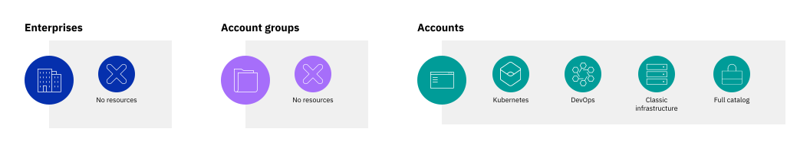

---

copyright:
  years: 2019
lastupdated: "2019-07-25"

keywords: enterprise, enterprise account, multiple accounts, organization, hierarchy

subcollection: account

---

{:shortdesc: .shortdesc}
{:new_window: target="_blank"}
{:codeblock: .codeblock}
{:important: .important}
{:tip: .tip}
{:note: .note}

# Qu'est-ce qu'une entreprise ?
{: #enterprise}

Les entreprises {{site.data.keyword.Bluemix}} permettent de gérer centralement la facturation et l'utilisation des ressources dans plusieurs comptes. Dans une entreprise, vous créez une hiérarchie de comptes à plusieurs niveaux, avec la facturation et les paiements pour tous les comptes gérés au niveau de l'entreprise.
{:shortdesc}

Par rapport à l'utilisation de plusieurs comptes autonomes, les entreprises présentent les principaux avantages suivants :
- Gestion de compte centralisée : consultez l'ensemble de la hiérarchie de votre entreprise d'un seul coup d'oeil, sans qu'il soit nécessaire de passer d'un compte à un autre. Vous pouvez ajouter des comptes existants ou créer de nouveaux comptes directement dans l'entreprise.
- Facturation d'abonnement consolidée : effectuez le suivi de vos abonnements et du crédit dépensé pour tous les comptes à partir d'une seule vue. Votre crédit d'abonnement est mis en commun et partagé entre les comptes de l'entreprise.
- Rapport d'utilisation descendant : dans votre compte d'entreprise, vous pouvez afficher l'utilisation de tous les comptes de votre entreprise, organisés par groupe de comptes.

## Hiérarchie d'entreprise
{: #enterprise-hierarchy}

Une entreprise se compose de trois blocs fonctionnels principaux :
- Le compte d'entreprise, qui sert de compte parent pour tous les autres comptes de l'entreprise. Ce compte gère la facturation pour l'ensemble de l'entreprise, avec les coûts d'utilisation de tous les comptes cumulés et payés à partir du compte d'entreprise.
- Les groupes de comptes, que vous pouvez utiliser pour organiser les comptes liés. Ils ne peuvent pas inclure de ressources mais vous pouvez afficher les coûts pour l'utilisation des ressources à partir des comptes qu'ils contiennent.
- Les comptes, similaires à des comptes {{site.data.keyword.Bluemix_notm}} par le fait qu'ils contiennent des ressources et des groupes de ressources, des organisations et des espaces Cloud Foundry et des droits d'accès indépendants. Cependant, il existe une différente importante. En effet, chaque compte d'une entreprise ne gère pas sa propre facturation ou ses propres paiements qui sont traités au niveau du compte de l'entreprise.

Vous créez des niveaux dans votre entreprise en imbriquant un groupe de comptes dans un groupe de comptes.

Une entreprise peut inclure jusqu'à 10 niveaux de comptes et de groupes de comptes. Dans sa forme la plus basique, une entreprise a deux niveaux : le compte d'entreprise et un compte enfant unique.

Votre structure d'entreprise est flexible et peut s'accroître et évoluer en fonction de vos besoins. Vous pouvez ajouter et retirer des groupes de comptes et déplacer des comptes entre différents groupes de comptes. Si le rôle d'un groupe de comptes change, vous pouvez le renommer afin de mieux refléter les comptes qu'il inclut.

## Facturation consolidée
{: #enterprise-billing}

Dans une entreprise, l'ensemble de la facturation est gérée via le compte d'entreprise de niveau élevé. Les entreprises exigent une [facturation d'abonnement](/docs/account?topic=account-accounts#subscription-account), ce qui signifie que vous achetez un abonnement pour une quantité de crédit à dépenser pendant la durée de l'abonnement et l'utilisation est déduite du crédit d'abonnement à un tarif réduit. Le crédit d'abonnement, ainsi que le crédit provenant des diverses promotions, est ajouté au pool de crédit de l'entreprise partagé entre tous les comptes de l'entreprise. Lorsque les comptes utilisent des ressources, le crédit est dépensé.

Etant donné que la facturation est consolidée, les entreprises facilitent la gestion de la facturation et des paiements dans plusieurs comptes et offrent les avantages suivants :
* Un pool de crédit des abonnements s'appliquant à plusieurs comptes. Ainsi, vous pouvez définir vos abonnements pour l'ensemble de votre utilisation et non pour l'utilisation par compte
* Une seule facture pour l'ensemble de l'utilisation dans l'entreprise, ce qui permet de mieux comprendre les coûts
* Emplacement centralisé pour la gestion des méthodes de paiement afin que vous puissiez effectuer une seule mise à jour pour tous les comptes

Pour plus d'informations, voir [Gestion centrale de la facturation et de l'utilisation avec les entreprises](/docs/billing-usage?topic=billing-usage-enterprise).

## Gestion des ressources
{: #enterprise-resources}

Les ressources et les services d'une entreprise fonctionnent de la même manière que dans des comptes autonomes. Chaque compte d'une entreprise peut contenir des ressources dans des groupes de ressources et des services dans des organisations et des espaces Cloud Foundry. Les groupes de comptes ne peuvent pas contenir de ressources. Pour plus d'informations, voir [Utilisation des ressources et des services](/docs/resources?topic=resources-resource).

Comme c'est le cas avec tous les comptes, les ressources sont liées au groupe de ressources et au compte où ils sont créés. Ils ne peuvent donc pas être déplacés entre les différents comptes de l'entreprise. Cependant, la structure de compte flexible de l'entreprise vous permet de déplacer des ressources au sein de l'entreprise en déplaçant les comptes dans lesquels elles se trouvent.

## Rapport d'utilisation descendant
{: #enterprise-usage}

Dans le compte d'entreprise, vous pouvez voir l'utilisation des ressources de tous les comptes se trouvant dans l'entreprise. A partir du niveau de l'entreprise, vous pouvez voir les coûts d'utilisation estimés répartis par comptes et groupes de comptes. Vous pouvez parcourir la structure de l'entreprise afin de voir les coûts à chaque niveau. Au niveau du compte, les utilisateurs d'entreprise peuvent voir les coûts pour chaque type de ressource ou de service du compte.

Etant donné que l'accès dans l'entreprise est séparé de l'accès dans chaque compte, les utilisateurs de l'entreprise ne peuvent pas automatiquement créer ou gérer des ressources dans les comptes enfant. De la même façon, les utilisateurs de chaque compte peuvent continuer de consulter leur utilisation passée et en cours sur la page Utilisation, qu'ils aient ou non accès à l'entreprise.

Pour plus d'informations, voir [Affichage de l'utilisation dans une entreprise](/docs/billing-usage?topic=billing-usage-enterprise-usage).

## Gestion des utilisateurs et de l'accès isolée
{: #enterprise-access}

Les entreprises permettent d'isoler la gestion des utilisateurs et de l'accès entre l'entreprise et ses comptes enfant afin d'offrir une plus grande sécurité pour les données de vos comptes. Les utilisateurs et leur accès affecté dans le compte d'entreprise sont entièrement isolés de ceux dans les comptes enfant et aucun accès n'est automatiquement hérité entre les deux types de compte.

Les listes d'utilisateurs de chaque compte sont visibles uniquement des utilisateurs qui sont invités à rejoindre ce compte. Le seul fait qu'un utilisateur soit invité et dispose de l'accès lui permettant de gérer l'ensemble de l'entreprise n'implique pas qu'il puisse voir les utilisateurs invités dans chaque compte enfant. La gestion des utilisateurs dans chaque entreprise et dans chaque compte est entièrement séparée et doit être prise en charge par le propriétaire du compte ou un utilisateur disposant du rôle Administrateur sur le service de gestion des comptes dans le compte spécifique.

Tout comme la gestion des comptes est entièrement séparée dans chaque compte et l'entreprise elle-même, la gestion des accès l'est également. Cette séparation signifie que les utilisateurs qui gèrent votre entreprise ne peuvent pas accéder aux ressources de compte dans les comptes enfant sauf si vous les paramétrez pour cela. Par exemple, votre responsable financier peut avoir le rôle d'administrateur sur le service de gestion des comptes Facturation dans le compte de l'entreprise, ce qui lui permet d'accéder aux informations de facturation et de paiement ainsi qu'aux données d'utilisation et au type de ressource. Mais, sauf s'il est invité dans un compte enfant et que l'accès au service de gestion des comptes Facturation lui est affecté pour ce compte, il ne peut pas consulter les offres ou mettre à jour les limites de dépense pour le compte enfant.

Pour plus d'informations, voir [Gestion des utilisateurs pour les entreprises](/docs/iam?topic=iam-enterprise-access).

## Comment puis-je utiliser une entreprise ?
{: #enterprise-use-cases}

Les entreprises peuvent permettre de simplifier la gestion de la facturation et des comptes pour des scénarios plus complexes. Les entreprises peuvent être utiles pour gérer tout type d'organisation de grande taille mais les deux principaux cas d'utilisation dans lesquels vous souhaitez les créer sont les sociétés de grande taille et les établissements d'enseignement.

Le mode de structuration de votre entreprise dépend de la façon dont vous souhaitez analyser l'utilisation et les coûts, comme l'imputation de l'utilisation à un groupe spécifique. Organisez votre entreprise en fonction de la façon dont vous souhaitez effectuer le suivi et gérer la facturation et l'utilisation.
{:tip}

### Sociétés ou organisations de grande taille
{: #enterprise-orgs}

Les entreprises peuvent être fort utiles pour les organisations de grande taille ayant besoin de plusieurs comptes séparés pour leurs services ou leurs équipes. En utilisant des groupes de comptes, vous pouvez définir la hiérarchie de l'entreprise en fonction de la structure de votre organisation.

#### Organisation par service
{: #enterprise-by-dept}

Si votre organisation a des équipes globales qui partagent un budget, vous pouvez modéliser la structure de votre entreprise en fonction des différents services. Avec cette structure, vous pouvez voir les coûts d'utilisation regroupés pour chaque service.

#### Organisation par zone géographique
{: #enterprise-by-geo}

Si votre organisation inclut des budgets séparés en fonction des secteurs géographiques, vous pouvez structurer votre entreprise afin de regrouper les coûts pour chaque entité géographique.

### Etablissements d'enseignement
{: #enterprise-edu}

Les établissements d'enseignement peuvent souhaiter mettre à disposition de leurs étudiants des comptes {{site.data.keyword.Bluemix_notm}} afin qu'ils puissent apprendre des compétences utiles via des projets pratiques qui utilisent des services {{site.data.keyword.Bluemix_notm}}. Pour ces établissements (universités traditionnelles ou des plateformes d'apprentissage en ligne), vous pouvez regrouper les comptes par département ou domaine d'étude, puis créer des comptes pour chaque cours.

Dans chaque compte, les étudiants peuvent créer des ressources afin de développer leurs projets et de collaborer avec d'autres étudiants du compte. L'université a une vision globale des coûts de chaque département et cours.

