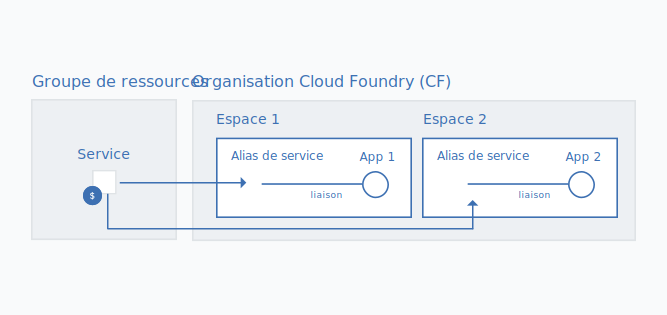

---

copyright:

  years: 2017, 2018

lastupdated: "2018-04-26"

---

{:shortdesc: .shortdesc}
{:codeblock: .codeblock}
{:screen: .screen}
{:new_window: target="_blank"}
{:gif: data-image-type='gif'}
{:tip: .tip}

# Migration des instances de service Cloud Foundry vers un groupe de ressources
{: #migrate}

Lorsque les services cessent d'utiliser des organisations, des espaces et des rôles Cloud Foundry au profit d'IAM (Identity and Access Management) et de groupes de ressources Cloud, vous pouvez faire migrer vos instances de service Cloud Foundry vers un [groupes de ressources](/docs/account/resourcegroups.html#rgs). Faire migrer des instances de service vers un groupe de ressources offre plusieurs avantages, notamment un contrôle d'accès à granularité plus fine via l'utilisation de rôles IAM et la connexion d'instances de service à des applications et des services dans différentes régions. 

Lorsqu'un service quitte Cloud Foundry, un message s'affiche sur votre tableau de bord pour vous inviter à faire migrer les instances de service existantes. Vous pouvez identifier les services qui sont prêts à être migrés grâce à l'icône .
{:shortdesc}

Lorsque vous faites migrer des instances de service Cloud Foundry existantes vers un groupe de ressources, le groupe que vous choisissez ne peut pas être modifié une fois la migration terminée. Par conséquent, vous devez prendre soin de planifier la façon dont vous souhaitez organiser des ressources dans le  compte avant de procéder à la migration. Cela peut signifier que vous devez créer un ou plusieurs groupes de ressources, si vous disposez d'un compte facturable, avant de procéder à la migration.
Vous pouvez essayer d'organiser vos ressources dans des groupes de ressources de la même façon que vous avez organisé vos ressources dans des espaces Cloud Foundry.
{: tip}

## Pourquoi faire migrer des instances de service ?

Les services qui prennent en charge le contrôle d'accès Cloud IAM et l'organisation dans des groupes de ressources en tirent plusieurs avantages, notamment la possibilité de se connecter à des applications et des services dans n'importe quel espace Cloud Foundry, ce qui vous permet de vous connecter à des applications et des services à partir de différentes régions. Pour créer la connexion, vous pouvez créer un alias d'une  instance à partir d'un groupe de ressources dans un espace Cloud Foundry. Lorsque vous effectuez une migration, la connexion est établie automatiquement par la transformation de votre instance de service Cloud Foundry initiale en un alias et par la création d'une instance liée dans un groupe de ressources de votre choix.

De plus, chaque instance gérée par Cloud IAM appartient à un groupe de ressources. La portée des groupes de ressources n'est pas établie par région, de sorte que vous pouvez mettre à disposition des applications et des services issus de différentes régions dans un même groupe de ressources. Vous pouvez également bénéficier du contrôle d'accès à granularité fine au niveau de chaque instance. 

## Qui peut faire migrer des instances de service ?
{: #whocanmigrate}

Les utilisateurs doivent posséder des droits d'accès spécifiques pour faire migrer des instances de service Cloud Foundry vers un groupe de ressources :

* Un utilisateur doit posséder le rôle de développeur sur l'espace Cloud Foundry ou le rôle de responsable sur l'organisation à laquelle l'instance appartient. 
* Un utilisateur doit posséder au minimum le rôle IAM Afficheur pour gérer le groupe de ressources vers lequel l'instance va être migrée. 
* Un utilisateur doit posséder au minimum le rôle IAM Editeur sur le service. 

Pour plus d'informations sur l'affectation des droits d'accès appropriés, voir [Accès Cloud Foundry](/docs/iam/cfaccess.html#cfaccess) et [Accès IAM](/docs/iam/users_roles.html#platformrolestable).

Pour vérifier les droits d'accès dont vous disposez, dans la barre de menus, cliquez sur **Gérer** &gt; **Sécurité** &gt; **Identity and Access**, puis cliquez sur **Utilisateurs**. Cliquez ensuite sur votre nom et passez en revue vos **règles d'accès** pour les rôles IAM affectés et les **droits d'accès Cloud Foundry** pour voir les organisations auxquelles vous avez accès, ainsi que les rôles Cloud Foundry qui vous sont affectés.
{: tip}

## Comment fonctionne la migration ?

Lors de la migration d'une instance de service depuis une organisation et un espace Cloud Foundry vers un groupe de ressources, une nouvelle instance de service liée est créée dans le groupe de ressources. L'instance d'origine dans l'organisation et l'espace Cloud Foundry se transforme en [alias](/docs/cfapps/connecting_apps.html#what_is_alias). L'alias est pris en compte dans le quota de votre organisation, mais vous êtes facturé pour l'utilisation de l'instance de service dans le groupe de ressources. 

{: gif}

Vous pouvez faire migrer vos instances de service une par une lorsque vous êtes prévenu sur le tableau de bord par l'icône  qui est associée à votre instance de service Cloud Foundry. 

1. Ouvrez le menu **Plus d'actions**. 
2. Sélectionnez **Migration vers un groupe de ressources** pour démarrer. 
3. Sélectionnez un groupe de ressources.
4. Cliquez sur **Migrer** ; la migration de l'instance est effectuée pour vous. 
5. Puisque vous ne pouvez faire migrer qu'une seule instance à la fois, vous pouvez continuer de faire migrer des instances éligibles une fois que la première instance a été migrée. 

Une fois que vous avez correctement fait migré une instance, elle apparaît dans la section Services de votre tableau de bord. L'alias demeure dans la section Cloud Foundry du tableau de bord. Vous pouvez utiliser l' dans la section Cloud Foundry du tableau de bord pour identifier les alias. 

## Traitement des incidents

Si vous rencontrez des problèmes lors de la migration d'instances de service Cloud Foundry, consultez la rubrique[Traitement des incidents liés à la migration d'instances de service](/docs/troubleshoot/ts_migration.html).
