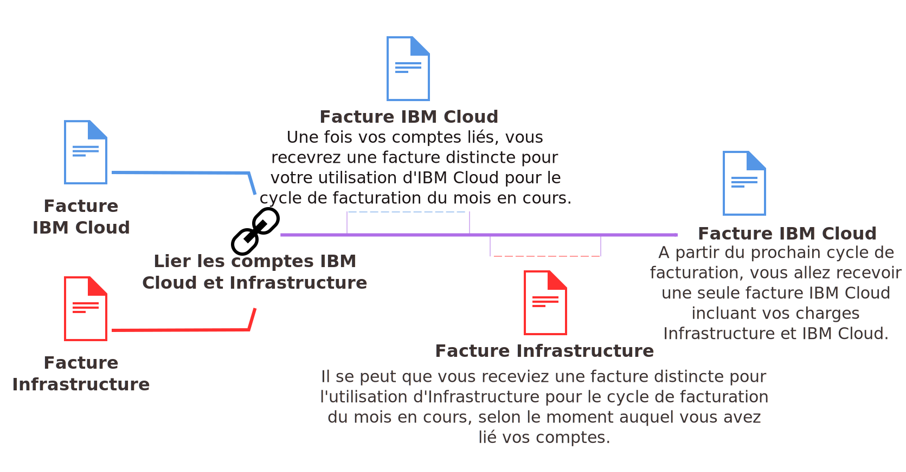

---

copyright:

  years: 2015, 2018
lastupdated: "2018-01-10"

---

{:shortdesc: .shortdesc}
{:codeblock: .codeblock}
{:screen: .screen}
{:tip: .tip}
{:new_window: target="_blank"}

# Liaison de vos comptes {{site.data.keyword.Bluemix_notm}} et SoftLayer
{: #unifyingaccounts}

Vous pouvez lier vos comptes {{site.data.keyword.Bluemix}} et SoftLayer pour utiliser des ressources combinées. 
{: shortdesc}

Si vous liez
vos comptes {{site.data.keyword.Bluemix_notm}} et Softlayer, vous ne recevrez qu'une seule facture {{site.data.keyword.Bluemix_notm}}. Si vous disposez d'un compte {{site.data.keyword.Bluemix_notm}}, la facturation via {{site.data.keyword.Bluemix_notm}} pour les ressources d'infrastructure entre en vigueur au prochain cycle de facturation après que les comptes ont été liés.

Tous les comptes liés dans {{site.data.keyword.Bluemix_notm}} doivent être de type Paiement à la carte. Vous pouvez créer un nouveau compte Paiement à la carte, lier un compte Paiement à la carte existant, ou lier un compte d'essai existant, qui est ensuite mis à niveau vers un compte Paiement à la carte. Vous ne pouvez pas lier des comptes de type Abonnement.
{: tip}

Vous devez être défini comme utilisateur principal sur le compte SoftLayer pour pouvoir lier des comptes.

Une fois que vos comptes sont liés :

* Vous devez utiliser vos données d'identification IBMid pour accéder à votre compte SoftLayer et à votre compte
{{site.data.keyword.Bluemix_notm}}.
* Les remises SoftLayer existantes sont appliquées à tous les prix {{site.data.keyword.Bluemix_notm}}.
* Vous recevez une facture en dollars américains (USD).
* Vous pouvez surveiller l'utilisation de vos ressources d'infrastructure dans la console {{site.data.keyword.Bluemix_notm}}.

Une fois vos comptes liés, cette opération est irréversible.  

En tant qu'utilisateur principal, procédez comme suit pour lier vos comptes {{site.data.keyword.Bluemix_notm}} et SoftLayer :

 1. Dans le portail client {{site.data.keyword.Bluemix_notm}}, cliquez sur **Liez un compte {{site.data.keyword.Bluemix_notm}}**.
 2. Lisez et acceptez les dispositions pour la liaison de comptes SoftLayer et {{site.data.keyword.Bluemix_notm}}.
 3. A l'invite, indiquez l'adresse électronique associée à votre compte {{site.data.keyword.Bluemix_notm}}. Si vous ne disposez pas d'un compte {{site.data.keyword.Bluemix_notm}}, indiquez l'adresse électronique que vous voulez utiliser, suivez les instructions pour être invité dans {{site.data.keyword.Bluemix_notm}} et créez un compte.

Après avoir lié vos comptes, l'option **Accéder à {{site.data.keyword.Bluemix_notm}}** est disponible dans la barre de menus de la console SoftLayer. En cliquant sur ce lien, vous accédez à la page de connexion de {{site.data.keyword.Bluemix_notm}}.

## Facturation pour l'utilisation de {{site.data.keyword.Bluemix_notm}} lorsque les comptes sont liés
{: #linkedbilling}

Une fois que vous avez lié vos comptes {{site.data.keyword.Bluemix_notm}} et SoftLayer, le prochain cycle de facturation sera imputé dans une seule facture {{site.data.keyword.Bluemix_notm}}.

Votre cycle d'utilisation de {{site.data.keyword.Bluemix_notm}} est basé sur le mois calendaire et votre compte sera facturé chaque mois le jour de facturation établi pour votre contrat de crédit. Avec SoftLayer, votre cycle d'utilisation débute au moment où vous avez commencé à utiliser SoftLayer, et vous êtes donc facturé chaque mois le même jour où vous avez ouvert votre compte SoftLayer. 

Lorsque vos comptes sont liés, votre utilisation de {{site.data.keyword.Bluemix_notm}} continue d'être mesurée pour le cycle du mois en cours et vous êtes facturé pour cette utilisation sur une facture {{site.data.keyword.Bluemix_notm}}. A compter du premier jour du mois suivant, vos frais {{site.data.keyword.Bluemix_notm}} et SoftLayer sont combinés sur votre facture {{site.data.keyword.Bluemix_notm}}.

Par exemple, si vous avez lié vos comptes le 16 avril 2017, vous recevez une facture {{site.data.keyword.Bluemix_notm}} pour votre consommation d'avril. Selon la date à laquelle vous avez lié vos comptes, vous pouvez recevoir une facture distincte pour votre utilisation de SoftLayer. Ensuite, votre utilisation combinée du mois de mai est facturée via votre compte {{site.data.keyword.Bluemix_notm}}.

Une fois vos factures liées, votre facture {{site.data.keyword.Bluemix_notm}} répertorie les prix de chaque ressource que vous avez utilisée.

## Services {{site.data.keyword.Bluemix_notm}} reposant sur des API
{: #api-based-services}

La liste suivante recense les services que vous pouvez configurer pour exécution avec votre code d'application. Les plans pour ces services ne sont pas tous disponibles pour utilisation avec des comptes liés. Seuls les plans activés pour les comptes Paiement à la carte peuvent être utilisés avec des comptes liés. Toutefois, si vous disposez d'un compte {{site.data.keyword.Bluemix_notm}} distinct qui est facturé séparément, vous pouvez utiliser n'importe quel plan associé à l'un de ces services.

* {{site.data.keyword.alchemyapishort}}
* {{site.data.keyword.alertnotificationshort}}
* {{site.data.keyword.sparks}}
* {{site.data.keyword.appseccloudshort}}
* {{site.data.keyword.blockchain}}
* {{site.data.keyword.cloudant}}
* {{site.data.keyword.conceptinsightsshort}}
* {{site.data.keyword.iotmapinsights_short}}
* {{site.data.keyword.dashdbshort}}
* {{site.data.keyword.dialogshort}}
* {{site.data.keyword.documentconversionshort}}
* {{site.data.keyword.twittershort}}
* {{site.data.keyword.weather_short}}
* {{site.data.keyword.iotdriverinsights_short}}
* {{site.data.keyword.geospatialshort_Geospatial}}
* {{site.data.keyword.graphshort}}
* {{site.data.keyword.iotelectronics}}
* {{site.data.keyword.languagetranslationshort}}
* {{site.data.keyword.messagehub}}
* {{site.data.keyword.mqa}}
* {{site.data.keyword.mobileappbuilder_short}}
* {{site.data.keyword.mql}}
* {{site.data.keyword.nlclassifiershort}}
* {{site.data.keyword.objectstorageshort}}
* {{site.data.keyword.personalityinsightsshort}}
* {{site.data.keyword.presenceinsightsshort}}
* {{site.data.keyword.relationshipextractionshort}}
* {{site.data.keyword.retrieveandrankshort}}
* {{site.data.keyword.servicediscoveryshort}}
* {{site.data.keyword.speechtotextshort}}
* {{site.data.keyword.sqldb}}
* {{site.data.keyword.streaminganalyticsshort}}
* {{site.data.keyword.texttospeechshort}}
* {{site.data.keyword.toneanalyzershort}}
* {{site.data.keyword.tradeoffanalyticsshort}}
* {{site.data.keyword.visualinsightsshort}}
* {{site.data.keyword.visualrecognitionshort}}
* {{site.data.keyword.workflow}}
* {{site.data.keyword.workloadscheduler}}

