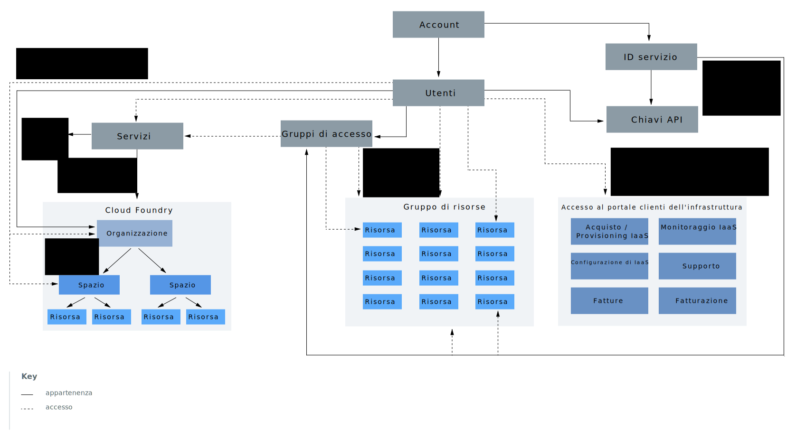

---

copyright:

  years: 2018
lastupdated: "2018-10-08"

---

{:shortdesc: .shortdesc}
{:codeblock: .codeblock}
{:screen: .screen}
{:tip: .tip}
{:new_window: target="_blank"}

# Gerarchia degli account
{: #overview}

Il tuo account {{site.data.keyword.Bluemix}} include molti componenti e sistemi che interagiscono. Il seguente diagramma e la spiegazione per ciascun componente mirano ad aiutarti a comprendere in che modo alcuni componenti sono connessi e come funziona l'accesso nell'ambito dell'account. 

All'interno del diagramma, sono presenti due concetti principali per i componenti nella gerarchia dell'account che è importante comprendere. L'utilizzo delle linee continue e delle linee tratteggiate aiuta ad illustrare che alcuni componenti sono contenuti all'interno di altri, ad esempio gli utenti vengono aggiunti ai gruppi di accesso o alle organizzazioni Cloud Foundry. Tuttavia, alcuni componenti interagiscono con altri allo scopo di fornire l'accesso invece dell'appartenenza. Ad esempio, agli utenti viene concesso l'accesso ai gruppi di risorse ma non sono membri di un gruppo di risorse nello stesso modo in cui lo sono per i gruppi di accesso. Questi concetti sono spiegati anche nelle seguenti sezioni.

<dl>
<dt>Utenti</dt>
<dd>Gli utenti sono invitati all'account e viene loro concesso l'accesso alle risorse nell'account.</dd>
<dt>ID servizio</dt>
<dd>Un ID servizio identifica un servizio o un'applicazione analogamente a come un ID utente identifica un utente. Puoi utilizzare un ID servizio da te creato per abilitare un'applicazione esterna a {{site.data.keyword.Bluemix_notm}} ad accedere ai tuoi servizi {{site.data.keyword.Bluemix_notm}}. Puoi assegnare delle specifiche politiche di accesso all'ID servizio che limitano le autorizzazioni per l'utilizzo di specifici servizi o anche combinare le autorizzazioni per l'accesso a servizi differenti. Poiché gli ID servizio non sono collegati a uno specifico utente, se capita che un utente lasci un'organizzazione e venga eliminato dall'account, l'ID servizio rimane, garantendo che la tua applicazione o il tuo servizio continuino a essere attivi e in esecuzione. Per ulteriori informazioni, vedi [Creazione e gestione degli ID servizio](/docs/iam/serviceid.html#serviceids).</dd>
<dt>Risorse o istanze del servizio</dt>
<dd>I servizi in {{site.data.keyword.Bluemix_notm}} sono un gruppo di risorse o basati su Cloud Foundry. Le istanze del servizio che possono essere aggiunte a un gruppo di risorse e gestite utilizzando {{site.data.keyword.Bluemix_notm}} IAM (Identity and Access Management) sono dette risorse. Le istanze del servizio che vengono aggiunte agli spazi e alle organizzazioni Cloud Foundry hanno un sistema di gestione dell'accesso separato mediante l'utilizzo di ruoli Cloud Foundry. Per ulteriori informazioni, vedi [Che cosa è una risorsa?](/docs/resources/acct_resources.html#resource)</dd>
<dt>Chiavi API</dt>
<dd>Una chiave API (application programming interface) è un codice univoco passato a una API (application programming interface) per identificare l'applicazione o l'utente chiamante. Ci sono delle chiavi API della piattaforma associate alle identità utente e ci sono delle chiavi API che possono essere create per gli ID servizio. Per ulteriori informazioni, vedi [Gestione delle chiavi API](/docs/iam/apikeys.html#manapikey).</dd>
<dt>Gruppi di accesso</dt>
<dd>Puoi creare un gruppo di accesso per organizzare un insieme di utenti e ID servizio in una sola entità e assegnare facilmente le autorizzazioni. Puoi assegnare una sola politica al gruppo invece di assegnare lo stesso accesso più volte per ogni utente o ID del servizio individuale. Per ulteriori informazioni, vedi [Configurazione dei gruppi di accesso](/docs/iam/groups.html#groups).</dd>
<dt>Gruppo di risorse</dt>
<dd>Un gruppo di risorse è un modo per organizzare le risorse dell'account in raggruppamenti personalizzabili, in modo da poter assegnare rapidamente agli utenti l'accesso a più di una risorsa alla volta. Qualsiasi risorsa dell'account gestita attraverso il controllo dell'accesso IAM (Identity and Access Management) appartiene a un gruppo di risorse all'interno del tuo account. Gli utenti non vengono aggiunti ai gruppi di risorse ma ad essi viene concesso l'accesso alle risorse all'interno oppure possono gestire il gruppo di risorse. Gli utenti a cui viene concesso l'accesso per gestire il gruppo di risorse possono creare nuove istanze all'interno del gruppo, gestire l'accesso di altri utenti per gestire il gruppo oppure modificare il nome del gruppo in base al ruolo IAM assegnato. Per ulteriori informazioni, vedi [Gestione di gruppi di risorse](/docs/resources/resourcegroups.html#rgs) e [Prassi ottimali per organizzare le risorse nei gruppi di risorse](/docs/resources/bestpractice_rgs.html#bp_resourcegroups).</dd>
<dt>Organizzazioni Cloud Foundry</dt>
<dd>In qualità di proprietario dell'account o gestore dell'organizzazione, puoi aggiungere organizzazioni e spazi dalla pagina delle organizzazioni Cloud Foundry nella console. I servizi che supportano l'utilizzo delle organizzazioni e degli spazi Cloud Foundry vengono aggiunti a un'organizzazione e a uno spazio quando li crei dal catalogo. Le organizzazioni contengono utenti, domini e quote. All'interno di ogni organizzazione, vengono aggiunti degli spazi, che contengono le istanze del servizio. Per ulteriori informazioni, vedi [Aggiunta di organizzazioni e spazi](/docs/account/orgs_spaces.html#orgsspacesusers).</dd>
<dt>Spazi Cloud Foundry</dt>
<dd>All'interno di un'organizzazione, puoi utilizzare gli spazi per raggruppare un insieme di applicazioni, servizi e utenti. Gli spazi sono collegati a una specifica
regione in {{site.data.keyword.Bluemix_notm}}. Puoi creare gli spazi in un'organizzazione in base al ciclo di vita della distribuzione. Ad esempio, puoi creare uno spazio dev come un ambiente di sviluppo,
uno spazio test come un ambiente di test e uno spazio production come un ambiente di produzione. Puoi quindi associare
le tue applicazioni agli spazi. Per ulteriori informazioni, vedi [Aggiunta di organizzazioni e spazi](/docs/account/orgs_spaces.html#orgsspacesusers).</dd>
</dl>

Un altro aspetto importante del diagramma è la raffigurazione dei tre tipi di sistemi di gestione dell'accesso che puoi utilizzare per fornire agli utenti dell'account l'accesso alle risorse all'interno dell'account. 

* I [ruoli di accesso](/docs/iam/users_roles.html#iamusermanrol) IAM sono utilizzati per fornire agli utenti l'accesso a tutte le risorse che appartengono a un gruppo di risorse. Questi ruoli di accesso vengono aggiunti anche per concedere agli utenti l'accesso per gestire i gruppi di risorse e creare delle nuove istanze del servizio che vengono assegnate a un gruppo di risorse.
* I [ruoli di spazio e organizzazione](/docs/iam/cfaccess.html#cfroles) Cloud Foundry sono utilizzati per fornire agli utenti l'accesso a qualsiasi istanza del servizio che si trova in uno spazio Cloud Foundry.
* Le autorizzazioni del [portale clienti](/docs/customer-portal/cpwhatis.html#customerportal_whatisCP) dell'infrastruttura sono disponibili per concedere agli utenti delle [autorizzazioni](/docs/iam/infrastructureaccess.html#infrapermission) granulari per l'accesso al portale clienti e le funzioni al suo interno quali le fatture, la fatturazione, la configurazione, il monitoraggio e l'acquisto di IaaS e il supporto. L'accesso al dispositivo è separato e gestito dal dispositivo stesso.
