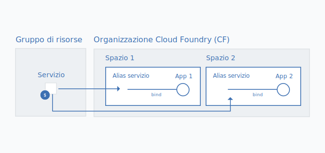

---

copyright:

  years: 2017, 2018

lastupdated: "2018-04-26"

---

{:shortdesc: .shortdesc}
{:codeblock: .codeblock}
{:screen: .screen}
{:new_window: target="_blank"}
{:gif: data-image-type='gif'}
{:tip: .tip}

# Migrazione di istanze del servizio Cloud Foundry a un gruppo di risorse
{: #migrate}

Man mano che i servizi passano dall'utilizzare organizzazioni, spazi e ruoli Cloud Foundry all'utilizzare Cloud IAM (Identity and Access Management) e gruppi di risorse, puoi eseguire la migrazione delle tue istanze del servizio Cloud Foundry a un [gruppo di risorse](/docs/account/resourcegroups.html#rgs). La migrazione delle istanze del servizio a un gruppo di risorse offre diversi vantaggi, tra cui un controllo dell'accesso più dettagliato utilizzando i ruoli IAM e la connessione delle istanze del servizio ad applicazioni e servizi in regioni differenti.

Quando un servizio esegue il passaggio da Cloud Foundry, un messaggio nel tuo dashboard ti chiede di migrare le tue istanze del servizio esistenti. Puoi identificare i servizi che sono pronti alla migrazione in base all'icona .
{:shortdesc}

Quando migri le istanze del servizio Cloud Foundry esistenti a un gruppo di risorse, il gruppo che scegli non può essere modificato dopo il completamento della migrazione. Assicurati pertanto di pianificare il modo in cui desideri organizzare le risorse nell'account prima di eseguire la migrazione. Questo potrebbe voler dire che devi creare uno o più gruppi di risorse, se hai un account fatturabile, prima della migrazione. Puoi provare a organizzare le tue risorse in gruppo di risorse nello stesso modo in cui hai organizzato le risorse negli spazi Cloud Foundry.
{: tip}

## Perché migrare le istanze del servizio?

I servizi che supportano il controllo dell'accesso e l'organizzazione Cloud IAM in gruppi di risorse dispongono di diversi vantaggi quali la possibilità di connettersi ad applicazioni e servizi da qualsiasi spazio Cloud Foundry, cosa che consente connessioni per applicazioni e servizi da regioni differenti. Per creare la connessione, puoi creare un alias di un'istanza da un gruppo di risorse in uno spazio Cloud Foundry. Quando esegui la migrazione, la connessione viene eseguita automaticamente trasformando la tua istanza del servizio Cloud Foundry originale in un alias e creando un'istanza collegata in un gruppo di risorse a tua scelta.

Inoltre, ciascuna istanza gestita da Cloud IAM appartiene a un gruppo di risorse. I gruppi di risorse non sono definiti dalla regione e puoi pertanto eseguire il provisioning di applicazioni e servizi da diverse regioni nello stesso gruppo di risorse. Puoi anche avvalerti di un controllo dell'accesso dettagliato a un livello di singola istanza.

## Chi può migrare le istanze del servizio?
{: #whocanmigrate}

Gli utenti devono disporre di un accesso specifico per migrare le istanze del servizio Cloud Foundry a un gruppo di risorse:

* Un utente deve avere il ruolo di sviluppatore sullo spazio Cloud Foundry o il ruolo Cloud Foundry di gestore organizzazione sull'organizzazione a cui appartiene l'istanza.
* Un utente deve avere almeno il ruolo IAM di visualizzatore per gestire il gruppo di risorse a cui sarà migrata l'istanza.
* Un utente deve avere almeno il ruolo IAM di editor sul servizio.

Per ulteriori informazioni sull'assegnazione dell'accesso corretto, vedi [Accesso Cloud Foundry](/docs/iam/cfaccess.html#cfaccess) e [Accesso IAM](/docs/iam/users_roles.html#platformrolestable).

Per controllare qual è l'accesso di cui disponi, dalla barra dei menu fai clic su **Gestisci** &gt; **Sicurezza** &gt; **Identità e accesso** e quindi fai clic su **Utenti**. Fai quindi clic sul tuo nome ed esamina le tue **Politiche di accesso** per i ruoli IAM assegnati e **Accesso Cloud Foundry** per visualizzare quali sono le organizzazioni a cui hai accesso e i tuoi ruoli Cloud Foundry assegnati.
{: tip}

## Come funziona la migrazione?

Quando esegui la migrazione di un'istanza del servizio da un'organizzazione e uno spazio Cloud Foundry a un gruppo di risorse, viene creata una nuova istanza del servizio collegata nel gruppo di risorse. L'istanza originale nell'organizzazione o spazio Cloud Foundry diventa un [alias](/docs/cfapps/connecting_apps.html#what_is_alias). L'alias viene conteggiato nella quota per la tua organizzazione ma ti viene addebitato l'utilizzo dell'istanza del servizio nel gruppo di risorse.

{: gif}

Puoi migrare le tue istanze del servizio una per volta quando ricevi la notifica nel dashboard dall'icona  associata alla tua istanza del servizio Cloud Foundry.

1. Apri il menu **Ulteriori azioni**.
2. Per iniziare, seleziona **Migra a un gruppo di risorse**.
3. Seleziona un gruppo di risorse.
4. Fai clic su **Migra**; l'istanza viene migrata per tuo conto.
5. Poiché puoi migrare solo un'istanza per volta, puoi continuare a migrare le istanze idonee dopo che hai migrato la prima.

Dopo che hai correttamente migrato un'istanza, la visualizzi nella sezione dei servizi del tuo dashboard. L'alias rimane nella sezione Cloud Foundry del dashboard. Puoi utilizzare l'icona  nella sezione Cloud Foundry del dashboard per identificare gli alias.

## Risoluzione dei problemi

Se riscontri eventuali problemi di migrazione delle istanze del servizio Cloud Foundry, consulta [Risoluzione dei problemi relativi alla migrazione delle istanze del servizio](/docs/troubleshoot/ts_migration.html).
