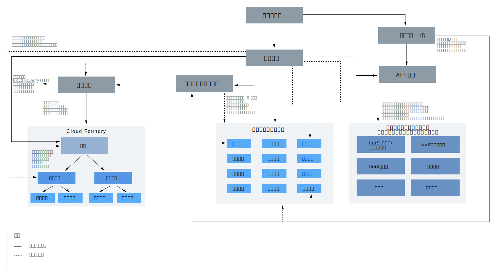

---

copyright:
  years: 2019
lastupdated: "2019-02-12"

keywords: IBM Cloud account, account differences, resources, access

subcollection: account

---

{:shortdesc: .shortdesc}
{:codeblock: .codeblock}
{:screen: .screen}
{:tip: .tip}
{:new_window: target="_blank"}

# アカウント階層
{: #overview}

{{site.data.keyword.Bluemix}} アカウントには、相互に作用する多くの要素とシステムが含まれています。 ここでは、それらの要素がどのように結び付いているのか、およびアカウント全体でアクセス権限がどのように機能するのかについて説明します。
{:shortdesc}

図の中には、アカウント階層内の要素に関する 2 つの主な概念があり、これらの概念を理解することが重要です。 実線と点線によって、一部の要素が他の要素内に含まれている ( 例えば、ユーザーはアクセス・グループまたは Cloud Foundry の組織に追加される) ことがわかります。 ただし、いくつかの要素は、メンバーシップではなくアクセス権限を提供するために他の要素と相互作用します。 例えば、ユーザーにはリソース・グループへのアクセス権限が付与されますが、リソース・グループのメンバーにはアクセス・グループの場合と同じ方法では付与されません。 このような概念は、以下のセクションでも説明します。

<dl>
<dt>ユーザー</dt>
<dd>ユーザーはアカウントに招待され、アカウント内のリソースへのアクセス権限を付与されます。</dd>
<dt>サービス ID</dt>
<dd>ユーザー ID がユーザーを識別するのと同様の方法で、サービス ID はサービスまたはアプリケーションを識別します。 作成するサービス ID を使用して、{{site.data.keyword.Bluemix_notm}} の外部にあるアプリケーションがサービスにアクセスできるようにすることができます。 このサービス ID には、特定のサービスを使用するための許可を制限したり、さまざまなサービスにアクセスするための許可を結合したりする特定のアクセス・ポリシーを割り当てることができます。 サービス ID は特定のユーザーに結合されているわけではないため、ユーザーが組織を辞めてアカウントから削除されるようなことがあっても、サービス ID はそのまま残り、アプリケーションまたはサービスが確実に稼働し続けるようにします。 詳しくは、『[サービス ID の作成と処理](/docs/iam?topic=iam-serviceids#serviceids)』を参照してください。</dd>
<dt>サービス・インスタンスまたはリソース</dt>
<dd>{{site.data.keyword.Bluemix_notm}} のサービスは、リソース・グループ・ベースまたは Cloud Foundry ベースのいずれかです。 リソース・グループに追加して、{{site.data.keyword.Bluemix_notm}} Identity and Access Management (IAM) を使用して管理できるサービス・インスタンスは、リソースと呼ばれます。 Cloud Foundry の組織およびスペースに追加されるサービス・インスタンスは、Cloud Foundry 役割を使用する別のアクセス管理システムを持ちます。 詳しくは、『[リソースとは](/docs/resources?topic=resources-resource#resource)』を参照してください。</dd>
<dt>API キー</dt>
<dd>API キーは、呼び出し側のアプリケーションまたはユーザーを識別するために API に渡される固有のコードです。 ユーザー ID に関連付けられているプラットフォーム API キーを使用することができます。また、サービス ID 用の他の API キーを作成することができます。 詳しくは、『[API キーについて](/docs/iam?topic=iam-manapikey#manapikey)』を参照してください。</dd>
<dt>アクセス・グループ</dt>
<dd>アクセス・グループを作成して、ユーザーとサービス ID のセットを単一のエンティティーに編成して、許可を簡単に割り当てることができます。 個々のユーザーまたはサービス ID ごとに同じアクセス権限を複数回割り当てるのではなく、単一のポリシーをグループに割り当てることができます。 詳しくは、[アクセス・グループのセットアップ](/docs/iam?topic=iam-groups#groups)を参照してください。</dd>
<dt>リソース・グループ</dt>
<dd>リソース・グループを使用して、カスタマイズ可能なグループにアカウント・リソースを編成することができ、これにより、複数リソースへのアクセス権限を一度に素早くユーザーに割り当てることができます。 IAM のアクセス制御を使用して管理されるすべてのアカウント・リソースが、アカウント内のリソース・グループに属します。 ユーザーはリソース・グループに追加されませんが、ユーザーにはリソース・グループ内のリソースへのアクセス権限が付与され、ユーザーはリソース・グループを管理することができます。 リソース・グループを管理するためにアクセス権限を付与されたユーザーは、グループ内に新規インスタンスを作成したり、グループを操作するためにその他のユーザーのアクセス権限を管理したり、割り当てられた IAM 役割に基づいてグループ名を編集したりすることができます。 詳しくは、『[リソース・グループの管理](/docs/resources?topic=resources-rgs#rgs)』および『[リソースをリソース・グループに編成するためのベスト・プラクティス](/docs/resources?topic=resources-bp_resourcegroups#bp_resourcegroups)』を参照してください。</dd>
<dt>Cloud Foundry の組織</dt>
<dd>アカウント所有者または組織管理者は、コンソールの「Cloud Foundry の組織」ページから組織とスペースを追加することができます。 Cloud Foundry の組織とスペースの使用をサポートするサービスをカタログから作成すると、これらのサービスが組織とスペースに追加されます。 組織には、ユーザー、ドメイン、および割り当て量が含まれています。 各組織内には、サービス・インスタンスを含むスペースが追加されます。 詳しくは、『[組織およびスペースの追加](/docs/account?topic=account-orgsspacesusers#orgsspacesusers)』を参照してください。</dd>
<dt>Cloud Foundry スペース</dt>
<dd>組織内でスペースを使用して、
アプリケーション、サービス、およびユーザーのセットをグループ化することができます。 スペースは、{{site.data.keyword.Bluemix_notm}} 内の特定の地域に関連付けられます。 デリバリー・ライフサイクルに基づいて、組織内にスペースを作成できます。 例えば、開発環境として dev というスペース、テスト環境として test というスペース、実稼働環境として production というスペースを作成できます。 その後、各スペースにアプリを関連付けることができます。 詳しくは、『[組織およびスペースの追加](/docs/account?topic=account-orgsspacesusers#orgsspacesusers)』を参照してください。</dd>
</dl>

上の図の別の重要な側面は、アカウント内のリソースへのアクセス権限をアカウント・ユーザーに付与するために使用できる 3 つのタイプのアクセス管理システムの描画です。

  * IAM [アクセス役割](/docs/iam?topic=iam-iamusermanrol#iamusermanrol)を使用して、特定のリソース・グループに属するすべてのリソースへのアクセス権限をユーザーに付与できます。 リソース・グループの管理およびリソース・グループに割り当てられる新規サービス・インスタンスの作成を行うためのアクセス権限をユーザーに付与することもできます。
  * Cloud Foundry [組織とスペースの役割](/docs/iam?topic=iam-cfroles#cfroles)を使用して、特定の Cloud Foundry スペース内にあるすべてのサービス・インスタンスへのアクセス権限をユーザーに付与できます。
  * クラシック・インフラストラクチャーの許可を使用して、クラシック・インフラストラクチャー用に、より細分化された[許可](/docs/iam?topic=iam-infrapermission#infrapermission)をユーザーに付与できます。 デバイス・アクセス権限と VPN サブネット・アクセス権限は別々に割り当てます。
