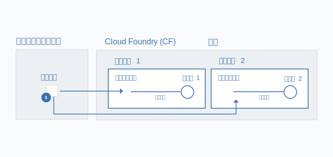

---

copyright:

  years: 2017, 2018

lastupdated: "2018-04-26"

---

{:shortdesc: .shortdesc}
{:codeblock: .codeblock}
{:screen: .screen}
{:new_window: target="_blank"}
{:gif: data-image-type='gif'}
{:tip: .tip}

# リソース・グループへの Cloud Foundry サービス・インスタンスのマイグレーション
{: #migrate}

サービスが Cloud Foundry の組織、スペース、および役割の使用から Cloud の ID およびアクセス管理 (IAM) とリソース・グループの使用に移るのに合わせて、Cloud Foundry サービス・インスタンスを[リソース・グループ](/docs/account/resourcegroups.html#rgs)にマイグレーションできます。サービス・インスタンスをリソース・グループにマイグレーションすると、IAM 役割の使用することと、さまざまな地域のアプリおよびサービスにサービス・インスタンスを接続することによるきめ細かいアクセス管理など、いくつかの利点があります。

サービスが Cloud Foundry から移ると、既存のサービス・インスタンスをマイグレーションするように促すプロンプトがダッシュボードに表示されます。 アイコンによって、マイグレーションする準備ができているサービスを識別できます。
{:shortdesc}

既存の Cloud Foundry サービス・インスタンスをリソース・グループにマイグレーションする場合、選択したグループをマイグレーション完了後に変更することはできません。そのため、マイグレーションを行う前に、アカウント内でリソースをどのように編成するのかを計画するようにしてください。これは、請求可能アカウントをお持ちの場合に、マイグレーション前に 1 つ以上のリソース・グループを作成する必要があることを意味する場合があります。Cloud Foundry スペースでリソースを編成していたのと同じ編成でリソースをリソース・グループに入れることもできます。
{: tip}

## サービス・インスタンスをマイグレーションする理由

Cloud IAM アクセス制御およびリソース・グループ内の組織をサポートするサービスには、いくつかのメリットがあります。その 1 つが、任意の Cloud Foundry スペースのアプリおよびサービスに接続できる機能であり、これにより、さまざまな地域からのアプリおよびサービスの接続が可能になります。接続を作成するために、Cloud Foundry スペース内に、リソース・グループからのインスタンスの別名を作成できます。マイグレーションすると、元の Cloud Foundry サービス・インスタンスを別名にし、選択したリソース・グループ内にリンクされたインスタンスを作成することによって、接続は自動的に行われます。

さらに、Cloud IAM で管理される各インスタンスは、リソース・グループに属します。 リソース・グループは地域で範囲設定されないため、異なる地域のアプリおよびサービスを同じリソース・グループにプロビジョンできます。 個々のインスタンス・レベルでのきめ細かなアクセス制御を利用することもできます。

## サービス・インスタンスをマイグレーションできるユーザー
{: #whocanmigrate}

Cloud Foundry サービス・インスタンスをリソース・グループにマイグレーションするには、ユーザーは特定のアクセス権限を持っている必要があります。

* ユーザーは、Cloud Foundry スペースに対する開発者役割、または、インスタンスが属する組織に対する組織管理者 Cloud Foundry 役割を持っている必要があります。
* ユーザーは、インスタンスのマイグレーション先リソース・グループを管理するために、少なくともビューアー IAM 役割を持っている必要があります。
* ユーザーは、サービスに対して少なくともエディター IAM 役割を持っている必要があります。

正しいアクセス権限の割り当てについて詳しくは、『[Cloud Foundry アクセス権限](/docs/iam/cfaccess.html#cfaccess)』および『[IAM アクセス権限](/docs/iam/users_roles.html#platformrolestable)』を参照してください。

どのアクセス権限を持っているのかを確認するには、メニュー・バーで、**「管理」** &gt; **「セキュリティー」** &gt; **「ID およびアクセス」**をクリックし、**「ユーザー」**をクリックします。次に、自分の名前をクリックし、割り当てられた IAM 役割を**「アクセス・ポリシー」**で確認し、アクセスできる組織および割り当てられた Cloud Foundry 役割を**「Cloud Foundry アクセス権限」**で確認します。
{: tip}

## マイグレーションの仕組み

サービス・インスタンスを Cloud Foundry の組織とスペースからリソース・グループにマイグレーションすると、新しくリンクされたサービス・インスタンスがリソース・グループ内に作成されます。Cloud Foundry の組織とスペース内の元のインスタンスは[別名](/docs/cfapps/connecting_apps.html#what_is_alias)になります。 別名は、組織の割り当て量に計上されますが、請求対象になるのはリソース・グループ内のサービス・インスタンスの使用です。

{: gif}

Cloud Foundry サービス・インスタンスと関連付けられた  アイコンによってダッシュボードで通知されたら、一度に 1 つずつサービス・インスタンスをマイグレーションできます。

1. **「その他のアクション」**メニューを開きます。
2. **「リソース・グループへのマイグレーション (Migrate to a resource group)」**を選択して開始します。
3. リソース・グループを選択します。
4. **「マイグレーション」**をクリックします。そうすると、インスタンスがマイグレーションされます。
5. 一度にマイグレーションできるインスタンスは 1 つのみであるため、最初のマイグレーションが終わったら、マイグレーション可能なインスタンスのマイグレーションを続けることができます。

インスタンスが正常にマイグレーションされたら、ダッシュボードの「サービス」セクションでそれが反映されたことを確認できます。別名は、ダッシュボードの「Cloud Foundry」セクションに残ります。 ダッシュボードの Cloud Foundry セクションで  を使用して、別名を識別できます。

## トラブルシューティング

Cloud Foundry サービス・インスタンスのマイグレーションで問題が発生した場合は、『[サービス・インスタンスのマイグレーションに関するトラブルシューティング](/docs/troubleshoot/ts_migration.html)』を参照してください。
