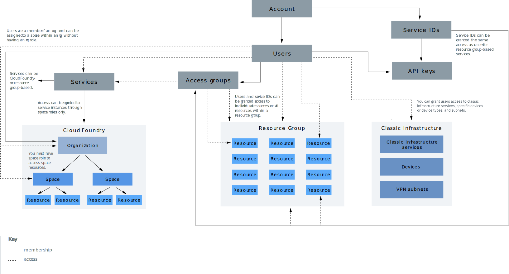

---

copyright:

  years: 2019
lastupdated: "2019-02-12"

---

{:shortdesc: .shortdesc}
{:codeblock: .codeblock}
{:screen: .screen}
{:tip: .tip}
{:new_window: target="_blank"}

# 계정 계층 구조
{: #overview}

{{site.data.keyword.Bluemix}} 계정에는 상호작용하는 여러 컴포넌트와 시스템이 포함되어 있습니다. 특정 컴포넌트가 연결된 방법과 계정에서 액세스가 작동하는 방법을 알아보십시오.
{:shortdesc}

다이어그램 내에는 이해해야 할 계정 계층 구조의 컴포넌트에 대한 두 가지 기본 개념이 있습니다. 실선과 점선을 사용하여 일부 컴포넌트가 다른 컴포넌트 내에 포함되어 있음(예: 사용자가 액세스 그룹 또는 Cloud Foundry 조직에 추가됨)을 나타내는 데 도움을 줍니다. 그러나 일부 컴포넌트는 멤버십 대신 액세스 제공을 위해 기타 컴포넌트와 상호작용합니다. 예를 들어, 사용자는 리소스 그룹에 대한 액세스를 부여받지만 액세스 그룹에 대한 것과 동일한 방식으로 리소스 그룹의 구성원은 아닙니다. 이러한 개념은 다음 섹션에도 설명되어 있습니다.

<dl>
<dt>사용자</dt>
<dd>사용자는 계정에 초대되고 계정의 리소스에 대한 액세스를 부여받습니다.</dd>
<dt>서비스 ID</dt>
<dd>서비스 ID는 사용자 ID가 사용자를 식별하는 것과 유사한 방법으로 서비스 또는 애플리케이션을 식별합니다. 작성된 서비스 ID를 사용하여 {{site.data.keyword.Bluemix_notm}} 외부의 애플리케이션이 서비스에 액세스하도록 허용할 수 있습니다. 특정 서비스 사용을 위해 권한을 제한하거나 여러 서비스에 액세스하기 위해 권한을 결합하는 특정 액세스 정책을 서비스 ID에 지정할 수 있습니다. 서비스 ID가 특정 사용자에 연계되어 있지 않으므로 사용자가 우연히 조직에서 나가고 계정에서 삭제되어도 서비스 ID는 그대로 유지되며, 이에 따라 애플리케이션 또는 서비스는 여전히 구동되어 실행됩니다. 자세한 정보는 [서비스 ID 작성 및 관련 작업 수행](/docs/iam?topic=iam-serviceids#serviceids)을 참조하십시오.</dd>
<dt>서비스 인스턴스 또는 리소스</dt>
<dd>{{site.data.keyword.Bluemix_notm}}의 서비스는 리소스 그룹 또는 Cloud Foundry 기반입니다. 리소스 그룹에 추가되고 {{site.data.keyword.Bluemix_notm}} Identity and Access Management(IAM)를 사용하여 관리될 수 있는 서비스 인스턴스를 리소스라고 합니다. Cloud Foundry 조직 및 영역에 추가되는 서비스 인스턴스에는 Cloud Foundry 역할을 사용하는 별도의 액세스 관리 시스템이 있습니다. 자세한 정보는 [리소스의 개념](/docs/resources?topic=resources-resource#resource)을 참조하십시오.</dd>
<dt>API 키</dt>
<dd>API 키는 호출 애플리케이션이나 사용자를 식별하기 위해 API에 전달되는 고유 코드입니다. 사용자 ID와 연관된 플랫폼 API 키를 사용할 수 있으며 서비스 ID에 대해 기타 API 키를 작성할 수 있습니다. 자세한 정보는 [API 키 이해하기](/docs/iam?topic=iam-manapikey#manapikey)를 참조하십시오.</dd>
<dt>액세스 그룹</dt>
<dd>액세스 그룹을 작성하여 사용자 및 서비스 ID 세트를 단일 엔티티로 구성하고 권한을 쉽게 지정할 수 있습니다. 개별 사용자 또는 서비스 ID마다 동일한 액세스를 여러 번 지정하는 대신 그룹에 단일 정책을 지정할 수 있습니다. 자세한 정보는 [액세스 그룹 설정](/docs/iam?topic=iam-groups#groups)을 참조하십시오.</dd>
<dt>리소스 그룹</dt>
<dd>리소스 그룹을 사용하면 한 번에 둘 이상의 리소스에 대한 사용자 액세스를 신속하게 지정할 수 있도록 사용자 정의할 수 있는 그룹화에서 계정 리소스를 구성할 수 있습니다. IAM 액세스 제어를 사용하여 관리되는 계정 리소스는 계정 내의 리소스 그룹에 속합니다. 사용자는 리소스 그룹에 추가되지 않지만 사용자에게 리소스 그룹 내의 리소스에 대한 액세스가 제공되거나 사용자가 리소스 그룹을 관리할 수 있습니다. 리소스 그룹을 관리하기 위한 액세스 권한을 부여받은 사용자는 그룹 내에 새 인스턴스를 작성하거나, 다른 사용자의 그룹 작업 액세스 권한을 관리하거나, 지정된 IAM 역할을 기반으로 그룹 이름을 편집할 수 있습니다. 자세한 정보는 [리소스 그룹 관리](/docs/resources?topic=resources-rgs#rgs) 및 [리소스 그룹의 리소스 구성 우수 사례](/docs/resources?topic=resources-bp_resourcegroups#bp_resourcegroups)를 참조하십시오.</dd>
<dt>Cloud Foundry 조직</dt>
<dd>계정 소유자 또는 조직 관리자는 콘솔의 Cloud Foundry 조직 페이지에서 조직 및 영역을 추가할 수 있습니다. 카탈로그에서 작성할 때 Cloud Foundry 조직 및 영역의 사용을 지원하는 서비스가 조직 및 영역에 추가됩니다. 조직에는 사용자, 도메인 및 할당량이 포함됩니다. 각 조직 내에서 서비스 인스턴스를 포함하는 영역이 추가됩니다. 자세한 정보는 [조직 및 영역 추가](/docs/account?topic=account-orgsspacesusers#orgsspacesusers)를 참조하십시오.</dd>
<dt>Cloud Foundry 영역</dt>
<dd>조직 내에서는 영역을 사용하여 애플리케이션, 서비스 및 사용자 세트를 그룹화할 수 있습니다. 영역은 {{site.data.keyword.Bluemix_notm}}에서 특정 지역과 연계됩니다. 전달 라이프사이클을 기반으로 조직에서 영역을 작성할 수 있습니다. 예를 들어, 개발 영역을 개발 환경으로, 테스트 영역을 테스트 환경으로, 프로덕션 영역을 프로덕션 환경으로 작성할 수 있습니다. 그런 다음, 앱을 영역과 연관시킬 수 있습니다. 자세한 정보는 [조직 및 영역 추가](/docs/account?topic=account-orgsspacesusers#orgsspacesusers)를 참조하십시오.</dd>
</dl>

이전 다이어그램의 또 다른 중요한 측면은 계정 사용자에게 계정 내의 리소스에 대한 액세스를 제공하는 데 사용할 수 있는 세 가지 유형의 액세스 관리 시스템에 대한 설명입니다.

  * IAM [액세스 역할](/docs/iam?topic=iam-iamusermanrol#iamusermanrol)을 사용하여 사용자에게 리소스 그룹에 속한 모든 리소스에 대한 액세스를 제공할 수 있습니다. 또한 사용자에게 리소스 그룹을 관리하고 리소스 그룹에 지정된 새 서비스 인스턴스를 작성하기 위한 액세스 권한을 부여할 수도 있습니다.
  * Cloud Foundry [조직 및 영역 역할](/docs/iam?topic=iam-cfroles#cfroles)을 사용하여 사용자에게 Cloud Foundry 영역에 상주하는 서비스 인스턴스에 대한 액세스를 제공할 수 있습니다.
  * 클래식 인프라 권한을 사용하여 사용자에게 클래식 인프라에 대한 보다 세부 단위의 [권한](/docs/iam?topic=iam-infrapermission#infrapermission)을 부여할 수 있습니다. 디바이스 액세스 및 VPN 서브넷 액세스는 별도로 지정합니다.
