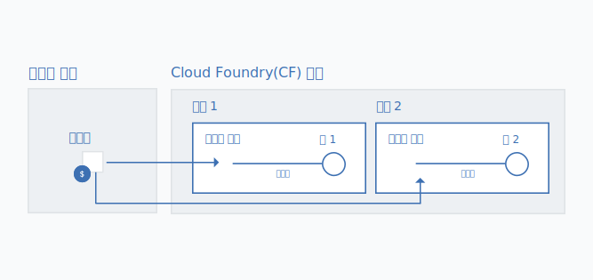

---

copyright:

  years: 2017, 2018

lastupdated: "2018-04-26"

---

{:shortdesc: .shortdesc}
{:codeblock: .codeblock}
{:screen: .screen}
{:new_window: target="_blank"}
{:gif: data-image-type='gif'}
{:tip: .tip}

# Cloud Foundry 서비스 인스턴스를 리소스 그룹으로 마이그레이션
{: #migrate}

서비스가 Cloud Foundry 조직, 영역 및 역할 사용에서 Cloud Identity and Access Management(IAM) 및 리소스 그룹 사용으로 바뀌면 Cloud Foundry 서비스 인스턴스를 [리소스 그룹](/docs/account/resourcegroups.html#rgs)에 마이그레이션할 수 있습니다. 서비스 인스턴스를 리소스 그룹에 마이그레이션하면 IAM 역할을 사용하고 서비스 인스턴스를 다른 지역의 앱과 서비스에 연결함으로써 세분화된 액세스 제어를 포함하는 여러 가지 이점을 누릴 수 있습니다. 

서비스가 Cloud Foundry에서 이동하는 경우 대시보드의 메시지를 통해 기존 서비스 인스턴스를 마이그레이션하도록 프롬프트가 표시됩니다.  아이콘으로 마이그레이션할 준비가 되어 있는 서비스를 식별할 수 있습니다.
{:shortdesc}

기존 Cloud Foundry 서비스 인스턴스를 리소스 그룹에 마이그레이션하는 경우 사용자가 선택한 그룹을 마이그레이션이 완료된 후에 변경할 수 없습니다. 따라서 마이그레이션하기 전에 계정에서 리소스를 구성하려는 방법을 먼저 계획해야 합니다. 이는 청구 가능한 계정이 있는 경우 마이그레이션 전에 하나 이상의 리소스 그룹을 작성해야 한다는 것을 의미할 수 있습니다. Cloud Foundry 영역에서 리소스를 구성한 방법과 동일한 방법으로 사용자 리소스를 리소스 그룹으로 구성할 수 있습니다.
{: tip}

## 서비스 인스턴스를 마이그레이션하는 이유는 무엇입니까?

리소스 그룹 내에서 Cloud IAM 액세스 제어 및 조직을 지원하는 서비스는 Cloud Foundry 영역의 앱과 서비스에 연결하는 기능과 같은 여러 가지 이점이 있으며 이를 통해 다른 지역의 앱과 서비스에 대한 연결이 허용됩니다. 연결을 작성하기 위해 Cloud Foundry 영역에 있는 리소스 그룹의 인스턴스에 대한 별명을 작성할 수 있습니다. 마이그레이션하는 경우 원래 Cloud Foundry 서비스 인스턴스를 별명으로 변경하고 연결된 인스턴스를 선택한 리소스 그룹에 작성하면 연결이 자동으로 작성됩니다. 

또한 Cloud IAM에서 관리하는 각 인스턴스는 리소스 그룹에 속합니다. 리소스 그룹은 지역별 범위가 아니므로 다른 지역의 앱과 서비스를 동일한 리소스 그룹에 프로비저닝할 수 있습니다. 또한 개별 인스턴스 레벨에서 세분화된 액세스 제어를 활용할 수 있습니다. 

## 누가 서비스 인스턴스를 마이그레이션할 수 있습니까?
{: #whocanmigrate}

Cloud Foundry 서비스 인스턴스를 리소스 그룹에 마이그레이션하려면 사용자에게 특정 액세스 권한이 있어야 합니다.

* 사용자는 Cloud Foundry 영역의 개발자 역할 또는 인스턴스가 속한 조직의 조직 관리자 Cloud Foundry 역할이 있어야 합니다.
* 사용자는 인스턴스가 마이그레이션될 리소스 그룹을 관리하려면 뷰어 이상의 IAM 역할이 있어야 합니다.
* 사용자는 서비스의 편집자 이상의 IAM 역할이 있어야 합니다.

올바른 액세스 지정에 대한 자세한 정보는 [Cloud Foundry 액세스](/docs/iam/cfaccess.html#cfaccess) 및 [IAM 액세스](/docs/iam/users_roles.html#platformrolestable)를 참조하십시오.

사용자가 가지고 있는 액세스가 무엇인지 확인하려면 메뉴 표시줄에서 **관리** &gt; **보안** &gt; **ID 및 액세스**를 클릭한 후에 **사용자**를 클릭하십시오. 그런 다음, 이름을 클릭하여 지정된 IAM 역할 및 **Cloud Foundry 액세스**에 대한 **액세스 정책**을 검토하여 액세스 권한이 있는 조직 및 지정된 Cloud Foundry 역할을 확인하십시오.
{: tip}

## 마이그레이션은 어떻게 작동합니까?

Cloud Foundry 조직 및 영역에서 리소스 그룹으로 서비스 인스턴스를 마이그레이션하는 경우 연결된 새 서비스 인스턴스가 리소스 그룹에 작성됩니다. Cloud Foundry 조직 및 영역의 원래 인스턴스는 [별명](/docs/cfapps/connecting_apps.html#what_is_alias)이 됩니다. 별명이 조직의 할당량에 포함되지만 리소스 그룹에서 서비스 인스턴스의 사용에 대해 비용이 청구됩니다. 

{: gif}

Cloud Foundry 서비스 인스턴스에 연관된  아이콘에 의해 대시보드에서 알림을 받은 경우 서비스 인스턴스를 한 번에 하나씩 마이그레이션할 수 있습니다. 

1. **추가 조치** 메뉴를 여십시오.
2. 시작할 **리소스 그룹으로 마이그레이션**을 선택하십시오.
3. 리소스 그룹을 선택하십시오.
4. **마이그레이션**을 클릭하면 인스턴스가 마이그레이션됩니다.
5. 한 번에 하나의 인스턴스만 마이그레이션할 수 있으므로 첫 번째 인스턴스를 마이그레이션한 후에 적격한 인스턴스를 계속 마이그레이션할 수 있습니다.

인스턴스를 마이그레이션하고 나면 대시보드의 서비스 섹션에 반영됩니다. 별명은 대시보드의 Cloud Foundry 섹션에 남아 있습니다. 대시보드의 Cloud Foundry 섹션에 있는 을 사용하여 별명을 식별할 수 있습니다.

## 문제점 해결

Cloud Foundry 서비스 인스턴스 마이그레이션과 관련된 문제가 발생하는 경우 [서비스 인스턴스 마이그레이션 문제점 해결](/docs/troubleshoot/ts_migration.html)을 확인하십시오.
