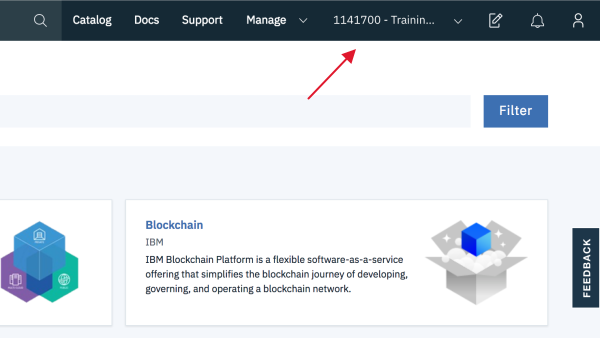

---

copyright:
  years: 2015, 2019
lastupdated: "2019-06-11"

keywords: account, upgrade, account settings, IBM Cloud account, Lite account

subcollection: account

---

{:shortdesc: .shortdesc}
{:codeblock: .codeblock}
{:screen: .screen}
{:new_window: target="_blank"}
{:faq: data-hd-content-type='faq'}
{:tip: .tip}

# FAQ
{: #accountfaqs}

## Como criar uma conta?
{: #create-account}
{: faq}

Acesse [{{site.data.keyword.Bluemix}}](https://cloud.ibm.com){: new_window}  e clique em **Criar uma conta do {{site.data.keyword.Bluemix_notm}}** para criar uma conta Lite que nunca expira. Veja [Conta Lite](/docs/account?topic=account-liteaccount#liteaccount) para obter mais detalhes sobre os recursos incluídos.

## Como resolver erros que ocorrem ao criar minha conta?
{: #account-error}
{: faq}

Se você puder efetuar login em uma conta do {{site.data.keyword.Bluemix_notm}}, acesse [Suporte](https://test.cloud.ibm.com/unifiedsupport/supportcenter) e escolha uma das opções a seguir.

* Se você tiver suporte avançado ou premium, clique em **Bate-papo em tempo real** para conversar com um representante de suporte do {{site.data.keyword.Bluemix_notm}}.
* Crie um caso de suporte clicando em **Criar um caso** na seção _Precisa de mais ajuda_.

   Depois de abrir o caso, uma notificação por e-mail é enviada a você. Siga as instruções para obter comunicação adicional.

Se não for possível efetuar login em uma conta do {{site.data.keyword.Bluemix_notm}}, [crie uma solicitação de conta](https://watson.service-now.com/x_ibmwc_open_case_app.do#!/create){: new_window} .

## O que é Cloud Foundry?
{: #cloud-foundry}
{: faq}

O Cloud Foundry é uma opção de plataforma como serviço (PaaS) de software livre disponível por meio do {{site.data.keyword.Bluemix_notm}} Public para construir e implementar aplicativos na nuvem. As organizações e os espaços do Cloud Foundry são usados para organizar recursos e apps disponíveis em regiões específicas.

Para obter mais informações sobre o gerenciamento de organizações e espaços, consulte [Incluindo organizações e espaços](/docs/account?topic=account-orgsspacesusers#orgsspacesusers). Se você estiver interessado em aprender mais sobre como fornecer acesso a recursos em um espaço do Cloud Foundry, consulte [Acesso ao Cloud Foundry](/docs/iam?topic=iam-cfaccess#cfaccess).

## Posso mover uma organização para outra conta?
{: #move-org-diff-account}
{: faq}

Atualmente, não é possível mover uma organização para uma conta diferente. No entanto, é possível recriar a organização com as mesmas credenciais em uma conta diferente para imitar essa funcionalidade. Para obter mais informações, consulte [Incluindo organizações e espaços](https://cloud.ibm.com/docs/account?topic=account-orgsspacesusers#createorg).

## Quais regiões do Cloud Foundry posso usar?
{: #whichregions}
{: faq}

Em uma conta Lite, é possível trabalhar em somente uma região. Em uma conta Pré-paga ou de Assinatura, é possível acessar todas as regiões disponíveis.

## O que é um plano de precificação Lite para serviços?
{: #whatisliteplan}
{: faq}

Um plano Lite é um plano de serviço baseado em cota grátis. É possível usar um plano Lite de serviço para construir um app sem incorrer em quaisquer encargos. Um plano Lite pode ser oferecido em um ciclo mensal que é renovado a cada mês ou em uma base de uso único. É possível ter uma instância por serviço de plano Lite. Os planos de precificação Lite são oferecidos em todas as contas. Para obter mais informações sobre contas Lite, veja [Tipos de conta](/docs/account?topic=account-accounts#accounts).

## O que acontece quando a instância do plano Lite atinge a minha cota mensal?
{: #monthlyquota}
{: faq}

Atingir qualquer limite de cota para instâncias do plano Lite suspende o serviço para esse mês. Limites de cota são por organização, não por instância. Novas instâncias que são criadas na mesma organização refletem qualquer uso de instâncias anteriores. Os
limites de cota são reconfigurados no primeiro dia de cada mês.

É possível verificar seu uso acessando **Gerenciar > Faturamento e uso** e selecionando **Uso**. Para obter mais informações, consulte [Visualizando seu uso](/docs/billing-usage?topic=billing-usage-viewingusage).

## Como excluo um serviço da minha conta?
{: #accounts-service-removal}
{: faq}

Se você deseja excluir um serviço, também é possível fazê-lo por meio da lista de recursos. Saiba mais em [Trabalhando com recursos e serviços](/docs/resources?topic=resources-resources-faq#service-removal).

## Quantos grupos de recursos, organizações ou espaços posso criar?
{: #resourcelimit}
{: faq}

Se você tiver uma conta faturável, não haverá limite para o número de grupos de recursos, organizações ou espaços que podem ser criados dentro de sua conta. No entanto, se você tiver uma conta Lite, estará limitado a uma organização e um grupo de recursos.

## Como eu faço upgrade ou converto o meu tipo de conta?
{: #changeacct}
{: faq}

Para fazer upgrade de sua conta Lite, acesse [Configurações da conta](https://{DomainName}/account/settings). Na seção Upgrade de conta, clique em **Incluir cartão de crédito** para fazer upgrade para uma conta pré-paga ou clique em **Fazer upgrade** para uma conta de assinatura. Também é possível aplicar um código de recurso promocional para converter sua conta Lite em uma conta de avaliação na página Configurações da conta.

Para converter entre os tipos de conta Pré-paga e de Assinatura, entre em contato com a equipe de [{{site.data.keyword.Bluemix_notm}} Vendas ](https://www.ibm.com/cloud-computing/bluemix/contact-us){: new_window}.

Se você não tiver certeza do seu tipo de conta atual, será possível localizá-lo na página Configurações da conta. Saiba mais em [Fazendo upgrade de sua conta](/docs/account?topic=account-upgrading-account).

## Se eu fizer upgrade da minha conta Lite, será possível continuar a usar minhas instâncias existentes?
{: #nochange}
{: faq}

Sim, quando você faz upgrade para uma conta faturável, é possível continuar a usar as instâncias que você criou com sua conta Lite.

## Como atualizar meu cartão de crédito?
{: #updatepayment}
{: faq}

A atualização de seu cartão de crédito é exatamente como incluir um novo. Acesse [Pagamentos](https://{DomainName}/billing/payments) e, na seção Incluir método de pagamento, insira as informações de faturamento para o seu novo cartão e, em seguida, clique em **Incluir cartão de crédito**.

Para alternar para um método de pagamento diferente, selecione **Pagamento com outro** e, em seguida, clique em **Enviar solicitação de mudança**. Um caso de suporte para mudar o seu método de pagamento será criado para você.

## Como mudar minhas configurações de notificação por e-mail?
{: #change-email-prefs}
{: faq}

É possível mudar as notificações por e-mail recebidas para eventos planejados, eventos não planejados e anúncios em suas configurações de perfil.
1. Acesse [Notificações](https://cloud.ibm.com/user/notifications) em suas configurações de perfil.
1. Selecione se as notificações por e-mail para cada tipo de evento devem ser recebidas.

Para serviços de infraestrutura clássica, os proprietários da conta também podem inscrever usuários para notificações desses serviços acessando **Gerenciar > Conta > Notificações**.

Para obter mais informações, consulte [Configurando preferências de e-mail](/docs/account?topic=account-email-prefs).

## Como reconfiguro a minha senha?
{: #reset-password}
{: faq}

Para reconfigurar a sua senha da conta, acesse o ícone Avatar  **> Perfil e configurações**. Em seguida, clique em **Mudar ou reconfigurar** no tile de informações sobre o usuário da conta.

Para reconfigurar sua senha da VPN, conclua as etapas a seguir:

  1. Acesse **Gerenciar > Acesso (IAM)** e selecione **Usuários**.
  2. Selecione o usuário.
  3. Na seção de sub-redes VPN, clique no ícone Editar  para inserir uma nova senha da VPN.
  5. Clique em **Aplicar**.

## Como cancelar minha conta?
{: #cancelaccount}
{: faq}

Estamos tristes em ver você ir! Se houver alguma maneira de ajudar você com a sua conta antes acessá-la, entre em contato conosco contatando o suporte.

Se decidir sair, a maneira como você cancela a sua conta depende do seu tipo de conta. É possível verificar seu tipo de conta acessando [Configurações da conta](https://cloud.ibm.com/account/settings) e olhando _Tipo de conta_.

* Para contas Pré-pagas ou de Assinatura, a maneira mais rápida de cancelar sua conta é entrar em contato conosco por meio do [bate-papo em tempo real](https://{DomainName}/unifiedsupport/supportcenter) ou ligando para 1-866-325-0045 e selecionando a terceira opção. Como alternativa, é possível abrir um caso de suporte.
* Para cancelar uma conta Lite, acesse [Configurações da conta](https://cloud.ibm.com/account/settings) e clique em **Desativar conta**.

## Como excluir minha conta?
{: #deleteaccount}
{: faq}

Entre em contato com o Suporte do [{{site.data.keyword.Bluemix_notm}} ](https://{DomainName}/unifiedsupport/supportcenter){: new_window} para abrir um caso de suporte e solicitar para excluir sua conta. Se você tem dados que estão associados à sua conta antiga e deseja salvá-los e movê-los para uma nova conta, inclua essas informações em seu e-mail.

## Como posso remover meus dados pessoais do {{site.data.keyword.Bluemix_notm}}?
{: #remove-pi}
{: faq}

Para entender como a IBM manipula suas informações pessoais, veja a [Declaração de Privacidade IBM ](https://www.ibm.com/privacy/){: new_window}. Na seção Your Rights, revise as informações sobre
o que é possível solicitar para remover. Clique no link na seção para enviar uma solicitação para
remover suas informações pessoais.

## Por que minha conta está desativada?
{: #account-deactivated}
{: faq}

A sua conta pode ser desativada pelos motivos a seguir:

- Para as contas para teste, o período de avaliação terminou. Para reativar a sua conta, efetue login em sua conta e atualize-a para uma conta Pré-paga.
- Um usuário autorizado cancelou a conta.
- A conta está suspensa. A critério da IBM, as contas que violam os comportamentos de uso aceitáveis dos serviços do {{site.data.keyword.Bluemix_notm}} podem ser desativadas sem aviso. Alguns serviços poderão ser restaurados se os usuários corrigirem seus comportamentos de uso depois de serem notificados sobre a ação ofensiva.

Se você acredita que a sua conta foi desativada com erro, entre em contato com o suporte ligando 1-866-325-0045 e selecionando a terceira opção.

## Como obter suporte?
{: #contactsupport}
{: faq}

Clique em **Suporte** na barra de menus do console para acessar o Centro de Suporte. Saiba mais sobre o suporte em [Obtendo suporte](/docs/get-support?topic=get-support-support-plans).

## Posso inscrever-me para uma avaliação grátis?
{: #freetrial}
{: faq}

As contas para teste do {{site.data.keyword.Bluemix_notm}} estão disponíveis para professores e estudantes de instituições acadêmicas credenciadas. Para se qualificar para uma conta para teste, acesse [Aproveitar o poder da IBM](https://onthehub.com/ibm/){: new_window} e valide suas credenciais da instituição.

## Depois de vincular minha conta, como efetuar login?
{: #al_login}
{: faq}

Depois de vincular a conta, use o seu IBMid para efetuar login no console do {{site.data.keyword.Bluemix}}.

## Depois de vincular minha conta, qual é o impacto no meu suporte?
{: #al_support}
{: faq}

Depois de vincular sua conta, você mantém o mesmo nível de suporte de quando inclui a plataforma {{site.data.keyword.Bluemix_notm}} em sua conta.

## Há outras maneiras para obter ajuda com a vinculação de minha conta?
{: #al_morehelp}
{: faq}

  1. Veja o blog [Etapas para vincular suas contas IaaS e PaaS](https://www.ibm.com/blogs/bluemix/2018/03/follow-steps-link-iaas-paas-accounts/){: new_window}  para obter informações úteis.
  2. No portal do cliente do {{site.data.keyword.BluSoftlayer_full}}, abra um **bate-papo em tempo real de vendas** para fazer perguntas de conta.
  3. Abra um chamado por meio do portal do cliente. Selecione **Suporte** > **Incluir chamado** e, em seguida, no campo **Assunto**, selecione **Solicitação de contabilidade** para rotear sua pergunta de conta para a equipe de suporte correta.

## Como vincular minha conta se eu tiver várias contas?
{: #al_multacct}
{: faq}

Se você tem múltiplas contas do SoftLayer, vincule as que têm uma conta de plataforma {{site.data.keyword.Bluemix_notm}} correspondente e um IBMid associado.

Se você não tem uma conta da plataforma {{site.data.keyword.Bluemix_notm}} correspondente e uma conta IBMid associada, uma nova conta do SoftLayer pode ser criada para vinculá-las.

## Há incentivos para vincular minhas contas?
{: #al_incent}
{: faq}

Ao vincular suas contas, é possível usar um crédito promocional de US$ 200 para experimentar os serviços {{site.data.keyword.Bluemix_notm}}.

Para saber mais sobre o crédito promocional de U$ 200, consulte [Conta pré-paga](/docs/account?topic=account-accounts#paygo).

## O que a inclusão dos serviços de plataforma do {{site.data.keyword.Bluemix_notm}} em minha conta do SoftLayer significa?
{: #al_owaffslacct}
{: faq}

Isso significa que a conta tem acesso a todas as ofertas da plataforma {{site.data.keyword.Bluemix_notm}}. Depois de incluir a oferta da plataforma {{site.data.keyword.Bluemix_notm}} em sua conta, a sua conta mestre deve permitir que o usuário tenha acesso à oferta.

Para obter mais informações sobre como ser uma conta mestre, consulte [Trabalhando com usuários](/docs/iam?topic=iam-iamuserinv#iamuserinv).

## Como a vinculação de contas afeta meu ID da conta principal do SoftLayer?
{: #al_howaffslmastacct}
{: faq}

Ainda é possível usar o ID para sua conta do SoftLayer para conectar-se ao portal do cliente porque o console do {{site.data.keyword.Bluemix_notm}} é acessível com IBMids.

## Como posso visualizar as contas que possuo?
{: #accounts-owned}
{: faq}

O cabeçalho do console do IBM Cloud lista todas as contas afiliadas ao seu ID de login, incluindo as que você possui. É possível visualizar sua função em cada conta na página [Usuários](https://{DomainName}/iam/users).

Também é possível localizar suas contas por meio da CLI executando o comando `ibmcloud account list`.

## Como alterno entre múltiplas contas?
{: #switch-between-accounts}
{: faq}

Se você tiver mais de uma conta, será possível clicar no nome da sua conta na barra de menus do console para selecionar outra conta para a qual tiver acesso.  

## Posso tornar alguém o proprietário da conta?
{: #switch-account-owners}
{: faq}

É possível transferir a propriedade de recursos individuais dentro de sua conta a outra pessoa usando o comando `ibmcloud catalog`. Para saber mais, consulte [Transferindo a propriedade de um recurso privado](/docs/account?topic=account-include#owners).

Para transferir a propriedade de toda a sua conta, atualize seu [perfil da empresa](https://{DomainName}/account/company-profile). Para obter mais informações, consulte [Transferindo a propriedade de sua conta](/docs/account?topic=account-transfer).

## O {{site.data.keyword.Bluemix_notm}} suporta o registro em lote de usuários?
{: #batch-registration}
{:faq}

Ao registrar usuários para {{site.data.keyword.Bluemix_notm}}, deve-se registrar cada usuário individualmente. O {{site.data.keyword.Bluemix_notm}} não suporta registro de lote de usuários.

Acesse o [{{site.data.keyword.Bluemix}}](https://cloud.ibm.com){: new_window}  e clique em **Criar uma conta do {{site.data.keyword.Bluemix_notm}}**. Em seguida, preencha o formulário de registro da conta de cada usuário individual.

## O que são tags?
{: #know-about-tags}
{: faq}

É possível usar tags para organizar e visualizar recursos em sua conta, filtrando tags de sua lista de recursos. Para obter mais informações, consulte [Trabalhando com tags](/docs/resources?topic=resources-tag).

## Quem pode visualizar as tags em uma conta?
{: #tags-visibility-account}
{: faq}

As tags são visíveis em toda a sua conta. Se você tiver permissão para ver um recurso, será possível visualizar todas as tags que estiverem anexadas. Para obter mais informações, veja [Concedendo aos usuários acesso a recursos de tag](/docs/resources?topic=resources-access#access).

## Quais permissões eu preciso para incluir ou remover tags?
{: #permissions-add-remove-tags}
{: faq}

Deve-se ter pelo menos o Editor para recursos ativados pelo IAM ou a função de desenvolvedor em um espaço do Cloud Foundry em um recurso para incluir ou remover tags nesse recurso. Para obter mais informações, veja [Concedendo aos usuários acesso a recursos de tag](/docs/resources?topic=resources-access#access).

## Posso excluir minha tag?
{: # delete-tag}
{: faq}

Antes que seja possível excluir uma tag, deve-se removê-la de todos os recursos. Se ainda assim não for possível excluí-la, a tag poderá ser anexada a um recurso para o qual você não tenha permissão para visualizar. A mesma tag pode ser anexada a vários recursos por diferentes usuários na mesma conta de cobrança. Os usuários não têm a mesma visibilidade em todos os recursos na conta.

## Posso renomear uma tag?
{: #rename-tag}
{: faq}

Não é possível editar o nome de uma tag. Para renomear uma tag, remova-a e redesigne o recurso a uma nova tag.  
