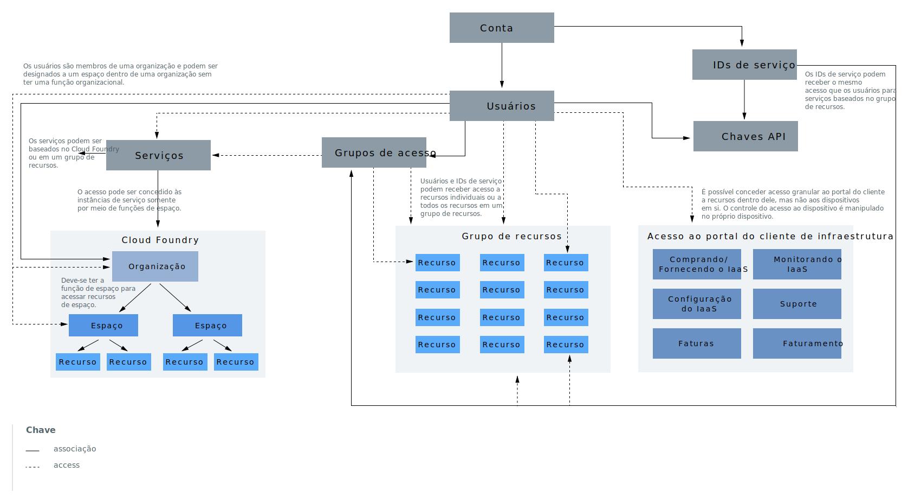

---

copyright:
  years: 2019
lastupdated: "2019-06-19"

keywords: IBM Cloud account, account differences, account overview, account components, how access works

subcollection: account

---

{:shortdesc: .shortdesc}
{:codeblock: .codeblock}
{:screen: .screen}
{:tip: .tip}
{:new_window: target="_blank"}

# O que há em uma conta?
{: #overview}

Sua conta do {{site.data.keyword.Bluemix}} inclui muitos componentes e sistemas interativos. Conceitos, por exemplo, de como certos componentes estão conectados ou como o acesso funciona ajudarão a entender como configurar sua conta.
{:shortdesc}

Figura 1. Componentes e sistemas da conta

Dentro do diagrama, há dois conceitos principais para os componentes na hierarquia da conta cujo entendimento é importante. O uso das linhas contínuas e das linhas pontilhadas ajudam a ilustrar que alguns componentes estão contidos em outros, por exemplo, os usuários estão incluídos em grupos de acesso ou em organizações do Cloud Foundry. No entanto, alguns componentes interagem com outros para fornecer acesso em vez de associação. Por exemplo, os usuários recebem acesso a grupos de recursos, mas não são membros de um grupo de recursos da mesma maneira que eles são para grupos de acesso. Esses conceitos também são explicados nas seções a seguir.

<dl>
<dt>Usuários</dt>
<dd>Os usuários são convidados para a conta e recebem acesso aos recursos na conta.</dd>
<dt>IDs de Serviço</dt>
<dd>Um ID de serviço identifica um serviço ou um aplicativo semelhante a como um ID de usuário identifica um usuário. É possível usar um ID de serviço criado para permitir que um aplicativo fora do {{site.data.keyword.Bluemix_notm}} acesse seus serviços. É possível designar políticas de acesso específicas ao ID de serviço que restringem permissões para usar serviços específicos ou até mesmo combinar permissões para acessar serviços diferentes. Como os IDs de serviço não são vinculados a um usuário específico, se um usuário deixar uma organização e for excluído da conta, o ID do serviço permanecerá, assegurando que seu aplicativo ou serviço continue funcionando. Para obter mais informações, consulte [Criando e trabalhando com IDs de serviço](/docs/iam?topic=iam-serviceids#serviceids).</dd>
<dt>Instâncias de serviço ou recursos</dt>
<dd>Os serviços no {{site.data.keyword.Bluemix_notm}} são baseados no grupo de recursos ou no Cloud Foundry. As instâncias de serviço que podem ser incluídas em um grupo de recursos e gerenciadas usando o {{site.data.keyword.Bluemix_notm}} Identity and Access Management (IAM) são chamadas de recursos. As instâncias de serviço que são incluídas nas organizações e nos espaços do Cloud Foundry têm um sistema de gerenciamento de acesso separado usando as funções do Cloud Foundry. Para obter mais informações, consulte [O que é um recurso?](/docs/resources?topic=resources-resource#resource)</dd>
<dt>Chaves API (interface de programação de aplicativos)</dt>
<dd>Uma chave de API é um código exclusivo que é passado para uma API para identificar o aplicativo de chamada ou usuário. É
possível usar as chaves de API da plataforma associadas a identidades do usuário e criar outras chaves de API para os IDs de
serviço. Para obter mais informações, veja [Entendendo chaves de API](/docs/iam?topic=iam-manapikey#manapikey).</dd>
<dt>Grupos de acesso</dt>
<dd>É possível criar um grupo de acesso para organizar um conjunto de usuários e IDs de serviço em uma única entidade e facilmente atribuir permissões. É possível designar uma política única ao grupo em vez
de designar o mesmo acesso múltiplas vezes por usuário ou ID de serviço individual. Para obter mais informações, consulte [Configurando grupos de acesso](/docs/iam?topic=iam-groups#groups).</dd>
<dt>Grupos de Recursos</dt>
<dd>É possível usar um grupo de recursos para organizar seus recursos de conta em agrupamentos customizáveis para que seja possível designar rapidamente aos usuários acesso a mais de um recurso por vez. Qualquer recurso da conta que é gerenciado usando o controle de acesso do IAM pertence a um grupo de recursos em sua conta. Os usuários não são incluídos em grupos de recursos, mas recebem acesso aos recursos nesses grupos ou podem gerenciar o grupo de recursos. Os usuários que recebem acesso para gerenciar o grupo de recursos podem criar novas instâncias dentro do grupo, gerenciar o acesso de outros usuários para trabalhar com o grupo ou editar o nome do grupo com base na função IAM designada. Para obter mais informações, consulte [Gerenciando grupos de recursos](/docs/resources?topic=resources-rgs#rgs) e [Melhores práticas para organizar recursos em grupos de recursos](/docs/resources?topic=resources-bp_resourcegroups#bp_resourcegroups).</dd>
<dt>Orgs do Cloud Foundry</dt>
<dd>Como um proprietário da conta ou um gerente de organização, é possível incluir organizações e espaços na página Organizações do Cloud Foundry no console. Os serviços que suportam o uso de organizações e espaços do Cloud Foundry são incluídos em uma organização e em um espaço quando você os cria no catálogo. Orgs contêm usuários, domínios e cotas. Dentro de cada organização, são incluídos espaços que contêm as instâncias de serviço. Para obter mais informações, consulte [Incluindo organizações e espaços](/docs/account?topic=account-orgsspacesusers#orgsspacesusers).</dd>
<dt>Espaços do Cloud Foundry</dt>
<dd>Dentro de uma organização, é possível usar espaços para
agrupar um conjunto de aplicativos, serviços e usuários. Espaços são ligados a uma região específica no
{{site.data.keyword.Bluemix_notm}}. É possível criar espaços em uma organização com base no ciclo de
vida de entrega. Por exemplo, é possível criar um espaço de desenvolvimento como um ambiente de desenvolvimento, um espaço de teste como um ambiente de teste e um espaço de produção como um ambiente de produção. Em seguida, é possível associar os apps aos espaços. Para obter mais informações, consulte [Incluindo organizações e espaços](/docs/account?topic=account-orgsspacesusers#orgsspacesusers).</dd>
</dl>

Outro aspecto importante do diagrama anterior é a representação dos três tipos de sistemas de gerenciamento de acesso que podem ser usados para fornecer aos usuários da conta o acesso a recursos dentro da conta.

  * É possível usar as [funções de acesso](/docs/iam?topic=iam-userroles#iamusermanrol) do IAM para fornecer aos usuários acesso a todos os recursos que pertencem a um grupo de recursos. Também é possível fornecer aos usuários acesso para gerenciar grupos de recursos e criar novas instâncias de serviço que são designadas a um grupo de recursos.
  * É possível usar as [funções de organização e espaço](/docs/iam?topic=iam-cfaccess#cfroles) do Cloud Foundry para fornecer aos usuários acesso a quaisquer instâncias de serviço que residam em um espaço do Cloud Foundry.
  * É possível usar permissões de infraestrutura clássica para conceder aos usuários [permissões](/docs/iam?topic=iam-infrapermission#infrapermission) mais granulares para infraestrutura clássica. Você designa o acesso ao dispositivo e o acesso à sub-rede VPN separadamente.
