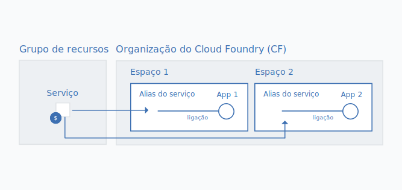

---

copyright:

  years: 2017, 2018

lastupdated: "2018-04-26"

---

{:shortdesc: .shortdesc}
{:codeblock: .codeblock}
{:screen: .screen}
{:new_window: target="_blank"}
{:gif: data-image-type='gif'}
{:tip: .tip}

# Migrando instâncias de serviço do Cloud Foundry para um grupo de recursos
{: #migrate}

Conforme os serviços deixam de usar organizações, espaços e funções do Cloud Foundry e começam a usar o Cloud Identity and Access Management (IAM) e os grupos de recursos, é possível migrar suas instâncias de serviço do Cloud Foundry para um [grupo de recursos](/docs/account/resourcegroups.html#rgs). A migração de instâncias de serviço para um grupo de recursos tem vários benefícios, incluindo o controle de acesso de baixa granularidade usando funções do IAM e conectando instâncias de serviço a apps e serviços em diferentes regiões.

Quando um serviço deixa de usar o Cloud Foundry, você é solicitado a migrar suas instâncias de serviço existentes por uma mensagem em seu painel. É possível identificar os serviços que estão prontos para serem migrados pelo ícone .
{:shortdesc}

Ao migrar instâncias de serviço existentes do Cloud Foundry para um grupo de recursos, o grupo que você escolhe não pode ser mudado após a migração ser concluída. Então, certifique-se de planejar como você deseja organizar os recursos na conta antes da migração. Isso pode significar que você precisará criar um ou mais grupos de recursos, se tiver uma conta faturável, antes da migração. É possível tentar organizar seus recursos em grupos de recursos da mesma forma que organizou os recursos em espaços do Cloud Foundry.
{: tip}

## Por que migrar instâncias de serviço?

Os serviços que suportam controle de acesso e organização do Cloud IAM em grupos de recursos têm vários benefícios, como a capacidade de conexão a apps e serviços em qualquer espaço do Cloud Foundry, que permite conexões de apps e serviços de diferentes regiões. Para criar a conexão, é possível criar um alias de uma instância de um grupo de recursos em um espaço do Cloud Foundry. Quando você migra, a conexão é feita automaticamente transformando sua instância de serviço do Cloud Foundry original em um alias e criando uma instância vinculada em um grupo de recursos de sua escolha.

Além disso, cada instância gerenciada pelo Cloud IAM pertence a um grupo de recursos. Os grupos de recursos não têm o escopo definido por região, portanto, é possível provisionar apps e serviços de regiões diferentes para o mesmo grupo de recursos. Também é possível tirar proveito do controle de acesso de baixa granularidade em um nível de instância individual.

## Quem pode migrar instâncias de serviço?
{: #whocanmigrate}

Os usuários devem ter acesso específico para migrar instâncias de serviço do Cloud Foundry para um grupo de recursos:

* Um usuário deve ter a função de Desenvolvedor no espaço do Cloud Foundry ou a função de Gerenciador de organização do Cloud Foundry na organização à qual a instância pertence.
* Um usuário deve ter pelo menos a função de Visualizador do IAM para gerenciar o grupo de recursos para o qual a instância será migrada.
* Um usuário deve ter pelo menos a função de Editor do IAM no serviço.

Para obter mais informações sobre como designar o acesso correto, veja [Acesso ao Cloud Foundry](/docs/iam/cfaccess.html#cfaccess) e [Acesso ao IAM](/docs/iam/users_roles.html#platformrolestable).

Para verificar o acesso que você tem, na barra de menus, clique em **Gerenciar** &gt; **Segurança** &gt; **Identidade e acesso** e, em seguida, clique em **Usuários**. Em seguida, clique em seu nome e revise suas **Políticas de acesso** para as funções designadas do IAM e o **Acesso ao Cloud Foundry** para ver a quais organizações você tem acesso e suas funções designadas do Cloud Foundry.
{: tip}

## Como a migração funciona?

Quando você migra uma instância de serviço de uma organização e de um espaço do Cloud Foundry para um grupo de recursos, uma nova instância de serviço vinculada é criada no grupo de recursos. A instância original na
organização e no espaço do Cloud Foundry se torna um
[alias](/docs/cfapps/connecting_apps.html#what_is_alias). O alias conta para a cota de sua organização, mas você é faturado por seu uso da instância de serviço no grupo de recursos.

{: gif}

É possível migrar uma instância de serviço por vez quando você é notificado no painel pelo ícone  que está associado à sua instância de serviço do Cloud Foundry.

1. Abra o menu **Mais ações**.
2. Selecione **Migrar para um grupo de recursos** para iniciar.
3. Selecione um grupo de recursos.
4. Clique em **Migrar** e a instância é migrada para você.
5. Como é possível migrar somente uma instância por vez, é possível continuar migrando instâncias elegíveis depois que você migra a primeira.

Depois de migrar com êxito uma instância, você a verá refletida na seção Serviços de seu painel. O alias permanece na seção do Cloud Foundry do painel. É possível usar o  na seção Cloud Foundry do painel para identificar os aliases.

## Resolução de problemas

Se você encontrar qualquer problema com a migração de instâncias de serviço do Cloud Foundry, verifique [Resolução de problemas de migração de instâncias de serviço](/docs/troubleshoot/ts_migration.html).
