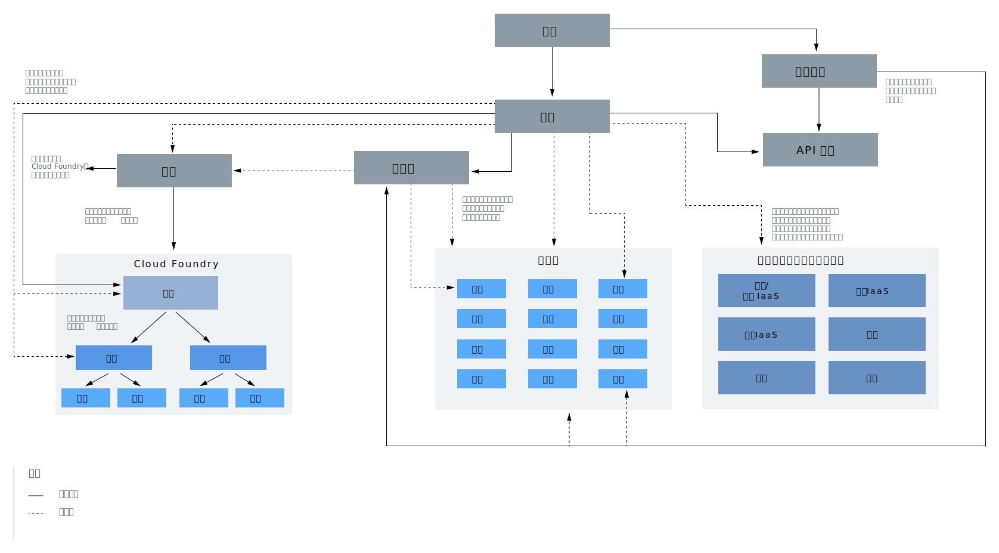

---

copyright:

  years: 2019
lastupdated: "2019-02-12"

---

{:shortdesc: .shortdesc}
{:codeblock: .codeblock}
{:screen: .screen}
{:tip: .tip}
{:new_window: target="_blank"}

# 帐户层次结构
{: #overview}

{{site.data.keyword.Bluemix}} 帐户包含许多交互组件和系统。了解特定组件的连接方式以及访问权在您帐户中的生效方式。
{:shortdesc}

在该图中，帐户层次结构中的组件有两个主要概念务必要理解。实线和虚线用于帮助说明某些组件包含在其他组件中，例如将用户添加到访问组或 Cloud Foundry 组织。但是，某些组件与其他组件进行交互的目的是为了提供访问权，而不是提供成员资格。例如，授予了用户对资源组的访问权，但这些用户并不会像针对访问组那样，成为资源组的成员。以下各部分还将对这些概念进行说明。

<dl>
<dt>用户</dt>
<dd>可以邀请用户加入帐户并向其授予对帐户中资源的访问权。</dd>
<dt>服务标识</dt>
<dd>服务标识用于标识服务或应用程序，类似于用户标识对用户进行标识的方式。可以使用创建的服务标识来支持 {{site.data.keyword.Bluemix_notm}} 外部的应用程序访问服务。您可以向服务标识分配特定访问策略，以限制使用特定服务的许可权，甚至可以将访问不同服务的许可权组合在一起。由于服务标识并不与特定用户绑定，因此即使用户离开组织并被从帐户中删除，该服务标识仍会保留，以确保您的应用程序或服务保持正常运行。有关更多信息，请参阅[创建和使用服务标识](/docs/iam?topic=iam-serviceids#serviceids)。</dd>
<dt>服务实例或资源</dt>
<dd>{{site.data.keyword.Bluemix_notm}} 中的服务是基于资源组或基于 Cloud Foundry 的服务。可以添加到资源组并使用 {{site.data.keyword.Bluemix_notm}} Identity and Access Management (IAM) 进行管理的服务实例称为资源。添加到 Cloud Foundry 组织和空间的服务实例通过使用 Cloud Foundry 角色，采用单独的访问管理系统。有关更多信息，请参阅[什么是资源？](/docs/resources?topic=resources-resource#resource)</dd>
<dt>API 密钥</dt>
<dd>API 密钥是传入到 API 的唯一代码，用于确定调用应用程序或用户。您可以使用与用户身份关联的平台 API 密钥，也可以为服务标识创建其他 API 密钥。有关更多信息，请参阅[了解 API 密钥](/docs/iam?topic=iam-manapikey#manapikey)。</dd>
<dt>访问组</dt>
<dd>可以创建一个访问组，用于将一组用户和服务标识组织成单个实体，从而轻松分配许可权。您可以将单个策略分配给该组，而不用对每个用户或服务标识多次指定相同的访问权。有关更多信息，请参阅[设置访问组](/docs/iam?topic=iam-groups#groups)。</dd>
<dt>资源组</dt>
<dd>您可以使用资源组在可定制的分组中组织帐户资源，以便您可以一次性快速为用户分配对多个资源的访问权。使用 IAM 访问控制来管理的任何帐户资源都属于帐户中的资源组。用户不会添加到资源组，但会为用户提供对资源组内资源的访问权，或者用户可以管理资源组。授予了资源组管理访问权的用户可以在该组内创建新实例，管理其他用户使用该组的访问权，或者根据分配的 IAM 角色编辑组名。有关更多信息，请参阅[管理资源组](/docs/resources?topic=resources-rgs#rgs)和[将资源组织成资源组的最佳实践](/docs/resources?topic=resources-bp_resourcegroups#bp_resourcegroups)。</dd>
<dt>Cloud Foundry 组织</dt>
<dd>作为帐户所有者或组织管理者，您可以在控制台的“Cloud Foundry 组织”页面中添加组织和空间。通过目录创建支持使用 Cloud Foundry 组织和空间的服务时，会将这些服务添加到组织和空间。组织包含用户、域和配额。在每个组织中，会添加空间，其中包含服务实例。有关更多信息，请参阅[添加组织和空间](/docs/account?topic=account-orgsspacesusers#orgsspacesusers)。</dd>
<dt>Cloud Foundry 空间</dt>
<dd>在组织内，您可以使用空间来对一组应用程序、服务和用户进行分组。空间与 {{site.data.keyword.Bluemix_notm}} 中的特定区域联系在一起。您可以基于交付生命周期在组织中创建多个空间。例如，可以创建 dev 空间（作为开发环境）、test 空间（作为测试环境）和 production 空间（作为生产环境）。然后，可以将应用程序与空间相关联。有关更多信息，请参阅[添加组织和空间](/docs/account?topic=account-orgsspacesusers#orgsspacesusers)。</dd>
</dl>

上图的另一个重要方面是描述了三种类型的访问管理系统，您可以使用这些系统为帐户用户提供对帐户内资源的访问权。

  * 可以使用 IAM [访问角色](/docs/iam?topic=iam-iamusermanrol#iamusermanrol)向用户提供对属于一个资源组的所有资源的访问权。还可以为用户提供访问权，用于管理资源组和创建新服务实例以分配给资源组。
  * 可以使用 Cloud Foundry [组织和空间角色](/docs/iam?topic=iam-cfroles#cfroles)为用户提供对位于 Cloud Foundry 空间中的任何服务实例的访问权。
  * 可以使用经典基础架构许可权授予用户对传统基础架构的更详细[许可权](/docs/iam?topic=iam-infrapermission#infrapermission)。您可分别分配设备访问权和 VPN 子网访问权。
