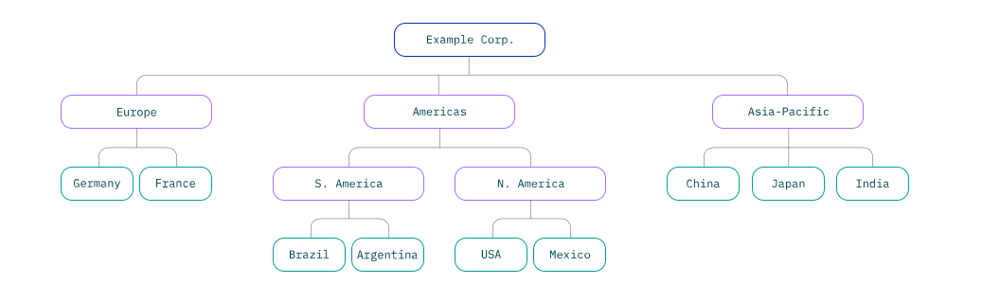

---

copyright:
  years: 2019
lastupdated: "2019-07-25"

keywords: enterprise, enterprise account, multiple accounts, organization, hierarchy

subcollection: account

---

{:shortdesc: .shortdesc}
{:new_window: target="_blank"}
{:codeblock: .codeblock}
{:important: .important}
{:tip: .tip}
{:note: .note}

# 什么是企业？
{: #enterprise}

{{site.data.keyword.Bluemix}} 企业提供了一种集中管理多个帐户中帐单和资源使用情况的方法。在企业中，可以创建多层帐户层次结构，其中所有帐户的帐单和付款在企业级别进行管理。
{:shortdesc}

与使用多个独立帐户相比，企业提供了以下主要优点：
- 集中帐户管理：查看整个企业层次结构的概况，无需切换帐户。您可以在企业中添加现有帐户或直接创建新帐户。
- 合并预订计费：在单个视图中跟踪所有帐户的预订和信用值花费。预订信用值会汇聚成池，供企业中的各个帐户共享。
- 自顶向下使用情况报告：通过企业帐户，可以查看企业中所有帐户的使用情况（按帐户组进行组织）。

## 企业层次结构
{: #enterprise-hierarchy}

企业的核心由三个主要构建块组成：
- 企业帐户，充当企业中其他所有帐户的父帐户。企业帐户管理整个企业的计费，其中所有帐户的使用成本会累积到企业帐户并通过该帐户付款。
- 帐户组，可用于组织相关帐户。帐户组不能包含资源本身，但您可以查看帐户组所包含的帐户中的资源使用成本。
- 帐户，与独立 {{site.data.keyword.Bluemix_notm}} 帐户一样，其中包含资源和资源组、Cloud Foundry 组织和空间以及独立访问许可权。但是，与独立帐户的一个主要差别是，企业中的每个帐户不会管理自己的计费或付款，因为这些会在企业帐户级别进行处理。

通过在帐户组中嵌套帐户组，可在企业中创建层。

企业可以包含多达 10 层的帐户和帐户组。最基本形式的企业有两层：企业帐户和单个子帐户。

企业结构十分灵活，可以随您的需求增长和变化。您可以添加和除去帐户组，也可以在帐户组之间移动帐户。如果帐户组的用途发生更改，那么可以对其重命名，以更好地反映其中包含的帐户。

## 合并计费
{: #enterprise-billing}

在企业中，所有计费都通过顶级企业帐户进行管理。企业需要[预订计费](/docs/account?topic=account-accounts#subscription-account)，这意味着在预订期限内，购买预订需要花费一定量的信用值，并且使用量会按折扣率从预订信用值中扣除。预订信用值以及来自任何促销的信用值会添加到企业的信用值池，供企业中的所有帐户共享。帐户使用资源时，会花费信用值池中的信用值。

由于合并了计费，企业可更轻松地管理多个帐户中的开票和付款，并具有以下主要优点：
* 跨多个帐户的预订的信用值池，因此可以针对您的所有使用量（而不是每个帐户的使用量）来设置预订大小
* 一张发票涵盖企业中的所有使用量，因此了解成本更容易
* 在一个位置管理付款方式，因此可以一次更新所有帐户的付款方式

请在[集中管理企业的计费和使用情况](/docs/billing-usage?topic=billing-usage-enterprise)中了解更多信息。

## 资源管理
{: #enterprise-resources}

企业中的资源和服务的功能与独立帐户中的相同。企业中的每个帐户都可以包含 Cloud Foundry 组织和空间的资源组和服务中的资源。帐户组不能包含资源。有关更多信息，请参阅[使用资源和服务](/docs/resources?topic=resources-resource)。

与所有帐户一样，资源会绑定到在其中创建这些资源的资源组和帐户，因此无法在企业中的帐户之间移动资源。但是，企业灵活的帐户结构意味着可以通过移动包含资源的帐户，在企业中移动这些资源。

## 自顶向下使用情况报告
{: #enterprise-usage}

在企业帐户中，可以查看企业中所有帐户的资源使用情况。从企业级别开始，您会看到按帐户和帐户组细分的估算使用成本。可以在企业结构中向下导航，以查看每个级别的成本。在帐户级别，企业用户可以查看帐户中每种类型的资源或服务的成本。

由于企业中的访问权与每个帐户中的访问权相分离，因此企业用户无法在子帐户中自动创建或管理资源。与此类似，每个帐户中的用户都可以在“使用情况”页面中持续查看其过去和当前使用情况，而不管他们是否具有企业访问权。

有关更多信息，请参阅[查看企业中的使用情况](/docs/billing-usage?topic=billing-usage-enterprise-usage)。

## 隔离的用户和访问权管理
{: #enterprise-access}

企业将企业的用户和访问权管理与其子帐户的用户和访问权管理保持隔离，为帐户数据提供了更高安全性。企业帐户中的用户及其分配的访问权与子帐户中的用户及其分配的访问权完全分离，并且在这两种类型的帐户之间不会自动继承任何访问权。

每个帐户的用户列表仅可供受邀加入该帐户的用户查看。仅仅因为邀请了用户并向其授予了管理整个企业的访问权，并不意味着该用户可以查看受邀加入每个子帐户的用户。每个企业中的用户管理与每个帐户中的用户管理是完全分离的，并且必须由帐户所有者进行管理，或者由向其授予对特定帐户中用户管理帐户管理服务的管理员角色的用户进行管理。

访问权管理与用户管理类似，每个帐户中的访问权管理与企业本身的访问权管理完全分离。此分离意味着管理企业的用户无法访问子帐户中的帐户资源，除非您专门为该用户启用此功能。例如，财务管理人员可能具有对企业帐户中缴费帐户管理服务的管理员角色，因此能够访问帐单和付款信息以及下至资源类型的使用情况数据。但是，除非邀请这些管理人员加入子帐户，并且为其分配对该帐户的缴费帐户管理服务的访问权，否则他们无法查看报价，也无法更新子帐户的花费限制。

有关更多信息，请参阅[企业的用户管理](/docs/iam?topic=iam-enterprise-access)。

## 如何使用企业？
{: #enterprise-use-cases}

对于原本很复杂的场景，企业可以帮助简化帐户和计费管理。企业对于管理任何大型组织十分有利，但您可能希望创建企业的两个主要用例是大公司和教育机构。

如何构造企业取决于您希望如何分析使用情况和成本，例如要就使用量向特定组织退款。请根据要跟踪和管理计费和使用情况的方式来组织企业。
{:tip}

### 大型公司或组织
{: #enterprise-orgs}

企业对于原本需要为其部门或团队使用多个单独帐户的大型组织十分有利。通过使用帐户组，可以根据贵组织的结构对企业层次结构建模。

#### 按部门组织
{: #enterprise-by-dept}

如果贵组织有共享预算的全球团队，那么可以根据其部门对企业结构建模。通过此结构，可以查看针对每个部门聚集的使用成本。

#### 按地理位置组织
{: #enterprise-by-geo}

或者，如果组织是按地理位置划分预算的，那么可以将企业构造为对每个地理实体的成本分组。

### 教育机构
{: #enterprise-edu}

教育机构可能希望向其学生提供 {{site.data.keyword.Bluemix_notm}} 帐户，以便他们能够通过使用 {{site.data.keyword.Bluemix_notm}} 服务的实践项目来学习有价值的技能。对于这些机构（例如，传统大学或在线学习平台），可以按系或学科领域对帐户分组，然后为每个课程创建帐户。

在每个帐户中，学生可以创建资源来构建自己的项目，并与帐户中的其他学生进行协作。大学拥有每个系和课程的费用的完整视图。

