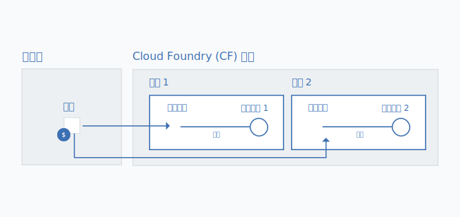

---

copyright:

  years: 2017, 2018

lastupdated: "2018-04-26"

---

{:shortdesc: .shortdesc}
{:codeblock: .codeblock}
{:screen: .screen}
{:new_window: target="_blank"}
{:gif: data-image-type='gif'}
{:tip: .tip}

# 将 Cloud Foundry 服务实例迁移到资源组
{: #migrate}

当服务从使用 Cloud Foundry 组织、空间和角色迁移到使用 Cloud Identity and Access Management (IAM) 和资源组时，您可以将 Cloud Foundry 服务实例迁移到[资源组](/docs/account/resourcegroups.html#rgs)。将服务实例迁移到资源组有几个好处，包括使用 IAM 角色进行更进一步的细颗粒度访问控制，以及将服务实例连接到来自不同区域的应用程序和服务。

将服务从 Cloud Foundry 迁出时，系统会在仪表板上显示消息来提示您迁移现有服务实例。您可以通过  图标来确定可以对哪些服务进行迁移。
{:shortdesc}

如果将现有 Cloud Foundry 服务实例迁移到资源组，那么在迁移完成后无法更改所选的资源组。因此，在迁移之前，请确保计划好资源在帐户中的组织方式。这可能意味着在迁移之前，您需要创建一个或多个资源组（如果您有计费帐户）。您可以尝试按照在 Cloud Foundry 空间中组织资源的方式将资源组织到资源组中。
{: tip}

## 为什么要迁移服务实例？

支持使用 Cloud IAM 访问控制和按资源组来组织资源的服务有几个优点。例如，能够连接到任何 Cloud Foundry 空间中的应用程序和服务。这意味着，您可以连接来自不同区域的应用程序和服务。要创建连接，可以通过 Cloud Foundry 空间中的资源组来创建实例的别名。在进行迁移时，只要将原始 Cloud Foundry 服务实例转变成别名，并在所选资源组中创建链接的实例，连接即会自动完成。

此外，由 Cloud IAM 管理的每个实例都属于一个资源组。资源组不是按区域划分的，因此可以将来自不同区域的应用程序和服务供应给同一资源组。您还可以利用单个实例级别的细颗粒度访问控制。

## 谁可以迁移服务实例？
{: #whocanmigrate}

用户必须具有特定访问权才能将 Cloud Foundry 服务实例迁移到资源组：

* 用户必须具有对 Cloud Foundry 空间的“开发者”角色，或具有对实例所属组织的“组织管理员”Cloud Foundry 角色。
* 用户必须至少具有“查看者”IAM 角色，才能管理实例要迁移到的资源组。
* 用户必须至少具有对服务的“编辑者”IAM 角色。

有关分配正确访问权的更多信息，请参阅 [Cloud Foundry 访问权](/docs/iam/cfaccess.html#cfaccess)和 [IAM 访问权](/docs/iam/users_roles.html#platformrolestable)。

要查看您拥有的访问权，请在菜单栏中，单击**管理** &gt; **安全性** &gt; **身份和访问权**，然后单击**用户**。接下来，单击您的姓名，查看**访问策略**来了解分配给您的 IAM 角色；单击 **Cloud Foundry 访问权**来查看您有权访问的组织以及分配给您的 Cloud Foundry 角色。
{: tip}

## 迁移如何工作？

将服务实例从 Cloud Foundry 组织和空间迁移到资源组时，会在资源组中新建一个链接的服务实例。Cloud Foundry 组织和空间中的原始实例会变成[别名](/docs/cfapps/connecting_apps.html#what_is_alias)。别名会计入组织的配额，但计费是基于您在资源组中对服务实例的使用情况。

{: gif}

当仪表板上显示与 Cloud Foundry 服务实例相关联的  图标时，您就可以迁移服务实例了（一次一个）。

1. 打开**更多操作**菜单。
2. 选择**迁移到资源组**以开始迁移。
3. 选择资源组。
4. 单击**迁移**，此时系统会为您迁移实例。
5. 一次只能迁移一个实例，在迁移第一个实例后，您可以继续迁移其他符合要求的实例。

成功迁移实例后，可在仪表板的“服务”部分中看到该实例。别名会保留在仪表板的 Cloud Foundry 部分中。您可以使用仪表板的 Cloud Foundry 部分中的  来确定别名。

## 故障诊断

如果在迁移 Cloud Foundry 服务实例时遇到任何问题，请查看[有关迁移服务实例的故障诊断](/docs/troubleshoot/ts_migration.html)。
