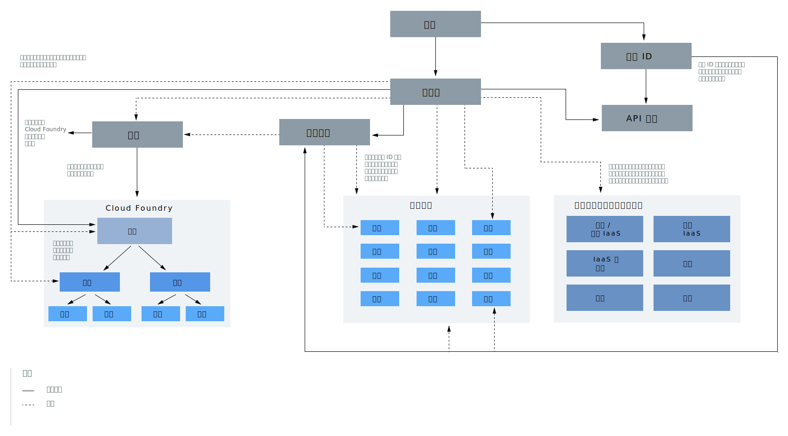

---

copyright:

  years: 2019
lastupdated: "2019-02-12"

---

{:shortdesc: .shortdesc}
{:codeblock: .codeblock}
{:screen: .screen}
{:tip: .tip}
{:new_window: target="_blank"}

# 帳戶階層
{: #overview}

您的 {{site.data.keyword.Bluemix}} 帳戶包含許多互動元件及系統。瞭解某些元件的連接方式，以及存取權在您的帳戶之間如何運作。
{:shortdesc}

在圖表內，有兩個關於帳戶階層中之元件的主要概念，務必要瞭解。實線與虛線的使用有助於說明部分元件包含在其他元件之內，例如，使用者新增至存取群組或 Cloud Foundry 組織內。不過，部分元件會與其他元件互動，以提供存取權而非成員資格。例如，使用者被授與資源群組的存取權，但不像存取群組那樣隸屬於資源群組。這些概念也在下列各節解釋。

<dl>
<dt>使用者</dt>
<dd>使用者受邀加入帳戶，並取得帳戶中資源的存取權。</dd>
<dt>服務 ID</dt>
<dd>服務 ID 識別服務或應用程式的方式，與使用者 ID 識別使用者的方式類似。您可以使用您建立的服務 ID，讓 {{site.data.keyword.Bluemix_notm}} 以外的應用程式能夠存取您的服務。您可以將特定存取原則指派給服務 ID，而服務 ID 限制用於使用特定服務的許可權，或甚至結合用於存取不同服務的許可權。因為服務 ID 未關聯至特定使用者，所以如果使用者剛好離開組織，並從帳戶刪除，服務 ID 仍會保留，以確保您的應用程式或服務保持啟動並執行。如需相關資訊，請參閱[建立及使用服務 ID](/docs/iam/serviceid.html#serviceids)。</dd>
<dt>服務實例或資源</dt>
<dd>{{site.data.keyword.Bluemix_notm}} 中的服務是以資源群組或 Cloud Foundry 為基礎。可以新增至資源群組並藉由使用 {{site.data.keyword.Bluemix_notm}} Identity and Access Management (IAM) 管理的服務實例，稱為資源。新增至 Cloud Foundry 組織及空間的服務實例，會因為使用 Cloud Foundry 角色而有個別的存取管理系統。如需相關資訊，請參閱[何謂資源？](/docs/resources/acct_resources.html#resource)</dd>
<dt>API 金鑰</dt>
<dd>API 金鑰是傳入給 API 的唯一代碼，用來識別呼叫端應用程式或使用者。您可以使用平台 API 金鑰（其與使用者身分相關聯），且可以建立服務 ID 的其他 API 金鑰。如需相關資訊，請參閱[瞭解 API 金鑰](/docs/iam/apikeys.html#manapikey)。</dd>
<dt>存取群組</dt>
<dd>您可以建立存取群組，將一組使用者和服務 ID 組織成單一實體，並輕鬆地指派許可權。您可以指派單一原則給群組，而不是針對每個個別使用者或服務 ID 指派相同的存取權多次。如需相關資訊，請參閱[設定存取群組](/docs/iam/groups.html#groups)。</dd>
<dt>資源群組</dt>
<dd>您可以使用資源群組，用可自訂的分組來組織帳戶資源，以便您可以同時將多個資源的存取權快速指派給使用者。使用 IAM 存取控制來管理的任何帳戶資源，都屬於您帳戶內的資源群組。使用者不會新增至資源群組，而是會提供使用者對資源群組內之資源的存取權，或是可以管理資源群組。獲得管理資源群組之存取權的使用者，可以在群組內建立新的實例、管理其他使用者使用群組的存取權，或根據被指派的 IAM 角色編輯群組名稱。如需相關資訊，請參閱[管理資源群組](/docs/resources/resourcegroups.html#rgs)及[用資源群組組織資源的最佳作法](/docs/resources/bestpractice_rgs.html#bp_resourcegroups)。</dd>
<dt>Cloud Foundry 組織</dt>
<dd>身為帳戶擁有者或組織管理員，您可以從主控台的「Cloud Foundry 組織」頁面中新增組織及空間。支援使用 Cloud Foundry 組織及空間的服務，會在您從型錄建立它們時新增至組織及空間。組織包含使用者、網域及配額。在每個組織內，會新增空間，而其中包含服務實例。如需相關資訊，請參閱[新增組織及空間](/docs/account/orgs_spaces.html#orgsspacesusers)。</dd>
<dt>Cloud Foundry 空間</dt>
<dd>在組織內，您可以使用空間來群組一組應用程式、服務及使用者。在 {{site.data.keyword.Bluemix_notm}} 中，空間關聯於特定地區。您可以根據交付生命週期，在組織中建立空間。例如，您可以建立 dev 空間作為開發環境、test 空間作為測試環境，以及 production 空間作為正式作業環境。然後，您可以建立應用程式與空間的關聯。如需相關資訊，請參閱[新增組織及空間](/docs/account/orgs_spaces.html#orgsspacesusers)。</dd>
</dl>

前一個圖表的另一個重要層面是三種存取管理系統的描述，您可以用來提供帳戶使用者對於帳戶內資源的存取權。 

  * 您可以使用 IAM [存取角色](/docs/iam/users_roles.html#iamusermanrol)來提供使用者對於屬於資源群組之所有資源的存取權。您也可以授與使用者管理資源群組的存取權，以及建立指派給資源群組的新服務實例。
  * 您可以使用 Cloud Foundry [組織及空間角色](/docs/iam/cfaccess.html#cfroles)來提供使用者對於位在 Cloud Foundry 空間內之任何服務實例的存取權。
  * 您可以使用標準基礎架構許可權，將標準基礎架構的其他精細[許可權](/docs/iam/infrastructureaccess.html#infrapermission)授與給使用者。您可以個別指派裝置存取權及 VPN 子網路存取權。
