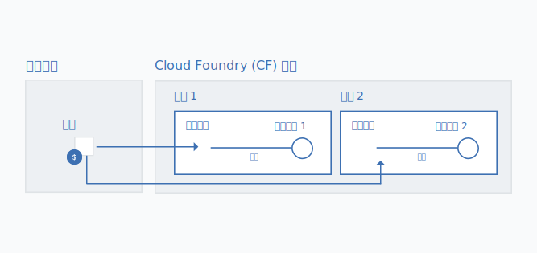

---

copyright:

  years: 2017, 2018

lastupdated: "2018-04-26"

---

{:shortdesc: .shortdesc}
{:codeblock: .codeblock}
{:screen: .screen}
{:new_window: target="_blank"}
{:gif: data-image-type='gif'}
{:tip: .tip}

# 將 Cloud Foundry 服務實例移轉至資源群組
{: #migrate}

當服務從使用 Cloud Foundry 組織、空間及角色，改為使用 Cloud Identity and Access Management (IAM) 和資源群組時，您可以將 Cloud Foundry 服務實例移轉到[資源群組](/docs/account/resourcegroups.html#rgs)。將服務實例移轉至資源群組有數個好處，包括使用 IAM 角色來進行更精細的存取控制，以及將服務實例連接至不同地區的應用程式和服務。

當服務離開 Cloud Foundry 時，系統會透過儀表板上的訊息來提示您移轉現有的服務實例。您可以藉由  圖示，識別準備好移轉的服務。
{:shortdesc}

當您將現有的 Cloud Foundry 服務實例移轉至資源群組時，移轉完成之後便無法變更您選擇的群組。因此，在移轉之前，請確定您已計劃好如何組織帳戶中的資源。這可能表示您需要在移轉之前建立一個以上的資源群組，如果您有計費帳戶的話。您可以使用與您在 Cloud Foundry 空間中組織資源的相同方式，來嘗試將資源組織成資源群組。
{: tip}

## 為何要移轉服務實例？

支援使用 Cloud IAM 存取控制及資源群組內之組織的服務有幾個優點，例如能夠連接至任何 Cloud Foundry 空間的應用程式及服務，這容許不同的地區應用程式及服務進行連接。若要建立連線，您可以從 Cloud Foundry 空間的資源群組建立實例的別名。當您移轉時，會透過將原始 Cloud Foundry 服務實例轉換為別名，並在您選擇的資源群組中建立鏈結實例，來自動執行連線。

此外，Cloud IAM 所管理的每一個實例都屬於一個資源群組。資源群組不是依地區限定範圍，因此您可以將不同地區的應用程式及服務佈建給相同的資源群組。您也可以利用個別實例層次的精細存取控制。

## 誰可以移轉服務實例？
{: #whocanmigrate}

使用者必須具有特定存取權，才能將 Cloud Foundry 服務實例移轉至資源群組：

* 使用者必須具有 Cloud Foundry 空間的開發人員角色，或實例所屬組織的組織管理員 Cloud Foundry 角色。
* 使用者必須至少具有檢視者 IAM 角色，才能管理實例移轉的目標資源群組。
* 使用者必須至少具有服務的編輯者 IAM 角色。

如需指派正確存取權的相關資訊，請參閱 [Cloud Foundry 存取](/docs/iam/cfaccess.html#cfaccess)及 [IAM 存取](/docs/iam/users_roles.html#platformrolestable)。

若要查看您具有什麼存取權，請從功能表列中，按一下**管理** &gt; **安全** &gt; **身分及存取**，然後按一下**使用者**。然後，按一下您的名稱，並檢閱已指派 IAM 角色的**存取原則**，並檢閱 **Cloud Foundry 存取**，以查看您有權存取的組織及已指派的 Cloud Foundry 角色。
{: tip}

## 移轉如何運作？

當您將服務實例從 Cloud Foundry 組織及空間移轉至資源群組時，會在資源群組中建立一個新的鏈結服務實例。Cloud Foundry 組織及空間中的原始實例會變成[別名](/docs/cfapps/connecting_apps.html#what_is_alias)。別名會計入您的組織配額，但會針對資源群組中的服務實例用量而向您收費。

{: gif}

當您在儀表板上收到與 Cloud Foundry 服務實例相關聯的  圖示通知時，可以一次移轉一個服務實例。

1. 開啟**更多動作**功能表。
2. 選取**移轉至資源群組**以開始使用。
3. 選取資源群組。
4. 按一下**移轉**，便會為您移轉實例。
5. 由於您一次只能移轉一個實例，所以在移轉第一個實例之後，您可以繼續移轉合格的實例。

順利移轉實例之後，您會看到它反映在儀表板的「服務」區段中。該別名會保留在儀表板的 Cloud Foundry 區段中。您可以在儀表板的 Cloud Foundry 區段中使用 ，來識別別名。

## 疑難排解

如果您在移轉 Cloud Foundry 服務實例時遇到任何問題，請參閱[移轉服務實例的疑難排解](/docs/troubleshoot/ts_migration.html)。
