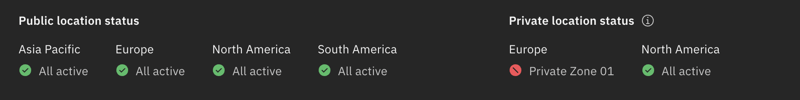

---

copyright:

  years: 2015, 2024

lastupdated: "2024-10-31"

keywords: upcoming maintenance, stay up-to-date, monitor status

subcollection: account

---

{{site.data.keyword.attribute-definition-list}}

# Monitoring status
{: #best-practices}

To create a plan and stay informed, use the following best practices for monitoring the status of {{site.data.keyword.Bluemix}}. Ongoing incidents or planned maintenance windows that impact a finite set of accounts do not display on the Status page. The notifications for those events are published only to the customer [Notifications page](/notifications){: external}.
{: shortdesc}


## Check for upcoming maintenance windows
{: #monbp-checmaintwin}

Check for upcoming maintenance windows posted on the {{site.data.keyword.Bluemix_notm}} console Dashboard page, at least one time every 24 hours, by using one of the following options:

* Check out the Planned maintenance widget on the [Dashboard](https://{DomainName}){: external}, and click **View events** to view all planned maintenance.
* Go directly to the [Status - Planned maintenance page](/status?selected=maintenance){: external}.


## Check for current maintenance windows or an incident in progress
{: #monbp-checcurmaninprog}

If you suspect that {{site.data.keyword.Bluemix_notm}} isn't functioning as expected, check the Status page for current maintenance windows or an incident in progress. To report an incident that isn't already listed on the Status page, open a support case. For more information about opening a support case, see [Creating support cases](/docs/get-support?topic=get-support-open-case).

In most cases, {{site.data.keyword.Bluemix_notm}} can be used normally during a maintenance window. However, minor interruptions of a service can't always be avoided. Running applications typically remain available even if the application management functions, such as starting and stopping apps, are temporarily interrupted. To maximize the availability of your running applications, run at least three instances of each application.


## Take advantage of multiple {{site.data.keyword.Bluemix_notm}} locations
{: #monbp-multpreg}

All users of {{site.data.keyword.Bluemix_notm}} automatically have access to the Dallas, London, Frankfurt, Sydney, Washington DC, and Tokyo locations. The {{site.data.keyword.Bluemix_notm}} Global Operations team manages all locations to avoid maintenance impacts and minimize the risk of incidents that affect all locations at the same time.

You can check the status of your locations from the dashboard on the {{site.data.keyword.Bluemix_notm}} status widget. To view specific events, click **View all**.


## Subscribing to email notifications
{: #monbp-subscribing}

As a Lite account owner, you can select whether to receive email notifications about {{site.data.keyword.Bluemix_notm}} platform unplanned events, such as outages, and planned events, such as maintenance. As a Pay-As-You-Go or Subscription account, you can choose whether to receive {{site.data.keyword.Bluemix_notm}} infrastructure email notifications about unplanned events, maintenance, and announcements. For more information, see [Setting email preferences](/docs/account?topic=account-email-prefs).

## Viewing cloud status
{: #viewing-cloud-status}

The {{site.data.keyword.Bluemix_notm}} [Status page](/status){: external} is the central place to find details about major incidents that affect the {{site.data.keyword.Bluemix}} platform and services. Other incidents, planned maintenance, announcements, release notes, and security bulletins are posted on the Notifications page, where you can easily view them.

To get notified about key events that are specifically affecting your account, go to the [Notifications page](/notifications){: external}. You can easily update your preferences by clicking **Manage email preferences**.
{: tip}

To view the Status page, complete the following steps:

1. In the {{site.data.keyword.Bluemix_notm}} console, click the **Notifications** icon  in the menu bar.
1. Click **View cloud status**.
1. From the side navigation pane, you can select to view planned maintenance, security bulletins, announcements, release notes, and history.

   To view planned maintenance and report outages for your account, you must be logged in to your authorized account.
   {: note}

   * Click **Planned maintenance** to see any upcoming scheduled maintenance.
   * Click **Security bulletins** to view a list of security bulletins that might affect various {{site.data.keyword.Bluemix_notm}} services or the platform.
   * Click **Announcements** to view a list of announcements that might be of general interest to you.
   * Click **Release notes** to view release entries for the last year.
   * Click **History** to view a list of completed events from the past year.

   If any issue occurs with the Status page, contact [{{site.data.keyword.cloud_notm}} Support](/unifiedsupport/supportcenter){: external}.
   {: note}

1. You can filter the lists by selecting specific components, locations, dates, types of ongoing events, or by using keyword searches. Click each item to get more details about the changes and why, and how they impact your environment.

You can build URL search values by using query parameters from outside the console. For more information, see [Advanced status search](/docs/get-support?topic=get-support-adv-search).
{: tip}

### Viewing the status of a dedicated multizone region (MZR)
{: #view-private-mzr}

As a user in an account that has access to a dedicated [MZR](#x9774820){: term}, you are able to view incidents, planned maintenance, security bulletins, and announcements that are related to the resources within that MZR in addition to the public regions on the {{site.data.keyword.cloud_notm}} Status page. Also, on the History page, users in the account can view past status-related items that impact the dedicated MZR.

To view the status of a dedicated MZR, complete the following steps:

1. In the {{site.data.keyword.cloud_notm}} console, click the **Notifications** icon  in the menu bar.
1. Click **View cloud status**.
1. Select from the services that are available within the dedicated MZR to view the status of the MZR in the **Private location status** section. To view planned maintenance, security bulletins and announcements that are related only to your dedicated MZR, use the location filter on the appropriate page.

If an incident occurs that affects the dedicated MZR, you can see the following status on the {{site.data.keyword.cloud_notm}} Status page, which shows you the continent where your private MZR is located, and the status of your private region:

{: caption="An example of the Status page when there is an active incident that affects the dedicated MZR" caption-side="bottom"}

If no active incident occurs that affects the dedicated MZR, you can see the following status on the {{site.data.keyword.cloud_notm}} Status page:

{: caption="An example of the Status page when there is no incident that affects the dedicated MZR" caption-side="bottom"}

### Subscribing to an RSS feed
{: #subscribing-rss-feed}

You can stay up to date about the events by subscribing to the RSS feed for the [Status page](https://cloud.ibm.com/status){: external}. Ongoing incidents or planned maintenance windows that impact a finite set of accounts do not display on the Status page.

{{site.data.keyword.Bluemix_notm}} typically has approximately 50 updates per month.
{: note}

To subscribe to the {{site.data.keyword.Bluemix_notm}} Notifications RSS feed, complete the following steps:

1. Access your RSS reader.
1. Copy and paste the feed URL into your RSS reader.
    ```sh
    https://cloud.ibm.com/status/api/notifications/feed.rss
    ```
    {: pre}

1. Optional: Apply notification filters and rules if your reader supports them.


### Checking incident reports
{: #status-incident-report}

The {{site.data.keyword.Bluemix_notm}} [Incident reports page](/status/incident-reports){: external} provides a way for you to review technical details of major outages for {{site.data.keyword.Bluemix_notm}} services. These Customer Incident Reports (CIR) provide Root Cause Analysis (RCA), which is a problem-solving process that is used for identifying the root causes of an incident and describing the problem. They are publicly available for all major outages.

You can view and download the incident reports from the service health dashboard about any events that affect {{site.data.keyword.Bluemix_notm}} availability.

The downloadable reports are in PDF file formats. These reports are available for 5 years starting from the date when the event occurred.
{: note}

The events can be region-specific, global, or they might have an unspecified location.

To view the Incident reports page and check RCAs, complete the following steps:

1. In the {{site.data.keyword.Bluemix_notm}} console, click the **Notifications** icon  in the menu bar.
1. Click **View cloud status**.
1. Select **Incident reports**.
1. See the table for the incident reports and click the **Download** icon  to download each report.

### Advanced status search
{: #adv-search}

You can search across all tabs on the [Status page](/status), but did you know that you can build URL search values by using query parameters from outside the console?

The following list includes examples of URL search options:

* Load the page with the Status tab selected: `console.cloud.ibm.com/status?selected=status`
* Load the page with the Planned maintenance tab selected: `console.cloud.ibm.com/status?selected=maintenance`
* Load the page with the Security bulletin tab selected: `console.cloud.ibm.com/status?selected=security`
* Load the page with the Announcements tab selected: `console.cloud.ibm.com/status?selected=announcement`
* Load the page with a search query entered: `console.cloud.ibm.com/status?selected=<selected>&query=<query>`
* Land on the page with filters selected. For example, you can set the geographic location to North America by using the following URL search: `console.cloud.ibm.com/status?selected=status&region=na`

* Use unique notification identifiers as a search parameter to go directly to the details for the notification. For example, `query=INC1000001` targets items with the ID: `INC1000001`. In this example, `INC1000001` is the case number for a maintenance notification.

#### URL query filters:
{: #url-query}

The following table provides information on URL query filters that you can use to search across all tabs on the status page.

| URL Query Parameter | Description | Values                      |
|---------------------|-------------|-----------------------------|
| `?type`             | A filter that applies only to the Status tab. Use the `?type` query to filter the Status tab by incidents or maintenance. | `=incident`, `=maintenance` |
| `?region`           | Filter the page by geographic location.  | `=na`, `=eu`, `=sa`, `=ap`  |
| `?component`        | Filter the page by {{site.data.keyword.Bluemix_notm}} components. For example, you might filter by a service you are interested in. | Applies to most global catalog IDs; for example, `?component=iotf-service` filters the page and display events that affect Internet of Things Platform |
{: caption="URL query filters" caption-side="top"}

You can always use the **Filter by** filters, and then copy or bookmark the URL query that is generated. The filters are displayed in your URL and can help you build future queries.
{: tip}
